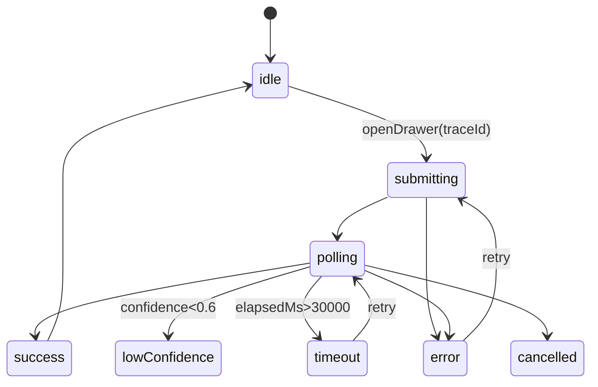

# 圆桌讨论记录：APM 失败链路定位器 UI 设计

## 一句话结论

5 个新组件 580 LOC、Day 4-5 共 9.8h（砍快捷键/动画后）落地"**原始 Span 优先 + AI 折叠在顶 + 证据锚点必校验**"的右抽屉式诊断面板。

---

## 一、最终架构总览

| 项 | 决定 |
|---|---|
| 入口 | TraceView span 右键菜单 + AiDiagnosisChat 头部按钮（双入口） |
| 容器 | 右侧 Drawer `clamp(480px, 38vw, 640px)`，非模态，不锁主界面 |
| 状态机 | 8 态：idle / submitting / polling / success / lowConfidence / timeout / error / cancelled |
| Store | apmStore.diagnosis 子字段，**按 URL traceId 隔离**（防多 tab 串数据） |
| 锚点 | 类#方法:行号 + spanId 双链接，**后端校验失败则降级纯文本** |
| 置信度 | **百分比 + 证据条数**（如 87% · 命中 3 日志+1 异常栈），不用高/中/低标签 |
| 颜色 | 失败用品牌橙 #FA8C16（避撞 el-button--danger 红） |
| 进度 | spinner + 倒计时 + 单行状态文案，**不做 4 段进度条** |
| 快捷键 | **只留 ESC**（砍其他省 0.6h） |
| 通知 | 桌面 Notification API，拒绝授权降级为 ElNotification |
| 复制 | 双位置（TraceView 右键 + Drawer 头部），带 `copy_md_click` 埋点 |
| 撤回 | 4 类失败页 + 撤回开关（D14 LLM 无用率 >40% → 整体回滚） |

---

## 二、🆕 R5 用户反馈裁定（重要修正）

用户给 6.5/10，要求 **raw first, AI 折叠** 才能到 8 分。

**Drawer 默认布局**：
```
┌────────────────────────────┐
│ [AI 根因 87% · 3 证据] ▲折叠│  ← 默认折叠
├────────────────────────────┤
│ 原始异常堆栈                │  ← 默认展开
│ NullPointerException...    │
│  at OrderService.java:88   │
├────────────────────────────┤
│ 失败 span 入参/出参 JSON    │  ← 默认展开
└────────────────────────────┘
```

## 三、🆕 置信度展示形式

去掉"高/中/低"标签，统一展示为：
```
置信度 87% · 命中 3 条日志 + 1 个异常栈
```
颜色辅助：≥70% 灰 / 50-70% 橙 #FA8C16 / <50% 红 #F56C6C + banner "建议人工复核"

---

## 四、Day 4-5 时段表（9.8h 实做）

| 时段 | 工时 | 任务 | 产出 |
|---|---|---|---|
| D4 早 | 2h | apmStore traceId 隔离 + TraceView 红框 + 右键菜单 | 多 tab 不串数据 |
| D4 午 | 2h | DiagnosisDrawer + 8 态机 + raw-first 布局 | 静态卡片切换 |
| D4 晚 | 1.5h | DiagnosisResult 锚点 + 后端校验 + 降级 | 锚点降级逻辑通 |
| D5 早 | 2h | 4 类失败页 + 置信度百分比 | 三态切换 |
| D5 午 | 1.5h | 复制按钮（双位置+埋点）+ ESC + toast + 桌面通知 | 复制流程通 |
| D5 晚 | 0.8h | 联调 + 5 条 DoD + 埋点 | 可发布 |

---

## 五、5 条 DoD（PM/QA 独立验收）

1. **成功**：触发分析 → 30s 内看到根因卡 + 87% + 至少 1 个 `OrderService.java:88` 锚点可点
2. **超时**：mock 35s 不返回 → 看到橙色超时页 + 重试按钮
3. **低置信度**：mock confidence=40% → 顶部 banner + 3 操作按钮
4. **复制**：点 Drawer 头部复制 → 粘贴飞书出现完整 markdown
5. **隔离**：开 2 tab 不同 traceId → A 刷新不影响 B

## 六、3 条视觉死线

1. LOW confidence 页必须有 3 个操作按钮
2. 8 状态副文案不能露英文 key 或空白
3. 锚点点击必须后端校验，失败必须降级纯文本

## 七、4 条 D7/D14 砍线

| 时间 | 成功 | 失败 → 行动 |
|---|---|---|
| D7 | 失败 trace 点 AI 率 ≥40% **或** LLM P95 ≤6s | <15% 砍入口；>12s 关流式 |
| D7 | 复制点击率 ≥5% | <3% 砍失败页内复制 |
| D7 | 锚点跳转率 ≥15% | <15% 砍锚点 |
| D14 | 周活 ≥10 且 AI 有用率 ≥30% | 周活 <3 或反馈 <10% → **整体回滚** |

D0 必须 PM 签字接受 D14 失败 = 自动回滚。

---

## 八、组件清单（5 新文件 580 LOC）

| 文件 | LOC | 职责 |
|---|---|---|
| `views/apm-debug/components/DiagnosisDrawer.vue` | 180 | 抽屉容器+8 态调度+raw-first 布局 |
| `views/apm-debug/components/diagnosis/DiagnosisPolling.vue` | 90 | spinner+倒计时+取消+丢后台 |
| `views/apm-debug/components/diagnosis/DiagnosisResult.vue` | 140 | 结果渲染+证据锚点+复制 |
| `views/apm-debug/components/diagnosis/DiagnosisFallback.vue` | 110 | 4 类失败页 |
| `composables/useDesktopNotification.ts` | 60 | Notification API + 降级 |

## 九、4 个埋点事件

```
diagnosis_started        { trace_id, project_id }
diagnosis_cancelled      { trace_id, elapsed_ms, source }
failure_page_shown       { trace_id, kind, retry_clicked }
copy_clicked             { trace_id, location }
```

## 十、性能预算

- Drawer 打开→spinner ≤100ms
- 轮询间隔 1500ms，最多 40 次（60s 超时），第 10 次后指数回退到 3000ms
- 结果渲染（markdown+高亮）≤250ms
- 复制阻塞 ≤16ms

## 十一、状态机（mermaid）



---

## 十二、各方观点矩阵

| 维度 | 前端工程师 | UX 设计师 | 目标用户 | 魔鬼代言人 |
|---|---|---|---|---|
| 进度展示 | 砍 4 段为 spinner+倒计时 | 单行状态文案 | 不要假进度 | 死线：60s 零点击砍 |
| 颜色方案 | 2 色 red/gray | 改橙避撞红 | 砍高中低标签 | 撞色风险 |
| 复制按钮 | Drawer 头部 0.5h | 双位置 | 双位置必须 | 埋点 <3% 砍 |
| 状态隔离 | apmStore 子字段 | - | **按 tab 隔离必须** | activeDiagnosisId 防丢 |
| 默认布局 | AI 在顶 | AI 在顶 | **raw first！AI 折叠** | 用户裁定 |
| 置信度 | 高中低标签 | 高中低三色 | **必须百分比+证据条数** | 用户裁定 |

---

## 十三、完整 5 轮讨论概要

### R1 各抒己见
- 前端：450 LOC 5 文件，单 SSE 流
- UX：8 态机情绪曲线，4 类失败页插画
- 用户：要求复制按钮、不要假进度
- 魔鬼：质疑 4 色阶层和独立 store 必要性

### R2 交叉质疑
- 前端让步：砍 4 段进度为 spinner+倒计时
- UX 让步：用 spinner+countdown 替代情绪曲线
- 用户加码：8s 切走 + 桌面通知
- 魔鬼：要求复制按钮带埋点死线

### R3 收敛到状态机
- 8 态状态机定型
- 5 个文件 580 LOC
- apmStore.diagnosis schema 定型
- 4 类失败页 UI 蓝图

### R4 边界细化
- 工时回算 11h，砍快捷键回到 9.8h
- 用户加 3 硬要求：锚点必有/置信度百分比/按 tab 隔离
- 桌面通知 + 丢后台逃生口规范
- 4 个埋点事件定型

### R5 优先级与验收
- P0/P1/P2 全任务排序
- 5 条 DoD + 3 视觉死线
- 用户给 6.5/10，要 raw first 才到 8 分
- 魔鬼代言人建议跳过 R6 直接出结论

## 后续行动

- [ ] PM 签字 D14 失败 = 自动回滚
- [ ] Day 4-5 按时段表落地 5 个新组件
- [ ] 开启技术实现细节圆桌（用户已要求）
- [ ] D7 / D14 复盘 7 条砍线指标
