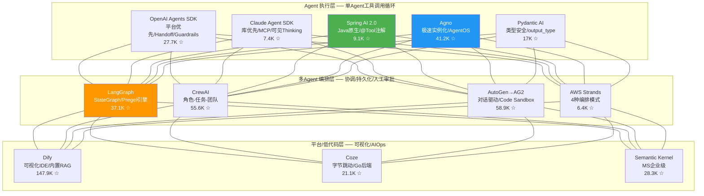
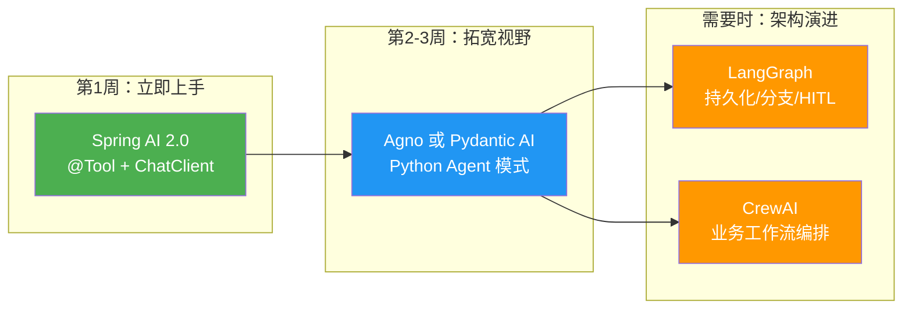

# AI Agent 主流框架深度技术调研报告

> **调研日期**：2026年7月25日  
> **数据来源**：150+ 次可信信源抓取（官方文档、GitHub 仓库、PyPI、技术博客、生产案例），6 个并行 Agent 协作采集  
> **原始数据量**：~334K tokens  
> **面向读者**：Java 后端工程师（4年）+ 1年 Python 背景 + AI Agent 新手

---

## 目录

1. [Agent 框架生态全景](#一agent-框架生态全景)
2. [GitHub 数据排行（2026年7月）](#二github-数据排行2026年7月)
3. [执行层框架详解](#三执行层框架详解)
   - [LangChain + LangGraph](#31-langchain--langgraph-python)
   - [OpenAI Agents SDK](#32-openai-agents-sdk-pythonts)
   - [Anthropic Claude Agent SDK](#33-anthropic-claude-agent-sdk-pythonts)
   - [Spring AI 2.0 (Java)](#34-spring-ai-20-java)
   - [Agno](#35-agno-python)
   - [Pydantic AI](#36-pydantic-ai-python)
4. [多Agent编排层框架详解](#四多agent编排层框架详解)
   - [CrewAI](#41-crewai-python)
   - [AutoGen → AG2](#42-autogen--ag2-python)
   - [AWS Strands Agents](#43-aws-strands-agents-pythonts)
5. [平台/低代码层详解](#五平台低代码层详解)
   - [Dify](#51-dify-开源平台)
   - [Semantic Kernel](#52-semantic-kernel-microsoft)
   - [Coze](#53-coze-字节跳动)
6. [新兴框架速览](#六新兴框架速览)
7. [完整对比矩阵](#七完整对比矩阵)
8. [Java 工程师专属学习路径](#八java-工程师专属学习路径)
9. [2026 年生态关键变化](#九2026-年生态关键变化)
10. [决策指南](#十决策指南)

---

## 一、Agent 框架生态全景

Agent 框架已形成清晰的三层架构：



**核心结论**：**80% 的场景只需要执行层**。你不需要为了调个工具就上 LangGraph。框架复杂度应该跟随你的实际编排需求增长，而非你的野心。

---

## 二、GitHub 数据排行（2026年7月）

| # | 框架 | Stars | 语言 | 许可证 | 状态 |
|---|------|-------|------|--------|------|
| 1 | **Dify** | 147.9K | Python/TS | Apache 2.0 | 🟢 活跃 |
| 2 | **LangChain** | 141K | Python/TS | MIT | 🟢 活跃 |
| 3 | **AutoGen** | 58.9K | Python/.NET | MIT | ⚠️ 维护模式 |
| 4 | **CrewAI** | 55.6K | Python | MIT | 🟢 活跃 |
| 5 | **Agno** | 41.2K | Python | MPL-2.0 | 🟢 活跃 |
| 6 | **LangGraph** | 37.1K | Python/TS | MIT | 🟢 活跃 |
| 7 | **Semantic Kernel** | 28.3K | C#/Py/Java | MIT | → MAF 演进 |
| 8 | **OpenAI Agents SDK** | 27.7K | Python/TS | Apache 2.0 | 🟢 活跃 |
| 9 | **Mastra** | 25.9K | TypeScript | Apache 2.0 | 🟢 活跃 |
| 10 | **Coze Studio** | 21.1K | Go/TS | Apache 2.0 | 🟢 活跃 |
| 11 | **Spring AI** | 9.1K | **Java** | Apache 2.0 | 🟢 v2.0 GA |
| 12 | **Claude Agent SDK** | 7.4K | Python/TS | MIT | 🟢 活跃 |
| 13 | **AWS Strands** | 6.4K | Python/TS | Apache 2.0 | 🟢 活跃 |

**Java 生态额外发现**：

| 框架 | Stars | 说明 |
|------|-------|------|
| LangChain4j | 12.2K | 框架无关，Java 生态最成熟 |
| Spring AI Alibaba | 10.1K | SequentialAgent/ParallelAgent/RoutingAgent/LoopAgent 编排 |
| Spring AI (Official) | 9.1K | Spring 原生，v2.0 GA |

---

## 三、执行层框架详解

### 3.1 LangChain + LangGraph (Python)

**定位**：LangChain = 高层便捷 API，LangGraph = 底层编排运行时。两者已统一到 v1.0（2025年10月），LangChain 的 `create_agent` 底层编译为 LangGraph 图。

#### 源码级架构（Java 概念映射）

| LangChain 概念 | Java 等价 | 说明 |
|---------------|-----------|------|
| `Runnable[I,O]` | `Function<T,R>` + lifecycle hooks | 所有组件的基协议，6 个标准方法 + `\|` 管道组合 |
| `RunnableSequence` | `Stream.reduce(a,b)->a.andThen(b)` | `prompt \| llm \| parser` 编译为顺序链 |
| `RunnableParallel` | `CompletableFuture.allOf()` | Dict 字面量自动并发执行，结果合并为 dict |
| `StateGraph` | BPMN 流程定义（Camunda/Temporal） | 节点+边+条件路由，编译为 Pregel 引擎 |
| Checkpointer | Saga/Event Sourcing 持久层 | 每步保存 `StateSnapshot`，支持时间旅行回放 |
| Middleware | Servlet Filter 链 | 请求前后拦截（Summarization/HITL/Guardrails） |
| State Reducer | CRDT / Git merge strategy | 并行节点写入同一 key 时的冲突解决 |

#### Pregel 执行引擎核心

每个 super-step 三阶段：

```
1. PLAN    → 决定本步执行哪些节点
2. EXECUTE → 并行执行选中节点，写入缓冲（同一步内节点看到相同的输入状态）
3. UPDATE  → 提交缓冲到状态通道（下一步可见）
```

当两个并行节点写入同一 key 时，Reducer 函数解决冲突：
- `LastValue`（默认）：最后写入者胜出
- `add`：追加到列表
- `Topic`：发布-订阅模式
- `BinaryOperatorAggregate`：持久化聚合

#### 快速上手

```python
# 最简单入口 — LangChain create_agent (v1.0+)
from langchain.agents import create_agent

def get_weather(city: str) -> str:
    """Get weather for a given city."""
    return f"It's always sunny in {city}!"

agent = create_agent(
    model="openai:gpt-4o-mini",
    tools=[get_weather],
    system_prompt="You are a helpful assistant",
)
result = agent.invoke({
    "messages": [{"role": "user", "content": "Weather in Tokyo?"}]
})
```

```python
# 手动控制 — LangGraph StateGraph
from typing import TypedDict, Annotated
from langgraph.graph import StateGraph, START, END
from langgraph.graph.message import add_messages
from langgraph.prebuilt import ToolNode, tools_condition
from langgraph.checkpoint.memory import MemorySaver

class AgentState(TypedDict):
    messages: Annotated[list, add_messages]  # add_messages = 追加而非覆盖

model = ChatOpenAI(model="gpt-4o-mini").bind_tools([get_weather, calculator])

def call_model(state: AgentState):
    response = model.invoke(state["messages"])
    return {"messages": [response]}

builder = StateGraph(AgentState)
builder.add_node("agent", call_model)
builder.add_node("tools", ToolNode([get_weather, calculator]))
builder.add_edge(START, "agent")
builder.add_conditional_edges("agent", tools_condition)   # tool_call→tools, 否则→END
builder.add_edge("tools", "agent")                          # 工具结果回到 agent
graph = builder.compile(checkpointer=MemorySaver())

# 多轮对话（自动记忆，通过 thread_id）
config = {"configurable": {"thread_id": "session-1"}}
graph.invoke({"messages": [{"role": "user", "content": "东京天气?"}]}, config)
graph.invoke({"messages": [{"role": "user", "content": "那大阪呢?"}]}, config)
```

#### LangGraph Functional API（写普通 Python）

```python
from langgraph.func import entrypoint, task

@task()
def fetch_weather(city: str) -> str:
    """每个城市独立 checkpoint，可单独重试"""
    return f"72F in {city}"

@entrypoint(checkpointer=MemorySaver())
def weather_workflow(cities: list[str]) -> str:
    futures = [fetch_weather(city) for city in cities]  # 并行
    return "\n".join([f.result() for f in futures])
```

#### 适用场景与注意事项

| ✅ 适用 | ⚠️ 注意 |
|--------|--------|
| 需要持久化状态、多步骤分支 | 框架开销约 40%（vs 直接 API 调用） |
| 人工审批节点（interrupt_before/after） | 堆栈深度 15 层+，调试困难 |
| 时间旅行调试（回放到任意 checkpoint） | Serverless 不友好（需要长连接） |
| 多 Agent 协作（Subgraph/Supervisor/Send） | 版本升级频繁导致工作流破坏 |

---

### 3.2 OpenAI Agents SDK (Python/TS)

**定位**：OpenAI 官方 Agent SDK（2025年3月发布），Apache 2.0。代替已废弃的 Assistants API（**2026年8月关闭**）。

**核心理念**：平台优先，开箱即用。内置 Tracing + Guardrails + Handoff，5 分钟从零到可工作 Agent。

#### 架构核心

```
Agent（纯配置 @dataclass，无状态，线程安全）
  ├── instructions: 系统指令
  ├── tools: 工具列表
  ├── handoffs: 可移交的 Agent 列表
  ├── input_guardrails: 输入检查（并行执行，tripwire 机制）
  └── output_guardrails: 输出检查
        ↓
Runner（无状态执行器）
  └── Runner.run(agent, input) → while True:
       ├── LLM 调用
       ├── 检测 Handoff → 切换 current_agent，循环继续
       ├── 检测 ToolCall → 执行工具，追加结果，循环继续
       └── 检测 FinalOutput → 返回
```

**Handoff 机制（杀手级特性）**：底层实现为特殊工具调用。SDK 将 `handoffs=[billing_agent]` 转换为 `transfer_to_billing_agent` 工具。LLM "调用"此工具时，SDK 拦截并切换活跃 Agent。

#### 快速上手

```python
from agents import Agent, Runner

billing = Agent(name="Billing", instructions="处理账单/支付问题。")
tech = Agent(name="Tech", instructions="处理技术故障。")
triage = Agent(name="Triage", instructions="账户问题→Billing，服务故障→Tech",
               handoffs=[billing, tech])

result = await Runner.run(triage, "我被重复扣款了")
print(result.last_agent.name)  # "Billing"
```

#### Guardrails

```python
from agents import input_guardrail, GuardrailFunctionOutput

@input_guardrail
async def math_guardrail(context, agent, input_data):
    result = await Runner.run(guardrail_agent, input_data)
    return GuardrailFunctionOutput(
        tripwire_triggered=result.final_output.is_homework,  # True = 阻止
    )

tutor = Agent(name="Math Tutor", input_guardrails=[math_guardrail])
```

#### OpenAI Agents SDK vs 旧 Assistants API

| Old (Assistants API) | New (Agents SDK) |
|---|---|
| 服务端管理 Thread 状态 | **你**管理对话历史（无状态） |
| `assistants.create()` + `threads.create()` + `runs.createAndPoll()` | 单个 `Runner.run(agent, input)` |
| 内置 File Search / Code Interpreter | 自己集成 |
| 有状态（轮询、状态检查） | 无状态（单次请求/流式） |

---

### 3.3 Anthropic Claude Agent SDK (Python/TS)

**定位**：Anthropic 官方 Agent SDK（2026年初），MIT 许可。**设计哲学与 OpenAI 截然相反** —— 你掌控循环，模型负责推理。

**核心理念**：库优先，受监管自动化。"先问再执行"（Ask-before-act），通过 Hooks（类似 Spring AOP）拦截危险操作。

#### 与 OpenAI Agents SDK 的哲学对比

| 维度 | Claude Agent SDK | OpenAI Agents SDK |
|------|-----------------|-------------------|
| **Thinking 可见性** | 开发者可见 `thinking` 内容块 | o1/o3 隐藏思维链 |
| **工具协议** | MCP（开放标准，200+ Server） | OpenAI Function Calling |
| **安全模型** | Hooks AOP 拦截（Pre/Post ToolUse） | Guardrails tripwire |
| **Prompt Caching** | 自动启用，90% 成本降低 | 不支持 |
| **执行姿态** | "先问再执行" | "信任但验证" |
| **锁定风险** | 低（MCP 是开放标准） | 中高（深度绑定 OpenAI 平台） |

#### Extended Thinking

Claude 的推理过程作为 `thinking` 块返回并保存在对话历史中。**必须保留这些块（包括加密签名）**，否则 API 返回 400 错误。

```python
# 可见的 Thinking + Prompt Caching
response = client.messages.create(
    model="claude-sonnet-4-20250514",
    max_tokens=16000,
    thinking={"type": "enabled", "budget_tokens": 8000},
    system=[{"type": "text", "text": LONG_SYSTEM_PROMPT,
             "cache_control": {"type": "ephemeral"}}],  # 90% 成本节省
    messages=[...],
)
```

| 复杂度 | 推荐 Thinking Budget |
|--------|---------------------|
| 简单澄清 | 1,024 – 4,000 |
| 代码审查/调试 | 4,000 – 10,000 |
| 架构/安全审计 | 10,000 – 20,000 |

#### Hooks（AOP 拦截）

```python
from claude_agent_sdk import ClaudeAgentOptions, HookMatcher

async def block_rm_rf(input_data, tool_use_id, context):
    if "rm -rf" in input_data["tool_input"].get("command", ""):
        return {"hookSpecificOutput": {"permissionDecision": "deny"}}
    return {}

options = ClaudeAgentOptions(
    hooks={"PreToolUse": [HookMatcher(matcher="Bash", hooks=[block_rm_rf])]}
)
```

#### 快速上手

```python
from claude_agent_sdk import tool, create_sdk_mcp_server, ClaudeAgentOptions, query

@tool("add", "Add two numbers", {"a": float, "b": float})
async def add_tool(args):
    return {"content": [{"type": "text", "text": f"Sum: {args['a'] + args['b']}"}]}

mcp = create_sdk_mcp_server(name="calc", version="1.0.0", tools=[add_tool])
options = ClaudeAgentOptions(mcp_servers={"calc": mcp}, allowed_tools=["mcp__calc__add"])

async for msg in query(prompt="3 + 5 = ?", options=options):
    print(msg)
```

---

### 3.4 Spring AI 2.0 (Java) 🟢

> **对 Java 工程师最重要的框架。** 2026年6月 GA，基于 Spring Boot 4 + Spring Framework 7.0，Apache 2.0。

**核心理念**：将 AI 调用融入 Spring 生态 —— 用 `@Tool` 注解定义工具，用 `ChatClient` 发起对话，用 `ToolCallingAdvisor` 处理 ReAct 循环。就像 JDBC 统一了数据库访问一样，Spring AI 统一了 AI 模型访问。

#### 快速上手

```java
// 一个文件，完整的天气查询 Agent
@RestController
class WeatherAgent {
    @Tool(description = "查城市天气")
    String getWeather(String city) { return city + ": 22°C 晴天"; }

    @GetMapping("/chat")
    String chat(@RequestParam String q) {
        return ChatClient.create(chatModel)
            .prompt(q)
            .tools(this)    // 自动将 @Tool 方法注册为工具
            .call()
            .content();
    }
}
```

#### Agentic Patterns

| 模式 | 说明 |
|------|------|
| Agent Skills | 模块化 SKILL.md 文件夹，渐进式加载 |
| Subagent Orchestration | 层级任务委派 + 模型路由 + 并行执行 |
| A2A Protocol | 跨平台 Agent 通信（JSON-RPC） |
| AutoMemoryTools | 文件级长期记忆（MEMORY.md 索引） |
| Session API | Event Sourced 对话历史 + 压缩策略 |
| Advisor Chain | 可组合拦截器链（记忆→工具调用→可观测性→Guardrails） |

#### Java 生态三大框架

| 框架 | Stars | 差异化 |
|------|-------|--------|
| **LangChain4j** | 12.2K | 框架无关，Java 生态最成熟，最大社区 |
| **Spring AI Alibaba** | 10.1K | 多 Agent 编排（SequentialAgent/ParallelAgent 等），Nacos A2A |
| **Spring AI (Official)** | 9.1K | Spring 原生，v2.0 GA |

#### Advisor Chain 架构

```
ChatClient.create(model)
    .prompt(userMessage)
    .advisors(
        new MemoryAdvisor(),          // 注记历史
        new ToolCallingAdvisor(),     // ReAct 循环
        new ObservabilityAdvisor(),   // 追踪
        new GuardrailAdvisor()        // 安全检查
    )
    .call()
    .content();
```

---

### 3.5 Agno (Python)

**定位**：前身为 Phidata，2025年1月改名。MPL-2.0 许可。**极速实例化 + 内置生产运行时**。

**核心理念**：纯 Python，无图/无链/无复杂模式。Agent 实例化 ~3μs（声称 529x 快于 LangGraph），内存占用 ~6.5KB（24x 低于 LangGraph）。

#### 快速上手

```python
from agno.agent import Agent
from agno.models.openai import OpenAIChat
from agno.tools.duckduckgo import DuckDuckGoTools

agent = Agent(
    model=OpenAIChat(id="gpt-4o"),
    tools=[DuckDuckGoTools()],
    show_tool_calls=True,
    markdown=True,
)
agent.print_response("2026年AI Agent最新趋势?", stream=True)
```

#### 多 Agent Team 模式

```python
from agno.team import Team

team = Team(
    members=[researcher, writer, reviewer],
    mode="coordinate",   # coordinate/route/broadcast/collaborate
)
team.print_response("写一份量子计算市场报告", stream=True)
```

| 模式 | 行为 |
|------|------|
| coordinate | Leader 委派任务给成员 |
| route | 自动转发到最合适的成员 |
| broadcast | 群发给所有成员 |
| collaborate | 成员对等协商 |

---

### 3.6 Pydantic AI (Python)

**定位**：Pydantic 团队（FastAPI 团队）出品的类型安全 Agent 框架，MIT 许可，v2.0（2026年6月）。

**核心理念**：`output_type=MyPydanticModel` 保证 LLM 返回合法结构化数据，失败自动重试并注入错误提示。

```python
from pydantic_ai import Agent
from pydantic import BaseModel

class JobPosting(BaseModel):
    job_title: str
    required_skills: list[str]
    is_remote: bool

agent = Agent("openai:gpt-4o-mini", output_type=JobPosting)
result = agent.run_sync("招聘高级Python工程师，远程，需要FastAPI/Docker")
print(result.output.job_title)  # "高级Python工程师"
print(result.output.is_remote)  # True
```

---

## 四、多Agent编排层框架详解

### 4.1 CrewAI (Python)

**定位**：面向业务工作流的多 Agent 编排。MIT 许可，55.6K Stars，11.3M/月 PyPI 下载。

**核心理念**：角色驱动的项目管理模式 —— Agent（角色）+ Task（工作单元）+ Crew（编排器）。

#### 架构核心

```
Crew (编排器)
├── Process.sequential → 任务按序执行，前一个输出通过 context 参数流入后一个
└── Process.hierarchical → Manager Agent 自动拆解目标，委派给工人 Agent
```

#### 源码级关键机制

**工具权限隔离（最小权限原则）**：

```python
# Agent 有完整的工具箱
financial_agent = Agent(
    tools=[market_data, trade_execution, db_writer]
)

# Task 1 限定为只读工具（覆盖 Agent.tools）
research_task = Task(
    tools=[market_data],  # 只能查数据，不能交易
)

# Task 2 限定为写入工具
execute_task = Task(
    tools=[trade_execution],  # 只能执行交易
)
```

**委派协议**：LLM 发出 `coworker_role|task_description|context` 管道分隔命令，`AgentTools.delegate_work()` 解析并路由。

#### 快速上手

```python
from crewai import Agent, Task, Crew, Process

researcher = Agent(
    role="研究员", goal="查找最新AI趋势",
    tools=[SerperDevTool()], allow_delegation=False
)
writer = Agent(
    role="撰稿人", goal="撰写报告",
    allow_delegation=False
)

research_task = Task(
    description="调研2026年AI Agent三大趋势",
    expected_output="带证据的列表", agent=researcher
)
write_task = Task(
    description="根据调研写报告",
    expected_output="4段Markdown", agent=writer,
    context=[research_task]           # 前一个任务的输出流入
)

crew = Crew(
    agents=[researcher, writer],
    tasks=[research_task, write_task],
    process=Process.sequential
)
result = crew.kickoff()
```

#### 四种 HITL 级别

| 级别 | 机制 | 场景 |
|------|------|------|
| 任务级 | `Task(human_input=True)` | 敏感分析后人工审核 |
| Agent级 | `Agent(require_approval_for_tools=True)` | 每次工具调用前审批 |
| 确认门 | `Task(require_confirmation=True)` | 任务开始前确认 |
| 生产级 | Webhook 异步 HITL | 分布式人工审批 |

---

### 4.2 AutoGen → AG2 (Python)

> ⚠️ **重要变化**：微软 AutoGen 已于 **2025年10月进入维护模式**。  
> 社区 fork **AG2**（github.com/ag2ai/ag2，原核心作者领导）继承了活跃开发。  
> 微软新方案是 **Microsoft Agent Framework (MAF)**，整合了 Semantic Kernel + AutoGen。

**核心理念**：群聊式协作。所有 Agent 通过共享消息历史通信，像团队群聊一样解决问题。

#### 独特能力：Docker 代码执行沙箱

当 `UserProxyAgent` 检测到 Markdown 代码块（` ```python ... ``` `）时，自动路由到隔离 Docker 容器执行，捕获输出返还对话。这是**其他框架不具备的关键差异化能力**。

#### 快速上手（AG2，最新 API）

```python
from autogen import AssistantAgent, UserProxyAgent, GroupChat, GroupChatManager

coder = AssistantAgent("coder",
    system_message="你写Python代码。输出在markdown代码块中。",
    llm_config=config)
reviewer = AssistantAgent("reviewer",
    system_message="审查代码。答 PASS 或 FAIL 并说明原因。",
    llm_config=config)
user_proxy = UserProxyAgent("user",
    human_input_mode="TERMINATE",
    code_execution_config={"work_dir": "coding", "use_docker": True})

groupchat = GroupChat(
    agents=[user_proxy, coder, reviewer], messages=[], max_round=12,
    allowed_or_disallowed_speaker_transitions={
        user_proxy: [coder],
        coder: [reviewer],
        reviewer: [coder, user_proxy],  # 可打回修改
    },
)
manager = GroupChatManager(groupchat=groupchat, llm_config=config)
user_proxy.initiate_chat(manager, message="写一个Hacker News爬虫，保存为CSV。")
```

#### AutoGen vs AG2 vs MAF 选择

| 场景 | 选择 |
|------|------|
| 已有 AutoGen 生产代码 | 继续用，计划迁移 |
| 新项目，需要 AutoGen 模式 | **AG2**（社区活跃 fork） |
| 新项目，需要微软生态 | **MAF**（Microsoft Agent Framework） |
| 想要对话驱动+代码沙箱 | **AG2** |

---

### 4.3 AWS Strands Agents (Python/TS)

**定位**：AWS 开源 Agent SDK（2025年5月），Apache 2.0。16.7M/月 PyPI 下载，支撑 Amazon Q Developer。

**核心理念**：**模型驱动，而非硬编码**。让 LLM 决定执行路径，只在需要时添加结构。提供 4 种可组合编排模式。

#### 四种编排模式

```python
from strands import Agent, tool
from strands.multiagent import Swarm
from strands.multiagent import GraphBuilder

# 模式 1: Agents-as-Tools（层级委派）
@tool
def billing_agent(query: str) -> str:
    return Agent(tools=[invoice_lookup], model=model)(query)

support = Agent(tools=[billing_agent, tech_agent], model=model)

# 模式 2: Swarm（Peer-to-Peer 自主移交）
swarm = Swarm(
    [researcher, analyst, writer],
    max_handoffs=10,
    max_iterations=15,
    execution_timeout=300.0,
    repetitive_handoff_detection_window=6,  # 防乒乓检测
)
result = swarm("写量子计算市场趋势报告")
print(result.node_history)  # ['researcher', 'analyst', 'writer']

# 模式 3: Graph（确定性 DAG，并行执行）
builder = GraphBuilder()
builder.add_node(classifier, "classify")
builder.add_node(searcher, "search")
builder.add_node(validator, "validate")
builder.add_node(synthesizer, "synthesize")
builder.add_edge("classify", "search")
builder.add_edge("classify", "validate")  # 并行分支
builder.add_edge("search", "synthesizer")
builder.add_edge("validate", "synthesizer")

# 模式 4: Meta Agents（动态创建 Agent）
# 一个 Agent 推理需要哪些子 Agent，动态创建并编排
```

#### 性能数据（Thrad.ai 基准测试，50 个潜在客户）

| 指标 | Graph | Swarm |
|------|-------|-------|
| 平均延迟 | 32s | 45s |
| P95 延迟 | 38s | 78s |
| 平均 Token | ~8,500 | ~12,000 |
| 质量评分 | 7.6/10 | 8.2/10 |
| 成本/客户 | ~$0.06 | ~$0.08 |

> Graph 更快更便宜；Swarm 对复杂推理质量更高。

---

## 五、平台/低代码层详解

### 5.1 Dify（开源平台）

**定位**：开源 AI 应用开发平台。Dify 之于 LangChain，就像 WordPress 之于 PHP。147.9K Stars（全球 #54），Apache 2.0。

| 维度 | Dify | LangChain/LangGraph |
|------|------|---------------------|
| **类型** | 平台（自托管 SaaS） | 库（pip install） |
| **开发方式** | 可视化画布 + Prompt IDE | 代码驱动 |
| **RAG** | 内置端到端管道 | 自己组装 |
| **部署** | `docker compose up -d` | 嵌入你的应用 |
| **企业特性** | SOC2/GDPR/ISO/RBAC/SSO（内置） | 需自己构建或购买 LangSmith |
| **灵活性** | 受平台边界限制 | 无限 |

**应用架构**（Docker Compose 一键部署）：

```
Nginx → Next.js(Web) + Flask(API) + Go(Plugin Daemon)
         ↓
PostgreSQL/pgvector + Redis + Celery Worker + Sandbox
```

**快速上手**：`docker compose up -d` → 访问 `localhost/install` → 创建 Agent → 发布 API。

---

### 5.2 Semantic Kernel (Microsoft)

**定位**：微软企业级 AI 编排 SDK，28.3K Stars，MIT。多语言（C#/Python/Java）。正演进为 **Microsoft Agent Framework (MAF)**。

**核心理念**：把 AI 带入已有代码，而非把代码带入 AI。Kernel = DI 容器 + 插件注册 + 规划器。

```python
from semantic_kernel import Kernel
from semantic_kernel.connectors.ai.open_ai import OpenAIChatCompletion
from semantic_kernel.functions import kernel_function

kernel = Kernel()
kernel.add_service(OpenAIChatCompletion(api_key="..."))

class WeatherPlugin:
    @kernel_function(description="查城市天气")
    def get_weather(self, city: str) -> str:
        return f"{city}: 22°C 晴天"

kernel.add_plugin(WeatherPlugin(), "Weather")
result = await kernel.invoke_prompt("{{$input}}",
    arguments=KernelArguments(input="西雅图天气?"))
```

---

### 5.3 Coze（字节跳动）

**定位**：字节跳动 AI Agent 开发平台。2025年7月开源（Apache 2.0），21.1K Stars。**Go 后端** + React/TS 前端，DDD 架构。

**与 Dify 对比**：

| 维度 | Coze (Open Source) | Dify |
|------|-------------------|------|
| **后端语言** | **Golang** (CloudWeGo/Hertz) | Python (Flask/Celery) |
| **多 Agent** | Commander-Specialist 层级 | Agent 节点（深度有限） |
| **企业特性** | 有限（开源版无 SSO/多租户） | SOC2/GDPR/RBAC/SSO |
| **生态** | 飞书/微信/Douyin/豆包 | 200+ 模型集成 |
| **成熟度** | 新开源，快速迭代 | 成熟（2023年起） |

---

## 六、新兴框架速览

| 框架 | 语言 | Stars | 亮点 | 最适合 |
|------|------|-------|------|--------|
| **Mastra** | TypeScript | 25.9K | TS-native、Zod 类型推断、Vercel 部署、OTel 追踪 | Next.js 前端团队 |
| **Pydantic AI** | Python | ~17K | `output_type` 类型安全、`deps_type` DI、Capabilities v2 | 类型安全需求、FastAPI 用户 |
| **Smolagents** | Python | ~15K | 核心仅 ~1000 行、CodeAgent 生成 Python 而非 JSON 工具调用 | 极简主义、本地模型 |
| **Bee AI (IBM)** | Python/TS | ~3.2K | 企业治理、A2A+MCP 双协议、审计追踪、条件式需求约束 | 合规严格的企业 |
| **Atomic Agents** | Python | ~2K | 显示控制流、无魔法、IPO 模型+Schema 链式组合 | 被其他框架复杂度烧伤的团队 |
| **LlamaIndex Agent** | Python | ~40K | AgentWorkflow、Best-in-class 文档 RAG、Filesystem 原语 | 文档密集型 RAG |

---

## 七、完整对比矩阵

| 框架 | 语言 | Agent 模式 | 多 Agent | 学习曲线 | 生产就绪 | HITL | MCP | 对 Java 工程师 |
|------|------|-----------|----------|---------|---------|------|-----|---------------|
| **Spring AI** | Java | `@Tool` + Advisor 链 | Subagent + A2A | ★☆☆ | ★★★★★ | ✅ | ✅ | 🟢 **首选** |
| **LangGraph** | Python | Pregel BSP 引擎 | Subgraph/Supervisor | ★★★ | ★★★★ | ✅ | ✅ | 需理解 BPMN 类比 |
| **LangChain** | Python | `create_agent` + Middleware | 基础 | ★★ | ★★★ | ✅ | ✅ | 快速原型 |
| **CrewAI** | Python | 角色→任务→团队 | 串行/层级 | ★☆ | ★★★★ | ✅ | ❌ | 业务流天然映射 |
| **AG2 (AutoGen)** | Python | 对话+代码沙箱 | 群聊/嵌套/Swarm | ★★★ | ★★★ | ✅ | ✅ | 研究型场景 |
| **OpenAI Agents SDK** | Python/TS | Runner + Handoff | Handoff 移交 | ★☆ | ★★★ | ✅ | ✅ | 简单路由 Bot |
| **Claude Agent SDK** | Python | MCP + Hooks AOP | Sub-agent + Hooks | ★★★ | ★★★★ | ✅ | ✅ | 受监管自动化 |
| **AWS Strands** | Python/TS | 模型驱动 | 4 模式组合 | ★★☆ | ★★★★ | ✅ | ✅ | AWS 生态首选 |
| **Semantic Kernel** | C#/Py/Java | Plugin + Planner | AgentGroupChat | ★★ | ★★★★ | ❌ | ✅ | .NET/Azure 生态 |
| **Dify** | 平台 | 可视化+API | Agent 节点 | ★ | ★★★★ | ✅ | ❌ | HTTP API 集成 |
| **Agno** | Python | Agent + Team | 4 模式 | ★ | ★★★★ | ✅ | ✅ | 高性能 Python |
| **Pydantic AI** | Python | `output_type`+Capabilities | Sub-agent+Graph | ★★ | ★★★ | ✅ | ✅ | 类型安全 |
| **Mastra** | TypeScript | Agent+Workflow graph | `.then/.parallel/.branch` | ★★ | ★★★★ | ✅ | ✅ | TS/Next.js 团队 |

---

## 八、Java 工程师专属学习路径



### 🥇 第 1 步（本周）：Spring AI 2.0

**理由**：零语言切换成本。用你熟悉的 `@Tool`、`@Service`、`@RestController` 直接构建 Agent。

```java
// pom.xml
// spring-ai-starter-model-openai (OpenAI) 或 spring-ai-starter-model-anthropic (Claude)

// application.yml
spring.ai.openai.api-key: ${OPENAI_API_KEY}
spring.ai.openai.chat.options.model: gpt-4o-mini

// AgentService.java
@Service
class MyAgent {
    @Tool(description = "查询订单状态")
    OrderStatus getOrderStatus(String orderId) {
        return orderRepo.findById(orderId).getStatus();
    }

    String chat(String input) {
        return ChatClient.create(chatModel)
            .prompt(input).tools(this).call().content();
    }
}
```

### 🥈 第 2 步（2周内）：Python Agent 框架

选一个 Python 框架学习，体会不同设计哲学：
- **Agno**：学习曲线最低，3 行代码出结果
- **Pydantic AI**：类型安全（与你 Java 背景最契合）

### 🥉 第 3 步（按需）：编排层

当你的 Agent 需要以下能力时才引入：
- ❓ 跨会话持久化状态 → LangGraph
- ❓ 复杂条件分支和并行执行 → LangGraph
- ❓ 确定性业务工作流 + 审计 → CrewAI
- ❓ AWS 生态深度集成 → AWS Strands
- ❓ 对话驱动 + 代码沙箱 → AG2

**记住 80/20 法则**：80% 的场景只需要 Spring AI 的 `ChatClient.tools().call().content()`。

---

## 九、2026 年生态关键变化

| 变化 | 影响 | 行动 |
|------|------|------|
| **OpenAI Assistants API 2026年8月关闭** | 所有基于旧 API 的 Agent 需要迁移 | 迁移到 OpenAI Agents SDK |
| **AutoGen 维护模式** | `pyautogen` 不再有新功能 | 新项目用 AG2 或 MAF |
| **LangChain/LangGraph v1.0 统一** | `create_agent` 底层编译为 LangGraph | 渐进采用：先用 create_agent，复杂后下拉到 StateGraph |
| **MCP 成为行业标准** | 全部主流框架已支持 | 选择支持 MCP 的框架，工具可跨框架复用 |
| **Spring AI 2.0 GA** | Java 生态 Agent 开发成熟 | Java 工程师首选 |
| **Microsoft Agent Framework 发布** | 合并 SK + AutoGen | .NET/Azure 新项目直接用 MAF |
| **Coze 开源** | 企业可自托管 Agent 平台 | 中国生态/飞书集成场景 |
| **Claude Agent SDK 发布** | Anthropic 正式进入 Agent SDK 赛道 | 代码审查/长任务/受监管自动化 |

---

## 十、决策指南

### 按场景选择

| 你正在构建… | 推荐 | 理由 |
|------------|------|------|
| Spring Boot 服务中的 AI 功能 | **Spring AI 2.0** | Java 原生，零语言切换，融入现有架构 |
| 简单工具调用链（调 API、查 DB） | **Spring AI** 或 **Agno** 或 **OpenAI Agents SDK** | 不需要编排层 |
| 多步骤审批工作流（订单/合规） | **CrewAI** 或 **LangGraph** | 流程可审计、确定性强 |
| 代码生成+自动执行验证 | **AG2** 或 **Claude Agent SDK** | 内置代码沙箱、AOP 安全拦截 |
| 文档密集型 RAG Agent | **Dify** 或 **LlamaIndex Agent** | 内置 RAG 管道或最佳文档处理 |
| AWS 生态中复杂多 Agent | **AWS Strands** | 4 种编排模式+Bedrock/CloudWatch 集成 |
| .NET/Azure 企业环境 | **MAF**（Microsoft Agent Framework） | SK + AutoGen 的统一后继 |
| 前端团队（Next.js/React） | **Mastra** | TypeScript-native、Vercel 部署 |
| 研究/实验/开放式探索 | **AG2** | 对话驱动、灵活、不适合确定性要求高的场景 |
| 字节/飞书/微信生态 | **Coze** | 原生集成、Go 后端 |

### 框架复杂度递增

```
简单工具调用          结构化工作流         复杂多Agent编排
←──────────────→    ←─────────────→     ←─────────────────→
Spring AI            CrewAI               LangGraph
OpenAI Agents SDK    AWS Strands Graph    AG2
Agno                                       AWS Strands Swarm
Pydantic AI                              LangGraph Subgraph
Claude Agent SDK
```

> 从左到右引入框架。不要为简单任务上重武器。

---

## 附录：数据来源

本报告基于 6 个并行 Agent 从以下信源采集的数据：

- 官方文档：python.langchain.com, docs.crewai.com, microsoft.github.io/autogen, platform.openai.com, docs.anthropic.com, docs.agno.com, mastra.ai, spring.io, strandsagents.com
- GitHub 仓库：langchain-ai/langchain, crewAIInc/crewAI, microsoft/autogen, openai/openai-agents-python, anthropics/claude-agent-sdk-python, agno-agi/agno, mastra-ai/mastra, langgenius/dify, coze-dev/coze-studio, spring-projects/spring-ai, aws-samples
- 技术博客：Langfuse, Skywork, Arize, DataCamp, Peliqan, Oxylabs, FutureAGI, VentureBeat
- 生产案例：Uber, LinkedIn, Klarna, Replit, Amazon Q Developer, Novo Nordisk, 60% Fortune 500 CrewAI 用户
- 社区讨论：GitHub Issues/Discussions, Reddit r/LocalLLaMA, Hacker News

**调研规模**：150+ 次信源抓取，~334K tokens 原始数据，覆盖 13 个主流框架。

---

*报告生成日期：2026年7月25日 | 调研方式：6 Agent 并行 + agent-browser 独立验证*
