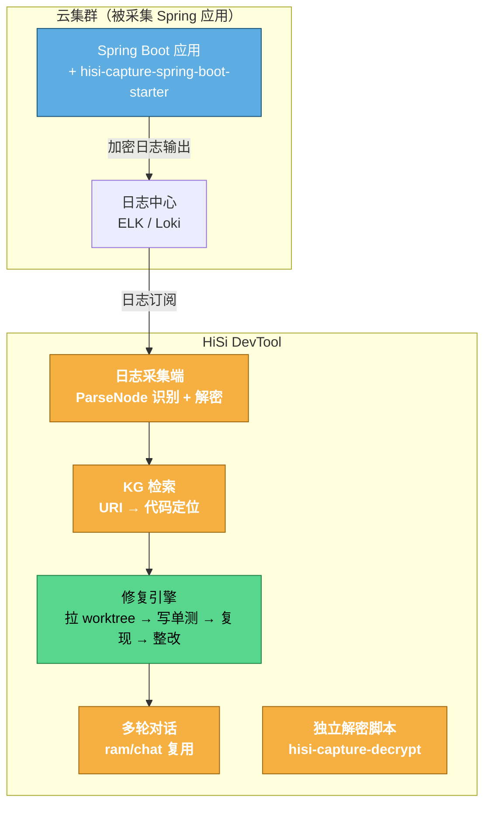

# 异常自动修复闭环系统 — 方案设计文档（v2.0 主索引）

> 版本：v2.0 | 日期：2026-07-01 | 状态：设计评审中
>
> 范围：Java Spring 项目（FastAPI 留待 v2）
>
> 说明：本文档为索引文档，详细设计见同目录 exception-auto-fix/ 下子文档。

---

## 1. 背景与目标

### 1.1 背景

当前 HiSi DevTool 已实现「故障日志分析报告自动生成」，但只到「根因报告」为止。生产异常被诊断后，仍需人工：拉分支 → 复现故障 → 整改代码 → 写测试 → 提 MR。整套流程人均 4-8 小时，且复现率受个人经验影响。

### 1.2 目标

**端到端自动修复闭环**：异常报告 → 一键自动修复 → AI 拉工作树 → 写单测复现 → 整改代码 → 提交本地 bugfix_<timestamp>_<uuid> 分支 → 用户 review → 多轮对话调整。

### 1.3 核心约束

| 约束 | 决策 |
|------|------|
| 被采集项目范围 | Java Spring（FastAPI v2） |
| 拦截范围 | 所有入口（HTTP / @Scheduled / @Async / FeignClient 出向 + SPI 扩展点预留） |
| 测试标准 | 纯 Mockito 单测（不启动 Spring，避免本地配置地狱） |
| 业务正确性 | 复现测试通过即可，业务逻辑由人工 review |
| 改动说明 | commit 描述说清改动原因 + 改动代码处加注释 |
| 多轮对话 | AI 跑完完整流程后用户 review MR，用户后续可继续多轮追问调整 |
| 分支提交 | bugfix_<timestamp>_<uuid>，提交到本地，不 push |

---

## 2. 整体架构

---

## 3. 子系统拆分

| 子系统 | 职责 | 复用 | 新建 | 详细设计文档 |
|--------|------|------|------|------------|
| A. 采集 SDK | 入口拦截 + 中间变量采集 + 异常 message 注入 + 加密 | hisi-otel-extension 模式参考 | hisi-capture-spring-boot-starter | [01-capture-sdk.md](./01-capture-sdk.md) |
| B. 日志识别端 | 识别 HISI_CAPTURE 格式 + 解密 + 提取入口/span | loganalysis/nodes/ParseNode | CaptureDecoder | [02-log-recognizer-fix-engine.md](./02-log-recognizer-fix-engine.md) |
| C. 修复引擎 | URI→代码定位 + 单测生成 + worktree + 复现 + 整改 | mergeanalysis/、ram/phase2v2/ | TestGenAgent + ReproAgent + FixAgent | [02-log-recognizer-fix-engine.md](./02-log-recognizer-fix-engine.md) |
| D. 多轮对话前端 | 类 RAM chat 页面，自动启动 + 历史会话 | ram/chat/、AiDiagnosisChat.vue | 修复会话页面 | [03-multi-turn-dialog-history.md](./03-multi-turn-dialog-history.md) |
| E. 历史会话管理 | 列表 + 详情展开 | LogAnalysisReportEntity | 修复会话关联表 | [03-multi-turn-dialog-history.md](./03-multi-turn-dialog-history.md) |
| F. 独立解密脚本 | 不依赖 HiSi DevTool 解密采集信息 | — | hisi-capture-decrypt CLI | [04-decrypt-script-business-scan.md](./04-decrypt-script-business-scan.md) |
| G. 配置开关 + 决策点 | 全局开关 + 决策点状态 + 工作量/风险 | — | — | [05-config-decisions-workload.md](./05-config-decisions-workload.md) |

---

## 4. 决策点状态总览

> v2.0 决策原则：除决策 5（AES-GCM）外，其他决策点均采用「默认实现 + 预留开关」策略，默认值见下表，开关详见 [05-config-decisions-workload.md](./05-config-decisions-workload.md)。

| 决策 | 默认实现 | 开关切换选项 | 状态 |
|------|---------|------------|------|
| 1. TTL 集成方式 | (c) BeanPostProcessor 自动包装业务方 ExecutorPoolConfig Bean | (a) agent 字节码改写 / (b) 显式 TtlExecutors 包装 | 默认 (c)，开关 hisi.capture.ttl.mode=auto/agent/explicit |
| 2. @CaptureLog 强制性 | (a) 静态扫描违规告警 | (b) 仅提示不告警 | 默认 (a)，开关 hisi.capture.scan.capture-log-strict=true/false |
| 3. silent_catch 兜底 3 默认开关 | (a) 默认开 | (b) 默认关 | 默认 (a)，开关 hisi.capture.silent-catch.enabled=true/false |
| 4. 单测生成失败兜底 | (a) 3 轮迭代后降级 | (b) 第一次失败即降级 | 默认 (a)，开关 hisi.fix.test-gen.max-iterate-rounds=3/1 |
| 5. 加密算法 | AES-256-GCM（已定） | — | ✅ 已决策 |
| 6. 加密方案 | 静态非对称 RSA-OAEP-2048 + AES-256-GCM 混合（已定） | — | ✅ 已决策 |

---

## 5. 业务方代码现状扫描结论（简版）

> 完整扫描结果见 [04-decrypt-script-business-scan.md §业务方扫描](./04-decrypt-script-business-scan.md#业务方代码现状扫描结果)。

| 维度 | 结果 | 对方案影响 |
|------|------|----------|
| Java 仓库 | ~31 个，主流 SB 3.5.14 + Java 21 | SDK 兼容 SB 2.x/3.x |
| 入口类型 | 只有 HTTP / @Async / @Scheduled / FeignClient | MVP 砍 Rabbit/Kafka/gRPC/WS/Netty SPI → 节省 ~2 天 |
| 线程池 | 100% 通过 com.hisilicon.<module>.basic.config.ExecutorPoolConfig Bean 暴露 | BeanPostProcessor 自动包装路径可行，业务零代码改动 |
| APM 现状 | 0 agent（无 OTel/SkyWalking/Pinpoint） | 零冲突接入 |

---

## 6. 文档索引

| 文档 | 内容 |
|------|------|
| 本文（主索引） | 背景、架构、子系统拆分、决策点状态总览 |
| [01-capture-sdk.md](./01-capture-sdk.md) | 子系统 A：采集 SDK 代码粒度设计 |
| [02-log-recognizer-fix-engine.md](./02-log-recognizer-fix-engine.md) | 子系统 B+C：日志识别端 + 修复引擎 |
| [03-multi-turn-dialog-history.md](./03-multi-turn-dialog-history.md) | 子系统 D+E：多轮对话前端 + 历史会话 |
| [04-decrypt-script-business-scan.md](./04-decrypt-script-business-scan.md) | 子系统 F + 附录：独立解密脚本 + 业务方扫描 |
| [05-config-decisions-workload.md](./05-config-decisions-workload.md) | 配置开关全集 + 决策点详述 + 工作量/风险 + 后续规划 |

---

## 7. 变更记录

| 版本 | 日期 | 修改内容 | 作者 |
|------|------|---------|------|
| v1.0 | 2026-07-01 | 初始版本 | AI + 用户讨论 |
| v1.1 | 2026-07-01 | 加密方案改静态非对称；记录线程池顾虑；新增业务方扫描结果；MVP 范围收敛 | AI + 用户讨论 |
| v2.0 | 2026-07-01 | 拆分为索引 + 5 个子文档；决策 1-4 改为「默认实现 + 预留开关」；决策 5 定 AES-GCM；全部刷新到代码粒度 | AI + 用户讨论 |
