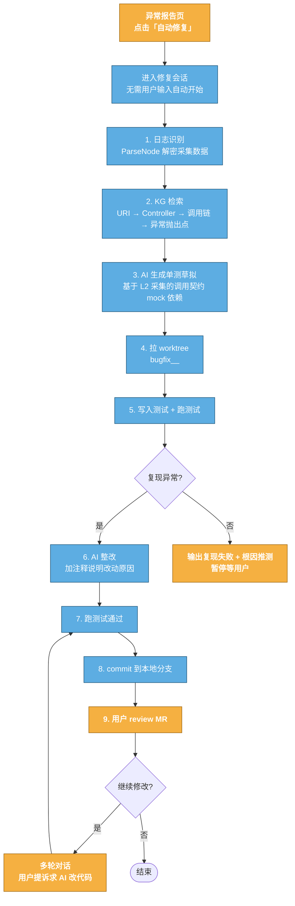

# 子系统 B + C：日志识别端 + 修复引擎

> 本文档覆盖：
> - 子系统 B：日志识别端（HiSi DevTool 后端，识别 HISI_CAPTURE 格式 + 解密 + 提取入口/span）
> - 子系统 C：修复引擎（URI→代码定位 + 单测生成 + worktree + 复现 + 整改 + commit）
>
> 代码位置：D:\codeknowledge\ HiSi DevTool 后端

---

## 1. 子系统 B：日志识别端

### 1.1 改造点

在 loganalysis/nodes/ParseNode 增加 HISI_CAPTURE 格式识别。

### 1.2 现有 ParseNode 结构（参考）

```
loganalysis/
├── nodes/
│   ├── ParseNode.java         # 改造点：加 HISI_CAPTURE 识别
│   ├── KgSearchNode.java      # 用 entry.uri 检索 KG
│   ├── CodeContextNode.java   # 用 spans 找异常抛出点
│   └── ...
├── service/
│   └── LogAnalysisService.java
└── entity/
    └── LogAnalysisContext.java
```

### 1.3 ParseNode 改造（代码粒度）

```java
package com.hisi.devtool.loganalysis.nodes;

import com.hisi.devtool.loganalysis.entity.LogAnalysisContext;
import com.hisi.devtool.loganalysis.entity.CapturePayload;
import com.hisi.devtool.loganalysis.decoder.CaptureDecoder;
import org.springframework.stereotype.Component;

import java.util.regex.*;

@Component
public class ParseNode implements DagNode {

    private static final Pattern CAPTURE_PATTERN =
        Pattern.compile("HISI_CAPTURE_BEGIN(\\{.*?\\})HISI_CAPTURE_END", Pattern.DOTALL);

    @Override
    public void execute(LogAnalysisContext ctx) {
        String log = ctx.getRawLog();
        Matcher m = CAPTURE_PATTERN.matcher(log);
        while (m.find()) {
            String json = m.group(1);
            try {
                CapturePayload payload = CaptureDecoder.decode(json);
                ctx.addCapture(payload);
            } catch (Exception e) {
                // 解密失败不阻塞流程，记录失败 payload
                ctx.addCaptureFailure(json, e);
            }
        }
    }
}
```

### 1.4 CaptureDecoder（混合加密解密）

```java
package com.hisi.devtool.loganalysis.decoder;

import com.hisi.devtool.loganalysis.entity.*;
import org.bouncycastle.jce.provider.BouncyCastleProvider;
import org.springframework.beans.factory.annotation.Value;
import org.springframework.core.io.FileSystemResource;
import org.springframework.stereotype.Component;

import javax.crypto.*;
import javax.crypto.spec.GCMParameterSpec;
import java.nio.file.*;
import java.security.*;
import java.security.spec.PKCS8EncodedKeySpec;
import java.util.Base64;

@Component
public class CaptureDecoder {

    static {
        Security.addProvider(new BouncyCastleProvider());
    }

    /**
     * 私钥路径：codeknowledge 内部配置，不发布到业务方。
     * 配置：hisi.capture.crypto.private-key-path=/path/to/hisi_capture_private.pem
     */
    @Value("${hisi.capture.crypto.private-key-path:}")
    private String privateKeyPath;

    @Value("${hisi.capture.crypto.private-key-b64:}")
    private String privateKeyB64;

    private PrivateKey sk;

    public static CapturePayload decode(String json) {
        // 1. 解析外层 JSON
        com.fasterxml.jackson.databind.JsonNode root =
            new com.fasterxml.jackson.databind.ObjectMapper().readTree(json);
        String alg = root.get("alg").asText();

        CapturePayload payload = new CapturePayload();
        payload.setAlg(alg);

        // 2. meta 明文
        com.fasterxml.jackson.databind.JsonNode meta = root.get("meta");
        payload.setEntryTag(meta.get("tag").asText());
        payload.setUri(meta.get("uri").asText());
        payload.setMethod(meta.get("method").asText());
        payload.setTimestamp(meta.get("ts").asLong());

        // 3. 解密 enc 字段（混合加密）
        com.fasterxml.jackson.databind.JsonNode enc = root.get("enc");
        PrivateKey sk = loadPrivateKey();

        if (enc.has("entry")) {
            payload.setEntryParams(decrypt(enc.get("entry").asText(), sk));
        }
        if (enc.has("spans")) {
            payload.setSpans(decrypt(enc.get("spans").asText(), sk));
        }
        if (enc.has("feign")) {
            payload.setFeignCalls(decrypt(enc.get("feign").asText(), sk));
        }

        return payload;
    }

    /**
     * 混合加密解密：
     *   1. base64 decode → rsa_wrapped_dek[256B] || iv[12B] || ct||tag
     *   2. RSA-OAEP-Decrypt(SK, rsa_wrapped_dek) → DEK
     *   3. AES-GCM-Decrypt(DEK, IV, ct||tag) → plaintext
     */
    private static String decrypt(String encB64, PrivateKey sk) throws Exception {
        byte[] raw = Base64.getDecoder().decode(encB64);
        byte[] wrappedDek = new byte[256];
        byte[] iv = new byte[12];
        byte[] ctTag = new byte[raw.length - 256 - 12];
        System.arraycopy(raw, 0, wrappedDek, 0, 256);
        System.arraycopy(raw, 256, iv, 0, 12);
        System.arraycopy(raw, 256 + 12, ctTag, 0, ctTag.length);

        // RSA 解密 DEK
        Cipher rsaCipher = Cipher.getInstance("RSA/ECB/OAEPWithSHA-256AndMGF1Padding");
        rsaCipher.init(Cipher.DECRYPT_MODE, sk);
        byte[] dek = rsaCipher.doFinal(wrappedDek);

        // AES-GCM 解密
        Cipher aesCipher = Cipher.getInstance("AES/GCM/NoPadding");
        aesCipher.init(Cipher.DECRYPT_MODE, new SecretKeySpec(dek, "AES"),
                       new GCMParameterSpec(128, iv));
        byte[] pt = aesCipher.doFinal(ctTag);
        return new String(pt, java.nio.charset.StandardCharsets.UTF_8);
    }

    private static PrivateKey loadPrivateKey() throws Exception {
        // 从文件或环境变量加载 PEM 私钥
        // 详见 04-decrypt-script-business-scan.md §独立解密脚本
        // codeknowledge 内部：读配置 hisi.capture.crypto.private-key-path
        // 此处简化，实际实现见 StaticPrivateKeyLoader
        throw new UnsupportedOperationException("See StaticPrivateKeyLoader");
    }
}
```

### 1.5 CapturePayload 实体

```java
package com.hisi.devtool.loganalysis.entity;

import java.util.List;
import java.util.Map;

public class CapturePayload {
    private String alg;
    private String entryTag;       // meta.tag
    private String uri;            // meta.uri
    private String method;         // meta.method
    private long timestamp;        // meta.ts
    private Map<String, Object> entryParams;  // 解密后
    private List<Map<String, Object>> spans;  // 解密后
    private List<Map<String, Object>> feignCalls;  // 解密后

    // getters / setters 略
}
```

### 1.6 LogAnalysisContext 扩展

```java
package com.hisi.devtool.loganalysis.entity;

import java.util.*;

public class LogAnalysisContext {
    private String rawLog;
    private List<CapturePayload> captures = new ArrayList<>();
    private List<CaptureFailure> captureFailures = new ArrayList<>();
    // ... 其他字段

    public void addCapture(CapturePayload payload) { captures.add(payload); }
    public void addCaptureFailure(String json, Exception e) {
        captureFailures.add(new CaptureFailure(json, e));
    }
    // getters / setters 略
}

class CaptureFailure {
    private String rawJson;
    private String error;
    public CaptureFailure(String rawJson, Exception e) {
        this.rawJson = rawJson;
        this.error = e.getClass().getSimpleName() + ": " + e.getMessage();
    }
    // getters 略
}
```

### 1.7 下游节点利用

#### 1.7.1 KgSearchNode 用 entry.uri 检索定位

```java
package com.hisi.devtool.loganalysis.nodes;

import com.hisi.devtool.kg.api.KgClient;
import com.hisi.devtool.kg.api.dto.*;
import com.hisi.devtool.loganalysis.entity.*;
import org.springframework.beans.factory.annotation.Autowired;
import org.springframework.stereotype.Component;

import java.util.List;

@Component
public class KgSearchNode implements DagNode {

    @Autowired
    private KgClient kgClient;

    @Override
    public void execute(LogAnalysisContext ctx) {
        for (CapturePayload cap : ctx.getCaptures()) {
            // 用 uri 检索 KG 定位 Controller
            List<MethodNode> methods = kgClient.findMethodsByUri(cap.getUri());
            ctx.addKgHit(cap.getEntryTag(), methods);
        }
    }
}
```

#### 1.7.2 CodeContextNode 用 spans 找异常抛出点

```java
package com.hisi.devtool.loganalysis.nodes;

import com.hisi.devtool.kg.api.KgClient;
import com.hisi.devtool.kg.api.dto.MethodNode;
import com.hisi.devtool.loganalysis.entity.*;
import org.springframework.beans.factory.annotation.Autowired;
import org.springframework.stereotype.Component;

import java.util.*;

@Component
public class CodeContextNode implements DagNode {

    @Autowired
    private KgClient kgClient;

    @Override
    public void execute(LogAnalysisContext ctx) {
        for (CapturePayload cap : ctx.getCaptures()) {
            // spans[0] 是异常抛出点
            List<Map<String, Object>> spans = cap.getSpans();
            if (spans == null || spans.isEmpty()) continue;

            Map<String, Object> throwSpan = spans.get(0);
            String sig = (String) throwSpan.get("sig");
            // sig 格式: ClassName.methodName(ParamType1,ParamType2)
            MethodNode method = kgClient.findMethodBySignature(sig);
            ctx.addCodeContext(cap.getEntryTag(), method);
        }
    }
}
```

---

## 2. 子系统 C：修复引擎

### 2.1 流程总览



### 2.2 模块结构

```
fixengine/
├── controller/
│   └── FixSessionController.java        # 启动修复会话入口
├── service/
│   ├── FixOrchestrator.java             # 编排 1-9 步
│   ├── TestGenService.java              # 单测生成（最难点）
│   ├── ReproService.java                # 复现验证
│   ├── FixService.java                  # AI 整改
│   └── WorktreeService.java             # worktree + commit
├── agent/
│   ├── TestGenAgent.java                # AI Agent
│   ├── FixAgent.java                    # AI Agent
│   └── prompt/
│       ├── test-gen-prompt.txt
│       └── fix-prompt.txt
├── executor/
│   ├── MavenExecutor.java               # 跑 mvn test
│   └── GitExecutor.java                 # worktree + commit
└── entity/
    ├── FixSession.java
    └── FixStep.java
```

### 2.3 FixSessionController

```java
package com.hisi.devtool.fixengine.controller;

import com.hisi.devtool.fixengine.service.FixOrchestrator;
import com.hisi.devtool.fixengine.entity.FixSession;
import org.springframework.beans.factory.annotation.Autowired;
import org.springframework.web.bind.annotation.*;

@RestController
@RequestMapping("/api/fix")
public class FixSessionController {

    @Autowired
    private FixOrchestrator orchestrator;

    /**
     * 启动修复会话：用户点击「自动修复」按钮调用此接口。
     * 立即返回 sessionId，后续流程异步执行通过 WebSocket 推送进度。
     */
    @PostMapping("/sessions")
    public com.hisi.devtool.common.core.domain.R<Long> startSession(
            @RequestParam Long reportId) {
        FixSession session = orchestrator.startSession(reportId);
        return com.hisi.devtool.common.core.domain.R.ok(session.getId());
    }
}
```

### 2.4 FixOrchestrator（核心编排）

```java
package com.hisi.devtool.fixengine.service;

import com.hisi.devtool.fixengine.entity.*;
import com.hisi.devtool.loganalysis.entity.*;
import com.hisi.devtool.loganalysis.service.LogAnalysisService;
import com.hisi.devtool.kg.api.KgClient;
import com.hisi.devtool.kg.api.dto.*;
import org.springframework.beans.factory.annotation.Autowired;
import org.springframework.stereotype.Service;

import java.util.UUID;

@Service
public class FixOrchestrator {

    @Autowired private LogAnalysisService logAnalysisService;
    @Autowired private KgClient kgClient;
    @Autowired private TestGenService testGenService;
    @Autowired private ReproService reproService;
    @Autowired private FixService fixService;
    @Autowired private WorktreeService worktreeService;
    @Autowired private FixSessionWebSocketHandler wsHandler;

    /**
     * 启动修复会话，立即返回，后续异步执行 1-9 步。
     */
    public FixSession startSession(Long reportId) {
        FixSession session = new FixSession();
        session.setReportId(reportId);
        session.setStatus("RUNNING");
        session.setSessionType("FIX");
        session.setBranchName(generateBranchName());
        session.insert();

        // 异步执行流程
        new Thread(() -> runFlow(session)).start();
        return session;
    }

    private void runFlow(FixSession session) {
        try {
            // 步骤 1：日志识别
            wsHandler.push(session.getId(), "step1", "日志识别中");
            LogAnalysisContext logCtx = logAnalysisService.analyzeByReportId(session.getReportId());
            CapturePayload capture = logCtx.getCaptures().get(0);
            wsHandler.push(session.getId(), "step1", "日志识别完成: tag=" + capture.getEntryTag());

            // 步骤 2：KG 检索
            wsHandler.push(session.getId(), "step2", "KG 检索中");
            MethodNode controller = kgClient.findMethodByUri(capture.getUri());
            List<MethodNode> callChain = kgClient.findCallChain(controller);
            MethodNode throwPoint = findThrowPoint(capture, callChain);
            wsHandler.push(session.getId(), "step2", "KG 检索完成: throwPoint=" + throwPoint);

            // 步骤 4：拉 worktree（先于测试生成，避免污染原工作区）
            wsHandler.push(session.getId(), "step4", "拉 worktree");
            String worktreePath = worktreeService.createWorktree(
                session.getBranchName(), throwPoint.getRepoPath(), throwPoint.getBranch());
            session.setWorktreePath(worktreePath);

            // 步骤 3：AI 生成单测草拟
            wsHandler.push(session.getId(), "step3", "AI 生成单测");
            String testCode = testGenService.generate(capture, throwPoint, callChain);
            worktreeService.writeTestFile(worktreePath, throwPoint, testCode);

            // 步骤 5：跑测试（决策 4 默认 3 轮迭代）
            wsHandler.push(session.getId(), "step5", "跑复现测试");
            boolean reproduced = reproService.runAndCheckRepro(worktreePath, throwPoint, capture, 3);
            wsHandler.push(session.getId(), "step5", "复现结果: " + reproduced);

            if (!reproduced) {
                session.setStatus("PAUSED");
                session.update();
                wsHandler.push(session.getId(), "pause", "复现失败，等待用户");
                return;
            }

            // 步骤 6：AI 整改
            wsHandler.push(session.getId(), "step6", "AI 整改");
            String fixCode = fixService.fix(throwPoint, capture, worktreePath);
            worktreeService.applyFix(worktreePath, throwPoint, fixCode);

            // 步骤 7：跑测试通过
            wsHandler.push(session.getId(), "step7", "跑整改后测试");
            boolean passed = reproService.runAndCheckPass(worktreePath, throwPoint);
            if (!passed) {
                session.setStatus("PAUSED");
                session.update();
                wsHandler.push(session.getId(), "pause", "整改未通过测试，等待用户");
                return;
            }

            // 步骤 8：commit 到本地分支（不 push）
            wsHandler.push(session.getId(), "step8", "commit 到本地分支");
            String commitHash = worktreeService.commit(session.getBranchName(), worktreePath,
                "fix: " + throwPoint.getSimpleName() + " NPE reproduced and fixed\n\n" +
                "Root cause: ...\nFix: ...\nTest: ...");
            session.setCommitHash(commitHash);

            session.setStatus("SUCCESS");
            session.update();
            wsHandler.push(session.getId(), "done", "完成，等待用户 review");

        } catch (Exception e) {
            session.setStatus("FAILED");
            session.setErrorMsg(e.getMessage());
            session.update();
            wsHandler.push(session.getId(), "error", e.getMessage());
        }
    }

    private MethodNode findThrowPoint(CapturePayload cap, List<MethodNode> chain) {
        // spans[0].sig = ClassName.methodName(ParamTypes)
        String sig = (String) cap.getSpans().get(0).get("sig");
        return chain.stream()
            .filter(m -> m.getSignature().equals(sig))
            .findFirst()
            .orElse(chain.get(0));
    }

    private String generateBranchName() {
        return "bugfix_" + System.currentTimeMillis() + "_" +
               UUID.randomUUID().toString().substring(0, 8);
    }
}
```

### 2.5 TestGenService（最难点：基于 L2 采集契约生成 Mockito 单测）

```java
package com.hisi.devtool.fixengine.service;

import com.hisi.devtool.fixengine.agent.TestGenAgent;
import com.hisi.devtool.fixengine.entity.*;
import com.hisi.devtool.kg.api.dto.*;
import com.hisi.devtool.loganalysis.entity.CapturePayload;
import org.springframework.beans.factory.annotation.Autowired;
import org.springframework.beans.factory.annotation.Value;
import org.springframework.stereotype.Service;

import java.util.*;

@Service
public class TestGenService {

    @Autowired private TestGenAgent agent;

    /**
     * 决策 4：单测生成失败兜底
     *   - 默认 max-iterate-rounds=3：3 轮迭代修测试
     *   - 切换 =1：第一次失败即降级
     */
    @Value("${hisi.fix.test-gen.max-iterate-rounds:3}")
    private int maxIterateRounds;

    /**
     * 生成 Mockito 单测。
     *
     * 输入：
     *   - capture: 入口入参 + spans（含每个依赖方法的签名/入参/返回值）+ 异常类型+message
     *   - throwPoint: 异常抛出方法
     *   - callChain: 调用链
     *
     * 输出：@ExtendWith(MockitoExtension.class) 单测类源代码
     */
    public String generate(CapturePayload cap, MethodNode throwPoint, List<MethodNode> chain) {
        TestGenInput input = new TestGenInput();
        input.setTestMethodName("reproduce_" + throwPoint.getSimpleName());
        input.setTestMethodSignature(throwPoint.getSignature());
        input.setEntryParams(cap.getEntryParams());
        input.setSpans(cap.getSpans());
        input.setExceptionType(cap.getExceptionType());
        input.setExceptionMessage(cap.getExceptionMessage());
        input.setCallChain(chain);

        return agent.generate(input, maxIterateRounds);
    }
}
```

### 2.6 TestGenAgent（AI Agent + prompt 工程）

```java
package com.hisi.devtool.fixengine.agent;

import com.hisi.devtool.fixengine.entity.TestGenInput;
import com.hisi.devtool.llm.LlmClient;
import org.springframework.beans.factory.annotation.Autowired;
import org.springframework.core.io.ClassPathResource;
import org.springframework.stereotype.Component;

import java.nio.charset.StandardCharsets;

@Component
public class TestGenAgent {

    @Autowired private LlmClient llm;
    @Autowired private TestRunner runner;

    private final String promptTemplate;

    public TestGenAgent() throws Exception {
        this.promptTemplate = new String(
            new ClassPathResource("prompt/test-gen-prompt.txt").getInputStream().readAllBytes(),
            StandardCharsets.UTF_8);
    }

    public String generate(TestGenInput input, int maxRounds) {
        String prompt = renderPrompt(promptTemplate, input);
        String testCode = llm.complete(prompt);

        // 迭代修测试（决策 4 默认 3 轮）
        for (int round = 1; round <= maxRounds; round++) {
            TestRunResult result = runner.run(input.getTestClassPackage(), testCode);
            if (result.isPassed()) {
                return testCode;
            }
            if (result.isReproduced()) {
                // 测试失败但成功复现目标异常 → 达成复现目的
                return testCode;
            }
            // 修测试
            String fixPrompt = buildFixPrompt(prompt, testCode, result.getFailureMsg());
            testCode = llm.complete(fixPrompt);
        }

        // 超过最大轮数，返回当前版本（标记为草拟）
        return testCode + "\n// [DRAFT] max-iterate-rounds=" + maxRounds + " exceeded";
    }

    private String renderPrompt(String tpl, TestGenInput input) {
        // 模板替换：{className} {methodName} {spansJson} {exceptionType} 等
        return tpl
            .replace("{testMethodName}", input.getTestMethodName())
            .replace("{testMethodSignature}", input.getTestMethodSignature())
            .replace("{entryParamsJson}", toJson(input.getEntryParams()))
            .replace("{spansJson}", toJson(input.getSpans()))
            .replace("{exceptionType}", input.getExceptionType())
            .replace("{exceptionMessage}", input.getExceptionMessage());
    }

    private String buildFixPrompt(String origPrompt, String testCode, String failureMsg) {
        return origPrompt + "\n\n## 上一版测试代码\n```java\n" + testCode +
               "\n```\n\n## 跑测试失败信息\n```\n" + failureMsg +
               "\n```\n\n请基于失败信息修正测试代码。";
    }

    private String toJson(Object o) {
        try {
            return new com.fasterxml.jackson.databind.ObjectMapper()
                .writeValueAsString(o);
        } catch (Exception e) { return String.valueOf(o); }
    }
}
```

### 2.7 test-gen-prompt.txt（prompt 模板）

```
你是一个 Java 测试工程师。基于以下采集到的运行时数据，生成一个 Mockito 纯单测，用于复现目标异常。

## 目标
- 测试类用 @ExtendWith(MockitoExtension.class)
- 不启动 Spring，不依赖本地配置
- 所有依赖用 @Mock，被测对象用 @InjectMocks
- 复现目标异常：{exceptionType}: {exceptionMessage}

## 被测方法
{testMethodSignature}

## 入口入参（来自采集）
{entryParamsJson}

## 调用链 spans（每个 span 含方法签名/入参/返回值，从异常抛出点栈顶开始）
{spansJson}

## 测试方法名
{testMethodName}

## 输出要求
- 只输出 Java 源代码，不要解释
- 包名按被测方法所在包
- 类名：{testMethodName} 的 PascalCase 形式 + Test
- Given-When-Then 结构，加注释说明每步依据来自哪个 span
```

### 2.8 生成的单测样例

```java
package com.example.order.service;

import org.junit.jupiter.api.*;
import org.junit.jupiter.api.extension.ExtendWith;
import org.mockito.*;
import org.mockito.junit.jupiter.MockitoExtension;

import static org.junit.jupiter.api.Assertions.*;
import static org.mockito.ArgumentMatchers.any;
import static org.mockito.Mockito.when;

@ExtendWith(MockitoExtension.class)
class OrderServiceCreateReproTest {

    @Mock InventoryMapper inventoryMapper;
    @Mock PaymentClient paymentClient;
    @InjectMocks OrderService orderService;

    @Test
    @DisplayName("复现 NPE: OrderService.create 当 order.userId 为 null")
    void reproduce_npe() {
        // Given - 来自 entry.params
        OrderReq req = new OrderReq(123, "A001", 2);

        // 来自 span[0] (InventoryMapper.deduct) 的真实返回值
        when(inventoryMapper.deduct(any())).thenReturn(0);

        // 来自 span[1] (PaymentClient.charge) 的真实返回值
        when(paymentClient.charge(any())).thenReturn(200);

        // When & Then - 复现目标 NPE
        NullPointerException ex = assertThrows(NullPointerException.class,
            () -> orderService.create(req));
        assertTrue(ex.getMessage().contains("Order.getUserId"));
    }
}
```

### 2.9 ReproService（跑测试 + 判定复现）

```java
package com.hisi.devtool.fixengine.service;

import com.hisi.devtool.fixengine.executor.MavenExecutor;
import com.hisi.devtool.fixengine.executor.TestRunResult;
import com.hisi.devtool.kg.api.dto.MethodNode;
import com.hisi.devtool.loganalysis.entity.CapturePayload;
import org.springframework.beans.factory.annotation.Autowired;
import org.springframework.stereotype.Service;

@Service
public class ReproService {

    @Autowired private MavenExecutor maven;

    /**
     * 跑复现测试，判定是否复现目标异常。
     *
     * @param rounds 决策 4 默认 3 轮
     */
    public boolean runAndCheckRepro(String worktreePath, MethodNode throwPoint,
                                     CapturePayload cap, int rounds) {
        for (int round = 1; round <= rounds; round++) {
            TestRunResult result = maven.runTest(worktreePath, throwPoint);
            if (result.isReproduced(cap.getExceptionType(), cap.getExceptionMessage())) {
                return true;
            }
        }
        return false;
    }

    public boolean runAndCheckPass(String worktreePath, MethodNode throwPoint) {
        TestRunResult result = maven.runTest(worktreePath, throwPoint);
        return result.isPassed();
    }
}
```

### 2.10 MavenExecutor

```java
package com.hisi.devtool.fixengine.executor;

import com.hisi.devtool.kg.api.dto.MethodNode;
import org.springframework.stereotype.Component;

import java.io.*;
import java.nio.file.Path;

@Component
public class MavenExecutor {

    public TestRunResult runTest(String worktreePath, MethodNode method) {
        try {
            // mvn -pl <module> test -Dtest=<TestClass>#<testMethod>
            String testClass = method.getSimpleName() + "ReproTest";
            ProcessBuilder pb = new ProcessBuilder(
                "mvn", "test",
                "-Dtest=" + testClass,
                "-pl", method.getModuleName(),
                "-q"
            ).directory(Path.of(worktreePath).toFile());
            pb.redirectErrorStream(true);
            Process p = pb.start();
            String output = new String(p.getInputStream().readAllBytes());
            int code = p.waitFor();
            return new TestRunResult(code, output);
        } catch (Exception e) {
            return new TestRunResult(-1, "Executor error: " + e.getMessage());
        }
    }
}
```

```java
package com.hisi.devtool.fixengine.executor;

public class TestRunResult {
    private final int exitCode;
    private final String output;

    public TestRunResult(int exitCode, String output) {
        this.exitCode = exitCode;
        this.output = output;
    }

    public boolean isPassed() { return exitCode == 0; }

    public boolean isReproduced(String exType, String exMsg) {
        // 测试失败但抛出了目标异常 → 复现成功
        return exitCode != 0 &&
               output.contains(exType) &&
               (exMsg == null || output.contains(exMsg));
    }

    public String getFailureMsg() { return output; }
    public int getExitCode() { return exitCode; }
    public String getOutput() { return output; }
}
```

### 2.11 FixService + FixAgent（AI 整改）

```java
package com.hisi.devtool.fixengine.service;

import com.hisi.devtool.fixengine.agent.FixAgent;
import com.hisi.devtool.kg.api.dto.MethodNode;
import com.hisi.devtool.loganalysis.entity.CapturePayload;
import org.springframework.beans.factory.annotation.Autowired;
import org.springframework.stereotype.Service;

@Service
public class FixService {

    @Autowired private FixAgent agent;

    public String fix(MethodNode throwPoint, CapturePayload cap, String worktreePath) {
        return agent.fix(throwPoint, cap, worktreePath);
    }
}
```

```java
package com.hisi.devtool.fixengine.agent;

import com.hisi.devtool.fixengine.executor.GitExecutor;
import com.hisi.devtool.kg.api.dto.MethodNode;
import com.hisi.devtool.llm.LlmClient;
import com.hisi.devtool.loganalysis.entity.CapturePayload;
import org.springframework.beans.factory.annotation.Autowired;
import org.springframework.core.io.ClassPathResource;
import org.springframework.stereotype.Component;

import java.nio.charset.StandardCharsets;
import java.nio.file.*;

@Component
public class FixAgent {

    @Autowired private LlmClient llm;
    @Autowired private GitExecutor git;

    private final String promptTemplate;

    public FixAgent() throws Exception {
        this.promptTemplate = new String(
            new ClassPathResource("prompt/fix-prompt.txt").getInputStream().readAllBytes(),
            StandardCharsets.UTF_8);
    }

    public String fix(MethodNode throwPoint, CapturePayload cap, String worktreePath) {
        // 读取异常抛出方法源代码
        String sourceCode = Files.readString(Path.of(worktreePath, throwPoint.getFilePath()));
        String prompt = renderPrompt(promptTemplate, throwPoint, cap, sourceCode);
        String fixCode = llm.complete(prompt);
        return fixCode;
    }

    private String renderPrompt(String tpl, MethodNode m, CapturePayload cap, String src) {
        return tpl
            .replace("{methodSignature}", m.getSignature())
            .replace("{exceptionType}", cap.getExceptionType())
            .replace("{exceptionMessage}", cap.getExceptionMessage())
            .replace("{sourceCode}", src)
            .replace("{entryParams}", String.valueOf(cap.getEntryParams()));
    }
}
```

### 2.12 fix-prompt.txt（整改 prompt）

```
你是 Java 资深工程师。基于以下信息，修复目标方法中的异常。

## 整改原则（必须遵守）
1. 复现测试通过即可，不做业务逻辑增强
2. 改动代码处加注释说明改动原因（WHY，非 WHAT）
3. 不顺手优化周边代码（外科手术式改动）
4. 匹配既有代码风格

## 目标方法
{methodSignature}

## 异常
- 类型：{exceptionType}
- message：{exceptionMessage}

## 入口入参（来自采集）
{entryParams}

## 当前源代码
```java
{sourceCode}
```

## 输出要求
- 只输出修改后的完整方法源代码（包含所在类的 package 和 import 不需要重复）
- 在改动行上方加 // 注释说明改动原因
```

### 2.13 WorktreeService（worktree + commit）

```java
package com.hisi.devtool.fixengine.service;

import com.hisi.devtool.fixengine.executor.GitExecutor;
import com.hisi.devtool.kg.api.dto.MethodNode;
import org.springframework.beans.factory.annotation.Autowired;
import org.springframework.beans.factory.annotation.Value;
import org.springframework.stereotype.Service;

import java.nio.file.*;

@Service
public class WorktreeService {

    @Autowired private GitExecutor git;

    @Value("${hisi.fix.worktree.base-dir:D:/codeknowledge/fix-worktrees}")
    private String baseDir;

    public String createWorktree(String branchName, String repoPath, String targetBranch) {
        Path worktree = Path.of(baseDir, branchName);
        Files.createDirectories(worktree.getParent());
        git.createWorktree(repoPath, worktree.toString(), branchName, targetBranch);
        return worktree.toString();
    }

    public void writeTestFile(String worktreePath, MethodNode method, String testCode) {
        // 测试文件路径：src/test/java/<package>/XxxReproTest.java
        Path testFile = Path.of(worktreePath, "src/test/java",
            method.getPackageName().replace(".", "/"),
            method.getSimpleName() + "ReproTest.java");
        Files.createDirectories(testFile.getParent());
        Files.writeString(testFile, testCode);
    }

    public void applyFix(String worktreePath, MethodNode method, String fixedMethodSource) {
        // 解析 fixedMethodSource 中的方法体，替换原文件中对应方法
        // 简化实现：全文件替换
        Path srcFile = Path.of(worktreePath, method.getFilePath());
        String original = Files.readString(srcFile);
        String updated = replaceMethod(original, method, fixedMethodSource);
        Files.writeString(srcFile, updated);
    }

    public String commit(String branchName, String worktreePath, String message) {
        return git.commitAll(worktreePath, message);
    }

    private String replaceMethod(String original, MethodNode method, String newMethod) {
        // 实现略：用 JavaParser 或正则定位方法体并替换
        return original;
    }
}
```

### 2.14 GitExecutor

```java
package com.hisi.devtool.fixengine.executor;

import org.springframework.stereotype.Component;

import java.io.*;
import java.nio.file.Path;

@Component
public class GitExecutor {

    public void createWorktree(String repoPath, String worktreePath,
                                String branchName, String targetBranch) {
        exec(repoPath, "git", "worktree", "add", "-b", branchName,
             worktreePath, targetBranch);
    }

    public String commitAll(String worktreePath, String message) {
        exec(worktreePath, "git", "add", "-A");
        exec(worktreePath, "git", "commit", "-m", message);
        return revParseHead(worktreePath);
    }

    private String revParseHead(String worktreePath) {
        return exec(worktreePath, "git", "rev-parse", "HEAD");
    }

    private String exec(String workdir, String... cmd) {
        try {
            ProcessBuilder pb = new ProcessBuilder(cmd)
                .directory(Path.of(workdir).toFile())
                .redirectErrorStream(true);
            Process p = pb.start();
            String output = new String(p.getInputStream().readAllBytes());
            int code = p.waitFor();
            if (code != 0) {
                throw new RuntimeException("Command failed: " + String.join(" ", cmd) +
                    "\nOutput: " + output);
            }
            return output.trim();
        } catch (Exception e) {
            throw new RuntimeException("Exec failed: " + e.getMessage(), e);
        }
    }
}
```

### 2.15 复用现有组件清单

| 阶段 | 复用 | 改造 |
|------|------|------|
| 1 日志识别 | loganalysis/nodes/ParseNode | 加 HISI_CAPTURE 格式识别 + 解密 |
| 2 KG 检索 | kg/ + ram/kg/impl/DirectKgClient | 入参→代码定位策略 |
| 3 单测生成 | ram/phase2v2/ChainAnalysisAgent 模式 | TestGenAgent（最难点） |
| 4 worktree | mergeanalysis/service/ | 命名规范 bugfix_<ts>_<uuid>，本地不 push |
| 5 跑测试 | Bash 调 mvn | 结果解析 |
| 6 整改 | tdd-guide Agent + java-reviewer | 整改 prompt 工程 |
| 7 commit | git-workflow skill | 本地分支不 push |
| 8 多轮对话 | ram/chat/RamChatOrchestrator + WebSocket | 复用，详见 [03-multi-turn-dialog-history.md](./03-multi-turn-dialog-history.md) |
