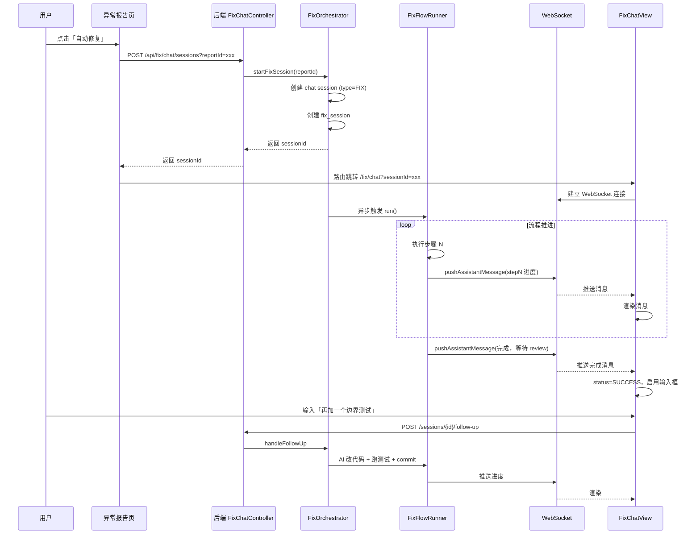

# 子系统 D + E：多轮对话前端 + 历史会话管理

> 本文档覆盖：
> - 子系统 D：多轮对话前端（类 RAM chat 页面，自动启动 + 历史会话）
> - 子系统 E：历史会话管理（列表 + 详情展开）
>
> 代码位置：
> - 后端：com.hisi.devtool.fixengine.* + com.hisi.devtool.ram.chat.*
> - 前端：hisi-dev-tool-frontend/src/views/fix/

---

## 1. 子系统 D：多轮对话前端

### 1.1 复用 RAM chat 组件清单

| RAM chat 组件 | 路径 | 修复会话复用方式 |
|--------------|------|----------------|
| RamChatOrchestrator | ram/chat/RamChatOrchestrator.java | 直接复用，新增 SessionType.FIX |
| RamChatWebSocketHandler | ram/chat/RamChatWebSocketHandler.java | 直接复用 |
| RamChatController | ram/chat/RamChatController.java | 直接复用 |
| AiDiagnosisChat.vue | views/apm-debug/AiDiagnosisChat.vue | 复制一份改 views/fix/FixChatView.vue |

### 1.2 后端：SessionType 扩展

```java
package com.hisi.devtool.ram.chat.enums;

public enum SessionType {
    RAM,        // 原有 RAM 诊断会话
    FIX         // 新增：异常自动修复会话
}
```

### 1.3 后端：FixChatController（修复会话专用入口）

```java
package com.hisi.devtool.fixengine.controller;

import com.hisi.devtool.fixengine.service.FixOrchestrator;
import com.hisi.devtool.fixengine.service.FixChatService;
import com.hisi.devtool.ram.chat.entity.RamChatSession;
import org.springframework.beans.factory.annotation.Autowired;
import org.springframework.web.bind.annotation.*;

@RestController
@RequestMapping("/api/fix/chat")
public class FixChatController {

    @Autowired private FixOrchestrator orchestrator;
    @Autowired private FixChatService chatService;

    /**
     * 启动修复会话：用户在异常报告页点击「自动修复」调用。
     * 立即返回 sessionId，AI 自动开始流程，无需用户输入。
     */
    @PostMapping("/sessions")
    public com.hisi.devtool.common.core.domain.R<Long> startSession(
            @RequestParam Long reportId) {
        RamChatSession session = orchestrator.startFixSession(reportId);
        return com.hisi.devtool.common.core.domain.R.ok(session.getId());
    }

    /**
     * 用户在 review MR 后继续追问：多轮对话调整。
     */
    @PostMapping("/sessions/{sessionId}/follow-up")
    public com.hisi.devtool.common.core.domain.R<Void> followUp(
            @PathVariable Long sessionId,
            @RequestBody String userMessage) {
        chatService.handleFollowUp(sessionId, userMessage);
        return com.hisi.devtool.common.core.domain.R.ok();
    }

    /**
     * 加载历史会话完整对话记录（只读）。
     */
    @GetMapping("/sessions/{sessionId}/history")
    public com.hisi.devtool.common.core.domain.R<List<ChatMessageVo>> getHistory(
            @PathVariable Long sessionId) {
        return com.hisi.devtool.common.core.domain.R.ok(chatService.loadHistory(sessionId));
    }
}
```

### 1.4 FixOrchestrator.startFixSession（接入 RAM chat）

```java
package com.hisi.devtool.fixengine.service;

import com.hisi.devtool.fixengine.entity.FixSession;
import com.hisi.devtool.ram.chat.entity.*;
import com.hisi.devtool.ram.chat.enums.SessionType;
import com.hisi.devtool.ram.chat.service.RamChatSessionService;
import org.springframework.beans.factory.annotation.Autowired;
import org.springframework.stereotype.Service;

@Service
public class FixOrchestrator {

    @Autowired private RamChatSessionService sessionService;
    @Autowired private FixFlowRunner flowRunner;

    /**
     * 启动修复会话：创建 RAM chat session（type=FIX），立即触发修复流程。
     */
    public RamChatSession startFixSession(Long reportId) {
        // 1. 创建 chat session
        RamChatSession session = sessionService.create(SessionType.FIX, reportId);

        // 2. 关联 fix_session
        FixSession fixSession = new FixSession();
        fixSession.setReportId(reportId);
        fixSession.setChatSessionId(session.getId());
        fixSession.setStatus("RUNNING");
        fixSession.setBranchName(generateBranchName());
        fixSession.insert();

        // 3. 异步执行修复流程（步骤 1-9）
        new Thread(() -> flowRunner.run(fixSession, session)).start();

        return session;
    }

    private String generateBranchName() {
        return "bugfix_" + System.currentTimeMillis() + "_" +
               java.util.UUID.randomUUID().toString().substring(0, 8);
    }
}
```

### 1.5 FixFlowRunner（流程推进 + WebSocket 推送）

```java
package com.hisi.devtool.fixengine.service;

import com.hisi.devtool.fixengine.entity.*;
import com.hisi.devtool.ram.chat.entity.*;
import com.hisi.devtool.ram.chat.service.RamChatWebSocketHandler;
import org.springframework.beans.factory.annotation.Autowired;
import org.springframework.stereotype.Service;

@Service
public class FixFlowRunner {

    @Autowired private LogAnalysisService logAnalysisService;
    @Autowired private KgClient kgClient;
    @Autowired private TestGenService testGenService;
    @Autowired private ReproService reproService;
    @Autowired private FixService fixService;
    @Autowired private WorktreeService worktreeService;
    @Autowired private RamChatWebSocketHandler wsHandler;

    public void run(FixSession fixSession, RamChatSession chatSession) {
        try {
            // 每一步都通过 WebSocket 推送进度消息到前端 chat 界面

            // 步骤 1：日志识别
            push(chatSession, "🔍 日志识别中...");
            LogAnalysisContext logCtx = logAnalysisService.analyzeByReportId(fixSession.getReportId());
            CapturePayload capture = logCtx.getCaptures().get(0);
            push(chatSession, "✅ 日志识别完成：entryTag=" + capture.getEntryTag() +
                 ", uri=" + capture.getUri());

            // 步骤 2：KG 检索
            push(chatSession, "🔍 KG 检索异常抛出点...");
            MethodNode controller = kgClient.findMethodByUri(capture.getUri());
            List<MethodNode> callChain = kgClient.findCallChain(controller);
            MethodNode throwPoint = findThrowPoint(capture, callChain);
            push(chatSession, "✅ 定位到：" + throwPoint.getSignature());

            // 步骤 4：拉 worktree
            push(chatSession, "🔨 拉取 worktree: " + fixSession.getBranchName());
            String worktreePath = worktreeService.createWorktree(
                fixSession.getBranchName(), throwPoint.getRepoPath(), throwPoint.getBranch());
            fixSession.setWorktreePath(worktreePath);

            // 步骤 3：AI 生成单测
            push(chatSession, "🤖 AI 生成复现单测...");
            String testCode = testGenService.generate(capture, throwPoint, callChain);
            worktreeService.writeTestFile(worktreePath, throwPoint, testCode);
            push(chatSession, "✅ 单测已生成：" + throwPoint.getSimpleName() + "ReproTest.java");

            // 步骤 5：跑复现测试
            push(chatSession, "🧪 跑复现测试...");
            boolean reproduced = reproService.runAndCheckRepro(worktreePath, throwPoint, capture, 3);
            if (!reproduced) {
                push(chatSession, "⚠️ 复现失败，已暂停。请用户补全测试或提供更多线索。");
                fixSession.setStatus("PAUSED");
                fixSession.update();
                return;
            }
            push(chatSession, "✅ 成功复现异常：" + capture.getExceptionType());

            // 步骤 6：AI 整改
            push(chatSession, "🤖 AI 整改中...");
            String fixCode = fixService.fix(throwPoint, capture, worktreePath);
            worktreeService.applyFix(worktreePath, throwPoint, fixCode);
            push(chatSession, "✅ 整改完成");

            // 步骤 7：跑整改后测试
            push(chatSession, "🧪 跑整改后测试...");
            boolean passed = reproService.runAndCheckPass(worktreePath, throwPoint);
            if (!passed) {
                push(chatSession, "⚠️ 整改未通过测试，已暂停。");
                fixSession.setStatus("PAUSED");
                fixSession.update();
                return;
            }
            push(chatSession, "✅ 测试通过");

            // 步骤 8：commit 到本地分支
            push(chatSession, "📦 commit 到本地分支：" + fixSession.getBranchName());
            String commitHash = worktreeService.commit(
                fixSession.getBranchName(), worktreePath,
                buildCommitMessage(throwPoint, capture));
            fixSession.setCommitHash(commitHash);

            fixSession.setStatus("SUCCESS");
            fixSession.update();
            push(chatSession, "🎉 修复完成！请 review MR：\n" +
                 "- 分支：" + fixSession.getBranchName() + "\n" +
                 "- worktree：" + worktreePath + "\n" +
                 "- commit：" + commitHash + "\n\n" +
                 "如需继续调整，请在下方输入诉求。");

        } catch (Exception e) {
            fixSession.setStatus("FAILED");
            fixSession.setErrorMsg(e.getMessage());
            fixSession.update();
            push(chatSession, "❌ 流程失败：" + e.getMessage());
        }
    }

    private void push(RamChatSession session, String message) {
        // 通过 WebSocket 推送到前端 chat 界面（AI 角色消息）
        wsHandler.pushAssistantMessage(session.getId(), message);
    }

    private MethodNode findThrowPoint(CapturePayload cap, List<MethodNode> chain) {
        String sig = (String) cap.getSpans().get(0).get("sig");
        return chain.stream()
            .filter(m -> m.getSignature().equals(sig))
            .findFirst()
            .orElse(chain.get(0));
    }

    private String buildCommitMessage(MethodNode throwPoint, CapturePayload cap) {
        return "fix: " + throwPoint.getSimpleName() + " " +
               cap.getExceptionType() + " reproduced and fixed\n\n" +
               "Root cause: ...\n" +
               "Fix: ...\n" +
               "Test: " + throwPoint.getSimpleName() + "ReproTest.java\n" +
               "EntryTag: " + cap.getEntryTag() + "\n";
    }
}
```

### 1.6 FixChatService（多轮对话续问）

```java
package com.hisi.devtool.fixengine.service;

import com.hisi.devtool.fixengine.agent.FixAgent;
import com.hisi.devtool.fixengine.entity.*;
import com.hisi.devtool.fixengine.executor.*;
import com.hisi.devtool.kg.api.dto.MethodNode;
import com.hisi.devtool.ram.chat.entity.*;
import com.hisi.devtool.ram.chat.service.RamChatWebSocketHandler;
import org.springframework.beans.factory.annotation.Autowired;
import org.springframework.stereotype.Service;

import java.util.*;

@Service
public class FixChatService {

    @Autowired private FixSessionMapper fixSessionMapper;
    @Autowired private ChatMessageMapper chatMessageMapper;
    @Autowired private FixAgent fixAgent;
    @Autowired private WorktreeService worktreeService;
    @Autowired private ReproService reproService;
    @Autowired private RamChatWebSocketHandler wsHandler;

    /**
     * 用户在 review MR 后继续追问：AI 根据诉求改代码，跑测试，commit。
     */
    public void handleFollowUp(Long sessionId, String userMessage) {
        // 1. 加载会话上下文
        RamChatSession chatSession = chatSessionMapper.selectById(sessionId);
        FixSession fixSession = fixSessionMapper.selectByChatSessionId(sessionId);
        List<ChatMessage> history = chatMessageMapper.selectBySessionId(sessionId);

        // 2. 推送用户消息到前端
        wsHandler.pushUserMessage(sessionId, userMessage);

        // 3. AI 解析诉求 → 改代码
        wsHandler.pushAssistantMessage(sessionId, "🤖 根据您的诉求调整代码...");
        String fixDiff = fixAgent.handleFollowUp(fixSession, history, userMessage);
        worktreeService.applyFixDiff(fixSession.getWorktreePath(), fixDiff);

        // 4. 跑测试
        wsHandler.pushAssistantMessage(sessionId, "🧪 跑测试验证...");
        boolean passed = reproService.runAndCheckPass(
            fixSession.getWorktreePath(), fixSession.getThrowPoint());
        if (!passed) {
            wsHandler.pushAssistantMessage(sessionId, "⚠️ 测试未通过，已暂停。");
            return;
        }

        // 5. commit（amend 或新 commit）
        String newCommit = worktreeService.commit(
            fixSession.getBranchName(), fixSession.getWorktreePath(),
            "fix: follow-up adjustment\n\nUser request: " + userMessage);
        wsHandler.pushAssistantMessage(sessionId,
            "✅ 已调整并 commit：" + newCommit + "\n请继续 review。");
    }

    public List<ChatMessageVo> loadHistory(Long sessionId) {
        List<ChatMessage> msgs = chatMessageMapper.selectBySessionId(sessionId);
        return msgs.stream().map(ChatMessageVo::from).toList();
    }
}
```

### 1.7 FixAgent.handleFollowUp（多轮 prompt）

```java
package com.hisi.devtool.fixengine.agent;

import com.hisi.devtool.fixengine.entity.FixSession;
import com.hisi.devtool.llm.LlmClient;
import com.hisi.devtool.ram.chat.entity.ChatMessage;
import org.springframework.beans.factory.annotation.Autowired;
import org.springframework.stereotype.Component;

import java.util.*;
import java.util.stream.Collectors;

@Component
public class FixAgent {

    @Autowired private LlmClient llm;

    public String handleFollowUp(FixSession fixSession, List<ChatMessage> history,
                                  String userMessage) {
        String prompt = buildFollowUpPrompt(fixSession, history, userMessage);
        return llm.complete(prompt);
    }

    private String buildFollowUpPrompt(FixSession fixSession, List<ChatMessage> history,
                                        String userMessage) {
        StringBuilder sb = new StringBuilder();
        sb.append("你是 Java 资深工程师。用户已 review 上一轮修复，现提出新的调整诉求。\n\n");

        sb.append("## 历史对话\n");
        for (ChatMessage m : history) {
            sb.append("- [").append(m.getRole()).append("] ").append(m.getContent()).append("\n");
        }

        sb.append("\n## worktree 路径\n").append(fixSession.getWorktreePath()).append("\n");
        sb.append("\n## 分支\n").append(fixSession.getBranchName()).append("\n");
        sb.append("\n## 用户新诉求\n").append(userMessage).append("\n");
        sb.append("\n## 输出要求\n");
        sb.append("- 输出 unified diff 格式的改动\n");
        sb.append("- 改动处加注释说明原因\n");
        sb.append("- 外科手术式改动，不顺手优化\n");

        return sb.toString();
    }
}
```

---

## 2. 前端：FixChatView.vue

### 2.1 文件位置

hisi-dev-tool-frontend/src/views/fix/FixChatView.vue

### 2.2 完整代码（基于 AiDiagnosisChat.vue 改造）

```vue
<template>
  <div class="fix-chat-container">
    <!-- 顶部：会话信息 -->
    <div class="chat-header">
      <div class="session-info">
        <span class="branch-name" v-if="fixSession.branchName">
          分支：{{ fixSession.branchName }}
        </span>
        <span class="status" :class="fixSession.status">
          {{ statusText(fixSession.status) }}
        </span>
      </div>
      <div class="actions">
        <el-button type="primary" size="small" @click="openWorktree"
                   :disabled="!fixSession.worktreePath">
          打开 worktree
        </el-button>
      </div>
    </div>

    <!-- 中间：消息列表 -->
    <div class="chat-messages" ref="msgListRef">
      <div v-for="msg in messages" :key="msg.id" :class="['msg', msg.role]">
        <div class="msg-avatar">{{ msg.role === 'user' ? '👤' : '🤖' }}</div>
        <div class="msg-content">
          <pre v-html="renderMarkdown(msg.content)"></pre>
        </div>
      </div>
      <div v-if="loading" class="msg assistant">
        <div class="msg-avatar">🤖</div>
        <div class="msg-content"><el-icon class="is-loading"><Loading /></el-icon></div>
      </div>
    </div>

    <!-- 底部：输入框（多轮追问） -->
    <div class="chat-input" v-if="canInput">
      <el-input
        v-model="inputText"
        type="textarea"
        :rows="3"
        placeholder="提出调整诉求（如：再加一个边界测试 / 改用 Optional 判空）..."
        @keydown.enter.ctrl="sendFollowUp"
      />
      <el-button type="primary" @click="sendFollowUp" :loading="loading">
        发送
      </el-button>
    </div>
    <div class="chat-input disabled" v-else>
      <el-alert :title="inputDisabledReason" type="info" :closable="false" />
    </div>
  </div>
</template>

<script setup lang="ts">
import { ref, reactive, onMounted, nextTick } from 'vue'
import { useRoute, useRouter } from 'vue-router'
import { ElMessage } from 'element-plus'
import { Loading } from '@element-plus/icons-vue'
import MarkdownIt from 'markdown-it'
import { fixApi } from '@/api/fix'

const route = useRoute()
const router = useRouter()
const md = new MarkdownIt()

const fixSession = reactive({
  id: null as number | null,
  branchName: '',
  worktreePath: '',
  status: '',
  commitHash: ''
})

const messages = ref<Array<{id: number, role: string, content: string}>>([])
const inputText = ref('')
const loading = ref(true)
const msgListRef = ref<HTMLElement>()

const canInput = computed(() => fixSession.status === 'SUCCESS' || fixSession.status === 'PAUSED')
const inputDisabledReason = computed(() => {
  if (fixSession.status === 'RUNNING') return '修复流程进行中，请等待完成...'
  if (fixSession.status === 'FAILED') return '流程失败，请重新启动会话'
  return ''
})

onMounted(async () => {
  const reportId = Number(route.query.reportId)
  if (reportId) {
    await startNewSession(reportId)
  } else {
    const sessionId = Number(route.query.sessionId)
    if (sessionId) {
      await loadHistory(sessionId)
    }
  }
})

async function startNewSession(reportId: number) {
  const res = await fixApi.startSession(reportId)
  fixSession.id = res.data
  connectWebSocket(res.data)
}

async function loadHistory(sessionId: number) {
  const res = await fixApi.getHistory(sessionId)
  messages.value = res.data
  const sessionRes = await fixApi.getSession(sessionId)
  Object.assign(fixSession, sessionRes.data)
  loading.value = false
  // 转只读模式（除非 status=SUCCESS/PAUSED）
  connectWebSocket(sessionId)
}

function connectWebSocket(sessionId: number) {
  const ws = new WebSocket(`ws://localhost:8080/ws/ram-chat/${sessionId}`)
  ws.onmessage = (event) => {
    const msg = JSON.parse(event.data)
    messages.value.push(msg)
    if (msg.metadata?.fixSessionStatus) {
      fixSession.status = msg.metadata.fixSessionStatus
      fixSession.branchName = msg.metadata.branchName || fixSession.branchName
      fixSession.worktreePath = msg.metadata.worktreePath || fixSession.worktreePath
      fixSession.commitHash = msg.metadata.commitHash || fixSession.commitHash
    }
    loading.value = fixSession.status === 'RUNNING'
    scrollToBottom()
  }
}

async function sendFollowUp() {
  if (!inputText.value.trim()) return
  const userMsg = inputText.value
  inputText.value = ''
  messages.value.push({ id: Date.now(), role: 'user', content: userMsg })
  loading.value = true
  await fixApi.followUp(fixSession.id!, userMsg)
}

function renderMarkdown(content: string) {
  return md.render(content)
}

function scrollToBottom() {
  nextTick(() => {
    if (msgListRef.value) {
      msgListRef.value.scrollTop = msgListRef.value.scrollHeight
    }
  })
}

function openWorktree() {
  // 通过 Electron API 或文件管理器打开 worktree 目录
  window.electronAPI?.openPath(fixSession.worktreePath)
}

function statusText(status: string) {
  const map: Record<string, string> = {
    RUNNING: '进行中',
    SUCCESS: '已完成',
    FAILED: '失败',
    PAUSED: '已暂停'
  }
  return map[status] || status
}
</script>

<style scoped lang="scss">
.fix-chat-container {
  display: flex;
  flex-direction: column;
  height: 100vh;

  .chat-header {
    padding: 12px 20px;
    border-bottom: 1px solid #ebeef5;
    display: flex;
    justify-content: space-between;
    align-items: center;
    .session-info {
      display: flex;
      gap: 16px;
      .branch-name { font-family: monospace; }
      .status {
        padding: 2px 8px;
        border-radius: 4px;
        font-size: 12px;
        &.RUNNING { background: #e6f7ff; color: #1890ff; }
        &.SUCCESS { background: #f6ffed; color: #52c41a; }
        &.FAILED { background: #fff2f0; color: #f5222d; }
        &.PAUSED { background: #fffbe6; color: #faad14; }
      }
    }
  }

  .chat-messages {
    flex: 1;
    overflow-y: auto;
    padding: 20px;
    .msg {
      display: flex;
      gap: 12px;
      margin-bottom: 16px;
      &.user { flex-direction: row-reverse; }
      .msg-avatar {
        font-size: 24px;
        flex-shrink: 0;
      }
      .msg-content {
        max-width: 70%;
        pre {
          margin: 0;
          padding: 12px 16px;
          border-radius: 8px;
          background: #f5f5f5;
          white-space: pre-wrap;
        }
      }
    }
  }

  .chat-input {
    padding: 12px 20px;
    border-top: 1px solid #ebeef5;
    display: flex;
    gap: 12px;
    &.disabled { justify-content: center; }
  }
}
</style>
```

### 2.3 fixApi（API 封装）

```typescript
// hisi-dev-tool-frontend/src/api/fix.ts
import request from '@/utils/request'

export const fixApi = {
  startSession: (reportId: number) =>
    request.post('/api/fix/chat/sessions', null, { params: { reportId } }),

  followUp: (sessionId: number, message: string) =>
    request.post(`/api/fix/chat/sessions/${sessionId}/follow-up`, message),

  getHistory: (sessionId: number) =>
    request.get(`/api/fix/chat/sessions/${sessionId}/history`),

  getSession: (sessionId: number) =>
    request.get(`/api/fix/chat/sessions/${sessionId}`),

  listByReport: (reportId: number) =>
    request.get('/api/fix/chat/sessions', { params: { reportId } })
}
```

---

## 3. 子系统 E：历史会话管理

### 3.1 数据模型

```sql
-- 修复会话表（关联 RAM chat session + 异常报告）
CREATE TABLE fix_session (
    id              BIGINT(20)    NOT NULL COMMENT '主键ID',
    tenant_id       VARCHAR(20)   DEFAULT '000000' COMMENT '租户ID',
    chat_session_id BIGINT(20)    DEFAULT NULL COMMENT '关联 ram_chat_session.id',
    report_id       BIGINT(20)    NOT NULL COMMENT '关联异常报告 ID',
    session_type    VARCHAR(20)   DEFAULT 'FIX' COMMENT '会话类型',
    status          VARCHAR(20)   DEFAULT 'RUNNING' COMMENT 'RUNNING/SUCCESS/FAILED/PAUSED',
    worktree_path   VARCHAR(500)  DEFAULT NULL COMMENT '本地 worktree 路径',
    branch_name     VARCHAR(200)  DEFAULT NULL COMMENT 'bugfix_<ts>_<uuid>',
    commit_hash     VARCHAR(40)   DEFAULT NULL COMMENT '最终 commit hash',
    throw_point_sig VARCHAR(500)  DEFAULT NULL COMMENT '异常抛出方法签名',
    error_msg       TEXT          DEFAULT NULL COMMENT '失败原因',
    create_dept     BIGINT(20)    DEFAULT NULL COMMENT '创建部门',
    create_by       BIGINT(20)    DEFAULT NULL COMMENT '创建人',
    create_time     DATETIME      DEFAULT CURRENT_TIMESTAMP COMMENT '创建时间',
    update_by       BIGINT(20)    DEFAULT NULL COMMENT '更新人',
    update_time     DATETIME      DEFAULT CURRENT_TIMESTAMP ON UPDATE CURRENT_TIMESTAMP COMMENT '更新时间',
    del_flag        CHAR(1)       DEFAULT '0' COMMENT '删除标志(0正常 1已删除)',
    PRIMARY KEY (id),
    INDEX idx_report_id (report_id),
    INDEX idx_chat_session_id (chat_session_id),
    INDEX idx_branch_name (branch_name)
) ENGINE=InnoDB DEFAULT CHARSET=utf8mb4 COMMENT='异常修复会话表';
```

### 3.2 FixSession 实体

```java
package com.hisi.devtool.fixengine.entity;

import com.hisi.devtool.common.mybatis.core.domain.TenantEntity;
import com.baomidou.mybatisplus.annotation.*;
import lombok.*;

@Data
@TableName("fix_session")
public class FixSession extends TenantEntity {

    @TableId(value = "id")
    private Long id;
    private Long chatSessionId;
    private Long reportId;
    private String sessionType;
    private String status;
    private String worktreePath;
    private String branchName;
    private String commitHash;
    private String throwPointSig;
    private String errorMsg;

    @TableLogic
    private Long delFlag;

    public void insert() {
        // 通过 Mapper 持久化
        SpringUtils.getBean(FixSessionMapper.class).insert(this);
    }

    public void update() {
        SpringUtils.getBean(FixSessionMapper.class).updateById(this);
    }
}
```

### 3.3 FixSessionMapper

```java
package com.hisi.devtool.fixengine.mapper;

import com.hisi.devtool.fixengine.entity.FixSession;
import com.hisi.devtool.common.mybatis.core.mapper.BaseMapperPlus;
import org.apache.ibatis.annotations.Mapper;

@Mapper
public interface FixSessionMapper extends BaseMapperPlus<FixSession, FixSession> {
}
```

### 3.4 历史会话列表 Controller

```java
package com.hisi.devtool.fixengine.controller;

import com.hisi.devtool.fixengine.service.FixSessionQueryService;
import com.hisi.devtool.fixengine.entity.vo.*;
import org.springframework.beans.factory.annotation.Autowired;
import org.springframework.web.bind.annotation.*;

import java.util.List;

@RestController
@RequestMapping("/api/fix/sessions")
public class FixSessionListController {

    @Autowired private FixSessionQueryService queryService;

    /**
     * 按异常报告 ID 查询历史修复会话列表。
     */
    @GetMapping
    public com.hisi.devtool.common.core.domain.R<List<FixSessionVo>> listByReport(
            @RequestParam Long reportId) {
        return com.hisi.devtool.common.core.domain.R.ok(queryService.listByReport(reportId));
    }
}
```

### 3.5 FixSessionQueryService

```java
package com.hisi.devtool.fixengine.service;

import com.hisi.devtool.fixengine.entity.*;
import com.hisi.devtool.fixengine.mapper.FixSessionMapper;
import com.hisi.devtool.fixengine.entity.vo.*;
import com.baomidou.mybatisplus.core.toolkit.Wrappers;
import org.springframework.beans.factory.annotation.Autowired;
import org.springframework.stereotype.Service;

import java.util.List;

@Service
public class FixSessionQueryService {

    @Autowired private FixSessionMapper mapper;

    public List<FixSessionVo> listByReport(Long reportId) {
        return mapper.selectVoList(Wrappers.<FixSession>lambdaQuery()
            .eq(FixSession::getReportId, reportId)
            .orderByDesc(FixSession::getCreateTime));
    }
}
```

### 3.6 FixSessionVo

```java
package com.hisi.devtool.fixengine.entity.vo;

import com.hisi.devtool.fixengine.entity.FixSession;
import io.github.linpeipei.annotations.AutoMapper;
import lombok.Data;

import java.util.Date;

@Data
@AutoMapper(target = FixSession.class)
public class FixSessionVo {
    private Long id;
    private Long chatSessionId;
    private Long reportId;
    private String status;
    private String worktreePath;
    private String branchName;
    private String commitHash;
    private String throwPointSig;
    private Date createTime;
}
```

---

## 4. 异常报告页接入（前端）

### 4.1 异常报告页加按钮

在 views/apm-debug/LogAnalysisReportDetail.vue（异常报告详情页）增加两个按钮：

```vue
<template>
  <div class="report-detail">
    <!-- 现有内容 -->
    ...

    <!-- 新增：自动修复 + 历史修复会话 -->
    <div class="fix-actions">
      <el-button type="primary" @click="startAutoFix">
        🤖 自动修复
      </el-button>
      <el-button @click="showHistoryDialog = true">
        📜 历史修复会话 ({{ historySessions.length }})
      </el-button>
    </div>

    <!-- 历史会话列表弹窗 -->
    <el-dialog v-model="showHistoryDialog" title="历史修复会话" width="60%">
      <el-table :data="historySessions" @row-click="openHistorySession">
        <el-table-column prop="branchName" label="分支" />
        <el-table-column prop="status" label="状态" />
        <el-table-column prop="throwPointSig" label="异常方法" />
        <el-table-column prop="createTime" label="时间" />
      </el-table>
    </el-dialog>
  </div>
</template>

<script setup lang="ts">
import { ref, onMounted } from 'vue'
import { useRouter } from 'vue-router'
import { fixApi } from '@/api/fix'

const props = defineProps<{ reportId: number }>()
const router = useRouter()
const showHistoryDialog = ref(false)
const historySessions = ref<any[]>([])

onMounted(async () => {
  const res = await fixApi.listByReport(props.reportId)
  historySessions.value = res.data
})

async function startAutoFix() {
  const res = await fixApi.startSession(props.reportId)
  router.push({
    path: '/fix/chat',
    query: { sessionId: res.data }
  })
}

function openHistorySession(row: any) {
  showHistoryDialog.value = false
  router.push({
    path: '/fix/chat',
    query: { sessionId: row.id }
  })
}
</script>
```

### 4.2 路由配置

```typescript
// hisi-dev-tool-frontend/src/router/index.ts
{
  path: '/fix',
  component: Layout,
  children: [
    {
      path: 'chat',
      name: 'FixChat',
      component: () => import('@/views/fix/FixChatView.vue'),
      meta: { title: '异常修复会话', icon: 'Tool' }
    }
  ]
}
```

---

## 5. 自动启动机制

修复会话与 RAM chat 的唯一区别：**无需用户输入自动开始**。

通过 SessionType.FIX 标识：FixOrchestrator.startFixSession 检测到该类型立即异步触发 FixFlowRunner.run，前端通过 WebSocket 实时接收流程进度消息。

用户在流程进行中（status=RUNNING）不能输入；流程完成后（status=SUCCESS/PAUSED）才能继续追问多轮对话。

---

## 6. 数据流时序图


