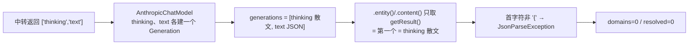
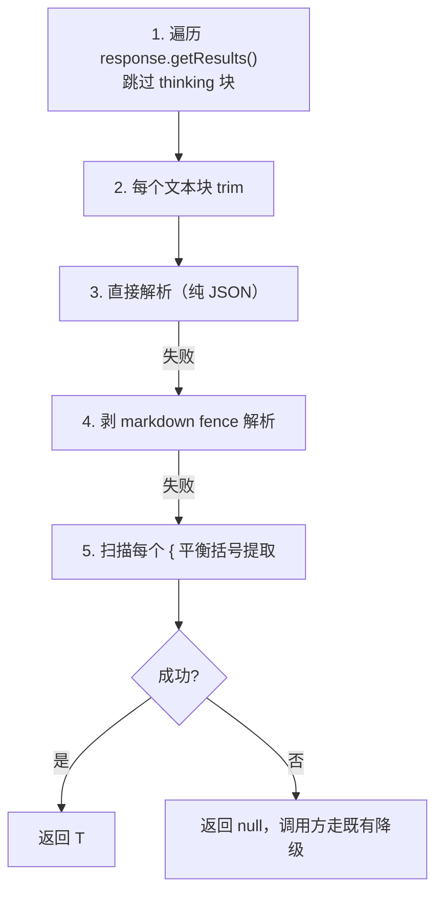

# 架构现状聚合 LLM 解析失败 — 修复方案文档

> 状态：方案已定稿，SDD 提案 `openspec/changes/fix-aggregation-llm-json-parse` 工件齐全
> 适用：大型项目触发「架构现状分析」时 Community / DomainName / FreeLayerRole 三阶段 LLM 产出全部为 0 的问题

---

## 一、问题现象

触发「架构现状分析」后，聚合管道三个阶段看似 SUCCESS，但前端呈现**领域全部未归属、包级依赖大量 UNKNOWN**。实际 LLM 产出全部为 0：

```
[Aggregation] 分块归纳失败: JsonParseException: Unrecognized token '用户要求将提供的一组Java类...'
[Aggregation] LLM 领域归纳遗漏：输入 292 类，仅覆盖 0 类
[Aggregation] Stage=Community 降级: 领域归纳失败
[LayerRoleLlm] 批量补全失败（0-20）: JsonParseException: Unexpected character (' ' (code 32))
[Aggregation] Stage=FreeLayerRole 完成, resolved=0
```

## 二、根因

一句话：**中转服务器返回 `['thinking','text']` 两个 content block，Spring AI 1.1.8 的 `AnthropicChatModel` 把 thinking 块和 text 块各建一个 `Generation`、thinking 块排第一；而 `ChatClient.content()` / `.entity()` 只调 `getResult()`（= `getResults().get(0)`，即第一个 Generation），于是拿到的是纯思考散文而非 JSON，`BeanOutputConverter` 首字符非 `{` 直接抛 `JsonParseException`。**

（反编译 `spring-ai-anthropic-1.1.8.jar` 证实：`getContentFromChatResponse` = `getResult()` → `getOutput()` → `getText()`，单数取第一个；`toChatResponse` 对 THINKING 和 TEXT 各 `new Generation` 并依次 `add`。）



## 三、已排除的伪根因

| 伪根因 | 结论 |
|---|---|
| base-url 配错（连官方 api.anthropic.com） | 已排除，当前是解析错而非连不上 |
| base-url 带 /v1 叠成 /v1/v1/messages | 已排除，改对后通了 |
| model 写死 deepseek-v4-pro-cc | 已排除，已改 @Value 注入 |
| Neo4j 查错库 | 已排除，Community 已能读到 1769 节点 / 292 类 |
| 模型本身不行 | 已排除，换 glm-5.1-plus / doubao 照样挂 |
| 单批太大超限截断 | 已排除，LayerRole 批仅 20 仍 5 批全挂 |

## 四、失败模式判定

| 模式 | 触发 | 表现 | 分批是否缓解 |
|---|---|---|---|
| A 超限截断 | maxTokens 被思考链吃光 | JSON 残缺/空 | ✅ 能 |
| B 散文前缀污染（当前） | 模型先输出思考散文再输出 JSON | JSON 完整但前贴散文 | ❌ 不能 |

当前是 **模式 B**。分批逻辑（`CLASSES_PER_BATCH=120` / `BATCH_SIZE=20`）设计初衷是防 A，对 B 无效——LayerRole 20 个一批 5 批全挂是铁证。

## 五、修复方案

### 核心思路

放弃 `BeanOutputConverter` 的 `.entity()` 整体解析（它只取第一个 Generation = thinking 散文），改为 `.chatResponse()` 拿完整响应，遍历 generations 跳过 thinking 块、从 text 块鲁棒提取 JSON——容忍前导思考散文、markdown fence、宽松语法。

### 两处调用点

| 文件 | 行 | 现状 | 改后 |
|---|---|---|---|
| `MultiDimensionCommunityDetector.java` | 208-210 | `.entity(DomainGrouping.class)` | `.chatResponse()` + `RobustJsonExtractor.extract(resp, DomainGrouping.class)` |
| `LayerRoleLlmService.java` | 72-76 | `.entity(RoleGrouping.class)` | `.chatResponse()` + `RobustJsonExtractor.extract(resp, RoleGrouping.class)` |

### 新增工具类

`RobustJsonExtractor`（`com.huawei.hisi.knowledgegraph.aggregation.llm`），泛型签名：

```java
public static <T> T extract(ChatResponse response, Class<T> type)
```

策略序列：



解析用严格 ObjectMapper → 宽松 ObjectMapper（尾逗号/单引号/注释/无引号字段名）两级降级。策略借鉴自项目内现成的 `RamClaudeJsonClient.parseJsonResponse`（fence 剥离、平衡括号提取、strict+lenient 解析），但抽取为**独立、非 deprecated、泛型**工具——因为原类是 `@Deprecated(forRemoval=true)`、方法 `private` 且返回 `Map<String,Object>`，不适合直接复用。

### 网络调研印证（agent-browser）

业界标准解法为「LLM 输出解析五级管线」（OpenClaw 中文社区 #33325 等）：

1. 预处理：剥 markdown fence + 提取标签
2. 候选提取：扫描所有平衡花括号片段（栈式，避免正则贪婪）
3. 修复解析：标准 JSON → JSON5 → json_repair 分级
4. Schema 校验：Pydantic / JSON Schema
5. 降级返回：失败塞回 raw 字段，不抛异常

与本案策略同构，印证了「放弃单点整体解析、改多级提取」是行业共识。关键补充细节：候选评分而非默认取第一个；失败日志只记 `length` + 前 N 字符（隐私）。

### 验证

- 临时 demo `ThinkingBlockReproDemo` 复现了「`.content()` 拿到 thinking 散文」的 bug，并验证新方案能跳过 thinking 块正确提取 JSON，验证通过后已删除。
- 全量 `mvn test`：**1161 run, 0 失败, 0 错误**。

## 六、影响范围

- **新增**：`RobustJsonExtractor.java`（1 个文件）
- **修改**：`MultiDimensionCommunityDetector.java`、`LayerRoleLlmService.java`（2 个文件）
- **不改**：中转服务器、模型选型、thinking 参数、`RamClaudeJsonClient` 本体
- **无新增依赖**：复用 Jackson ObjectMapper
- **补测试**：覆盖前导散文 / fence / 尾部散文 / 截断 / 宽松语法 五类污染

## 七、实施步骤

1. 新建 `RobustJsonExtractor`（遍历 generations 跳过 thinking + fence 剥离 + 平衡括号 + 两级解析）
2. 两处调用点改 `.chatResponse()` + 鲁棒提取
3. 写 demo 复现 bug 并验证新方案，验证通过后删除 demo
4. 同步更新既有测试 `MultiDimensionCommunityDetectorTest` 的 stub
5. `mvn test` 全绿（1161 run，0 失败）

> SDD 任务清单见 `openspec/changes/fix-aggregation-llm-json-parse/tasks.md`

## 八、附：独立问题（不在本次范围，勿混入）

1. `No bean named 'transactionManager'`（KG 构建期 dataModel 扫描）→ dataModelCount=0，独立修
2. `ClientAbortException`（前端 5 分钟超时主动断开）→ 是结果非原因，修好解析后自然消失
3. Neo4j 错库（裸 session）→ 前一轮已修，需远端确认全包改完
