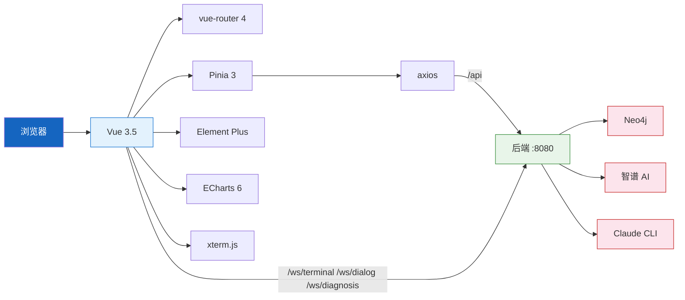
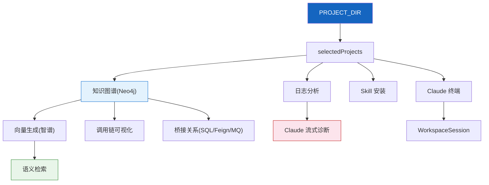

# 项目概览

---

## 1. 使命与定位

### 1.1 项目使命

HiSi DevTool Frontend 是 **HiSi 开发工具套件的 Web 前端**,为后端基于 Neo4j 知识图谱与智谱 AI 的代码分析能力提供统一的可视化操作面板。它把"项目扫描 → 知识图谱生成 → 向量生成 → 语义检索 → 调用链可视化 → 日志诊断 → Skill/MCP 管理 → Claude 终端"等能力串联到一个 SPA 中,让开发者无需切换工具即可完成日常的代码理解与诊断工作。

### 1.2 目标用户

| 用户角色 | 使用场景 | 核心诉求 |
|---------|---------|---------|
| 后端 Java 开发 | 调用链分析、Bug 排查 | 快速理解陌生方法的上下游、SQL/Feign/MQ 桥接关系 |
| 测试/SRE | 日志根因分析 | 把 ERROR 日志一键交给 Claude 分析,得到根因+修复建议 |
| 架构师 | 多服务依赖分析 | 跨服务调用链、Feign 链路、MQ 链路的可视化 |
| AI 工具研究者 | 玩转 Skill / MCP / Claude | 在 Web 上安装 Skill、启动 Claude 终端、复用 Prompt 模板 |

### 1.3 项目边界

| 范围 | 说明 |
|------|------|
| **做** | 操作面板、可视化(ECharts)、流式输出渲染(SSE/WS)、本地开发体验 |
| **做** | 通过 `/api` 代理把所有数据查询/AI 调用转发给后端 |
| **不做** | 直连 Neo4j、智谱 AI、Claude API(全部经后端代理) |
| **不做** | 用户体系、权限管理(本地工具,无登录认证) |
| **未来可能** | 公共知识图谱(`/public/scan`/`/public/generate`,前端 UI 待补) |

---

## 2. 技术栈

| 层 | 技术 | 版本 | 说明 | 选型理由 |
|----|------|------|------|---------|
| 框架 | Vue | ^3.5.30 | 视图层,Composition API | 与后端协作团队习惯一致 |
| 语言 | TypeScript | ~5.9.3 | 强类型 | 与后端 DTO 严格对齐 |
| 构建 | Vite | ^8.0.0 | 极速 HMR、原生 ESM | 当前事实标准 |
| 路由 | vue-router | ^4.6.4 | 路由 + 守卫 | Vue 3 官方 |
| 状态 | Pinia | ^3.0.4 | 组合式 Store | Vue 3 官方推荐 |
| UI | element-plus | ^2.13.5 | 企业级组件库 | 表单/表格/弹窗一应俱全 |
| 图表 | echarts | ^6.0.0 | 调用链/统计图 | 业界成熟 |
| HTTP | axios | ^1.13.6 | 请求拦截 + 序列化 | 拦截器统一解包 ApiResponse |
| 终端 | @xterm/xterm | ^6.0.0 | Claude 终端渲染 | xterm + addon-fit + addon-web-links |
| 图标 | @element-plus/icons-vue | ^2.3.2 | 全量注册 | main.ts 启动时注册 |
| 工具 | lodash-es | ^4.18.1 | tree-shaking 友好 | — |
| 单元测试 | Vitest + happy-dom | ^4.1.4 | 快速 DOM 测试 | 与 Vite 同生态 |
| E2E | Playwright | ^1.58.2 | Chromium/Firefox/WebKit/Mobile | 跨浏览器 |
| 构建检查 | vue-tsc | ^3.2.5 | Vue+TS 严格类型检查 | `npm run build` 强制通过 |

### 技术栈关系图



---

## 3. 项目结构

```
hisi-dev-tool-frontend/
├── index.html                  # SPA 单页入口
├── vite.config.ts              # Vite + 代理配置
├── vitest.config.ts            # 单元测试配置
├── playwright.config.ts        # E2E 5 浏览器矩阵
├── tsconfig.json/.app.json/.node.json   # TS 三段式配置
├── package.json                # 依赖与脚本
├── public/                     # 静态资源
├── src/
│   ├── main.ts                 # 应用启动入口
│   ├── App.vue                 # 根组件,挂载 AppLayout
│   ├── api/                    # 21 个 axios API 模块(每后端域一个文件)
│   ├── components/             # 通用组件(layout/dialog/diagnosis/Git/...)
│   ├── composables/            # 复用逻辑(useDiagnosis、useDialogWebSocket)
│   ├── router/                 # vue-router + 路由守卫
│   ├── stores/                 # Pinia stores(app/session/skill/theme/...)
│   ├── styles/                 # 全局 CSS
│   ├── themes/                 # 终端主题预设(6 种)
│   ├── types/                  # TS 类型/枚举/常量
│   ├── utils/                  # request、pathUtils、logParser
│   └── views/                  # 12 个业务页面(每页面一个目录)
├── e2e/                        # 10 个 Playwright spec
└── docs/codewiki/              # 本 Wiki(自动生成)
```

| 目录 | 职责 | 核心文件 | 文件数 |
|------|------|---------|--------|
| `src/api/` | 与后端通讯的 axios 模块 | `index.ts`、`knowledgeGraph.ts`、`vectorSearch.ts` | 21 |
| `src/views/` | 12 个业务页面 + 嵌套子组件 | `KnowledgeGraphView.vue`、`ClaudeTerminal.vue` | 30+ |
| `src/stores/` | 全局状态(含 2 个测试) | `app.ts`、`sessionStore.ts`、`themeStore.ts` | 10 |
| `src/types/` | 与后端 DTO 对齐的 TS 类型 | `api.ts`、`session.ts`、`agent.ts`、`dialog.ts` | 11 |
| `src/composables/` | WebSocket/SSE 复用逻辑 | `useDialogWebSocket.ts`、`useDiagnosis.ts` | 2 |
| `src/components/` | 跨页面复用组件 | `AppLayout.vue`、`AppSidebar.vue`、`ApiList.vue` | 8 |
| `src/utils/` | 纯函数工具 | `request.ts`、`pathUtils.ts`、`logParser.ts` | 4 |
| `src/themes/` | 终端主题预设与 CSS 变量 | `presets.ts`、`types.ts`、`index.ts` | 5 |
| `src/router/` | 路由表 + 守卫 | `index.ts` | 1 |
| `e2e/` | Playwright 端到端测试 | `*.spec.ts` | 10 |

---

## 4. 快速启动

### 4.1 环境准备

```bash
# 验证依赖版本
node --version    # 推荐 ≥ 20
npm --version

# 后端必须先行启动(默认 8080)
cd ../hisi-dev-tool && ./mvnw spring-boot:run
```

### 4.2 安装与启动

```bash
cd hisi-dev-tool-frontend
npm install
npm run dev          # 开发服 → http://localhost:5173
```

### 4.3 验证运行

| 服务 | 地址 | 预期结果 |
|------|------|---------|
| 前端 | `http://localhost:5173` | 自动跳转到 `/project`,看到"项目管理"页 |
| 后端代理 | `/api/health` | 200 OK(透传到后端 `:8080`) |
| 终端 WS | `/ws/terminal` | 终端连接成功,显示 `claude_ready` |

### 4.4 常见启动问题

| 问题 | 原因 | 解决方案 |
|------|------|---------|
| 网络连接失败 | 后端未启动 | 先 `cd ../hisi-dev-tool && ./mvnw spring-boot:run` |
| 进入业务页面被拦截到 `/project` | 未配置项目目录或未勾选项目 | 在"项目管理"页配置 `PROJECT_DIR` 并勾选项目 |
| 终端连不上 | 5173 端口被占用或 ws 代理失败 | 检查 `vite.config.ts` 中 `/ws` 代理 |
| Element Plus 图标报错 | 未全量注册 | 确认 `main.ts` 中 `for (...) app.component(key, component)` 仍存在 |

---

## 5. 核心概念

| 概念 | 英文 | 定义 | 代码对应 |
|------|------|------|---------|
| **项目目录** | PROJECT_DIR | 后端扫描的根目录,前端通过 `configApi` 拉取/更新 | `useAppStore.projectDir` |
| **选中项目** | Selected Projects | 用户在"项目管理"页勾选的目标项目集合 | `useAppStore.selectedProjects` |
| **菜单可用性** | Menu Availability | 部分菜单需 `projectDirConfigured && projectSelected` 才可点 | `useAppStore.availableMenus` |
| **知识图谱** | Knowledge Graph | 后端用 Neo4j 构建的方法节点/调用关系图 | `knowledgeGraphApi.*` |
| **向量生成** | Vector Generation | 调用智谱 embedding 把方法描述向量化,供语义检索使用 | `vectorGenerationApi.start` |
| **语义检索** | Vector Search | 自然语言查询,向量召回 + 图遍历扩展 | `vectorSearchApi.search` |
| **桥接关系** | Bridge | 跨方法的特殊调用:Mapper/JPA/MQ/Feign/HTTP/Aspect | `BridgeRelation`、`BridgeType` |
| **意图** | Intent | 自然语言对话识别出的用户目标 | `IntentType`、`IntentResult` |
| **工作空间会话** | Workspace Session | Claude 终端的一段对话上下文,可绑定 `claudeSessionId` | `useWorkspaceStore` |
| **Skill** | Skill | 可安装到项目 `.claude/skills/` 的 AI 能力包 | `useSkillStore` |

### 概念关系图



---

## 6. 项目演进

| 版本 | 日期 | 关键变更 | 对应 ADR |
|------|------|---------|---------|
| 0.x | 2025-? | 初始 monorepo,引入 KG 与向量检索 | ADR-001、ADR-002 |
| 0.x | 2025-? | 旧 `/api/search/semantic` 残留(`SemanticSearchView.vue` 不可用),改走 `/api/vector-search` | ADR-005 |
| 0.x | 2025-? | `call-chain` 路由全部 redirect 到 `/knowledge-graph?tab=methodRef` | ADR-006 |
| 0.x | 进行中 | 公共知识图谱(`/public/scan`)前端按钮待补 | ADR-007 |

> **延伸阅读**:[架构设计](../02-架构设计/index.md) · [技术决策](../08-技术决策/index.md)
