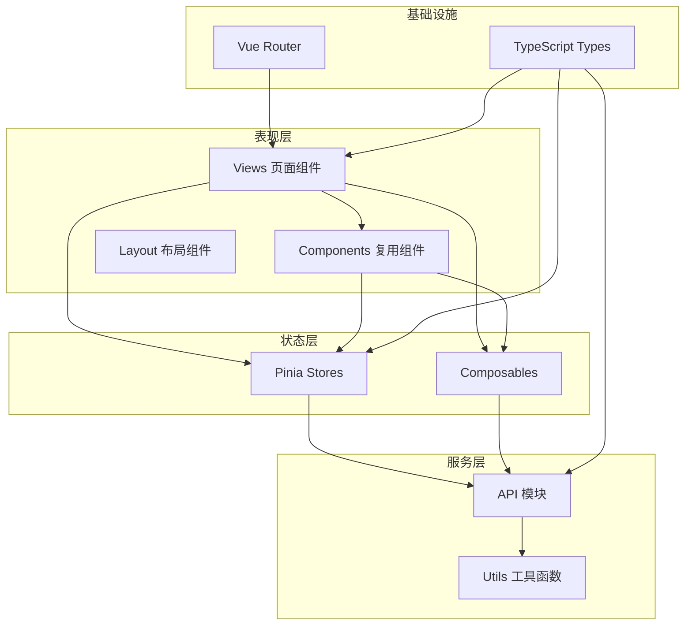
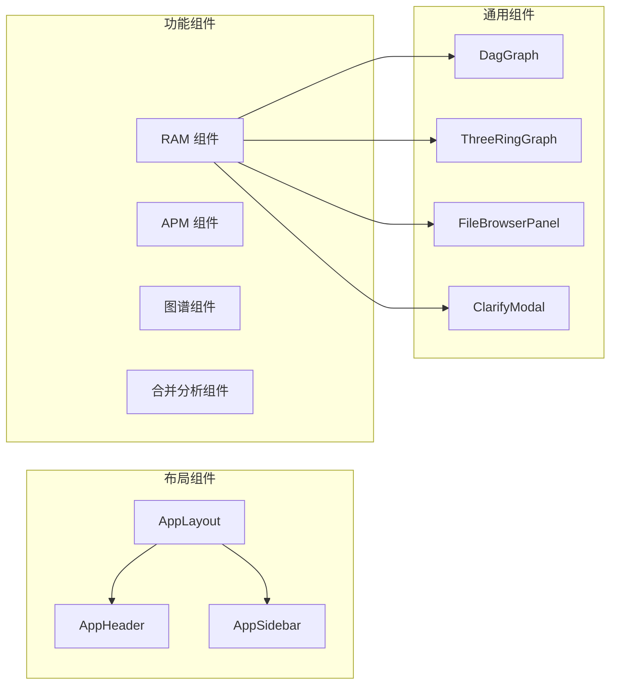
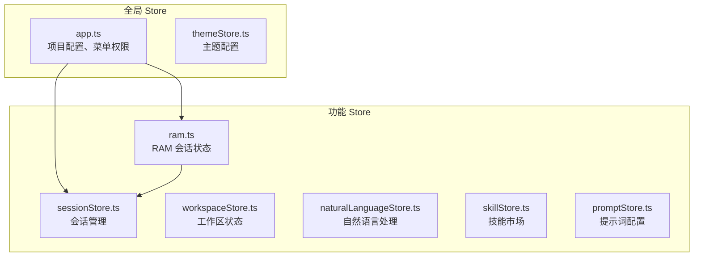
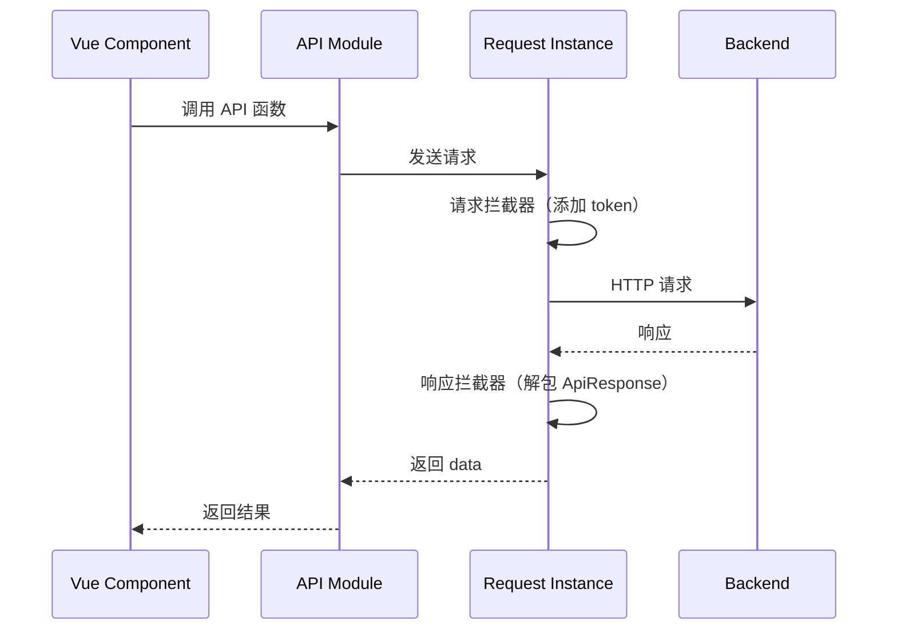
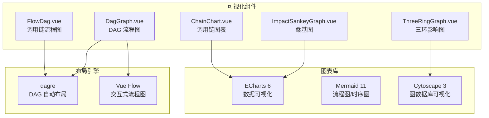
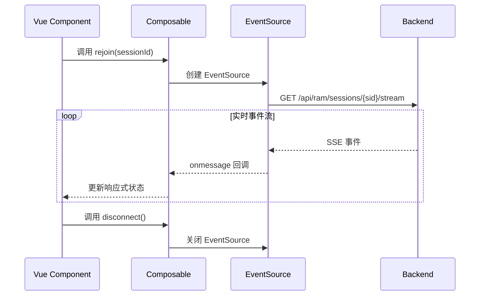
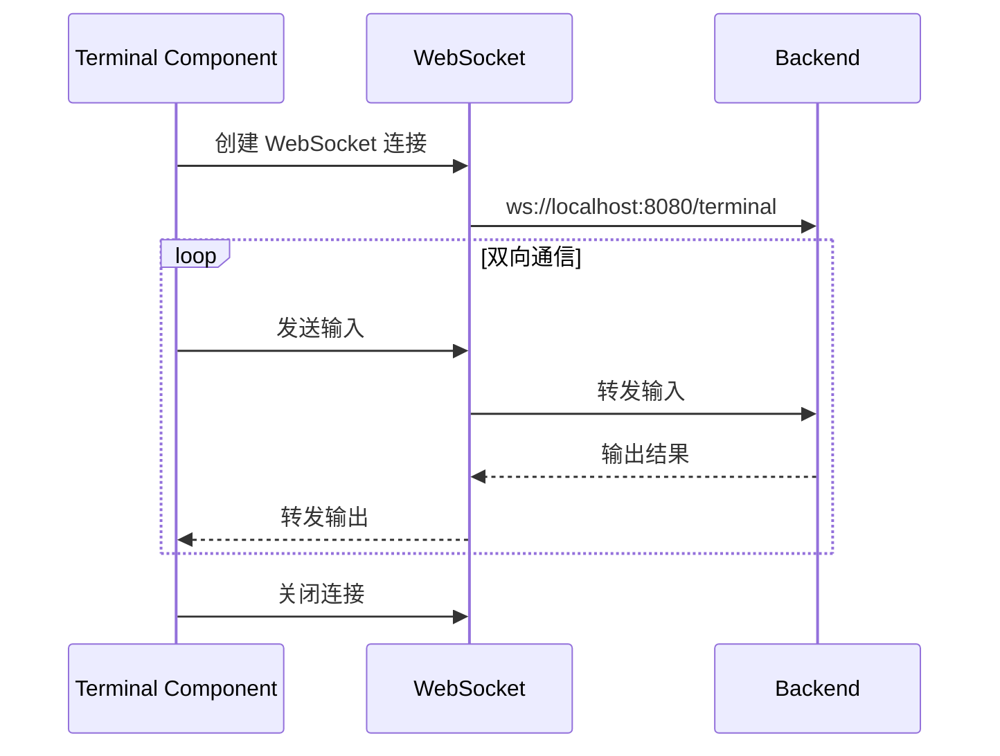

# 02-架构设计

## 架构概述

HiSi DevTool Frontend 采用 Vue 3 组件化架构，结合 Composition API 和 Pinia 状态管理，构建了一个现代化的单页应用（SPA）。架构设计遵循高内聚、低耦合的原则，将功能划分为独立的模块，每个模块包含自己的视图、组件、状态和 API 调用。

---

## 整体架构



---

## 分层架构

### 1. 表现层（Presentation Layer）

负责用户界面渲染和用户交互。

| 层级 | 职责 | 示例 |
|------|------|------|
| **Views** | 页面级组件，对应路由 | `InputPage.vue`、`DraftPage.vue` |
| **Components** | 复用组件，功能独立 | `DagGraph.vue`、`ThreeRingGraph.vue` |
| **Layout** | 布局组件，页面框架 | `AppLayout.vue`、`AppHeader.vue` |

### 2. 状态层（State Layer）

负责应用状态管理和业务逻辑封装。

| 层级 | 职责 | 示例 |
|------|------|------|
| **Stores** | 全局状态管理 | `app.ts`、`ram.ts`、`sessionStore.ts` |
| **Composables** | 可复用的组合式函数 | `useRamSession.ts`、`useDiagnosis.ts` |

### 3. 服务层（Service Layer）

负责与后端 API 通信和数据处理。

| 层级 | 职责 | 示例 |
|------|------|------|
| **API** | HTTP 请求封装 | `ram.ts`、`apmDebug.ts`、`search.ts` |
| **Utils** | 工具函数 | `request.ts`、`logParser.ts` |

### 4. 基础设施层（Infrastructure Layer）

提供路由、类型定义等基础能力。

| 层级 | 职责 | 示例 |
|------|------|------|
| **Router** | 路由配置、导航守卫 | `router/index.ts` |
| **Types** | TypeScript 类型定义 | `types/ram.ts`、`types/apm.ts` |

---

## 组件架构

### 组件分类



### 组件设计原则

1. **单一职责**：每个组件只负责一个功能点
2. **Props 传入，Events 传出**：组件通过 props 接收数据，通过 events 触发行为
3. **Composition API**：使用 `<script setup lang="ts">` 语法
4. **Scoped 样式**：使用 `<style scoped>` 避免样式污染

---

## 状态管理架构

### Pinia Store 设计



### Store 职责划分

| Store | 职责 | 持久化 |
|-------|------|--------|
| `app.ts` | 项目配置、选中项目、菜单权限 | 否 |
| `ram.ts` | RAM 会话的 impact payload、文件高亮 | 否 |
| `sessionStore.ts` | Claude 会话管理 | 否 |
| `workspaceStore.ts` | 工作区配置 | 否 |
| `themeStore.ts` | 主题配置 | 是 |
| `skillStore.ts` | 技能市场数据 | 否 |
| `promptStore.ts` | 提示词配置 | 否 |

---

## 路由架构

### 路由结构

```mermaid
graph TB
    ROOT[/] --> PROJECT[/project<br/>项目管理]
    ROOT --> KG[/knowledge-graph<br/>知识图谱分析]
    ROOT --> RAM[/ram<br/>需求分析大师]
    ROOT --> APM[/apm-debug<br/>APM 调试]
    ROOT --> MERGE[/merge-analysis<br/>合入分析]
    ROOT --> SEARCH[/search<br/>增强检索]
    ROOT --> LOG[/log-analysis<br/>日志分析]
    ROOT --> TERMINAL[/claude-terminal<br/>Claude 终端]
    ROOT --> SESSION[/claude-session<br/>Claude 会话]
    ROOT --> SKILL[/skill-market<br/>技能市场]
    ROOT --> SETTINGS[/settings<br/>系统设置]

    RAM --> DRAFT[/ram/draft/:sid<br/>RAM 草稿]
    RAM --> GRAPH[/ram/graph/:sid<br/>RAM 图谱]
    MERGE --> DIFF[/merge-analysis/diff<br/>Diff 预览]
    MERGE --> RESULT[/merge-analysis/result<br/>分析结果]
    LOG --> REPORT[/log-analysis/report/:id<br/>报告详情]
```

### 路由守卫

```typescript
router.beforeEach(async (to, _from, next) => {
  // 1. 设置页面标题
  // 2. 加载项目配置（首次导航时）
  // 3. 检查菜单可用性（需要项目选择的页面）
  // 4. 重定向处理
})
```

---

## API 通信架构

### Axios 实例配置



### API 模块组织

| 模块 | 文件 | 功能 |
|------|------|------|
| RAM | `api/ram.ts` | 需求分析会话管理 |
| APM | `api/apmDebug.ts` | APM 调试接口 |
| 知识图谱 | `api/search.ts` | 语义搜索、方法搜索 |
| 调用链 | `api/callChain.ts` | 调用链查询 |
| 合并分析 | `api/merge-analysis.ts` | 合并分析接口 |
| 日志分析 | `api/logAnalysis.ts` | 日志查询、报告生成 |
| 项目管理 | `api/project.ts` | 项目 CRUD |
| 远程项目 | `api/remote-project.ts` | 远程项目管理 |

---

## 可视化架构

### 可视化技术栈



---

## 实时通信架构

### SSE（Server-Sent Events）

用于 RAM 和合并分析的实时进度推送。



### WebSocket

用于 Claude 终端的双向通信。



---

## 测试架构

### 测试分层

```mermaid
graph TB
    subgraph "单元测试"
        UT[Vitest<br/>组件/Store/工具函数]
    end

    subgraph "E2E 测试"
        E2E[Playwright<br/>用户流程测试]
    end

    subgraph "测试工具"
        HD[happy-dom<br/>DOM 模拟]
        VTU[@vue/test-utils<br/>Vue 组件测试]
    end

    UT --> HD
    UT --> VTU
    E2E --> HD
```

### 测试策略

| 测试类型 | 工具 | 覆盖范围 |
|---------|------|---------|
| 单元测试 | Vitest | 组件、Store、工具函数、Composables |
| E2E 测试 | Playwright | 关键用户流程、页面交互 |
| 覆盖率 | @vitest/coverage-v8 | 80%+ 目标 |

---

## 构建与部署

### Vite 配置

```typescript
// vite.config.ts 核心配置
export default defineConfig({
  plugins: [vue()],
  resolve: {
    alias: { '@': '/src' }
  },
  server: {
    port: 5173,
    proxy: {
      '/api': {
        target: 'http://localhost:8080',
        changeOrigin: true
      }
    }
  }
})
```

### 构建产物

```
dist/
├── index.html
├── assets/
│   ├── index-[hash].js      # 主包
│   ├── index-[hash].css     # 样式
│   └── vendor-[hash].js     # 第三方库
└── favicon.ico
```

---

## 下一步

- [组件层](../03-模块说明/组件层.md) - 详细了解组件设计
- [状态管理](../03-模块说明/状态管理.md) - 深入 Pinia 状态管理
- [API服务层](../03-模块说明/API服务层.md) - API 通信机制
- [技术决策](../08-技术决策/index.md) - 技术选型决策记录
