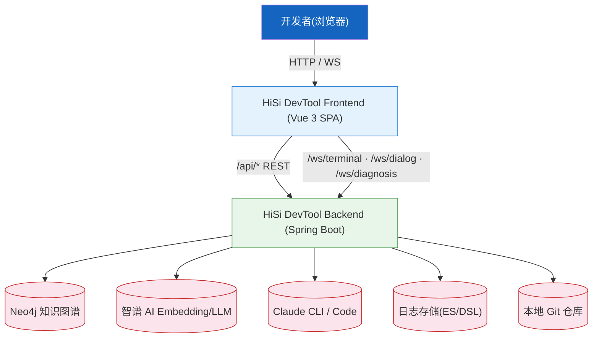
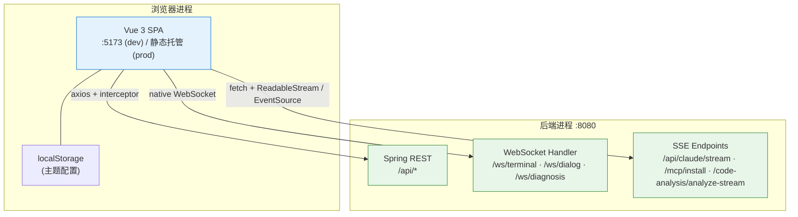
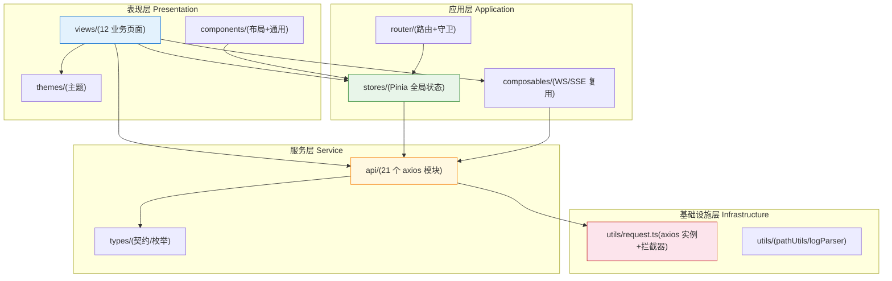
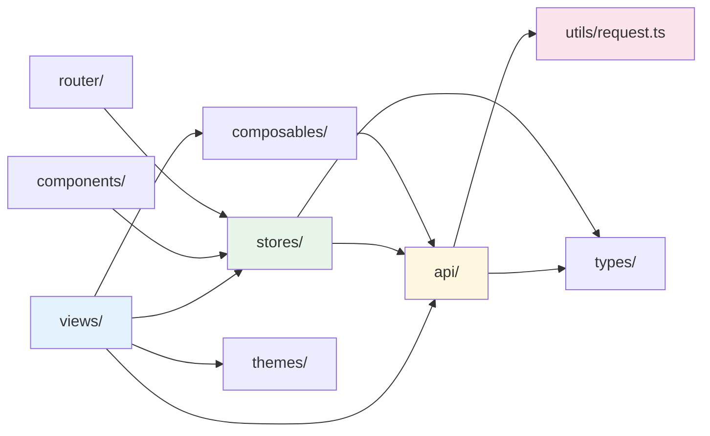
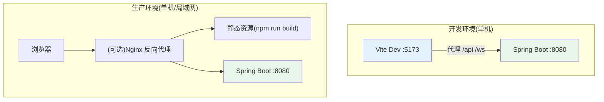

# 架构设计

---

## 1. 架构总览

### 1.1 系统上下文图(C4 Level 1: Context)

| 角色/系统 | 类型 | 交互方式 | 数据流向 |
|-----------|------|---------|---------|
| 开发者 | 人员 | 浏览器 | UI 操作 → Vue → axios/WS |
| 后端 | 系统 | REST + WebSocket + SSE | 双向 |
| Neo4j | 系统 | Cypher(经后端) | 后端代理,前端只见 REST |
| 智谱 AI | 系统 | HTTP API(经后端) | 同上 |
| Claude CLI | 系统 | PTY/SSE(经后端 `/ws/terminal`) | 同上 |

### 1.2 容器图(C4 Level 2: Container)

| 容器 | 技术 | 职责 | 端口 | 数据存储 |
|------|------|------|------|---------|
| 前端 SPA | Vue 3 + Vite | UI、状态、路由、可视化 | 5173 (dev) | localStorage(主题) |
| 后端服务 | Spring Boot 3.2 | KG/向量/AI/日志/Skill | 8080 | Neo4j + 文件 |

---

## 2. 分层设计

### 2.1 分层架构图

### 2.2 各层职责

#### 表现层 (Presentation)

- **职责**:渲染、用户交互、表单校验、ECharts/xterm 可视化
- **核心组件**:`AppLayout`/`AppSidebar`/`AppHeader`、12 个 `views/*` 页面
- **通信方式**:调用 Pinia Action / 直接调用 `api/*` / 注入 Composable
- **设计约束**:不直接操作 `axios`,统一通过 `api/` 模块

#### 应用层 (Application)

- **职责**:全局状态(Pinia)、路由守卫(菜单可用性、`PROJECT_DIR` 加载)、复用逻辑(WebSocket/SSE 生命周期)
- **核心模块**:`router/index.ts`、10 个 Pinia store、2 个 composable
- **设计约束**:不直接渲染 DOM;不持有任何 axios 实例,只调 `api/` 函数

#### 服务层 (Service)

- **职责**:封装后端 REST/SSE/WS 调用、TS 类型与后端 DTO 对齐
- **核心模块**:`api/*`(21 个文件)、`types/*`(11 个文件)
- **通信方式**:`utils/request.ts` 的 axios 实例 / `fetch` + ReadableStream / `EventSource` / 原生 `WebSocket`

#### 基础设施层 (Infrastructure)

- **职责**:axios 实例配置、统一拦截器(解包 ApiResponse、处理验证错误、错误提示)、路径标准化、日志解析
- **核心模块**:`utils/request.ts`、`utils/pathUtils.ts`、`utils/logParser.ts`

---

## 3. 模块依赖关系

| 规则 | 说明 | 示例 |
|------|------|------|
| **单向依赖** | 表现 → 应用 → 服务 → 基础设施 | `views/project/ProjectList.vue` → `useAppStore` → `configApi` → `request` |
| **禁止循环** | `api/` 不依赖 `stores/` 或 `views/` | OK |
| **跨层限制** | 视图层不直接 `import axios`,必须经 `api/` | `views/log-analysis/LogQuery.vue` → `logAnalysisApi.queryLogs()` |
| **路由懒加载** | 所有 `views/*` 都用 `() => import(...)`(见 `router/index.ts`) | `component: () => import('@/views/...')` |

---

## 4. 架构质量属性

| 优先级 | 质量属性 | 具体要求 | 架构保障措施 |
|--------|---------|---------|-------------|
| **P0** | 可维护性 | 新增后端域 → 增 1 个 `api/xxx.ts` + 1 个 `views/xxx/` 目录 | 分层 + 命名约定(每后端域一个 API 文件) |
| **P0** | 类型安全 | 与后端 DTO 严格对齐,`build` 阶段 `vue-tsc` 强制通过 | `types/` 集中管理,`build` 脚本含 `vue-tsc -b` |
| **P1** | 实时性 | Claude 流式输出毫秒级渲染、终端字符级回显 | SSE/`fetch` ReadableStream/原生 WebSocket,无中间 polling |
| **P1** | 体验一致性 | 全局错误统一弹 `ElMessage` | `utils/request.ts` 拦截器集中处理 |
| **P2** | 可测试性 | Store/工具可纯函数测试,关键页面 E2E 可回归 | Vitest + happy-dom + Playwright 5 浏览器矩阵 |
| **P2** | 主题一致性 | 终端 + UI 共用一套主题 token | `themes/` + CSS 变量(`document.documentElement.style.setProperty`) |

### 架构权衡

| 权衡点 | 选择 | 放弃 | 理由 |
|--------|------|------|------|
| 状态管理 | Pinia | Vuex 4 | Pinia 是 Vue 3 官方推荐、TS 友好、支持组合式 |
| HTTP 层 | axios + 自定义拦截器统一解包 | 直接 fetch | 拦截器可统一处理 `ApiResponse` 与验证错误 |
| 流式协议 | SSE / fetch 流 / WebSocket 三栈共存 | 单一协议 | 终端必须 WS(双向);Claude 流式 SSE 即可;意图对话用 fetch+SSE |
| 路由懒加载 | 全部视图懒加载 | 静态导入 | 减小首屏 bundle |
| 跨服务参数序列化 | `paramsSerializer: { indexes: null }` | axios 默认 `[]` 下标 | Spring `@RequestParam List<String>` 仅认 `?k=a&k=b` |

---

## 5. 跨切面关注点

### 5.1 错误处理策略

| 层 | 策略 | 实现 |
|----|------|------|
| HTTP 400 验证错误 | 解析 `参数校验失败: field: msg` 字符串,挂到 `error.validationErrors`,弹 `ElMessage.warning` | `utils/request.ts` + `types/api.ts::parseValidationErrors` |
| HTTP 其他错误 | 弹 `ElMessage.error(后端 message ?? HTTP 文案)` | `utils/request.ts` `getHttpErrorMessage` |
| 网络错误 | 弹 `网络连接失败,请检查网络` | `error.request` 分支 |
| 业务错误(`code !== 200`) | 走 reject,组件 `try/catch` 自处理 | 拦截器 |
| 流式错误 | 通过回调 `onError` 上抛,组件展示提示 | `claudeApi.streamAnalyze`/`naturalLanguageApi.streamProcess` |

### 5.2 日志策略

| 层 | 日志级别 | 输出目标 | 格式 |
|----|---------|---------|------|
| 前端 | `console.warn` / `console.error` | 浏览器控制台 | 文本 + 对象 |
| 用户可见 | `ElMessage` | 页面右上 toast | success/warning/error |

### 5.3 安全策略

| 关注点 | 策略 | 实现位置 |
|--------|------|---------|
| 输入校验 | 前端 Element Form 校验 + 后端二次校验,400 错误前端解析展示 | 各表单组件 + `utils/request.ts` |
| API Key | 不在前端持有任何密钥;智谱/Claude 凭证由后端管理 | — |
| WebSocket 协议 | 自动根据 `window.location.protocol` 推导 ws/wss | `api/terminal.ts` |
| CORS | 开发期由 Vite 代理同源,生产期由后端控制 | `vite.config.ts` |

---

## 6. 部署架构

| 环境 | 用途 | 前端地址 | 后端地址 |
|------|------|---------|---------|
| 开发 | 本地开发,HMR | `http://localhost:5173` | `http://localhost:8080` |
| 预览 | `vite preview` | `http://localhost:4173` | `http://localhost:8080` |
| 生产 | 静态托管 + 后端 | (按部署方案) | `:8080` |

---

## 7. 技术选型总结

| 领域 | 选择 | 备选 | 选择原因 | 对应 ADR |
|------|------|------|---------|---------|
| 框架 | Vue 3 | React/Svelte | Composition API + 团队熟悉度 | ADR-001 |
| 状态 | Pinia | Vuex 4 | 官方推荐 + TS | ADR-002 |
| UI | Element Plus | Naive/AntDV | 表单/表格/弹窗成熟 | ADR-003 |
| HTTP | axios + 拦截器解包 | fetch 包装 | 业务码统一处理 | ADR-004 |
| 流式 | SSE + fetch ReadableStream + WebSocket 三栈 | 单一 WS | 不同后端端点协议不同 | ADR-005 |
| E2E | Playwright | Cypress | 多浏览器 + 移动端 | ADR-006 |

---

## 8. 架构约束与限制

| 约束类型 | 约束 | 影响 | 应对 |
|---------|------|------|------|
| 后端依赖 | 必须先启 8080 后端 | 离线无法用 | `package.json` README 注明先启动顺序 |
| Spring 序列化 | `List<String>` 必须 `?k=a&k=b` | axios 默认序列化不兼容 | `paramsSerializer: { indexes: null }` |
| 路径风格 | Neo4j 内部统一正斜杠 | Windows 路径含 `\` | `utils/pathUtils.normalizePath` |
| 浏览器 API | 终端依赖 `EventSource`/`WebSocket`/`fetch` ReadableStream | 老浏览器不可用 | 仅支持 Chromium/Firefox/Safari 现代版 |

> **延伸阅读**:[模块说明](../03-模块说明/) · [数据流程](../04-数据流程/index.md) · [技术决策](../08-技术决策/index.md)
