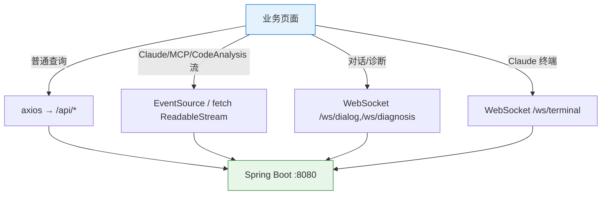

# API 服务层

| 属性 | 值 |
|------|-----|
| **所属层** | 服务层 |
| **目录** | `src/api/` |
| **文件数** | 21 个模块 |
| **基础设施** | `utils/request.ts` (axios 实例 + 拦截器) |

---

## 1. 模块概述

**核心职责**:封装所有后端调用,统一拦截器解包 `ApiResponse<T>`,屏蔽 axios 细节;同时承载 SSE / fetch ReadableStream / WebSocket 三种流式协议的客户端实现。

---

## 2. axios 实例(`utils/request.ts`)

```ts
const request = axios.create({
  baseURL: '/api',
  timeout: 120000,
  paramsSerializer: { indexes: null }   // ?k=a&k=b 兼容 Spring @RequestParam List<String>
})

// Response 拦截器
request.interceptors.response.use(
  (resp) => {
    const { code, message, data } = resp.data
    if (typeof code === 'number') {
      if (code === 200) return data
      return Promise.reject(new BusinessError(code, message))
    }
    return resp.data  // 非标准响应直接返回
  },
  (error) => {
    if (error.response?.status === 400) {
      const ve = parseValidationErrors(error.response.data)
      error.validationErrors = ve
      ElMessage.warning(ve[0]?.message ?? '参数校验失败')
    } else if (error.response) {
      ElMessage.error(getHttpErrorMessage(error.response.status, error.response.data))
    } else if (error.request) {
      ElMessage.error('网络连接失败,请检查网络')
    }
    return Promise.reject(error)
  }
)
```

---

## 3. API 模块清单

| 模块 | 后端前缀 | 主要函数 | 协议 |
|------|---------|---------|------|
| `index.ts` | — | 导出 request 实例 | — |
| `config.ts` | `/config/*` | getConfig/updateConfig、getProjectDir/updateProjectDir、getSelectedProject/updateSelectedProject | REST |
| `project.ts` | `/projects/*` | list/clone/pull/delete/getStatus/scanGitRepos | REST |
| `knowledgeGraph.ts` | `/knowledge-graph/*` | ~30 函数:KG 生成/状态/调用链/桥接/MyBatis/业务流/单元测试 | REST |
| `vectorSearch.ts` | `/vector-search` | search(query, projectPath/Paths, limit, graphDepth, language) | REST |
| `vectorGeneration.ts` | `/vector-generation/*` | start、getStatus、getStatusBatch | REST |
| `search.ts` | `/search/semantic` | (历史残留,后端无对应) | REST |
| `callChain.ts` | `/callchain/*` | analyze、queryByKey 等(部分已 redirect) | REST + SSE |
| `logAnalysis.ts` | `/log/*` | queryLogs、analyze、getReports、getReport、getStatus | REST |
| `claude.ts` | `/claude/*` | streamAnalyze(EventSource)、streamChat(fetch reader)、universalChat、endSession、resumeSession、getSessionCode | SSE + fetch 流 |
| `session.ts` | `/session/*` | list、get、update、delete、archive、export、clearMessages | REST |
| `workspaceSession.ts` | `/workspace-session/*` | CRUD + bindClaudeSession | REST |
| `mcp.ts` | `/mcp/*` | list、install(SSE 含 step/info/success/warning/error/log/done) | REST + SSE |
| `skillMarket.ts` | `/skill/*` | getSkillList、getProjectStatus、install、uninstall、checkUpdates、updateSkill | REST |
| `prompt.ts` | `/prompt/*` | list/get/update/render/extractVariables | REST |
| `git.ts` | `/git/*` | getStatus/checkout/pull/getLogs/getCommits/getCommitDiff/updateAll | REST |
| `ops.ts` | `/ops/*` | getHealth、runImpactAnalysis、generateDocs、downloadLogs | REST |
| `task.ts` | `/task/*` | startGenerate、getStatus、getLatest(CallChainTask) | REST |
| `terminal.ts` | `/ws/terminal` | createTerminalConnection(WebSocket + 30s 心跳) | WS |
| `naturalLanguage.ts` | `/dialog/*` | createSession、listSessions、streamProcess(SSE)、sendIntervention、getContext | REST + SSE |
| `codeAnalysis.ts` | `/code-analysis/*` | getCommits、getCommitDetail、analyzeCommitsStream(SSE)、streamChat | REST + SSE |

---

## 4. 三种流式协议封装



### 4.1 SSE / EventSource(适合单向流)

```ts
// claudeApi.streamAnalyze
const es = new EventSource(`/api/claude/stream?reportId=${id}`)
es.addEventListener('delta', (e) => onDelta(e.data))
es.addEventListener('done', () => { es.close(); onDone() })
es.onerror = (e) => { es.close(); onError(e) }
```

### 4.2 fetch + ReadableStream(适合 POST 大 body 流式)

```ts
// naturalLanguageApi.streamProcess / claudeApi.streamChat
const resp = await fetch('/api/dialog/.../stream', { method:'POST', body: JSON.stringify(req) })
const reader = resp.body!.getReader()
while (true) {
  const { done, value } = await reader.read()
  if (done) break
  // 解析 SSE 帧:event: xxx \n data: {...} \n\n
}
```

### 4.3 WebSocket(双向,终端/诊断/对话)

```ts
// terminal.ts
const proto = window.location.protocol === 'https:' ? 'wss' : 'ws'
const ws = new WebSocket(`${proto}://${location.host}/ws/terminal`)
ws.onopen = () => { /* heartbeat 30s */ }
ws.onmessage = (e) => dispatch(JSON.parse(e.data))   // output/session_info/ready/claude_ready/pong/error
```

---

## 5. 错误码与拦截

| HTTP | 处理 | 用户感知 |
|------|------|---------|
| 400 | `parseValidationErrors` → 挂到 `error.validationErrors` + `ElMessage.warning` | 字段提示 |
| 401/403 | `ElMessage.error('未授权/无权限')` | toast |
| 404 | `ElMessage.error('资源不存在')` | toast |
| 408/504 | `ElMessage.error('请求超时')` | toast |
| 500 | `ElMessage.error('服务器内部错误')` | toast |
| 业务码 ≠ 200 | reject + `BusinessError`,组件 try/catch 自处理 | 由组件决定 |

---

## 6. 设计约定

| 约定 | 示例 |
|------|------|
| 每后端域一个文件 | `/api/log/*` → `logAnalysis.ts` |
| 函数返回 `Promise<解包后的 data>` | `getStatus(): Promise<KnowledgeGraphStatus>` |
| List 类参数用 `paramsSerializer: { indexes: null }` | `?projectPaths=a&projectPaths=b` |
| 路径规范化 | 通过 `utils/pathUtils.normalizePath` 把 `\` 转 `/` |
| 流式接口返回取消句柄 | `{ close(): void }` 供组件 `onUnmounted` 释放 |
