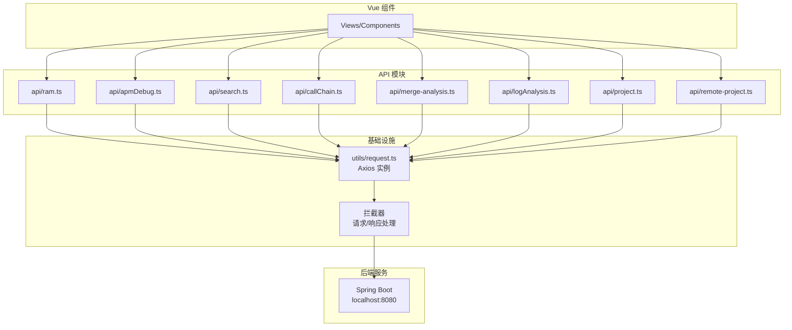

# API 服务层

## 概述

API 服务层负责与后端 Spring Boot 服务进行 HTTP 通信。项目使用 Axios 作为 HTTP 客户端，通过模块化组织 API 调用，配合 TypeScript 类型定义，提供类型安全的 API 访问。

---

## API 架构



---

## Axios 实例配置

### request.ts

**路径**：`src/utils/request.ts`

**职责**：创建 Axios 实例，配置拦截器。

**配置**：
```typescript
const request = axios.create({
  baseURL: '/api',  // Vite 代理前缀
  timeout: 30000,
  headers: {
    'Content-Type': 'application/json'
  }
})
```

**请求拦截器**：
```typescript
request.interceptors.request.use(
  (config) => {
    // 添加 token（如果有）
    const token = localStorage.getItem('token')
    if (token) {
      config.headers.Authorization = `Bearer ${token}`
    }
    return config
  },
  (error) => {
    return Promise.reject(error)
  }
)
```

**响应拦截器**：
```typescript
request.interceptors.response.use(
  (response) => {
    // 解包 ApiResponse<T>，直接返回 data
    const apiResponse = response.data as ApiResponse<unknown>
    if (apiResponse.success) {
      return apiResponse.data
    } else {
      // 业务错误处理
      const message = apiResponse.error || '请求失败'
      ElMessage.error(message)
      return Promise.reject(new Error(message))
    }
  },
  (error) => {
    // HTTP 错误处理
    if (error.response) {
      const status = error.response.status
      switch (status) {
        case 401:
          ElMessage.error('未授权，请重新登录')
          break
        case 403:
          ElMessage.error('权限不足')
          break
        case 404:
          ElMessage.error('资源不存在')
          break
        case 500:
          ElMessage.error('服务器内部错误')
          break
        default:
          ElMessage.error(`请求失败：${status}`)
      }
    } else if (error.request) {
      ElMessage.error('网络错误，请检查网络连接')
    }
    return Promise.reject(error)
  }
)
```

---

## API 模块组织

### 模块列表

| 模块 | 文件 | 功能 | 后端端点 |
|------|------|------|---------|
| RAM | `api/ram.ts` | 需求分析会话管理 | `/api/ram/*` |
| APM | `api/apmDebug.ts` | APM 调试接口 | `/api/apm/*` |
| 搜索 | `api/search.ts` | 语义搜索、方法搜索 | `/api/search/*` |
| 调用链 | `api/callChain.ts` | 调用链查询 | `/api/callchain/*` |
| 合并分析 | `api/merge-analysis.ts` | 合并分析接口 | `/api/merge-analysis/*` |
| 日志分析 | `api/logAnalysis.ts` | 日志查询、报告生成 | `/api/log/*` |
| 项目管理 | `api/project.ts` | 项目 CRUD | `/api/projects/*` |
| 远程项目 | `api/remote-project.ts` | 远程项目管理 | `/api/remote-projects/*` |
| 配置 | `api/config.ts` | 系统配置 | `/api/config/*` |
| Git | `api/git.ts` | Git 操作 | `/api/git/*` |
| MCP | `api/mcp.ts` | MCP 配置 | `/api/mcp/*` |
| 技能市场 | `api/skillMarket.ts` | 技能管理 | `/api/skill/*` |
| 会话 | `api/session.ts` | Claude 会话 | `/api/session/*` |
| 工作区 | `api/workspaceSession.ts` | 工作区会话 | `/api/workspace-session/*` |
| 术语 | `api/glossary.ts` | 术语管理 | `/api/glossary/*` |
| 提示词 | `api/prompt.ts` | 提示词配置 | `/api/prompt/*` |
| 自然语言 | `api/naturalLanguage.ts` | 自然语言处理 | `/api/natural-language/*` |
| 代码分析 | `api/codeAnalysis.ts` | 代码分析 | `/api/code-analysis/*` |
| 向量生成 | `api/vectorGeneration.ts` | 向量生成 | `/api/vector-generation/*` |
| 终端 | `api/terminal.ts` | 终端操作 | `/api/terminal/*` |

---

## API 模块详解

### ram.ts

**路径**：`src/api/ram.ts`

**功能**：RAM（Requirement Analysis Master）会话管理。

**函数列表**：
| 函数 | 参数 | 返回值 | 说明 |
|------|------|--------|------|
| `startRamSession(payload)` | `StartSessionPayload` | `Promise<StartSessionResponse>` | 创建 RAM 会话 |
| `submitRamClarify(sessionId, answers)` | `string, Record<string, unknown>` | `Promise<ClarifyResponse>` | 提交澄清答案 |
| `resumeRamSession(sessionId)` | `string` | `Promise<ResumeResponse>` | 恢复会话 |
| `abortRamSession(sessionId)` | `string` | `Promise<AbortResponse>` | 中止会话 |
| `confirmRamNode(sessionId, payload)` | `string, ConfirmPayload` | `Promise<ConfirmResponse>` | 确认节点输出 |
| `getRamSession(sessionId)` | `string` | `Promise<SessionInfoResponse>` | 获取会话信息 |
| `executeTechPlan(sessionId)` | `string` | `Promise<Record<string, unknown>>` | 触发技术方案生成 |
| `ramStreamUrl(sessionId, afterSeq?)` | `string, number?` | `string` | 获取 SSE 流 URL |

**类型定义**：
```typescript
interface StartSessionPayload {
  rawInput: string
  projectPath: string
  userId?: string
}

interface StartSessionResponse {
  readonly sessionId: string
}

interface ClarifyResponse {
  readonly accepted: boolean
  readonly nextSeq: number
  readonly status?: string
  readonly hitlPayload?: {
    readonly nodeName: string
    readonly output: Readonly<Record<string, unknown>>
  }
}

interface ConfirmPayload {
  nodeName: string
  action: 'approve' | 'reject' | 'edit'
  feedback?: string
  editedOutput?: Record<string, unknown>
}
```

**SSE 流 URL 构建**：
```typescript
export function ramStreamUrl(sessionId: string, afterSeq?: number): string {
  const base = `/api/ram/sessions/${sessionId}/stream`
  return typeof afterSeq === 'number' && afterSeq > 0 
    ? `${base}?afterSeq=${afterSeq}` 
    : base
}
```

---

### apmDebug.ts

**路径**：`src/api/apmDebug.ts`

**功能**：APM 调试接口。

**函数列表**：
| 函数 | 参数 | 返回值 | 说明 |
|------|------|--------|------|
| `getEntryPoints(projectPath)` | `string` | `Promise<EntryPoint[]>` | 获取入口点列表 |
| `getEntryPointDetail(entryId)` | `string` | `Promise<EntryPointDetail>` | 获取入口点详情 |
| `getSchema(entryId)` | `string` | `Promise<SchemaNode>` | 获取 DTO schema |
| `executeRequest(entryId, params)` | `string, RequestParams` | `Promise<ExecutionResult>` | 执行 API 请求 |
| `searchApis(projectPath, keyword)` | `string, string` | `Promise<ApiSearchResult[]>` | 搜索 API |

---

### search.ts

**路径**：`src/api/search.ts`

**功能**：语义搜索和方法搜索。

**函数列表**：
| 函数 | 参数 | 返回值 | 说明 |
|------|------|--------|------|
| `semanticSearch(query, projectPath, limit?)` | `string, string, number?` | `Promise<SearchResult[]>` | 语义搜索 |
| `searchMethods(keyword, projectPath)` | `string, string` | `Promise<MethodInfo[]>` | 方法搜索 |
| `getMethodDetail(methodId)` | `string` | `Promise<MethodDetail>` | 获取方法详情 |
| `getCallChain(methodId, direction, depth)` | `string, string, number` | `Promise<CallChain>` | 获取调用链 |

---

### callChain.ts

**路径**：`src/api/callChain.ts`

**功能**：调用链查询。

**函数列表**：
| 函数 | 参数 | 返回值 | 说明 |
|------|------|--------|------|
| `getProjects()` | 无 | `Promise<Project[]>` | 获取项目列表 |
| `getUris(projectPath)` | `string` | `Promise<UriInfo[]>` | 获取 URI 列表 |
| `getUriChain(projectPath, uri)` | `string, string` | `Promise<UriChain>` | 获取 URI 调用链 |
| `getMethodReference(projectPath, className, methodName)` | `string, string, string` | `Promise<MethodReference>` | 获取方法引用 |

---

### merge-analysis.ts

**路径**：`src/api/merge-analysis.ts`

**功能**：合并分析接口。

**函数列表**：
| 函数 | 参数 | 返回值 | 说明 |
|------|------|--------|------|
| `startAnalysis(payload)` | `MergeAnalysisPayload` | `Promise<AnalysisSession>` | 启动合并分析 |
| `getDiff(sessionId)` | `string` | `Promise<DiffResult>` | 获取 Diff 结果 |
| `getAnalysisResult(sessionId)` | `string` | `Promise<AnalysisResult>` | 获取分析结果 |
| `analysisStreamUrl(sessionId)` | `string` | `string` | 获取 SSE 流 URL |

---

### logAnalysis.ts

**路径**：`src/api/logAnalysis.ts`

**功能**：日志分析接口。

**函数列表**：
| 函数 | 参数 | 返回值 | 说明 |
|------|------|--------|------|
| `queryLogs(params)` | `LogQueryParams` | `Promise<LogQueryResult>` | 查询日志 |
| `getReport(reportId)` | `string` | `Promise<LogReport>` | 获取分析报告 |
| `generateReport(logIds)` | `string[]` | `Promise<ReportTask>` | 生成分析报告 |

---

### project.ts

**路径**：`src/api/project.ts`

**功能**：项目管理接口。

**函数列表**：
| 函数 | 参数 | 返回值 | 说明 |
|------|------|--------|------|
| `getProjects()` | 无 | `Promise<Project[]>` | 获取项目列表 |
| `scanGitRepos()` | 无 | `Promise<GitRepositoryInfo[]>` | 扫描 Git 仓库 |
| `addProject(project)` | `ProjectInfo` | `Promise<Project>` | 添加项目 |
| `deleteProject(projectId)` | `string` | `Promise<void>` | 删除项目 |
| `updateProject(projectId, data)` | `string, ProjectUpdate` | `Promise<Project>` | 更新项目 |

---

### remote-project.ts

**路径**：`src/api/remote-project.ts`

**功能**：远程项目管理接口。

**函数列表**：
| 函数 | 参数 | 返回值 | 说明 |
|------|------|--------|------|
| `getRemoteProjects()` | 无 | `Promise<RemoteProject[]>` | 获取远程项目列表 |
| `addRemoteProject(project)` | `RemoteProjectInfo` | `Promise<RemoteProject>` | 添加远程项目 |
| `deleteRemoteProject(projectId)` | `string` | `Promise<void>` | 删除远程项目 |
| `syncProject(projectId)` | `string` | `Promise<SyncResult>` | 同步远程项目 |
| `getScheduleConfig(projectId)` | `string` | `Promise<ScheduleConfig>` | 获取调度配置 |
| `updateScheduleConfig(projectId, config)` | `string, ScheduleConfig` | `Promise<void>` | 更新调度配置 |

---

## API 设计模式

### 1. 统一响应格式

后端返回统一的 `ApiResponse<T>` 格式：

```typescript
interface ApiResponse<T> {
  success: boolean
  data?: T
  error?: string
  meta?: {
    total: number
    page: number
    limit: number
  }
}
```

前端在拦截器中解包，API 模块直接返回 `data`。

### 2. 错误处理

```typescript
// API 模块中的错误处理
async function getProjects(): Promise<Project[]> {
  try {
    const projects = await request.get('/projects')
    return projects as Project[]
  } catch (error) {
    // 拦截器已处理 HTTP 错误，这里处理业务错误
    throw error
  }
}
```

### 3. 类型安全

```typescript
// 使用 TypeScript 类型定义请求和响应
interface StartSessionPayload {
  rawInput: string
  projectPath: string
  userId?: string
}

interface StartSessionResponse {
  readonly sessionId: string
}

export function startRamSession(
  payload: StartSessionPayload
): Promise<StartSessionResponse> {
  return request.post('/ram/sessions', payload)
}
```

### 4. SSE 流处理

```typescript
// SSE 流 URL 构建
export function ramStreamUrl(sessionId: string, afterSeq?: number): string {
  const base = `/api/ram/sessions/${sessionId}/stream`
  return typeof afterSeq === 'number' && afterSeq > 0 
    ? `${base}?afterSeq=${afterSeq}` 
    : base
}

// 组件中使用 EventSource
const eventSource = new EventSource(ramStreamUrl(sessionId))
eventSource.onmessage = (event) => {
  const data = JSON.parse(event.data)
  // 处理事件
}
```

---

## API 与组件交互

### 1. 组件中调用 API

```typescript
// views/ram/InputPage.vue
import { startRamSession } from '@/api/ram'
import { projectApi } from '@/api/project'

const projects = ref<GitRepositoryInfo[]>([])
const submitting = ref(false)

async function loadProjects() {
  try {
    const list = await projectApi.scanGitRepos()
    if (Array.isArray(list)) {
      projects.value = list
    }
  } catch (error) {
    const msg = error instanceof Error ? error.message : '扫描项目失败'
    ElMessage.warning(`未能加载项目列表：${msg}`)
  }
}

async function onSubmit() {
  submitting.value = true
  try {
    const resp = await startRamSession({ 
      rawInput: rawInput.value, 
      projectPath: projectPath.value 
    })
    await router.push({ name: 'RamDraft', params: { sid: resp.sessionId } })
  } catch (error) {
    const msg = error instanceof Error ? error.message : '启动失败'
    ElMessage.error(msg)
  } finally {
    submitting.value = false
  }
}
```

### 2. Composable 封装

```typescript
// composables/useRamSession.ts
export function useRamSession() {
  const events = ref<RamEvent[]>([])
  const status = ref<RamStatus>('idle')
  const cost = ref({ tokens: 0, usd: 0 })

  function rejoin(sessionId: string, afterSeq?: number) {
    const url = ramStreamUrl(sessionId, afterSeq)
    const eventSource = new EventSource(url)
    
    eventSource.onmessage = (event) => {
      const data = JSON.parse(event.data)
      events.value.push(data)
    }
    
    eventSource.onerror = () => {
      status.value = 'error'
    }
  }

  return {
    events,
    status,
    cost,
    rejoin
  }
}
```

---

## 代理配置

### Vite 开发代理

```typescript
// vite.config.ts
export default defineConfig({
  server: {
    proxy: {
      '/api': {
        target: 'http://localhost:8080',
        changeOrigin: true
      },
      '/ws': {
        target: 'ws://localhost:8080',
        ws: true
      }
    }
  }
})
```

### 生产环境

生产环境通过 Nginx 反向代理：

```nginx
location /api {
  proxy_pass http://backend:8080;
  proxy_set_header Host $host;
  proxy_set_header X-Real-IP $remote_addr;
}

location /ws {
  proxy_pass http://backend:8080;
  proxy_http_version 1.1;
  proxy_set_header Upgrade $http_upgrade;
  proxy_set_header Connection "upgrade";
}
```

---

## 测试

### API 模块测试

```typescript
// api/__tests__/ram.spec.ts
import { describe, it, expect, vi } from 'vitest'
import { startRamSession } from '../ram'
import request from '@/utils/request'

vi.mock('@/utils/request')

describe('ram API', () => {
  it('should start session correctly', async () => {
    const mockResponse = { sessionId: 'test-session-id' }
    vi.mocked(request.post).mockResolvedValue(mockResponse)

    const result = await startRamSession({
      rawInput: 'test requirement',
      projectPath: '/test/project'
    })

    expect(result).toEqual(mockResponse)
    expect(request.post).toHaveBeenCalledWith('/ram/sessions', {
      rawInput: 'test requirement',
      projectPath: '/test/project'
    })
  })
})
```

---

## 下一步

- [RAM需求评估UI](./RAM需求评估UI.md) - 了解 RAM API 的具体使用
- [APM诊断UI](./APM诊断UI.md) - 了解 APM API 的具体使用
- [数据模型](../06-数据模型/index.md) - 了解 TypeScript 类型定义
