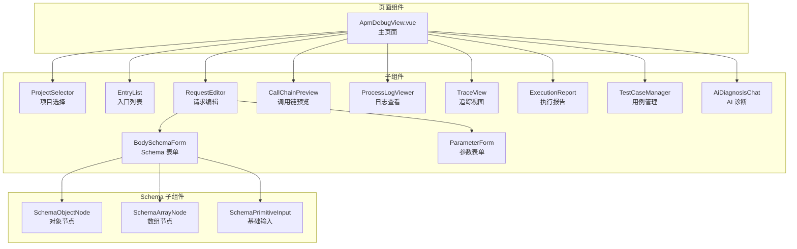
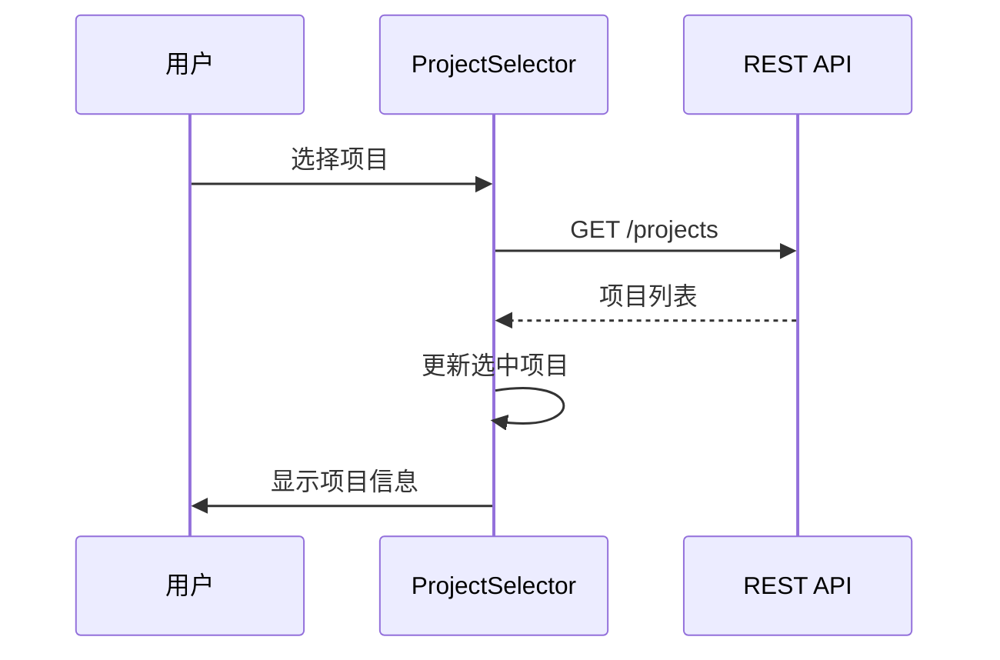
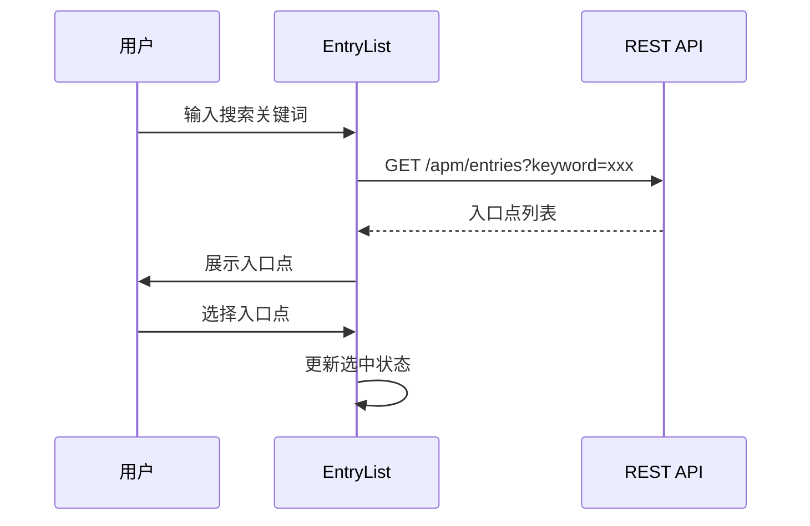
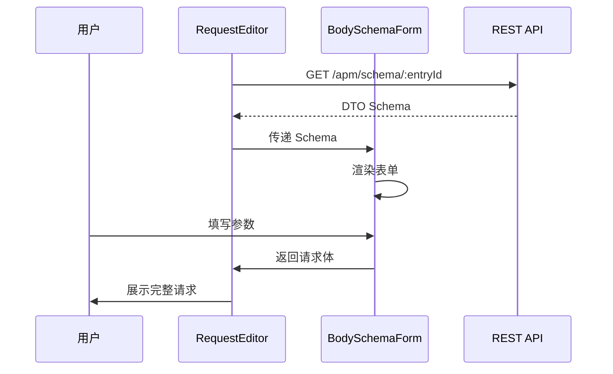
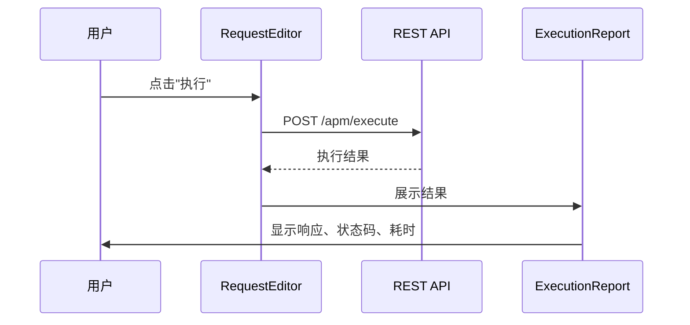

# APM 诊断 UI

## 概述

APM（Application Performance Monitoring）诊断 UI 是 HiSi DevTool 的 API 调试和诊断模块。该模块提供 DTO schema body skeleton、entryNodeId launch、API search autocomplete 等功能，帮助开发者快速调试和诊断 API 接口。

---

## 功能架构



---

## 页面流程

### 1. 项目选择

**功能**：选择要调试的目标项目。

**流程**：


---

### 2. 入口点浏览

**功能**：浏览项目中的 API 入口点（Controller、Schedule、MQ 等）。

**流程**：


**入口点类型**：
| 类型 | 说明 | 图标 |
|------|------|------|
| Controller | REST API 入口 | 🌐 |
| Scheduled | 定时任务入口 | ⏰ |
| MQ Listener | 消息队列入口 | 📨 |
| Feign Client | Feign 客户端入口 | 🔗 |

---

### 3. 请求编辑

**功能**：编辑 HTTP 请求参数，包括 URL、Headers、Body。

**流程**：


---

### 4. 请求执行

**功能**：执行 API 请求并查看结果。

**流程**：


---

## 核心组件

### ApmDebugView.vue

**路径**：`src/views/apm-debug/ApmDebugView.vue`

**职责**：APM 调试主页面，整合所有子组件。

**布局**：
```
┌─────────────────────────────────────────────────────┐
│                ProjectSelector                      │
├──────────────┬──────────────────────────────────────┤
│              │                                      │
│  EntryList   │         RequestEditor                │
│              │         (BodySchemaForm)              │
│              │                                      │
├──────────────┴──────────────────────────────────────┤
│                                                     │
│              CallChainPreview                        │
│                                                     │
├─────────────────────────────────────────────────────┤
│                                                     │
│              ExecutionReport                         │
│                                                     │
└─────────────────────────────────────────────────────┘
```

---

### BodySchemaForm.vue

**路径**：`src/views/apm-debug/components/BodySchemaForm.vue`

**职责**：DTO schema body skeleton 表单，根据后端 schema 自动生成请求体。

**功能**：
- Schema 解析和渲染
- 嵌套对象/数组支持
- 表单验证
- 默认值填充

**Schema 类型**：
```typescript
interface SchemaNode {
  type: 'object' | 'array' | 'string' | 'number' | 'boolean'
  properties?: Record<string, SchemaNode>
  items?: SchemaNode
  description?: string
  default?: unknown
  required?: string[]
}
```

**渲染逻辑**：
```typescript
function renderSchemaNode(node: SchemaNode, path: string): VNode {
  switch (node.type) {
    case 'object':
      return h(SchemaObjectNode, { node, path })
    case 'array':
      return h(SchemaArrayNode, { node, path })
    default:
      return h(SchemaPrimitiveInput, { node, path })
  }
}
```

---

### SchemaObjectNode.vue

**路径**：`src/views/apm-debug/components/SchemaObjectNode.vue`

**职责**：渲染对象类型的 Schema 节点。

**功能**：
- 递归渲染子属性
- 必填字段标记
- 折叠/展开

**Props**：
```typescript
interface SchemaObjectNodeProps {
  node: SchemaNode
  path: string
}
```

---

### SchemaArrayNode.vue

**路径**：`src/views/apm-debug/components/SchemaArrayNode.vue`

**职责**：渲染数组类型的 Schema 节点。

**功能**：
- 数组项增删
- 项类型渲染
- 最小/最大长度限制

**Props**：
```typescript
interface SchemaArrayNodeProps {
  node: SchemaNode
  path: string
}
```

---

### SchemaPrimitiveInput.vue

**路径**：`src/views/apm-debug/components/SchemaPrimitiveInput.vue`

**职责**：渲染基础类型的 Schema 节点（string、number、boolean）。

**功能**：
- 类型适配输入组件
- 格式验证
- 默认值填充

**Props**：
```typescript
interface SchemaPrimitiveInputProps {
  node: SchemaNode
  path: string
}
```

---

### EntryList.vue

**路径**：`src/views/apm-debug/components/EntryList.vue`

**职责**：入口点列表，展示可用的 API 入口。

**功能**：
- 入口点搜索和过滤
- 入口点详情展示
- 快速启动调试

**Props**：
```typescript
interface EntryListProps {
  projectPath: string
  selectedEntryId?: string
}
```

**Events**：
- `entry-select(entryId: string)`：入口点选中事件

---

### RequestEditor.vue

**路径**：`src/views/apm-debug/components/RequestEditor.vue`

**职责**：请求编辑器，编辑 HTTP 请求参数。

**功能**：
- URL 编辑
- Headers 编辑
- Body 编辑（Schema 驱动）
- 请求预览

**Props**：
```typescript
interface RequestEditorProps {
  entryId: string
  schema: SchemaNode | null
}
```

**Events**：
- `execute(request: RequestData)`：执行请求事件

---

### CallChainPreview.vue

**路径**：`src/views/apm-debug/components/CallChainPreview.vue`

**职责**：调用链预览，展示 API 调用链路。

**技术实现**：
- 使用 dagre 布局
- 支持节点展开/折叠
- 调用链高亮

**Props**：
```typescript
interface CallChainPreviewProps {
  entryId: string
  projectPath: string
}
```

---

### ProcessLogViewer.vue

**路径**：`src/views/apm-debug/components/ProcessLogViewer.vue`

**职责**：日志查看器，展示请求执行过程日志。

**功能**：
- 实时日志流
- 日志级别过滤
- 日志搜索

**Props**：
```typescript
interface ProcessLogViewerProps {
  sessionId: string
}
```

---

### TraceView.vue

**路径**：`src/views/apm-debug/components/TraceView.vue`

**职责**：追踪视图，展示分布式追踪信息。

**功能**：
- Trace ID 展示
- Span 树形结构
- 耗时分析

**Props**：
```typescript
interface TraceViewProps {
  traceId: string
}
```

---

### ExecutionReport.vue

**路径**：`src/views/apm-debug/components/ExecutionReport.vue`

**职责**：执行报告，展示请求执行结果。

**展示内容**：
- 状态码
- 响应时间
- 响应体
- Headers
- 错误信息

**Props**：
```typescript
interface ExecutionReportProps {
  result: ExecutionResult
}
```

---

### TestCaseManager.vue

**路径**：`src/views/apm-debug/components/TestCaseManager.vue`

**职责**：测试用例管理，保存和管理测试用例。

**功能**：
- 用例保存
- 用例加载
- 用例执行
- 用例导出

**Props**：
```typescript
interface TestCaseManagerProps {
  entryId: string
}
```

---

### AiDiagnosisChat.vue

**路径**：`src/views/apm-debug/components/AiDiagnosisChat.vue`

**职责**：AI 诊断对话，提供智能诊断建议。

**功能**：
- 问题输入
- AI 回答展示
- 诊断历史

**Props**：
```typescript
interface AiDiagnosisChatProps {
  entryId: string
  executionResult?: ExecutionResult
}
```

---

## API 接口

### REST API

| 端点 | 方法 | 说明 |
|------|------|------|
| `/api/apm/entries` | GET | 获取入口点列表 |
| `/api/apm/entries/:id` | GET | 获取入口点详情 |
| `/api/apm/schema/:entryId` | GET | 获取 DTO Schema |
| `/api/apm/execute` | POST | 执行 API 请求 |
| `/api/apm/search` | GET | 搜索 API |

### 请求参数

**获取入口点列表**：
```typescript
interface GetEntriesParams {
  projectPath: string
  keyword?: string
  type?: 'controller' | 'scheduled' | 'mq' | 'feign'
}
```

**执行 API 请求**：
```typescript
interface ExecuteRequestParams {
  entryId: string
  url: string
  method: 'GET' | 'POST' | 'PUT' | 'DELETE'
  headers?: Record<string, string>
  body?: unknown
}
```

---

## 数据模型

### SchemaNode

```typescript
interface SchemaNode {
  type: 'object' | 'array' | 'string' | 'number' | 'boolean'
  properties?: Record<string, SchemaNode>
  items?: SchemaNode
  description?: string
  default?: unknown
  required?: string[]
  format?: string
  enum?: unknown[]
}
```

### EntryPoint

```typescript
interface EntryPoint {
  id: string
  name: string
  type: 'controller' | 'scheduled' | 'mq' | 'feign'
  path: string
  method?: string
  className: string
  methodName: string
  description?: string
}
```

### ExecutionResult

```typescript
interface ExecutionResult {
  statusCode: number
  statusText: string
  headers: Record<string, string>
  body: unknown
  duration: number
  error?: string
  traceId?: string
}
```

---

## 状态管理

### 本地状态

APM 诊断 UI 主要使用组件本地状态，不需要全局 Store。

```typescript
// views/apm-debug/ApmDebugView.vue
const selectedProject = ref<string>('')
const selectedEntryId = ref<string>('')
const schema = ref<SchemaNode | null>(null)
const executionResult = ref<ExecutionResult | null>(null)
```

---

## 测试

### 单元测试

```typescript
// components/__tests__/BodySchemaForm.spec.ts
import { describe, it, expect } from 'vitest'
import { mount } from '@vue/test-utils'
import BodySchemaForm from '../BodySchemaForm.vue'

describe('BodySchemaForm', () => {
  it('should render object schema correctly', () => {
    const schema: SchemaNode = {
      type: 'object',
      properties: {
        name: { type: 'string', description: 'Name' },
        age: { type: 'number', description: 'Age' }
      },
      required: ['name']
    }
    
    const wrapper = mount(BodySchemaForm, {
      props: { schema, path: '' }
    })
    
    expect(wrapper.findAll('.schema-field')).toHaveLength(2)
    expect(wrapper.find('.required-field').exists()).toBe(true)
  })
})
```

### E2E 测试

```typescript
// e2e/apm-debug.spec.ts
import { test, expect } from '@playwright/test'

test('APM debug workflow', async ({ page }) => {
  await page.goto('/apm-debug')
  
  // 选择项目
  await page.selectOption('[data-test="apm-project"]', '/test/project')
  
  // 选择入口点
  await page.click('[data-test="entry-item"]:first-child')
  
  // 填写参数
  await page.fill('[data-test="param-name"]', 'test')
  
  // 执行请求
  await page.click('[data-test="execute-btn"]')
  
  // 验证结果
  await expect(page.locator('[data-test="status-code"]')).toHaveText('200')
})
```

---

## 设计模式

### 1. Schema 驱动表单

使用 JSON Schema 驱动表单渲染，实现动态表单：

```typescript
// 根据 Schema 类型选择渲染组件
function getComponentForSchema(schema: SchemaNode) {
  switch (schema.type) {
    case 'object':
      return SchemaObjectNode
    case 'array':
      return SchemaArrayNode
    case 'string':
    case 'number':
    case 'boolean':
      return SchemaPrimitiveInput
    default:
      return null
  }
}
```

### 2. 组件递归渲染

支持嵌套 Schema 的递归渲染：

```vue
<template>
  <div class="schema-object">
    <div v-for="(prop, key) in node.properties" :key="key">
      <label>{{ key }}</label>
      <component 
        :is="getComponentForSchema(prop)" 
        :node="prop" 
        :path="`${path}.${key}`"
      />
    </div>
  </div>
</template>
```

### 3. 表单验证

使用 Schema 中的 `required` 字段进行验证：

```typescript
function validateForm(data: unknown, schema: SchemaNode): string[] {
  const errors: string[] = []
  
  if (schema.type === 'object' && schema.required) {
    for (const field of schema.required) {
      if (!(field in (data as Record<string, unknown>))) {
        errors.push(`${field} is required`)
      }
    }
  }
  
  return errors
}
```

---

## 下一步

- [组件层](./组件层.md) - 了解其他组件设计
- [API服务层](./API服务层.md) - 了解 APM API 详情
- [图谱浏览器UI](./图谱浏览器UI.md) - 了解图谱相关功能
