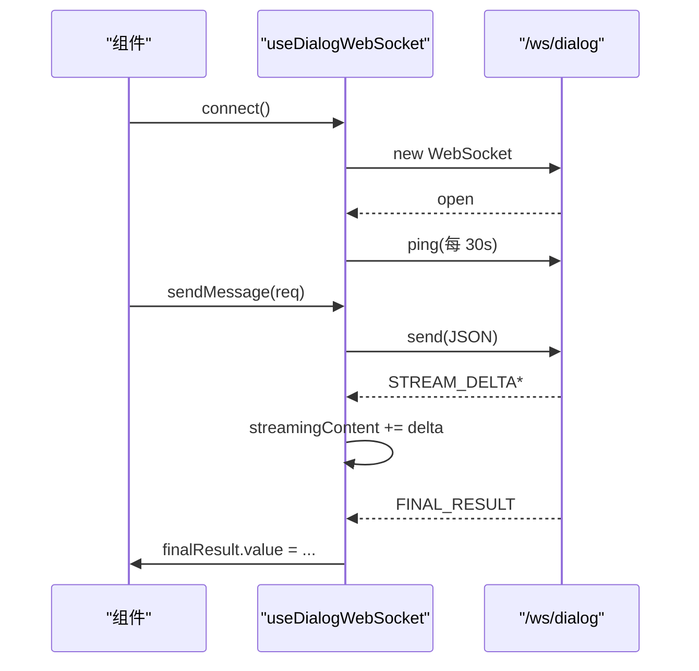

# Composables 与工具

| 属性 | 值 |
|------|-----|
| **所属层** | 应用层 / 基础设施层 |
| **目录** | `src/composables/`、`src/utils/` |
| **文件数** | composables: 2,utils: 4 |

---

## 1. Composables

### 1.1 `useDialogWebSocket.ts`

**职责**:封装 `/ws/dialog` 完整生命周期 —— 连接、心跳、重连、事件分发、流式拼接、最终结果。

| 暴露 | 类型 | 说明 |
|------|------|------|
| `status` | `Ref<TerminalConnectionStatus>` | idle/connecting/open/closed |
| `sessionId`、`intent`、`phases`、`agents`、`streamingContent`、`finalResult` | refs | 对话过程中的实时状态 |
| `connect(url)` | `() => void` | 建立 WebSocket |
| `disconnect()` | `() => void` | 关闭 + 清理心跳 |
| `sendMessage(req)` | `(req: DialogClientMessage) => void` | 用户消息 |
| `sendIntervention(text)` | `(text: string) => void` | 中途干预 |

**关键参数**:心跳 30s,断线重连 3s 间隔、最多 5 次。

### 1.2 `useDiagnosis.ts`

**职责**:封装 `/ws/diagnosis` 多 Agent 诊断事件流(307 行)。

| 暴露 | 用途 |
|------|------|
| `agents` | 各 Agent (STACK_TRACE/CODE_CONTEXT/GIT_HISTORY/CONSENSUS) 状态 |
| `events` | `AgentEvent[]` 时间线 |
| `final` | `FinalDiagnosticResult \| null` |
| `connect/disconnect/start` | 控制函数 |

事件:`REQUEST_RECEIVED → AGENT_START → AGENT_DELTA* → AGENT_END → ... → FINAL_RESULT`。

---

## 2. Utils

### 2.1 `request.ts`

axios 实例 + 拦截器(详见 [API 服务层](./API服务层.md))。

### 2.2 `pathUtils.ts`

| 函数 | 用途 |
|------|------|
| `normalizePath(path)` | `\` 转 `/`、去除尾部 `/`(Neo4j 内部统一正斜杠) |
| `joinPath(...parts)` | 跨平台路径拼接 |

### 2.3 `logParser.ts`

| 类型 | 字段 |
|------|------|
| `StackFrame` | className、methodName、fileName、lineNumber |
| `CausedByInfo` | type、message、stackFrames |
| `ParsedErrorLog` | 主异常 + caused-by 链 |

| 函数 | 用途 |
|------|------|
| `parseJavaStackTrace(text)` | Java 异常文本 → `ParsedErrorLog` |

### 2.4 测试文件

`pathUtils.test.ts` / `logParser.test.ts` — Vitest 单元测试。

---

## 3. 设计约定

| 约定 | 说明 |
|------|------|
| Composable 名以 `use` 开头 | Vue 3 惯例 |
| 内部用 `ref/reactive`,导出函数控制 | 不暴露原始 WS/timer |
| `onUnmounted` 自动清理 | 在调用方组件中调用 disconnect |
| utils 必须是纯函数 | 无副作用,可直接单测 |
