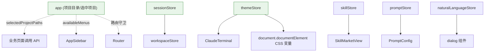

# Pinia 状态管理

| 属性 | 值 |
|------|-----|
| **所属层** | 应用层 |
| **目录** | `src/stores/` |
| **文件数** | 10 个 store(含 2 个测试文件) |
| **状态库** | Pinia 3 + Composition API 写法 |

---

## 1. Store 清单

| Store | 职责 | 关键 state | 关键 action |
|-------|------|-----------|------------|
| `app.ts` | 项目目录 + 选中项目 + 菜单可用性 | `projectDir`、`selectedProjects` | `loadProjectDir`、`updateProjectDir`、`selectProjects`、`getSelectedProjectPaths` |
| `sessionStore.ts` | Claude 会话流式缓存(分会话隔离) | `messagesCache`、`streamingContentCache`、`streamingStatusCache` | `switchSession`、`closeSession`、`appendStreamDelta` |
| `workspaceStore.ts` | Workspace 会话(终端绑定 claudeSessionId) | `sessions`、`currentSessionId` | `createSession`、`bindClaudeSession`、`removeSession` |
| `themeStore.ts` | 终端 + UI 主题(6 预设 + 自定义强调色) | `themeId`、`customAccent` | `setTheme`、`setAccent`、`applyCSSVariables`、`save/load` |
| `skillStore.ts` | Skill 列表 + 项目安装状态 | `skills`、`projectStatus`、`categoryStats` | `loadSkills`、`install`、`uninstall`、`checkUpdates` |
| `promptStore.ts` | Prompt 模板 CRUD | `templates` | `load`、`render`、`extractVariables` |
| `naturalLanguageStore.ts` | 自然语言对话(意图+流式) | `sessions`、`streamingContent`、`intentResults` | `processInput`、`createSession`、`endSession` |

---

## 2. Store 间关系



---

## 3. 核心 Store 详解

### 3.1 `app.ts` — 全局项目状态

```ts
state: {
  projectDir: string                    // PROJECT_DIR(后端配置)
  selectedProjects: SelectedProjectInfo[]
}

getters:
  projectDirConfigured: boolean         // projectDir 非空
  projectSelected: boolean              // selectedProjects.length > 0
  availableMenus: Record<string, boolean>
  // - project-management/skill-market/claude-terminal/prompt-config/settings/mcp: 永远 true
  // - search/knowledge-graph/log-analysis: projectDirConfigured && projectSelected

actions:
  loadProjectDir()                      // configApi.getProjectDir
  updateProjectDir(path)                // configApi.updateProjectDir
  selectProjects(items)                 // configApi.updateSelectedProject
  getSelectedProjectPaths(): string[]
```

### 3.2 `sessionStore.ts` — 多会话流式缓存

| 缓存 | 类型 | 用途 |
|------|------|------|
| `messagesCache` | `Map<sessionId, Message[]>` | 历史消息列表 |
| `streamingContentCache` | `Map<sessionId, string>` | 当前增量拼接缓冲 |
| `streamingStatusCache` | `Map<sessionId, 'idle'\|'streaming'\|'done'>` | 流式状态 |

**关键设计**:切换会话不丢上一会话的流式状态;`closeSession` 返回 `claudeSessionCode` 用于恢复。

### 3.3 `themeStore.ts` — 主题系统

| 字段 | 类型 | 默认值 |
|------|------|--------|
| `themeId` | 6 预设之一 | `dark-tech` |
| `customAccent` | string \| null | null |
| 持久化 | localStorage `THEME_STORAGE_KEY` | — |

`applyCSSVariables` 通过 `document.documentElement.style.setProperty` 注入,xterm.js 同时按 theme 配置渲染。

### 3.4 `skillStore.ts`

```ts
SkillCategory = 'diagnosis' | 'analysis' | 'generation' | 'operation' | 'other'

categoryStats: Record<SkillCategory, { total, installed }>
filteredSkills: computed(基于 category + keyword)
```

---

## 4. 设计约定

| 约定 | 说明 |
|------|------|
| 全部用 `defineStore('xxx', () => { ... })` Composition 写法 | 与 Vue 3 风格一致 |
| 不直接持有 axios 实例 | 只调 `api/*` 函数 |
| 不直接渲染 DOM | 不要 `document.getElementById` 等(themeStore 注入 CSS 变量是受控例外) |
| 异常用 `throw` + 上层 `try/catch` | Store 内部不弹 ElMessage |
| 持久化用 localStorage | 仅 `themeStore` 持久化,其余依赖后端 |

---

## 5. 测试

| 测试文件 | 覆盖 |
|---------|------|
| `app.test.ts` | availableMenus 计算逻辑 |
| `themeStore.test.ts` | setTheme/save/load |

> 通过 `vitest run` 执行,使用 happy-dom 环境。
