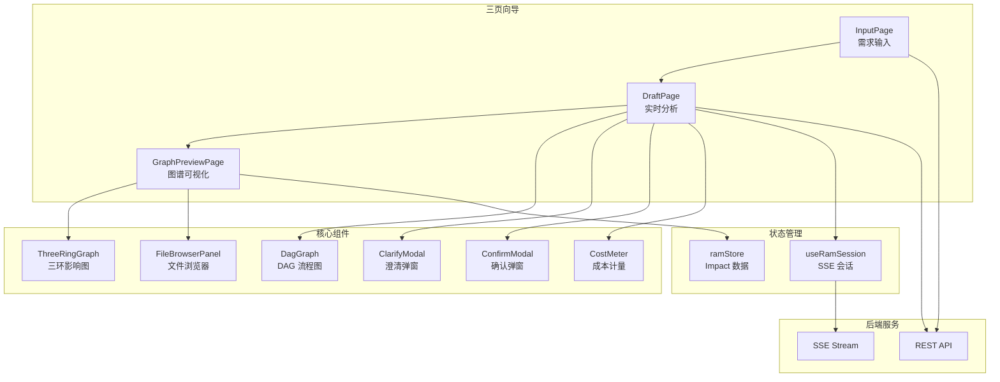
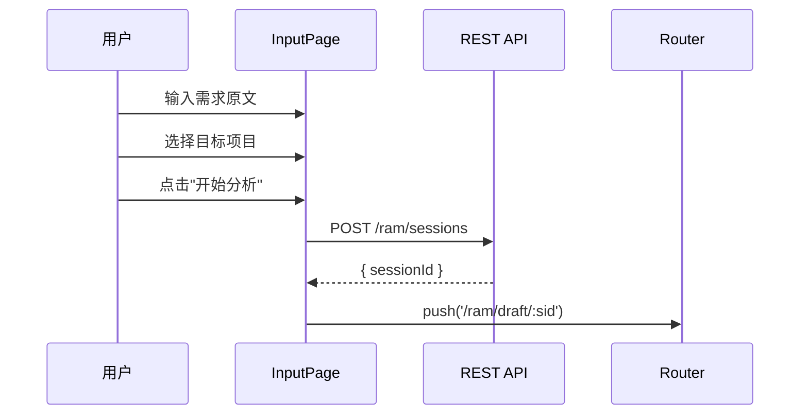
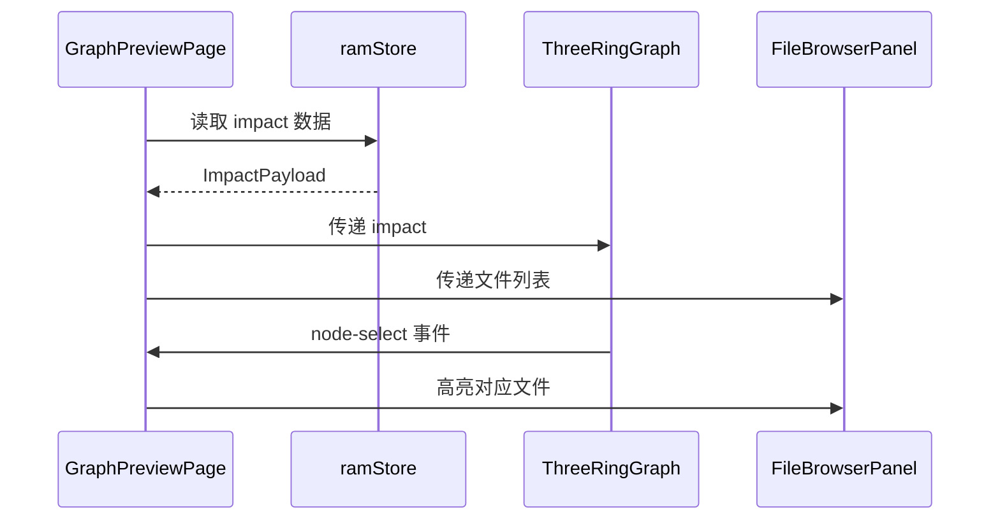

# RAM 需求评估 UI

## 概述

RAM（Requirement Analysis Master）是 HiSi DevTool 的需求分析大师模块，提供三页向导流程：输入需求 → 实时分析 → 图谱可视化。该模块通过 SSE（Server-Sent Events）实现实时进度推送，使用 DAG 和三环图进行可视化展示。

---

## 功能架构



---

## 页面流程

### 1. InputPage（需求输入）

**路径**：`/ram`

**职责**：收集需求原文和目标项目信息。

**功能**：
- 项目选择（自动扫描 Git 仓库 + 手动输入）
- 需求原文输入（文本区域）
- 创建 RAM 会话

**数据流**：


**关键代码**：
```typescript
// views/ram/InputPage.vue
async function onSubmit(): Promise<void> {
  if (!rawInput.value.trim()) {
    ElMessage.warning('请输入需求描述')
    return
  }
  if (!projectPath.value.trim()) {
    ElMessage.warning('请选择项目')
    return
  }
  submitting.value = true
  try {
    const resp = await startRamSession({ 
      rawInput: rawInput.value, 
      projectPath: projectPath.value 
    })
    await router.push({ name: 'RamDraft', params: { sid: resp.sessionId } })
  } catch (error) {
    const msg = error instanceof Error ? error.message : '启动失败'
    ElMessage.error(msg)
  } finally {
    submitting.value = false
  }
}
```

---

### 2. DraftPage（实时分析）

**路径**：`/ram/draft/:sid`

**职责**：实时展示 RAM 分析进度，处理澄清和确认交互。

**布局**：
```
┌─ top bar ───────────────────────────────────────────┐
│ CostMeter | status tag |   spacer  | actions        │
├─ DAG (horizontal 4-card) ───────────────────────────┤
│  Clarify → Impact → Implement → Verify              │
├─ detail body (2-col) ───────────────────────────────┤
│  Node detail (markdown + ring graph + …)  │ Events  │
└─────────────────────────────────────────────────────┘
```

**功能**：
- SSE 实时事件接收
- DAG 节点状态展示
- 节点详情展示（Markdown 渲染）
- ClarifyModal 弹窗（澄清问题）
- ConfirmModal 弹窗（节点确认）
- 成本计量展示
- 技术方案生成触发

**SSE 事件处理**：
```typescript
// views/ram/DraftPage.vue
watch(
  () => session.events.value,
  (list) => {
    for (const evt of list) {
      if (evt.seq <= processedSeq) continue
      processedSeq = evt.seq

      const nodeKey = resolveNodeKey(evt)
      if (!nodeKey) continue

      if (evt.type === 'CHECKPOINT') {
        const output = asRecord(evt.payload['output'])
        if (!output) continue

        const formatted = formatNodeOutput(nodeKey, output)
        switch (nodeKey) {
          case 'clarify':
            draftMd.value = formatted
            break
          case 'impact': {
            impactMd.value = formatted
            impactOutputData.value = output
            const impact = extractImpactFromCheckpoint(output)
            if (impact) {
              impactPayload.value = impact
              ramStore.setImpact(sid.value, impact)
            }
            break
          }
          // ... 其他节点
        }
      }
    }
  },
  { deep: true }
)
```

**DAG 节点状态**：
```typescript
type DagNodeKey = 'clarify' | 'impact' | 'implement' | 'verify' | 'tech_plan'
type DagNodeStatus = 'pending' | 'running' | 'done' | 'error' | 'awaiting-hitl'

interface DagNode {
  key: DagNodeKey
  label: string
  status: DagNodeStatus
}
```

---

### 3. GraphPreviewPage（图谱可视化）

**路径**：`/ram/graph/:sid`

**职责**：可视化展示 RAM 分析的影响图谱。

**功能**：
- ThreeRingGraph 三环影响图
- FileBrowserPanel 文件浏览器
- 节点详情展示
- 文件高亮联动

**数据流**：


---

## 核心组件

### DagGraph.vue

**路径**：`src/components/ram/DagGraph.vue`

**职责**：DAG 流程图可视化，展示 RAM 分析的 5 个节点状态。

**技术实现**：
- 使用 dagre 进行自动布局
- 使用 Vue Flow 渲染交互式流程图
- 支持节点状态高亮

**节点类型**：
| 节点 | 含义 | 状态流转 |
|------|------|---------|
| Clarify | 需求澄清 | pending → running → done |
| Impact | 影响分析 | pending → running → done |
| Implement | 实现方案 | pending → running → done |
| Verify | 验证检查 | pending → running → done |
| Tech Plan | 技术方案 | pending → running → done |

**Props**：
```typescript
interface DagGraphProps {
  nodes: DagNode[]
  activeKey: DagNodeKey
}
```

**Events**：
- `node-click(key: DagNodeKey)`：节点点击事件

**布局算法**：
```typescript
// components/ram/dagLayout.ts
export function layoutDag(nodes: DagNode[]): LayoutResult {
  const g = new dagre.graphlib.Graph()
  g.setGraph({ rankdir: 'LR', ranksep: 100, nodesep: 50 })
  
  for (const node of nodes) {
    g.setNode(node.key, { width: 150, height: 60 })
  }
  
  // 设置边
  g.setEdge('clarify', 'impact')
  g.setEdge('impact', 'implement')
  g.setEdge('implement', 'verify')
  g.setEdge('verify', 'tech_plan')
  
  dagre.layout(g)
  
  return {
    nodes: g.nodes().map(v => ({
      id: v,
      position: { x: g.node(v).x, y: g.node(v).y }
    })),
    edges: g.edges().map(e => ({
      source: e.v,
      target: e.w
    }))
  }
}
```

---

### ThreeRingGraph.vue

**路径**：`src/components/ram/ThreeRingGraph.vue`

**职责**：三环影响图可视化，展示 involved/modified/impacted 三层关系。

**技术实现**：
- 使用 Cytoscape.js 渲染图数据
- 支持节点拖拽、缩放、平移
- 支持节点高亮和详情查看

**三环结构**：
| 环 | 含义 | 数据来源 |
|---|------|---------|
| 内环 | involved（涉及的入口） | `impact.involved` |
| 中环 | modified（修改的方法） | `impact.modified` |
| 外环 | impacted（影响的范围） | `impact.impacted` |

**Props**：
```typescript
interface ThreeRingGraphProps {
  impact: ImpactPayload
  selectedFile?: string
  hoveredFile?: string
}
```

**Events**：
- `node-select(nodeId: string)`：节点选中事件
- `node-hover(nodeId: string)`：节点悬停事件

**布局算法**：
```typescript
// components/ram/threeRingLayout.ts
export function layoutThreeRing(impact: ImpactPayload): CytoscapeElements {
  const elements: CytoscapeElement[] = []
  
  // 内环：involved
  const involvedRadius = 100
  impact.involved.forEach((id, i) => {
    const angle = (2 * Math.PI * i) / impact.involved.length
    elements.push({
      data: { id, label: id, ring: 'involved' },
      position: {
        x: involvedRadius * Math.cos(angle),
        y: involvedRadius * Math.sin(angle)
      }
    })
  })
  
  // 中环：modified
  const modifiedRadius = 200
  impact.modified.forEach((id, i) => {
    const angle = (2 * Math.PI * i) / impact.modified.length
    elements.push({
      data: { id, label: id, ring: 'modified' },
      position: {
        x: modifiedRadius * Math.cos(angle),
        y: modifiedRadius * Math.sin(angle)
      }
    })
  })
  
  // 外环：impacted
  const impactedRadius = 300
  impact.impacted.forEach((id, i) => {
    const angle = (2 * Math.PI * i) / impact.impacted.length
    elements.push({
      data: { id, label: id, ring: 'impacted' },
      position: {
        x: impactedRadius * Math.cos(angle),
        y: impactedRadius * Math.sin(angle)
      }
    })
  })
  
  return elements
}
```

---

### FileBrowserPanel.vue

**路径**：`src/components/ram/FileBrowserPanel.vue`

**职责**：文件浏览器面板，展示受影响的文件列表。

**功能**：
- 文件树形结构展示
- 文件高亮（根据 impact 数据）
- 文件选择和悬停联动

**Props**：
```typescript
interface FileBrowserPanelProps {
  files: string[]
  highlightPath: Set<string>
  selectedFile?: string
}
```

**Events**：
- `file-select(path: string)`：文件选中事件
- `file-hover(path: string)`：文件悬停事件

---

### ClarifyModal.vue

**路径**：`src/components/ram/ClarifyModal.vue`

**职责**：澄清问题弹窗，收集用户对需求的补充信息。

**功能**：
- 问题列表展示
- 答案输入表单
- 提交和取消操作

**Props**：
```typescript
interface ClarifyModalProps {
  schema: ClarifySchema | null
  visible: boolean
}
```

**Events**：
- `submit(answers: Record<string, unknown>)`：提交答案
- `cancel()`：取消操作
- `update:visible(visible: boolean)`：更新可见性

---

### ConfirmModal.vue

**路径**：`src/components/ram/ConfirmModal.vue`

**职责**：节点确认弹窗，等待用户审批节点输出。

**功能**：
- 节点输出展示
- 审批操作（approve/reject/edit）
- 反馈输入

**Props**：
```typescript
interface ConfirmModalProps {
  schema: HitlSchema | null
  visible: boolean
}
```

**Events**：
- `confirm(action: 'approve' | 'reject' | 'edit', feedback?: string, editedOutput?: Record<string, unknown>)`：确认操作
- `cancel()`：取消操作
- `update:visible(visible: boolean)`：更新可见性

---

### CostMeter.vue

**路径**：`src/components/ram/CostMeter.vue`

**职责**：成本计量器，显示 token 消耗和费用。

**Props**：
```typescript
interface CostMeterProps {
  tokens: number
  usd: number
}
```

**展示内容**：
- Token 消耗数量
- 美元费用
- 实时更新

---

### ImpactOutputView.vue

**路径**：`src/components/ram/ImpactOutputView.vue`

**职责**：影响分析输出视图，结构化展示 impact 数据。

**展示内容**：
- Involved Ring：入口点列表
- Impact Ring：影响范围（upstream/downstream/crossService）
- Risk Score：风险评分
- Validation：验证结果

**Props**：
```typescript
interface ImpactOutputViewProps {
  output: Record<string, unknown>
}
```

---

### TechPlanOutputView.vue

**路径**：`src/components/ram/TechPlanOutputView.vue`

**职责**：技术方案输出视图，支持 Mermaid 图表渲染。

**功能**：
- Markdown 内容渲染
- Mermaid 图表渲染
- 代码高亮

**Props**：
```typescript
interface TechPlanOutputViewProps {
  output: Record<string, unknown>
}
```

---

## 状态管理

### ramStore

**路径**：`src/stores/ram.ts`

**职责**：RAM 会话状态管理，存储 Impact 数据。

**状态**：
```typescript
interface RamState {
  impact: ImpactPayload | null
  lastSessionId: string | null
  selectedFile: string | null
  hoveredFile: string | null
  highlightPath: Set<string>
}
```

**Actions**：
| Action | 参数 | 说明 |
|--------|------|------|
| `setImpact(sessionId, payload)` | `string, ImpactPayload` | 设置 impact 数据 |
| `clear()` | 无 | 清除所有状态 |
| `selectFile(file)` | `string \| null` | 选中文件 |
| `hoverFile(file)` | `string \| null` | 悬停文件 |
| `setHighlightPath(files)` | `readonly string[]` | 设置高亮路径 |
| `clearHighlight()` | 无 | 清除高亮 |

---

### useRamSession

**路径**：`src/composables/useRamSession.ts`

**职责**：RAM SSE 会话管理。

**功能**：
- SSE 连接管理
- 事件接收和解析
- 状态更新
- 成本追踪

**返回值**：
```typescript
interface UseRamSessionReturn {
  events: Ref<RamEvent[]>
  status: Ref<RamStatus>
  cost: Ref<{ tokens: number; usd: number }>
  clarifyQuestions: Ref<ClarifySchema | null>
  hitlSchema: Ref<HitlSchema | null>
  
  rejoin(sessionId: string, afterSeq?: number): void
  disconnect(): void
  submitClarify(answers: Record<string, unknown>): Promise<void>
  submitConfirm(action: string, feedback?: string, editedOutput?: Record<string, unknown>): Promise<void>
  abort(): Promise<void>
}
```

---

## API 接口

### REST API

| 端点 | 方法 | 说明 |
|------|------|------|
| `/api/ram/sessions` | POST | 创建 RAM 会话 |
| `/api/ram/sessions/:sid` | GET | 获取会话信息 |
| `/api/ram/sessions/:sid/clarify` | POST | 提交澄清答案 |
| `/api/ram/sessions/:sid/resume` | POST | 恢复会话 |
| `/api/ram/sessions/:sid/abort` | POST | 中止会话 |
| `/api/ram/sessions/:sid/confirm` | POST | 确认节点输出 |
| `/api/ram/sessions/:sid/nodes/tech-plan` | POST | 触发技术方案生成 |

### SSE API

| 端点 | 方法 | 说明 |
|------|------|------|
| `/api/ram/sessions/:sid/stream` | GET | SSE 事件流 |

**SSE 事件类型**：
| 事件类型 | 说明 |
|---------|------|
| `USER_MSG` | 用户消息 |
| `ASSISTANT_DELTA` | 助手增量消息 |
| `TOOL_USE` | 工具使用 |
| `TOOL_RESULT` | 工具结果 |
| `CHECKPOINT` | 检查点（节点完成） |
| `CLARIFY_REQ` | 澄清请求 |
| `CLARIFY_RES` | 澄清响应 |
| `HITL_REQ` | 人工确认请求 |
| `HITL_RES` | 人工确认响应 |
| `ERROR` | 错误 |
| `RUN_COMPLETED` | 运行完成 |
| `RUN_FAILED` | 运行失败 |
| `RUN_ABORTED` | 运行中止 |
| `CLARIFY_REQUIRED` | 需要澄清 |

---

## 数据模型

### ImpactPayload

```typescript
interface ImpactPayload {
  readonly involved: readonly string[]
  readonly modified: readonly string[]
  readonly impacted: readonly string[]
  readonly riskScores?: Readonly<Record<string, number>>
}
```

### ClarifySchema

```typescript
interface ClarifySchema {
  readonly nodeName?: string
  readonly questions: readonly string[]
}
```

### HitlSchema

```typescript
interface HitlSchema {
  readonly nodeName: string
  readonly output: Readonly<Record<string, unknown>>
}
```

### RamEvent

```typescript
interface RamEvent {
  readonly seq: number
  readonly type: string
  readonly payload: Readonly<Record<string, unknown>>
}
```

---

## 测试

### 单元测试

```typescript
// components/ram/__tests__/DagGraph.spec.ts
import { describe, it, expect } from 'vitest'
import { mount } from '@vue/test-utils'
import DagGraph from '../DagGraph.vue'

describe('DagGraph', () => {
  it('should render nodes correctly', () => {
    const nodes = [
      { key: 'clarify', label: 'Clarify', status: 'done' },
      { key: 'impact', label: 'Impact', status: 'running' }
    ]
    
    const wrapper = mount(DagGraph, {
      props: { nodes, activeKey: 'impact' }
    })
    
    expect(wrapper.findAll('.dag-node')).toHaveLength(2)
  })

  it('should emit node-click event', async () => {
    const nodes = [
      { key: 'clarify', label: 'Clarify', status: 'done' }
    ]
    
    const wrapper = mount(DagGraph, {
      props: { nodes, activeKey: 'clarify' }
    })
    
    await wrapper.find('.dag-node').trigger('click')
    expect(wrapper.emitted('node-click')).toBeTruthy()
  })
})
```

### E2E 测试

```typescript
// e2e/ram.spec.ts
import { test, expect } from '@playwright/test'

test('RAM workflow', async ({ page }) => {
  await page.goto('/ram')
  
  // 输入需求
  await page.fill('[data-test="ram-raw-input"]', '测试需求')
  await page.selectOption('[data-test="ram-project-select"]', '/test/project')
  
  // 提交
  await page.click('[data-test="ram-submit"]')
  
  // 验证跳转
  await expect(page).toHaveURL(/\/ram\/draft\//)
})
```

---

## 下一步

- [组件层](./组件层.md) - 了解其他组件设计
- [状态管理](./状态管理.md) - 了解 Pinia 状态管理
- [数据流程](../04-数据流程/index.md) - 了解 RAM 端到端流程
