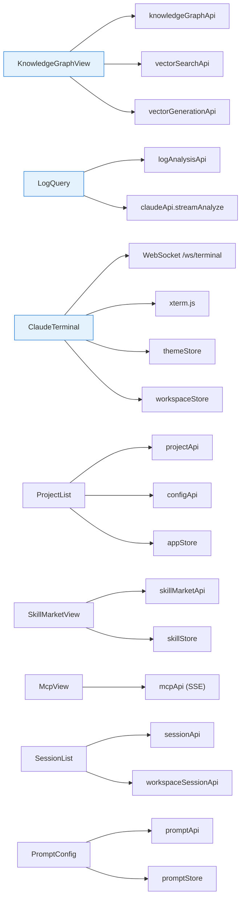
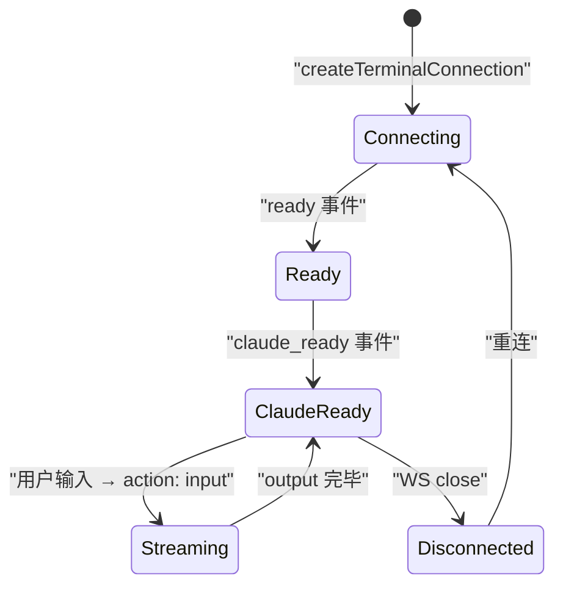
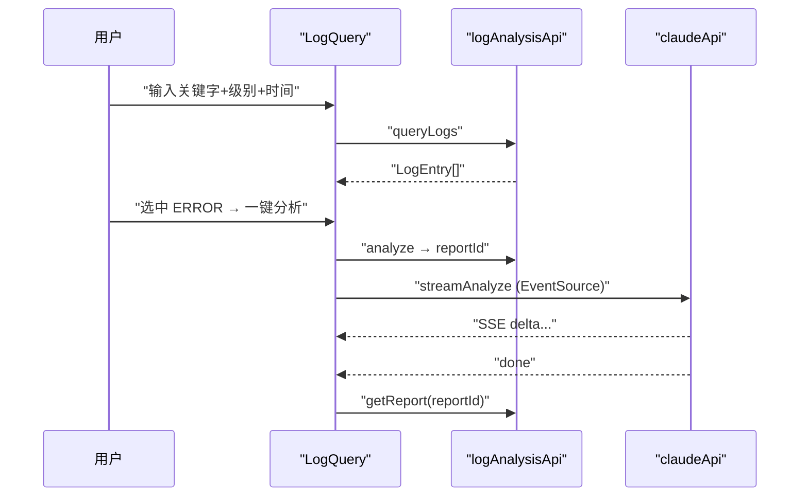

# 业务视图

| 属性 | 值 |
|------|-----|
| **所属层** | 表现层 |
| **目录** | `src/views/` |
| **页面数** | 12 个一级目录 + 多个嵌套子组件 |

---

## 1. 模块概述

**核心职责**:承载所有业务页面,组合 Pinia Store / API 模块 / Composable / 通用组件 完成完整的用户场景。

### 1.1 页面清单

| 路由 | 目录 | 入口组件 | 后端 API | 关键能力 |
|------|------|---------|---------|---------|
| `/project` | `project/` | `ProjectList.vue` | `/api/projects/*` + `/api/config/*` | 扫描 Git 仓库、勾选项目、配置 PROJECT_DIR |
| `/knowledge-graph` | `knowledge-graph/` | `KnowledgeGraphView.vue` | `/api/knowledge-graph/*` + `/api/vector-*` | KG 生成/状态/调用链/语义检索 Tab |
| `/search` | `search/` | `SemanticSearchView.vue` | `/api/search/semantic` (历史残留) | 全局语义检索(不可用) |
| `/call-chain` | `call-chain/` | redirect | — | 全部跳 `/knowledge-graph?tab=methodRef` |
| `/log-analysis` | `log-analysis/` | `LogQuery.vue` | `/api/log/*` | 日志查询 → 一键 Claude 分析 |
| `/mcp` | `mcp/` | `McpView.vue` | `/api/mcp/*` | MCP 列表/安装(SSE 进度) |
| `/skill-market` | `skill-market/` | `SkillMarketView.vue` | `/api/skill/*` | Skill 列表/分类/安装/更新 |
| `/claude-terminal` | `claude-terminal/` | `ClaudeTerminal.vue` | `/ws/terminal` | xterm.js + WebSocket 终端 |
| `/claude-session` | `claude-session/` | `SessionList.vue` | `/api/session/*` + `/api/workspace-session/*` | 会话历史/恢复/导出 |
| `/prompt-config` | `prompt-config/` | `PromptConfig.vue` | `/api/prompt/*` | Prompt 模板 CRUD/渲染预览 |
| `/settings` | `settings/` | `Settings.vue` | `/api/config/*` | 全局设置 + 终端主题切换 |
| `/` | — | `HomeView.vue` | redirect → `/project` | — |

---

## 2. 页面与依赖关系图

---

## 3. 重点页面剖析

### 3.1 KnowledgeGraphView

| Tab | 子组件(约) | 后端能力 |
|-----|-----------|---------|
| 总览 | KG 状态卡片 | `getKnowledgeGraphStatus` |
| 生成 | 进度面板 | `generateKnowledgeGraph` + `getStatusBatch` |
| 向量 | 向量生成面板 | `vectorGenerationApi.start` + `getStatusBatch` |
| 检索 | `SemanticSearchPanel` | `vectorSearchApi.search` |
| 调用链 (`?tab=methodRef`) | 树/图 | `getCalleesTree` / `getCallChainGraph` / `getRootEntries` |
| 桥接 | 列表 | `getBridgesByType` / `getMapperSql` |
| MyBatis SQL | 表格 | `getMybatisMappers` / `getMybatisSql` |
| 业务流 | 流程图 | `generateBusinessFlow` |
| 单元测试 | 生成器 | `generateUnitTest` |

### 3.2 ClaudeTerminal

### 3.3 LogQuery → 分析

---

## 4. 视图层约束

| 约束 | 说明 |
|------|------|
| 不直接 `import axios` | 必须经 `api/*` |
| Pinia Store 优先 | 跨页面共享状态(项目/会话/主题/Skill)必须放 Store |
| 流式渲染 | 使用 composable(`useDialogWebSocket`/`useDiagnosis`) 或 API 模块的回调式接口 |
| 错误处理 | `try/catch` + `ElMessage` 提示 |
| 类型对齐 | 所有 API 入参/响应使用 `types/` 定义 |
