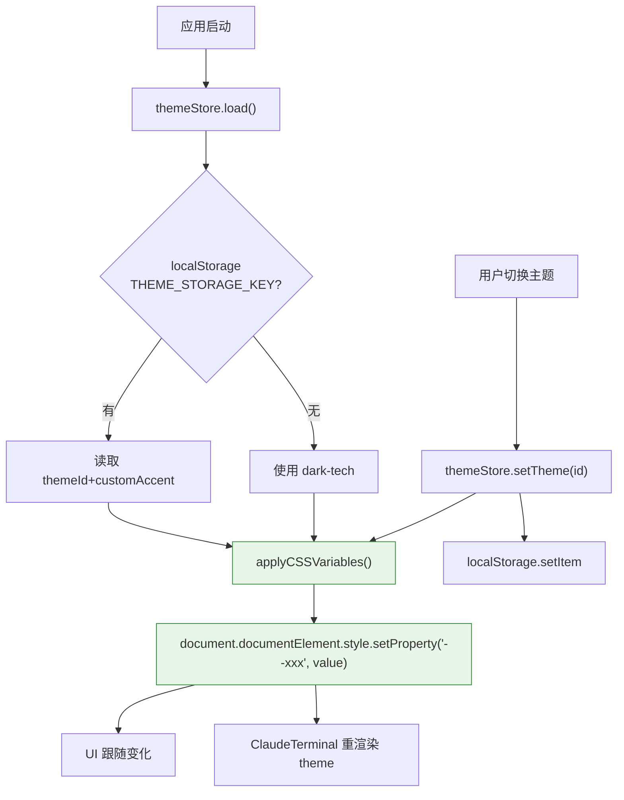

# 主题系统

| 属性 | 值 |
|------|-----|
| **所属层** | 基础设施层 |
| **目录** | `src/themes/` |
| **文件数** | 5(`index.ts`、`presets.ts`、`types.ts` + 2 个 .test.ts) |
| **持久化** | localStorage |
| **关联 Store** | `themeStore.ts` |

---

## 1. 模块概述

**核心职责**:为整站(主要是 Claude 终端 + UI 配色)提供 6 套预设主题与自定义强调色,通过注入 CSS 变量实现 UI 与 xterm.js 终端的视觉一致性。

---

## 2. 预设清单

| ID | 名称 | 类型 |
|----|------|------|
| `dark-tech` | 深色科技 | dark(默认) |
| `dark-monokai` | Monokai | dark |
| `dark-dracula` | Dracula | dark |
| `light-minimal` | 简约浅色 | light |
| `light-sepia` | 米色护眼 | light |
| `eye-care` | 护眼绿 | light |

---

## 3. 类型定义(`types.ts`)

```ts
interface ThemeDefinition {
  id: ThemeId
  name: string
  type: 'dark' | 'light'
  // UI / xterm 共享的颜色
  background: string
  foreground: string
  cursor: string
  selection: string
  black/red/green/yellow/blue/magenta/cyan/white: string
  brightBlack/.../brightWhite: string
  accent: string             // 强调色,可被 customAccent 覆盖
}
```

---

## 4. 应用流程



---

## 5. xterm.js 集成

```ts
// ClaudeTerminal.vue (示意)
const term = new Terminal({
  theme: {
    background: theme.background,
    foreground: theme.foreground,
    cursor: theme.cursor,
    selectionBackground: theme.selection,
    // ANSI 16 色
    black: theme.black, red: theme.red, ...
  }
})

watch(() => themeStore.themeId, () => term.options.theme = buildXtermTheme())
```

---

## 6. 测试

| 文件 | 覆盖 |
|------|------|
| `presets.test.ts` | 6 预设结构完整性、颜色字段非空 |
| `types.test.ts` | `ThemeDefinition` 必填字段断言 |

---

## 7. 扩展指南

| 任务 | 步骤 |
|------|------|
| 新增预设 | `presets.ts` 追加 `ThemeDefinition`;`index.ts` 导出 |
| 新增 CSS 变量 | `types.ts` 加字段;`themeStore.applyCSSVariables` 加 `setProperty`;6 预设全部补齐值 |
| 让组件感知 | 直接在 `<style scoped>` 中用 `var(--accent)` 等变量 |
