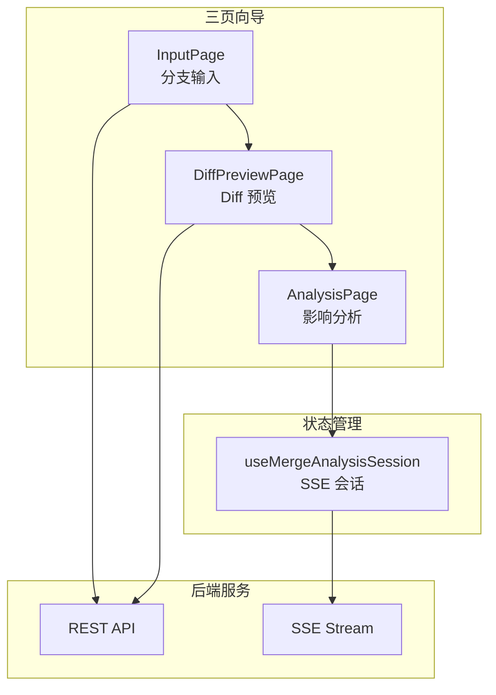
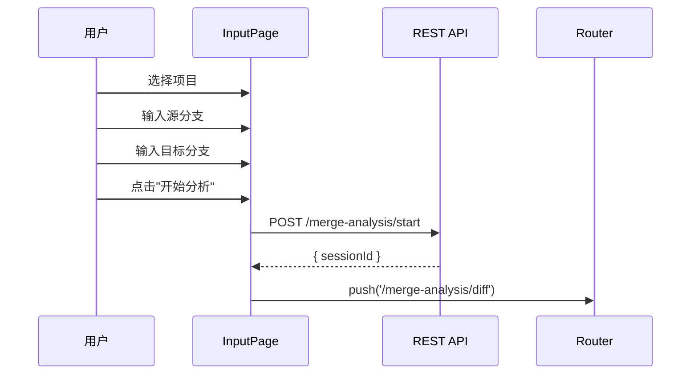
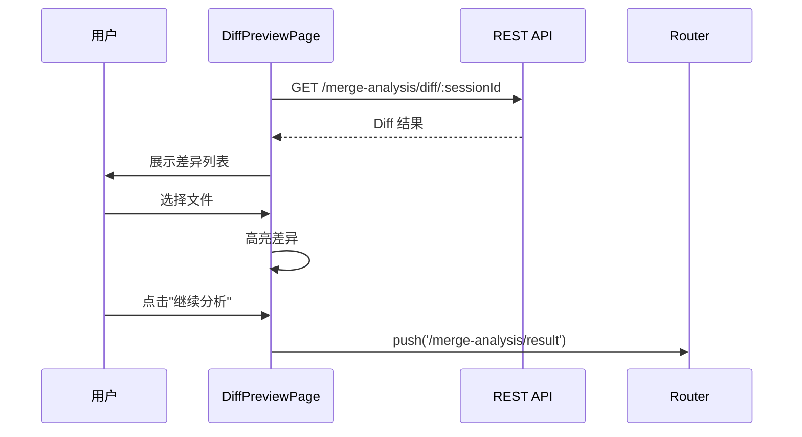
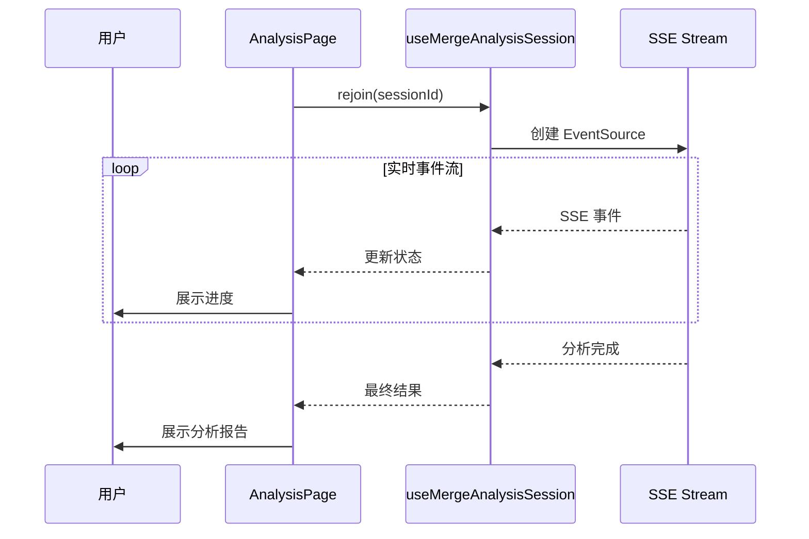

# 合并分析 UI

## 概述

合并分析 UI 是 HiSi DevTool 的代码合并影响分析模块。该模块提供向导 UI + SSE streaming，帮助开发者分析代码合并的影响范围和风险。

---

## 功能架构



---

## 页面流程

### 1. InputPage（分支输入）

**路径**：`/merge-analysis`

**职责**：收集合并分支信息。

**功能**：
- 项目选择
- 源分支输入
- 目标分支输入
- 启动分析

**数据流**：


---

### 2. DiffPreviewPage（Diff 预览）

**路径**：`/merge-analysis/diff`

**职责**：预览代码差异。

**功能**：
- 文件差异列表
- 代码差异高亮
- 文件选择
- 继续分析

**数据流**：


---

### 3. AnalysisPage（影响分析）

**路径**：`/merge-analysis/result`

**职责**：展示合并影响分析结果。

**功能**：
- SSE 实时进度
- 影响范围展示
- 风险评估
- 分析报告

**数据流**：


---

## 核心组件

### InputPage.vue

**路径**：`src/views/merge-analysis/InputPage.vue`

**职责**：合并分析输入页面。

**功能**：
- 项目选择
- 源分支输入
- 目标分支输入
- 启动分析

**布局**：
```
┌─────────────────────────────────────────────────────┐
│                                                     │
│                   项目选择                           │
│                                                     │
├─────────────────────────────────────────────────────┤
│                                                     │
│  源分支：[________________]                          │
│                                                     │
│  目标分支：[________________]                        │
│                                                     │
├─────────────────────────────────────────────────────┤
│                                                     │
│                   [开始分析]                         │
│                                                     │
└─────────────────────────────────────────────────────┘
```

**Props**：无

**Events**：无

---

### DiffPreviewPage.vue

**路径**：`src/views/merge-analysis/DiffPreviewPage.vue`

**职责**：Diff 预览页面。

**功能**：
- 文件差异列表
- 代码差异高亮
- 文件选择

**布局**：
```
┌─────────────────────────────────────────────────────┐
│                                                     │
│  文件列表：                                          │
│  ├── src/main.java (+5, -2)                         │
│  ├── src/utils.java (+10, -3)                       │
│  └── README.md (+1, -0)                             │
│                                                     │
├─────────────────────────────────────────────────────┤
│                                                     │
│  代码差异：                                          │
│  - 旧代码                                           │
│  + 新代码                                           │
│                                                     │
├─────────────────────────────────────────────────────┤
│                                                     │
│                   [继续分析]                         │
│                                                     │
└─────────────────────────────────────────────────────┘
```

**Props**：无

**Events**：无

---

### AnalysisPage.vue

**路径**：`src/views/merge-analysis/AnalysisPage.vue`

**职责**：分析结果页面。

**功能**：
- SSE 实时进度
- 影响范围展示
- 风险评估
- 分析报告

**布局**：
```
┌─────────────────────────────────────────────────────┐
│                                                     │
│  分析进度：                                          │
│  [████████████████████░░░░░░░░░░] 60%              │
│                                                     │
├─────────────────────────────────────────────────────┤
│                                                     │
│  影响范围：                                          │
│  - 修改文件：5 个                                    │
│  - 影响方法：12 个                                   │
│  - 风险等级：中                                      │
│                                                     │
├─────────────────────────────────────────────────────┤
│                                                     │
│  分析报告：                                          │
│  1. 文件 A 的修改会影响方法 B、C                      │
│  2. 方法 D 的调用链需要更新                           │
│  3. ...                                             │
│                                                     │
└─────────────────────────────────────────────────────┘
```

**Props**：无

**Events**：无

---

## 状态管理

### useMergeAnalysisSession

**路径**：`src/composables/useMergeAnalysisSession.ts`

**职责**：合并分析 SSE 会话管理。

**功能**：
- SSE 连接管理
- 事件接收和解析
- 状态更新
- 进度追踪

**返回值**：
```typescript
interface UseMergeAnalysisSessionReturn {
  events: Ref<MergeAnalysisEvent[]>
  status: Ref<MergeAnalysisStatus>
  progress: Ref<number>
  result: Ref<AnalysisResult | null>
  
  rejoin(sessionId: string): void
  disconnect(): void
}
```

**状态类型**：
```typescript
type MergeAnalysisStatus = 'idle' | 'running' | 'completed' | 'error'

interface MergeAnalysisEvent {
  seq: number
  type: string
  payload: Record<string, unknown>
}
```

---

## API 接口

### REST API

| 端点 | 方法 | 说明 |
|------|------|------|
| `/api/merge-analysis/start` | POST | 启动合并分析 |
| `/api/merge-analysis/diff/:sessionId` | GET | 获取 Diff 结果 |
| `/api/merge-analysis/result/:sessionId` | GET | 获取分析结果 |
| `/api/merge-analysis/stream/:sessionId` | GET | SSE 事件流 |

### 请求参数

**启动合并分析**：
```typescript
interface StartAnalysisPayload {
  projectPath: string
  sourceBranch: string
  targetBranch: string
}
```

**SSE 事件类型**：
| 事件类型 | 说明 |
|---------|------|
| `PROGRESS` | 进度更新 |
| `FILE_DIFF` | 文件差异 |
| `IMPACT` | 影响分析 |
| `RISK` | 风险评估 |
| `COMPLETED` | 分析完成 |
| `ERROR` | 错误 |

---

## 数据模型

### DiffResult

```typescript
interface DiffResult {
  files: FileDiff[]
  summary: {
    totalFiles: number
    addedLines: number
    removedLines: number
  }
}

interface FileDiff {
  path: string
  status: 'added' | 'modified' | 'deleted'
  additions: number
  deletions: number
  hunks: DiffHunk[]
}

interface DiffHunk {
  oldStart: number
  oldLines: number
  newStart: number
  newLines: number
  content: string
}
```

### AnalysisResult

```typescript
interface AnalysisResult {
  sessionId: string
  status: 'completed' | 'failed'
  impact: {
    modifiedFiles: string[]
    affectedMethods: string[]
    riskLevel: 'low' | 'medium' | 'high'
  }
  report: string
  suggestions: string[]
}
```

---

## 测试

### 单元测试

```typescript
// composables/__tests__/useMergeAnalysisSession.spec.ts
import { describe, it, expect } from 'vitest'
import { useMergeAnalysisSession } from '../useMergeAnalysisSession'

describe('useMergeAnalysisSession', () => {
  it('should initialize with idle status', () => {
    const { status } = useMergeAnalysisSession()
    expect(status.value).toBe('idle')
  })

  it('should update status on rejoin', () => {
    const { status, rejoin } = useMergeAnalysisSession()
    rejoin('test-session')
    expect(status.value).toBe('running')
  })
})
```

### E2E 测试

```typescript
// e2e/merge-analysis.spec.ts
import { test, expect } from '@playwright/test'

test('merge analysis workflow', async ({ page }) => {
  await page.goto('/merge-analysis')
  
  // 输入分支信息
  await page.selectOption('[data-test="merge-project"]', '/test/project')
  await page.fill('[data-test="source-branch"]', 'feature/new-feature')
  await page.fill('[data-test="target-branch"]', 'main')
  
  // 启动分析
  await page.click('[data-test="start-analysis"]')
  
  // 验证跳转到 Diff 预览
  await expect(page).toHaveURL('/merge-analysis/diff')
  
  // 继续分析
  await page.click('[data-test="continue-analysis"]')
  
  // 验证跳转到分析结果
  await expect(page).toHaveURL('/merge-analysis/result')
  
  // 验证分析完成
  await expect(page.locator('[data-test="analysis-status"]')).toHaveText('completed')
})
```

---

## 设计模式

### 1. 向导流程

使用 Vue Router 实现多步骤向导：

```typescript
// 路由配置
const routes = [
  {
    path: '/merge-analysis',
    name: 'MergeAnalysisInput',
    component: () => import('@/views/merge-analysis/InputPage.vue')
  },
  {
    path: '/merge-analysis/diff',
    name: 'MergeAnalysisDiff',
    component: () => import('@/views/merge-analysis/DiffPreviewPage.vue')
  },
  {
    path: '/merge-analysis/result',
    name: 'MergeAnalysisResult',
    component: () => import('@/views/merge-analysis/AnalysisPage.vue')
  }
]
```

### 2. SSE 实时通信

使用 EventSource 接收实时事件：

```typescript
// composables/useMergeAnalysisSession.ts
export function useMergeAnalysisSession() {
  const events = ref<MergeAnalysisEvent[]>([])
  const status = ref<MergeAnalysisStatus>('idle')
  let eventSource: EventSource | null = null

  function rejoin(sessionId: string) {
    status.value = 'running'
    const url = `/api/merge-analysis/stream/${sessionId}`
    eventSource = new EventSource(url)
    
    eventSource.onmessage = (event) => {
      const data = JSON.parse(event.data)
      events.value.push(data)
      
      if (data.type === 'COMPLETED') {
        status.value = 'completed'
        disconnect()
      }
    }
    
    eventSource.onerror = () => {
      status.value = 'error'
      disconnect()
    }
  }

  function disconnect() {
    if (eventSource) {
      eventSource.close()
      eventSource = null
    }
  }

  return {
    events,
    status,
    rejoin,
    disconnect
  }
}
```

### 3. 代码差异高亮

使用 Monaco Editor 或自定义差异渲染：

```vue
<template>
  <div class="diff-viewer">
    <div v-for="hunk in file.hunks" :key="hunk.oldStart" class="diff-hunk">
      <div 
        v-for="(line, index) in hunk.content.split('\n')" 
        :key="index"
        :class="getLineClass(line)"
      >
        {{ line }}
      </div>
    </div>
  </div>
</template>

<script setup lang="ts">
function getLineClass(line: string): string {
  if (line.startsWith('+')) return 'diff-add'
  if (line.startsWith('-')) return 'diff-remove'
  return 'diff-context'
}
</script>

<style scoped>
.diff-add {
  background-color: #e6ffec;
  color: #22863a;
}

.diff-remove {
  background-color: #ffeef0;
  color: #cb2431;
}

.diff-context {
  background-color: #ffffff;
  color: #24292e;
}
</style>
```

---

## 下一步

- [RAM需求评估UI](./RAM需求评估UI.md) - 了解 RAM 向导流程
- [API服务层](./API服务层.md) - 了解合并分析 API
- [数据流程](../04-数据流程/index.md) - 了解合并分析端到端流程
