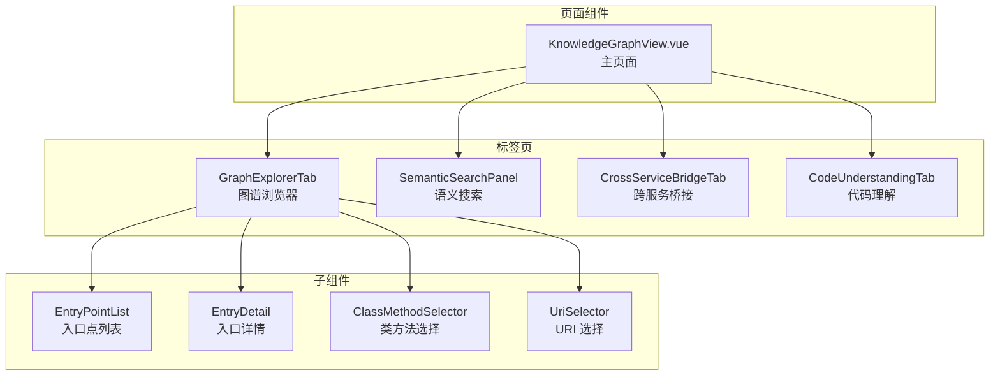
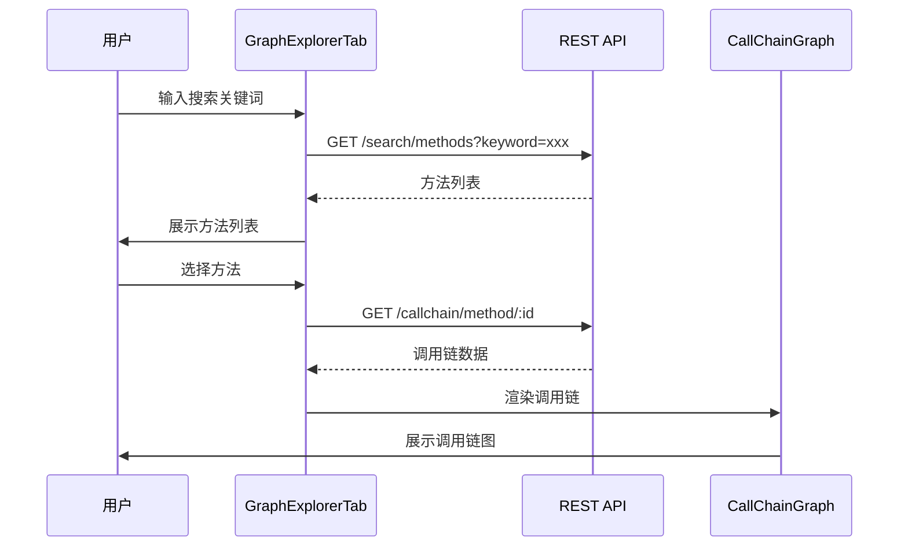
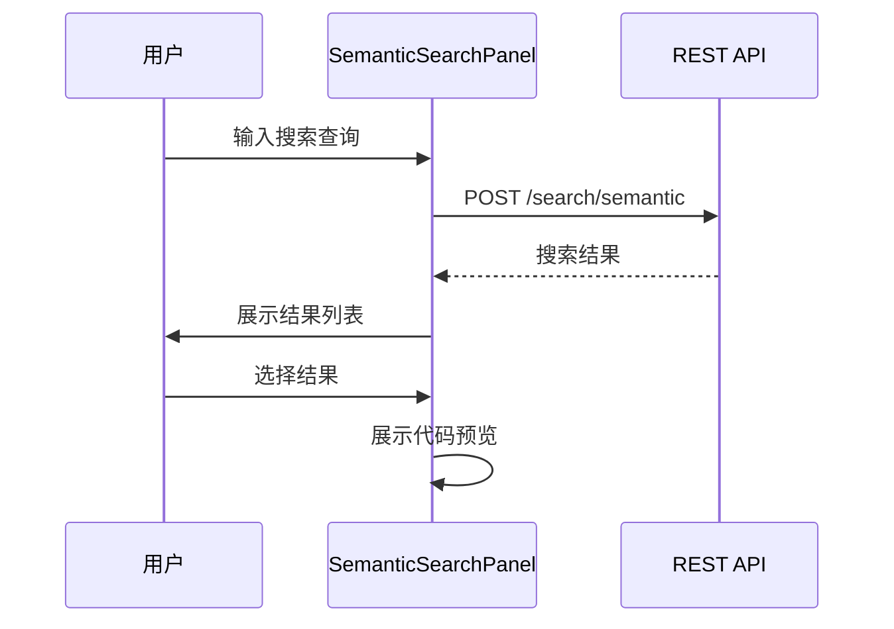
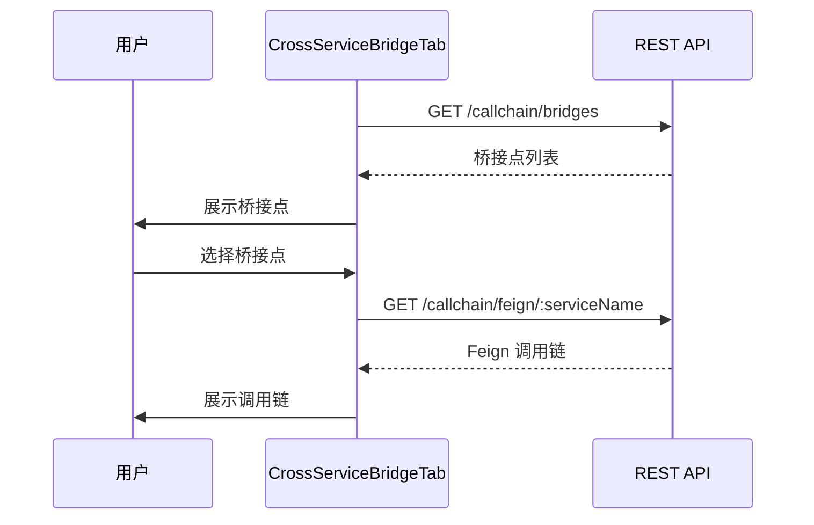
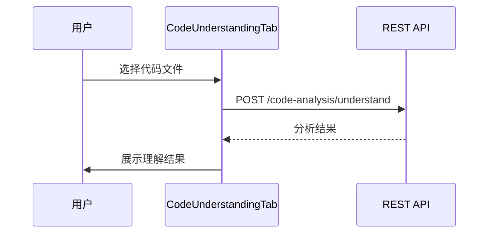

# 图谱浏览器 UI

## 概述

图谱浏览器 UI 是 HiSi DevTool 的知识图谱可视化探索模块。该模块提供方法搜索、调用链导航、入口类型浏览等功能，帮助开发者理解代码结构和调用关系。

---

## 功能架构



---

## 页面流程

### 1. 知识图谱分析主页

**路径**：`/knowledge-graph`

**职责**：知识图谱分析主页面，整合多个标签页。

**布局**：
```
┌─────────────────────────────────────────────────────┐
│                项目选择器                              │
├─────────────────────────────────────────────────────┤
│  ┌─────────────────────────────────────────────┐    │
│  │                                             │    │
│  │           标签页导航                          │    │
│  │  [图谱浏览器] [语义搜索] [跨服务桥接] [代码理解] │    │
│  │                                             │    │
│  ├─────────────────────────────────────────────┤    │
│  │                                             │    │
│  │           标签页内容                          │    │
│  │                                             │    │
│  └─────────────────────────────────────────────┘    │
└─────────────────────────────────────────────────────┘
```

**功能**：
- 项目选择
- 标签页切换
- URL 参数同步（`?tab=methodRef`）

---

### 2. 图谱浏览器标签页

**功能**：方法搜索、调用链导航、入口类型浏览。

**流程**：


---

### 3. 语义搜索标签页

**功能**：自然语言搜索代码。

**流程**：


---

### 4. 跨服务桥接标签页

**功能**：查看 Feign、MQ 等跨服务调用。

**流程**：


---

### 5. 代码理解标签页

**功能**：代码理解和分析。

**流程**：


---

## 核心组件

### KnowledgeGraphView.vue

**路径**：`src/views/knowledge-graph/KnowledgeGraphView.vue`

**职责**：知识图谱分析主页面。

**功能**：
- 项目选择器
- 标签页导航
- URL 参数同步

**标签页配置**：
```typescript
const tabs = [
  { key: 'graphExplorer', label: '图谱浏览器', component: GraphExplorerTab },
  { key: 'semanticSearch', label: '语义搜索', component: SemanticSearchPanel },
  { key: 'crossService', label: '跨服务桥接', component: CrossServiceBridgeTab },
  { key: 'codeUnderstanding', label: '代码理解', component: CodeUnderstandingTab }
]
```

---

### GraphExplorerTab.vue

**路径**：`src/views/knowledge-graph/components/GraphExplorerTab.vue`

**职责**：图谱浏览器标签页，提供方法搜索和调用链导航。

**功能**：
- 方法搜索（按类名、方法名）
- 调用链可视化（上下游）
- 入口类型浏览（Controller/Schedule/MQ）

**布局**：
```
┌─────────────────────────────────────────────────────┐
│  搜索框：[输入类名或方法名...]                          │
├──────────────┬──────────────────────────────────────┤
│              │                                      │
│  方法列表     │         调用链图                       │
│              │                                      │
│  - ClassA    │         ┌─────┐                      │
│    - method1 │         │ A   │                      │
│    - method2 │         └──┬──┘                      │
│  - ClassB    │            │                         │
│    - method3 │         ┌──▼──┐                      │
│              │         │ B   │                      │
│              │         └─────┘                      │
│              │                                      │
└──────────────┴──────────────────────────────────────┘
```

---

### EntryPointList.vue

**路径**：`src/views/knowledge-graph/components/EntryPointList.vue`

**职责**：入口点列表，按类型展示 API 入口。

**分类**：
| 类型 | 说明 | 图标 |
|------|------|------|
| Controller | REST API 入口 | 🌐 |
| Scheduled | 定时任务入口 | ⏰ |
| MQ Listener | 消息队列入口 | 📨 |
| Feign Client | Feign 客户端入口 | 🔗 |

**Props**：
```typescript
interface EntryPointListProps {
  projectPath: string
  type?: 'controller' | 'scheduled' | 'mq' | 'feign'
}
```

**Events**：
- `entry-select(entry: EntryPoint)`：入口点选中事件

---

### EntryDetail.vue

**路径**：`src/views/knowledge-graph/components/EntryDetail.vue`

**职责**：入口详情，展示入口点的详细信息。

**展示内容**：
- 类名、方法名
- HTTP 方法、路径
- 参数列表
- 返回类型
- 调用链

**Props**：
```typescript
interface EntryDetailProps {
  entryId: string
}
```

---

### SemanticSearchPanel.vue

**路径**：`src/views/knowledge-graph/components/SemanticSearchPanel.vue`

**职责**：语义搜索面板，提供自然语言搜索功能。

**功能**：
- 搜索输入
- 结果列表展示
- 代码预览

**Props**：
```typescript
interface SemanticSearchPanelProps {
  projectPath: string
}
```

**搜索结果类型**：
```typescript
interface SearchResult {
  id: string
  className: string
  methodName: string
  description: string
  score: number
  codeSnippet: string
}
```

---

### CodeUnderstandingTab.vue

**路径**：`src/views/knowledge-graph/components/CodeUnderstandingTab.vue`

**职责**：代码理解标签页，提供代码分析功能。

**功能**：
- 代码文件选择
- 代码分析
- 理解结果展示

**Props**：
```typescript
interface CodeUnderstandingTabProps {
  projectPath: string
}
```

---

### CrossServiceBridgeTab.vue

**路径**：`src/views/knowledge-graph/components/CrossServiceBridgeTab.vue`

**职责**：跨服务桥接标签页，展示 Feign、MQ 等跨服务调用。

**功能**：
- Feign 调用链
- MQ 消息链
- 桥接点统计

**Props**：
```typescript
interface CrossServiceBridgeTabProps {
  projectPath: string
}
```

---

### ClassMethodSelector.vue

**路径**：`src/views/call-chain/components/ClassMethodSelector.vue`

**职责**：类方法选择器，选择类和方法。

**功能**：
- 类名搜索
- 方法列表展示
- 方法选择

**Props**：
```typescript
interface ClassMethodSelectorProps {
  projectPath: string
}
```

**Events**：
- `select(className: string, methodName: string)`：选择事件

---

### UriSelector.vue

**路径**：`src/views/call-chain/components/UriSelector.vue`

**职责**：URI 选择器，选择 API URI。

**功能**：
- URI 搜索
- URI 列表展示
- URI 选择

**Props**：
```typescript
interface UriSelectorProps {
  projectPath: string
}
```

**Events**：
- `select(uri: string)`：选择事件

---

## 可视化组件

### CallChainGraph.vue

**路径**：`src/views/call-chain/CallChainGraph.vue`

**职责**：调用链图可视化，展示方法调用关系。

**技术实现**：
- 使用 dagre 进行自动布局
- 使用 Vue Flow 渲染交互式流程图
- 支持节点展开/折叠

**Props**：
```typescript
interface CallChainGraphProps {
  chain: CallChain
  direction: 'upstream' | 'downstream'
}
```

**Events**：
- `node-click(nodeId: string)`：节点点击事件

---

### MethodReferenceGraph.vue

**路径**：`src/views/call-chain/MethodReferenceGraph.vue`

**职责**：方法引用图，展示方法的引用关系。

**功能**：
- 方法引用展示
- 引用类型高亮
- 引用链导航

**Props**：
```typescript
interface MethodReferenceGraphProps {
  className: string
  methodName: string
  projectPath: string
}
```

---

### FlowDag.vue

**路径**：`src/views/call-chain/components/FlowDag.vue`

**职责**：流程 DAG 图，展示调用流程。

**技术实现**：
- 使用 dagre 布局
- 支持节点状态高亮

**Props**：
```typescript
interface FlowDagProps {
  nodes: FlowNode[]
  edges: FlowEdge[]
}
```

---

### ChainChart.vue

**路径**：`src/views/call-chain/components/ChainChart.vue`

**职责**：调用链图表，使用 ECharts 展示调用链。

**技术实现**：
- 使用 ECharts 渲染
- 支持缩放、平移

**Props**：
```typescript
interface ChainChartProps {
  chain: CallChain
}
```

---

## API 接口

### REST API

| 端点 | 方法 | 说明 |
|------|------|------|
| `/api/search/methods` | GET | 搜索方法 |
| `/api/search/semantic` | POST | 语义搜索 |
| `/api/callchain/method/:id` | GET | 获取方法调用链 |
| `/api/callchain/uri` | GET | 获取 URI 列表 |
| `/api/callchain/uri-chain` | GET | 获取 URI 调用链 |
| `/api/callchain/bridges` | GET | 获取桥接点 |
| `/api/callchain/feign/:serviceName` | GET | 获取 Feign 调用链 |
| `/api/callchain/mq/:topic` | GET | 获取 MQ 调用链 |
| `/api/knowledge-graph/entries` | GET | 获取入口点列表 |
| `/api/knowledge-graph/entries/:id` | GET | 获取入口点详情 |

---

## 数据模型

### MethodInfo

```typescript
interface MethodInfo {
  id: string
  className: string
  methodName: string
  description: string
  projectPath: string
  language: 'java' | 'python'
}
```

### CallChain

```typescript
interface CallChain {
  root: CallNode
  nodes: CallNode[]
  edges: CallEdge[]
}

interface CallNode {
  id: string
  className: string
  methodName: string
  type: 'method' | 'entry' | 'bridge'
}

interface CallEdge {
  source: string
  target: string
  type: 'call' | 'reference' | 'feign' | 'mq'
}
```

### EntryPoint

```typescript
interface EntryPoint {
  id: string
  name: string
  type: 'controller' | 'scheduled' | 'mq' | 'feign'
  path: string
  method?: string
  className: string
  methodName: string
  description?: string
}
```

---

## 状态管理

### 本地状态

图谱浏览器 UI 主要使用组件本地状态：

```typescript
// views/knowledge-graph/KnowledgeGraphView.vue
const activeTab = ref('graphExplorer')
const selectedProject = ref('')
const searchKeyword = ref('')
const searchResults = ref<MethodInfo[]>([])
```

### URL 同步

使用 Vue Router 的 query 参数同步标签页状态：

```typescript
// 监听 URL 参数
watch(() => route.query.tab, (tab) => {
  if (tab && typeof tab === 'string') {
    activeTab.value = tab
  }
})

// 更新 URL
function onTabChange(tab: string) {
  router.replace({ query: { tab } })
}
```

---

## 测试

### 单元测试

```typescript
// components/__tests__/GraphExplorerTab.spec.ts
import { describe, it, expect } from 'vitest'
import { mount } from '@vue/test-utils'
import GraphExplorerTab from '../GraphExplorerTab.vue'

describe('GraphExplorerTab', () => {
  it('should render search input', () => {
    const wrapper = mount(GraphExplorerTab, {
      props: { projectPath: '/test/project' }
    })
    
    expect(wrapper.find('input[type="text"]').exists()).toBe(true)
  })

  it('should emit search event', async () => {
    const wrapper = mount(GraphExplorerTab, {
      props: { projectPath: '/test/project' }
    })
    
    await wrapper.find('input').setValue('test')
    await wrapper.find('input').trigger('keyup.enter')
    
    expect(wrapper.emitted('search')).toBeTruthy()
  })
})
```

### E2E 测试

```typescript
// e2e/knowledge-graph.spec.ts
import { test, expect } from '@playwright/test'

test('knowledge graph workflow', async ({ page }) => {
  await page.goto('/knowledge-graph')
  
  // 选择项目
  await page.selectOption('[data-test="kg-project"]', '/test/project')
  
  // 搜索方法
  await page.fill('[data-test="method-search"]', 'getUser')
  await page.press('[data-test="method-search"]', 'Enter')
  
  // 验证搜索结果
  await expect(page.locator('[data-test="search-result"]')).toHaveCount(5)
  
  // 点击方法
  await page.click('[data-test="search-result"]:first-child')
  
  // 验证调用链图
  await expect(page.locator('[data-test="call-chain-graph"]')).toBeVisible()
})
```

---

## 设计模式

### 1. 标签页导航

使用 URL query 参数同步标签页状态：

```typescript
const tabs = [
  { key: 'graphExplorer', label: '图谱浏览器' },
  { key: 'semanticSearch', label: '语义搜索' },
  { key: 'crossService', label: '跨服务桥接' },
  { key: 'codeUnderstanding', label: '代码理解' }
]

const activeTab = computed({
  get: () => route.query.tab as string || 'graphExplorer',
  set: (tab) => router.replace({ query: { tab } })
})
```

### 2. 搜索防抖

使用 lodash-es 的 debounce 函数：

```typescript
import { debounce } from 'lodash-es'

const debouncedSearch = debounce(async (keyword: string) => {
  const results = await searchMethods(keyword, projectPath)
  searchResults.value = results
}, 300)

watch(searchKeyword, (value) => {
  debouncedSearch(value)
})
```

### 3. 图表交互

使用 Vue Flow 的交互功能：

```vue
<template>
  <VueFlow :nodes="nodes" :edges="edges" @node-click="onNodeClick">
    <template #node-default="props">
      <div class="custom-node">
        {{ props.data.label }}
      </div>
    </template>
  </VueFlow>
</template>
```

---

## 下一步

- [RAM需求评估UI](./RAM需求评估UI.md) - 了解 RAM 图谱可视化
- [合并分析UI](./合并分析UI.md) - 了解合并分析功能
- [API服务层](./API服务层.md) - 了解搜索和调用链 API
