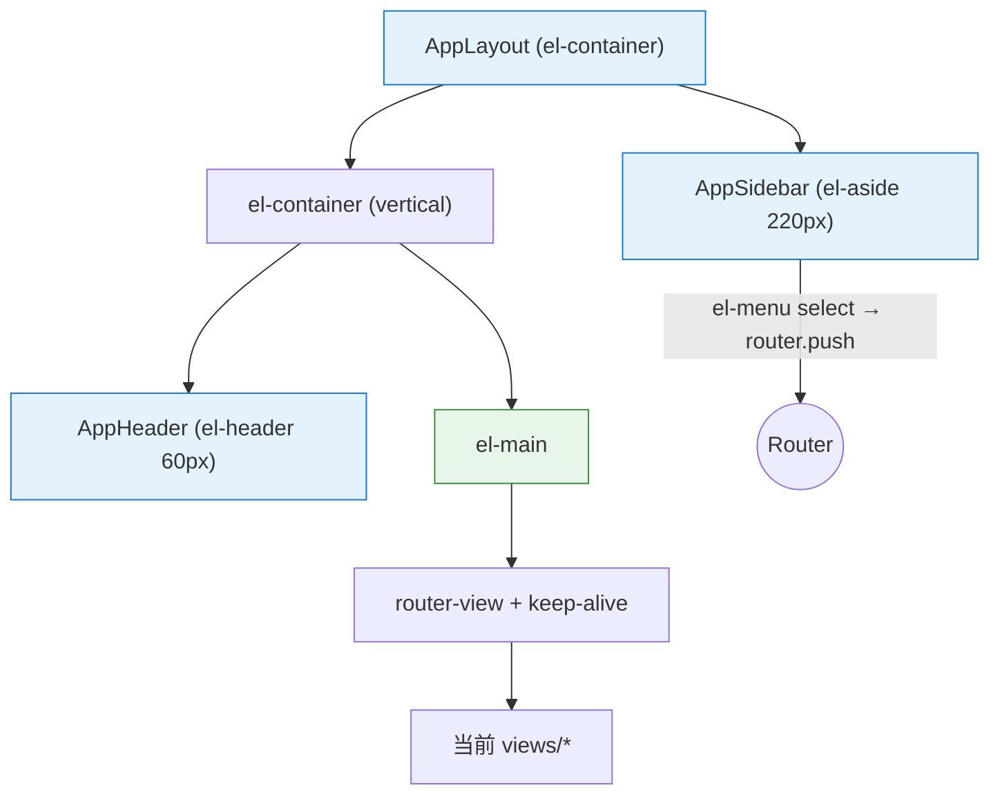
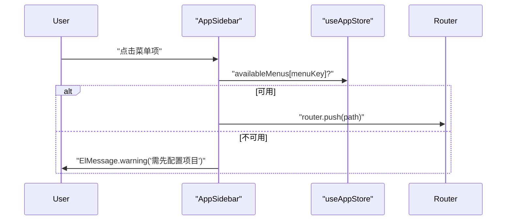

# 布局与通用组件

| 属性 | 值 |
|------|-----|
| **所属层** | 表现层 |
| **目录** | `src/components/` |
| **文件数** | 8 个 .vue 组件 |
| **依赖模块数** | `stores/app`、`api/*`、Element Plus |

---

## 1. 模块概述

### 1.1 职责定义

**核心职责**:提供整站统一的三段式布局(Sidebar/Header/Main)、跨页面复用的通用 UI(API 列表、Git 操作、项目目录配置弹窗、对话/诊断面板)。

### 1.2 文件清单

| 文件 | 类型 | 职责 |
|------|------|------|
| `layout/AppLayout.vue` | 布局根 | el-container 三段式 + `<router-view>`(含 keep-alive) |
| `layout/AppHeader.vue` | 顶部条 | 项目名/项目目录/选中项目数 + 设置入口 |
| `layout/AppSidebar.vue` | 侧边导航 | 菜单(含子菜单)、disabled 状态依据 `availableMenus` |
| `ProjectDirConfig.vue` | 弹窗 | 配置/更新 PROJECT_DIR,调用 `configApi.updateProjectDir` |
| `ApiList.vue` | 通用列表 | 显示扫描到的方法/Controller 接口 |
| `GitOperations.vue` | Git 面板 | git-status/checkout/pull/log,调用 `api/git.ts` |
| `dialog/*` | 对话面板 | 复用 `useDialogWebSocket` composable 的对话 UI |
| `diagnosis/*` | 诊断面板 | 复用 `useDiagnosis` composable 的诊断流 UI |

---

## 2. 布局结构

---

## 3. 关键交互

### 3.1 侧边栏菜单可用性

### 3.2 ProjectDirConfig 弹窗

| 步骤 | 操作 |
|------|------|
| 1 | 用户在项目管理页点击"配置目录" |
| 2 | 弹窗 v-model 双绑 input |
| 3 | 提交 → `useAppStore.updateProjectDir(path)` → `configApi.updateProjectDir` |
| 4 | 成功后 `ElMessage.success` + 关闭弹窗 + 刷新项目列表 |

---

## 4. 设计约定

| 约定 | 说明 |
|------|------|
| 不直接 import axios | 必须通过 `api/*` 模块 |
| 全部用 `<script setup lang="ts">` | Composition API |
| `<style scoped>` | 防止全局污染 |
| 错误提示统一 `ElMessage` | 不要 `alert/console.error` |

---

## 5. 依赖关系

| 上游 | 用途 |
|------|------|
| `stores/app.ts` | projectDir/selectedProjects/availableMenus |
| `api/config.ts`、`api/project.ts`、`api/git.ts` | 数据请求 |
| `composables/useDialogWebSocket`、`useDiagnosis` | dialog/diagnosis 子组件复用 WS 逻辑 |
| Element Plus | 全部 UI 组件 |

| 下游 | 使用场景 |
|------|---------|
| `App.vue` | 渲染 AppLayout |
| 各 `views/*` | ApiList、GitOperations、ProjectDirConfig、dialog/diagnosis 复用 |
