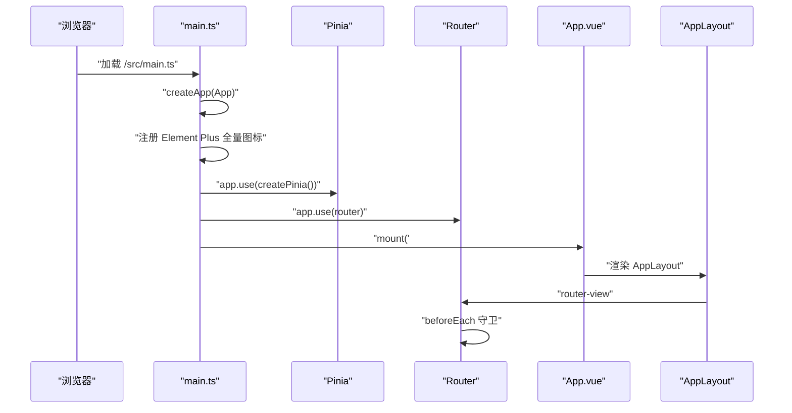
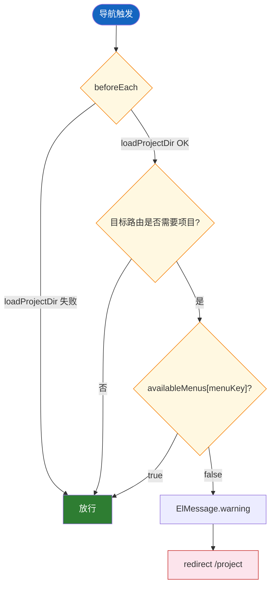

# 应用入口与路由

| 属性 | 值 |
|------|-----|
| **所属层** | 表现层 / 应用层 |
| **目录** | `src/main.ts`、`src/App.vue`、`src/router/` |
| **文件数** | 3 个核心文件 |
| **对外接口数** | 1 个 router 实例 + 12 条路由 |
| **依赖模块数** | Vue / Vue Router / Pinia / Element Plus / `stores/app` |

---

## 1. 模块概述

### 1.1 职责定义

**核心职责**:启动 Vue 应用、注册全局插件(Pinia/Router/Element Plus 全量图标)、定义所有页面路由及其守卫策略,确保进入业务页面前 `PROJECT_DIR` 已就绪、目标项目已勾选。

**职责边界**:

| 本模块负责 | 本模块不负责 | 由谁负责 |
|-----------|-------------|---------|
| 应用启动、全局插件注册 | 业务渲染 | `views/*` |
| 路由表 + lazy-load + redirect | 全局状态管理 | `stores/app.ts` |
| 守卫:加载 PROJECT_DIR、菜单可用性校验 | 实际权限判断逻辑 | `useAppStore.availableMenus` |

### 1.2 核心文件清单

| 文件 | 类型 | 职责 |
|------|------|------|
| `src/main.ts` | 启动入口 | createApp、注册 Element Plus 全量图标、use(ElementPlus/router/pinia)、mount('#app') |
| `src/App.vue` | 根组件 | 仅渲染 `<AppLayout />` |
| `src/router/index.ts` | 路由定义 | 12 条路由全部 lazy-load;`/call-chain*` 全部 redirect 到 `/knowledge-graph?tab=methodRef`;`beforeEach` 守卫 |

---

## 2. 模块架构

### 2.1 启动序列图



### 2.2 路由表与守卫流



---

## 3. 路由清单

| path | name | 组件 | menuKey | 守卫 |
|------|------|------|---------|------|
| `/` | home | redirect → `/project` | — | — |
| `/project` | project-management | `views/project/ProjectList.vue` | project-management | 始终可用 |
| `/knowledge-graph` | knowledge-graph | `views/knowledge-graph/KnowledgeGraphView.vue` | knowledge-graph | 需项目目录+选中项目 |
| `/search` | search | `views/search/SemanticSearchView.vue` | search | 同上(历史残留页) |
| `/call-chain*` | — | redirect → `/knowledge-graph?tab=methodRef` | — | — |
| `/log-analysis` | log-analysis | `views/log-analysis/LogQuery.vue` | log-analysis | 需项目目录+选中项目 |
| `/mcp` | mcp | `views/mcp/McpView.vue` | mcp | 始终可用 |
| `/skill-market` | skill-market | `views/skill-market/SkillMarketView.vue` | skill-market | 始终可用 |
| `/claude-terminal` | claude-terminal | `views/claude-terminal/ClaudeTerminal.vue` | claude-terminal | 始终可用 |
| `/claude-session` | claude-session | `views/claude-session/SessionList.vue` | — | — |
| `/prompt-config` | prompt-config | `views/prompt-config/PromptConfig.vue` | prompt-config | 始终可用 |
| `/settings` | settings | `views/settings/Settings.vue` | settings | 始终可用 |

---

## 4. 守卫实现要点

```ts
// router/index.ts beforeEach 简化版
router.beforeEach(async (to) => {
  const appStore = useAppStore()
  try { await appStore.loadProjectDir() } catch { /* 后端未启动则放行 */ }

  const requireProject = ['knowledge-graph', 'search', 'log-analysis']
  const menuKey = to.meta?.menuKey as string | undefined
  if (menuKey && requireProject.includes(menuKey)) {
    if (!appStore.availableMenus[menuKey]) {
      ElMessage.warning('请先在项目管理中配置项目目录并选择项目')
      return { name: 'project-management' }
    }
  }
})
```

---

## 5. 依赖关系

### 5.1 上游(本模块依赖)

| 模块 | 用途 |
|------|------|
| `vue` | createApp |
| `vue-router` | createRouter / createWebHistory |
| `pinia` | createPinia |
| `element-plus` | use(ElementPlus) + 全量图标注册 |
| `stores/app.ts` | useAppStore.loadProjectDir / availableMenus |

### 5.2 下游(谁依赖本模块)

| 消费者 | 接口 |
|--------|------|
| 12 个 `views/*` | 通过路由懒加载挂载 |
| `AppLayout` | `<router-view>` 渲染当前路由 |
| `AppSidebar` | 通过 `router.push` 跳转 |

---

## 6. 已知问题与扩展点

| 问题 | 影响 | 优先级 |
|------|------|--------|
| `views/search/SemanticSearchView.vue` 历史残留(后端无 `/search/semantic`) | 进入即报错 | 中 |
| 公共知识图谱(`/public/scan`) 前端按钮缺失 | 功能未上线 | 低 |

| 扩展点 | 扩展方式 |
|--------|---------|
| 新增页面 | 在 `routes` 数组追加 `{ path, component: () => import(...) }`,如需鉴权加 `meta.menuKey` |
| 新增菜单可用性规则 | 修改 `useAppStore.availableMenus` computed |
