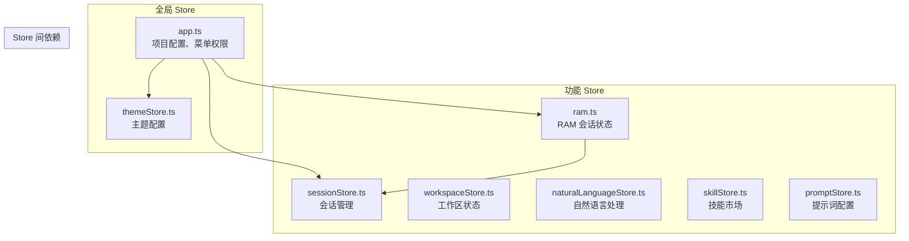
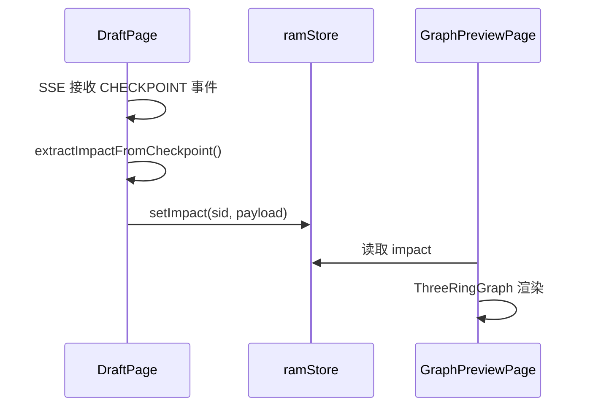

# 状态管理

## 概述

HiSi DevTool Frontend 使用 Pinia 进行集中式状态管理。Pinia 是 Vue 3 官方推荐的状态管理库，提供了类型安全、模块化、开发工具支持等特性。项目中的状态管理遵循单一数据源、不可变更新、模块化组织的原则。

---

## Pinia Store 架构



---

## 全局 Store

### app.ts

**路径**：`src/stores/app.ts`

**职责**：应用全局配置和状态管理。

**状态**：
```typescript
interface AppState {
  // 项目配置
  projectDir: string
  projectDirConfigured: boolean
  
  // 多项目选择
  selectedProjects: SelectedProjectInfo[]
  projectSelected: boolean
  selectedProject: string
  selectedProjectNames: string[]
  
  // 配置加载状态
  configLoading: boolean
  configError: string
  
  // 菜单可用性
  availableMenus: Record<string, boolean>
}
```

**Actions**：
| Action | 参数 | 说明 |
|--------|------|------|
| `loadProjectDir()` | 无 | 加载项目目录配置 |
| `updateProjectDir(newPath)` | `string` | 更新项目目录 |
| `selectProjects(projects)` | `SelectedProjectInfo[]` | 设置多个选中项目 |
| `selectProject(name, path?)` | `string, string?` | 选择单个项目（向后兼容） |
| `clearSelectedProject()` | 无 | 清除选中项目 |
| `getSelectedProjectPaths()` | 无 | 获取选中项目路径列表 |

**菜单可用性逻辑**：
```typescript
const availableMenus = computed(() => ({
  'project-management': true,
  'skill-market': true,
  'claude-terminal': true,
  'search': projectDirConfigured.value && projectSelected.value,
  'knowledge-graph': projectDirConfigured.value && projectSelected.value,
  'log-analysis': projectDirConfigured.value && projectSelected.value,
  'prompt-config': true,
  'settings': true,
  'apm-debug': true,
}))
```

---

### themeStore.ts

**路径**：`src/stores/themeStore.ts`

**职责**：主题配置管理。

**状态**：
```typescript
interface ThemeState {
  preset: ThemePreset
  darkMode: boolean
  primaryColor: string
}
```

**功能**：
- 主题预设切换
- 深色模式切换
- 主色调自定义
- 主题持久化（localStorage）

---

## 功能 Store

### ram.ts

**路径**：`src/stores/ram.ts`

**职责**：RAM（Requirement Analysis Master）会话状态管理。

**设计原则**：
- 保持轻量：只存储 `DraftPage` 和 `GraphPreviewPage` 之间共享的状态
- 长期会话状态由 SSE composable `useRamSession` 管理

**状态**：
```typescript
interface RamState {
  // Impact 数据（跨页面共享）
  impact: ImpactPayload | null
  lastSessionId: string | null
  
  // 文件高亮状态
  selectedFile: string | null
  hoveredFile: string | null
  highlightPath: Set<string>
}
```

**ImpactPayload 类型**：
```typescript
interface ImpactPayload {
  readonly involved: readonly string[]
  readonly modified: readonly string[]
  readonly impacted: readonly string[]
  readonly riskScores?: Readonly<Record<string, number>>
}
```

**Actions**：
| Action | 参数 | 说明 |
|--------|------|------|
| `setImpact(sessionId, payload)` | `string, ImpactPayload` | 设置 impact 数据 |
| `clear()` | 无 | 清除所有状态 |
| `selectFile(file)` | `string \| null` | 选中文件 |
| `hoverFile(file)` | `string \| null` | 悬停文件 |
| `setHighlightPath(files)` | `readonly string[]` | 设置高亮路径 |
| `clearHighlight()` | 无 | 清除高亮 |

**数据流**：


---

### sessionStore.ts

**路径**：`src/stores/sessionStore.ts`

**职责**：Claude 会话管理。

**状态**：
```typescript
interface SessionState {
  sessions: ClaudeSession[]
  currentSessionId: string | null
  loading: boolean
}
```

**功能**：
- 会话列表管理
- 当前会话切换
- 会话创建/删除

---

### workspaceStore.ts

**路径**：`src/stores/workspaceStore.ts`

**职责**：工作区配置管理。

**状态**：
```typescript
interface WorkspaceState {
  workspacePath: string
  recentWorkspaces: string[]
  workspaceConfig: WorkspaceConfig | null
}
```

**功能**：
- 工作区路径管理
- 最近工作区列表
- 工作区配置加载/保存

---

### naturalLanguageStore.ts

**路径**：`src/stores/naturalLanguageStore.ts`

**职责**：自然语言处理状态管理。

**状态**：
```typescript
interface NaturalLanguageState {
  query: string
  results: SearchResult[]
  loading: boolean
  error: string | null
}
```

**功能**：
- 自然语言查询
- 搜索结果管理
- 错误处理

---

### skillStore.ts

**路径**：`src/stores/skillStore.ts`

**职责**：技能市场状态管理。

**状态**：
```typescript
interface SkillState {
  skills: Skill[]
  installedSkills: string[]
  loading: boolean
}
```

**功能**：
- 技能列表获取
- 已安装技能管理
- 技能安装/卸载

---

### promptStore.ts

**路径**：`src/stores/promptStore.ts`

**职责**：提示词配置管理。

**状态**：
```typescript
interface PromptState {
  prompts: Prompt[]
  currentPrompt: Prompt | null
  loading: boolean
}
```

**功能**：
- 提示词列表管理
- 提示词编辑
- 提示词应用

---

## Store 设计模式

### 1. Setup Store 语法

项目使用 Pinia 的 Setup Store 语法，更接近 Vue 3 Composition API：

```typescript
export const useRamStore = defineStore('ram', () => {
  // State
  const impact = ref<ImpactPayload | null>(null)
  const lastSessionId = ref<string | null>(null)

  // Actions
  function setImpact(sessionId: string, payload: ImpactPayload): void {
    lastSessionId.value = sessionId
    impact.value = payload
  }

  function clear(): void {
    impact.value = null
    lastSessionId.value = null
  }

  // Return
  return {
    impact,
    lastSessionId,
    setImpact,
    clear
  }
})
```

### 2. 不可变更新

遵循不可变数据原则，避免直接修改状态：

```typescript
// ❌ 错误：直接修改数组
function addItem(item: Item) {
  state.items.push(item)  // 可变操作
}

// ✅ 正确：创建新数组
function addItem(item: Item) {
  state.items = [...state.items, item]  // 不可变操作
}
```

### 3. 计算属性派生

使用 `computed` 派生状态，避免冗余数据：

```typescript
const selectedProject = computed(() => 
  selectedProjects.value[0]?.name || ''
)

const selectedProjectNames = computed(() => 
  selectedProjects.value.map(p => p.name)
)
```

---

## Store 间通信

### 1. 直接调用

Store 之间可以直接调用：

```typescript
export const useRamStore = defineStore('ram', () => {
  const appStore = useAppStore()
  
  function getProjectPath(): string {
    return appStore.selectedProjects[0]?.path || ''
  }
})
```

### 2. 事件总线（不推荐）

项目不使用事件总线，优先使用 Store 直接调用或 Props/Events。

---

## 状态持久化

### 需要持久化的状态

| Store | 字段 | 存储方式 |
|-------|------|---------|
| `themeStore` | `preset`, `darkMode`, `primaryColor` | localStorage |
| `workspaceStore` | `recentWorkspaces` | localStorage |

### 持久化实现

```typescript
export const useThemeStore = defineStore('theme', () => {
  const preset = ref<ThemePreset>(
    (localStorage.getItem('theme-preset') as ThemePreset) || 'default'
  )

  watch(preset, (newValue) => {
    localStorage.setItem('theme-preset', newValue)
  })

  return { preset }
})
```

---

## 状态调试

### Vue DevTools

Pinia 集成了 Vue DevTools，可以：
- 查看所有 Store 状态
- 时间旅行调试
- 状态导出/导入

### 日志记录

在开发环境中，可以添加状态变更日志：

```typescript
export const useAppStore = defineStore('app', () => {
  // ... 状态和 actions ...

  // 开发环境日志
  if (import.meta.env.DEV) {
    watch(selectedProjects, (newVal) => {
      console.log('[appStore] selectedProjects changed:', newVal)
    }, { deep: true })
  }
})
```

---

## 最佳实践

### 1. Store 命名

- 使用 `use` 前缀：`useAppStore`、`useRamStore`
- Store ID 使用 kebab-case：`'app'`、`'ram'`

### 2. 状态组织

- 按功能模块划分 Store
- 避免单个 Store 过大（超过 200 行考虑拆分）
- 共享状态放在全局 Store

### 3. 类型安全

- 使用 TypeScript 接口定义状态
- 导出类型供组件使用

```typescript
// 导出类型
export interface ImpactPayload {
  readonly involved: readonly string[]
  readonly modified: readonly string[]
  readonly impacted: readonly string[]
}

// 组件中使用
import { useRamStore, type ImpactPayload } from '@/stores/ram'
```

### 4. 测试

Store 应该有对应的单元测试：

```typescript
// stores/__tests__/ram.spec.ts
describe('useRamStore', () => {
  beforeEach(() => {
    setActivePinia(createPinia())
  })

  it('should set impact correctly', () => {
    const store = useRamStore()
    const payload: ImpactPayload = {
      involved: ['a'],
      modified: ['b'],
      impacted: ['c']
    }
    store.setImpact('session-1', payload)
    expect(store.impact).toEqual(payload)
    expect(store.lastSessionId).toBe('session-1')
  })
})
```

---

## 下一步

- [组件层](./组件层.md) - 了解组件如何使用 Store
- [API服务层](./API服务层.md) - 了解 API 与 Store 的交互
- [RAM需求评估UI](./RAM需求评估UI.md) - 深入 RAM 状态管理
