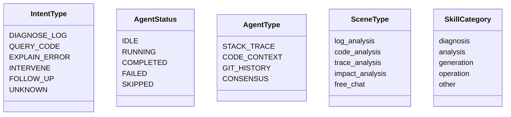

# 类型与数据契约

| 属性 | 值 |
|------|-----|
| **所属层** | 服务层 |
| **目录** | `src/types/` |
| **文件数** | 11 个 .ts |
| **设计目标** | 与后端 DTO 严格对齐,build 时由 vue-tsc 强制通过 |

---

## 1. 文件清单

| 文件 | 主要类型 | 用途 |
|------|---------|------|
| `api.ts` | `ApiResponse<T>`、`ValidationError`、`parseValidationErrors` | 全局响应包装与校验错误解析 |
| `session.ts` | `Session`、`Message`、`SceneType`、`SCENE_NAMES`、`PromptTemplate`、`UniversalChatRequest`、`StreamCallbacks` | Claude 通用会话 |
| `terminal.ts` | `TerminalConnectionStatus`、`ClaudeWorkspaceSession`、`TerminalClientMessage`、`TerminalServerMessage` | `/ws/terminal` 协议 |
| `intent.ts` | `IntentType`、`INTENT_NAMES`、`INTENT_COLORS`、`IntentResult`、`DialogMessage`、`DialogSession`、`DialogContext`、`NaturalLanguageRequest`、`NaturalLanguageCallbacks` | 自然语言对话(REST + SSE) |
| `dialog.ts` | `DialogEventType`、`DialogPhase`、`AgentDiagnosticStatus`、`InterventionRequest/Response`、`StreamChunk`、`DialogClientMessage/ServerMessage`、`DialogFinalResult` | `/ws/dialog` 协议 |
| `agent.ts` | `AgentStatus`、`AgentType`、`AgentEventType`、`AgentEvent`、`AgentResult`、`FinalDiagnosticResult` | 多 Agent 诊断事件 |
| `log.ts` | `LogEntry`、`LogQueryDto`、`LogAnalyzeRequest`、`AnalyzeTaskResponse`、`Report`、`DetailedAnalysisReport` | 日志查询/分析 |
| `skill.ts` | `SkillCategory`、`SkillCategoryInfo`、`SkillDefinition`、`ProjectSkillStatus` | Skill 市场 |
| `callchain.ts` | `CallChainNode`、`CallChainRawData`、`GitRepositoryInfo`、`CallChainTask` | 调用链/Git |
| `search.ts` | `SemanticSearchRequest`、`SearchFilters`、`SemanticSearchResult`、`CodeNode` | 历史残留语义检索 |
| `index.ts` | 显式 re-export | 解决 IntentResult 在 intent.ts/dialog.ts 的命名冲突 |

---

## 2. 核心契约

### 2.1 ApiResponse 包装

```ts
interface ApiResponse<T> {
  code: number      // 200 表示成功
  message: string
  data: T
}
```

**前端拦截器约定**:`code === 200` 解包为 `data` 直接返回;`code !== 200` reject `BusinessError`。

### 2.2 验证错误解析

```ts
// 后端 400 的 message 形如:"参数校验失败: field1: 不能为空; field2: 长度必须 >= 3"
parseValidationErrors(message: string): ValidationError[]
// → [{ field: 'field1', message: '不能为空' }, ...]
```

### 2.3 枚举与显示名



### 2.4 流式事件类型

| 事件源 | 事件类型(TS 字面量) |
|--------|---------------------|
| `/ws/terminal` | `output` / `session_info` / `ready` / `claude_ready` / `pong` / `error` |
| `/ws/dialog` | `CONNECTED` / `INTENT_RECOGNIZED` / `STREAM_START` / `STREAM_DELTA` / `STREAM_DONE` / `FINAL_RESULT` / `ERROR` 等(`DialogEventType`) |
| `/ws/diagnosis` | `REQUEST_RECEIVED` / `AGENT_START` / `AGENT_DELTA` / `AGENT_END` / `FINAL_RESULT`(`AgentEventType`) |
| `/api/mcp/install` SSE | `step` / `info` / `success` / `warning` / `error` / `log` / `done` |
| `/api/dialog/.../stream` SSE | `intent` / `output` / `progress` / `done` / `error` |

---

## 3. 类型与后端对齐策略

| 后端变更 | 前端响应 |
|---------|---------|
| 新增 DTO 字段 | 在对应 `types/*.ts` 添加可选字段(`field?: T`) |
| 字段重命名 | 同步前端类型 + 调用方 |
| 新增枚举 | 扩展 union 字面量 + `*_NAMES`/`*_COLORS` 表 |
| 删除字段 | 标 `@deprecated` 并清理调用 |

---

## 4. 已知冲突与扩展

| 项 | 说明 |
|----|------|
| `IntentResult` 同名冲突 | `types/index.ts` 显式 re-export 解决,`intent.ts` 优先 |
| `search.ts` | 全部接口为后端不存在的残留,build 不报错但运行 404 |
| `vector-search` 缺 `scope`/`language` | 公共图谱上线后需扩展 `VectorSearchRequest` |
