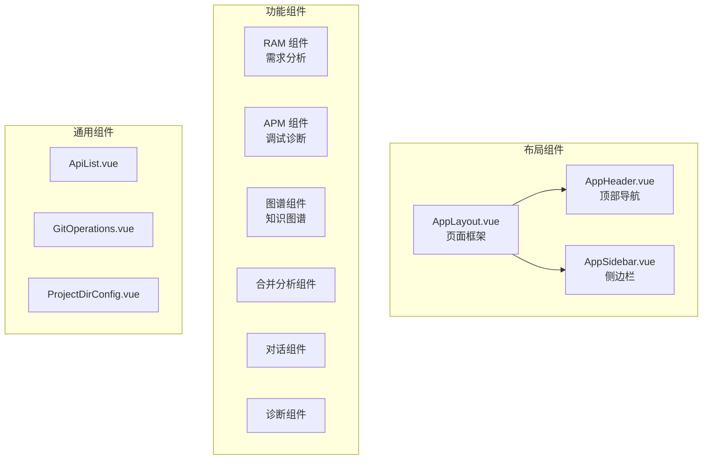
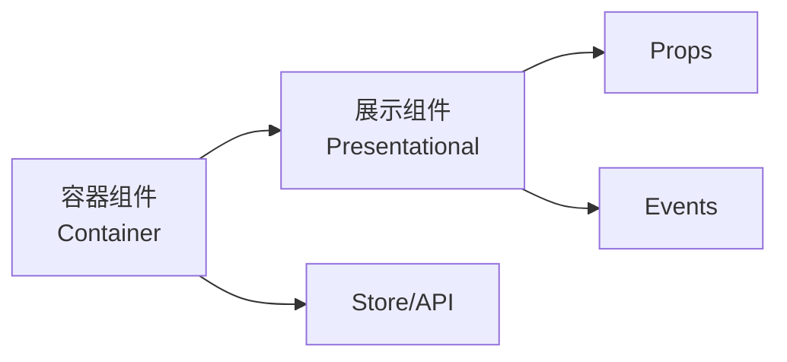

# 组件层

## 概述

组件层是 HiSi DevTool Frontend 的表现层核心，负责用户界面渲染和用户交互。组件按照职责分为布局组件、功能组件和通用组件三类，遵循单一职责、Props 传入/Events 传出的设计原则。

---

## 组件分类



---

## 布局组件

### AppLayout.vue

**路径**：`src/components/layout/AppLayout.vue`

**职责**：页面整体布局框架，包含顶部导航和侧边栏。

**结构**：
```
┌─────────────────────────────────────┐
│           AppHeader                 │
├──────────┬──────────────────────────┤
│          │                          │
│ AppSide  │       Content            │
│   bar    │       (router-view)      │
│          │                          │
└──────────┴──────────────────────────┘
```

**Props**：无

**插槽**：
- `default`：页面内容区域

---

### AppHeader.vue

**路径**：`src/components/layout/AppHeader.vue`

**职责**：顶部导航栏，显示应用标题、项目选择器、主题切换等。

**功能**：
- 应用标题显示
- 项目选择器（多项目支持）
- 主题切换按钮
- 用户信息显示

---

### AppSidebar.vue

**路径**：`src/components/layout/AppSidebar.vue`

**职责**：侧边导航栏，提供页面导航菜单。

**菜单项**：
| 菜单 | 路由 | 权限要求 |
|------|------|---------|
| 项目管理 | `/project` | 无 |
| 知识图谱分析 | `/knowledge-graph` | 需要项目选择 |
| 需求分析大师 | `/ram` | 无 |
| APM 调试 | `/apm-debug` | 无 |
| 合入分析 | `/merge-analysis` | 无 |
| 增强检索 | `/search` | 需要项目选择 |
| 日志分析 | `/log-analysis` | 需要项目选择 |
| Claude 终端 | `/claude-terminal` | 无 |
| 技能市场 | `/skill-market` | 无 |
| 系统设置 | `/settings` | 无 |

---

## RAM 组件

### DagGraph.vue

**路径**：`src/components/ram/DagGraph.vue`

**职责**：DAG 流程图可视化，展示 RAM 分析的 5 个节点状态。

**技术实现**：
- 使用 dagre 进行自动布局
- 使用 Vue Flow 渲染交互式流程图
- 支持节点状态高亮（pending/running/done/error）

**节点类型**：
| 节点 | 含义 | 状态 |
|------|------|------|
| Clarify | 需求澄清 | pending → running → done |
| Impact | 影响分析 | pending → running → done |
| Implement | 实现方案 | pending → running → done |
| Verify | 验证检查 | pending → running → done |
| Tech Plan | 技术方案 | pending → running → done |

**Props**：
```typescript
interface DagGraphProps {
  nodes: DagNode[]
  activeKey: DagNodeKey
}
```

**Events**：
- `node-click(key: DagNodeKey)`：节点点击事件

---

### ThreeRingGraph.vue

**路径**：`src/components/ram/ThreeRingGraph.vue`

**职责**：三环影响图可视化，展示 involved/modified/impacted 三层关系。

**技术实现**：
- 使用 Cytoscape.js 渲染图数据
- 支持节点拖拽、缩放、平移
- 支持节点高亮和详情查看

**三环结构**：
| 环 | 含义 | 数据来源 |
|---|------|---------|
| 内环 | involved（涉及的入口） | `impact.involved` |
| 中环 | modified（修改的方法） | `impact.modified` |
| 外环 | impacted（影响的范围） | `impact.impacted` |

**Props**：
```typescript
interface ThreeRingGraphProps {
  impact: ImpactPayload
  selectedFile?: string
  hoveredFile?: string
}
```

**Events**：
- `node-select(nodeId: string)`：节点选中事件
- `node-hover(nodeId: string)`：节点悬停事件

---

### FileBrowserPanel.vue

**路径**：`src/components/ram/FileBrowserPanel.vue`

**职责**：文件浏览器面板，展示受影响的文件列表。

**功能**：
- 文件树形结构展示
- 文件高亮（根据 impact 数据）
- 文件选择和悬停联动

**Props**：
```typescript
interface FileBrowserPanelProps {
  files: string[]
  highlightPath: Set<string>
  selectedFile?: string
}
```

**Events**：
- `file-select(path: string)`：文件选中事件
- `file-hover(path: string)`：文件悬停事件

---

### ImpactOutputView.vue

**路径**：`src/components/ram/ImpactOutputView.vue`

**职责**：影响分析输出视图，结构化展示 impact 数据。

**展示内容**：
- Involved Ring：入口点列表
- Impact Ring：影响范围（upstream/downstream/crossService）
- Risk Score：风险评分
- Validation：验证结果

**Props**：
```typescript
interface ImpactOutputViewProps {
  output: Record<string, unknown>
}
```

---

### TechPlanOutputView.vue

**路径**：`src/components/ram/TechPlanOutputView.vue`

**职责**：技术方案输出视图，支持 Mermaid 图表渲染。

**功能**：
- Markdown 内容渲染
- Mermaid 图表渲染
- 代码高亮

**Props**：
```typescript
interface TechPlanOutputViewProps {
  output: Record<string, unknown>
}
```

---

### ClarifyModal.vue

**路径**：`src/components/ram/ClarifyModal.vue`

**职责**：澄清问题弹窗，收集用户对需求的补充信息。

**功能**：
- 问题列表展示
- 答案输入表单
- 提交和取消操作

**Props**：
```typescript
interface ClarifyModalProps {
  schema: ClarifySchema | null
  visible: boolean
}
```

**Events**：
- `submit(answers: Record<string, unknown>)`：提交答案
- `cancel()`：取消操作
- `update:visible(visible: boolean)`：更新可见性

---

### ConfirmModal.vue

**路径**：`src/components/ram/ConfirmModal.vue`

**职责**：节点确认弹窗，等待用户审批节点输出。

**功能**：
- 节点输出展示
- 审批操作（approve/reject/edit）
- 反馈输入

**Props**：
```typescript
interface ConfirmModalProps {
  schema: HitlSchema | null
  visible: boolean
}
```

**Events**：
- `confirm(action: 'approve' | 'reject' | 'edit', feedback?: string, editedOutput?: Record<string, unknown>)`：确认操作
- `cancel()`：取消操作
- `update:visible(visible: boolean)`：更新可见性

---

### CostMeter.vue

**路径**：`src/components/ram/CostMeter.vue`

**职责**：成本计量器，显示 token 消耗和费用。

**Props**：
```typescript
interface CostMeterProps {
  tokens: number
  usd: number
}
```

---

### Minimap.vue

**路径**：`src/components/ram/Minimap.vue`

**职责**：小地图组件，提供图表的缩略视图。

**功能**：
- 图表缩略展示
- 视口指示器
- 点击跳转

---

## APM 组件

### BodySchemaForm.vue

**路径**：`src/views/apm-debug/components/BodySchemaForm.vue`

**职责**：DTO schema body skeleton 表单，根据后端 schema 自动生成请求体。

**功能**：
- Schema 解析和渲染
- 嵌套对象/数组支持
- 表单验证

**子组件**：
- `SchemaObjectNode.vue`：对象节点
- `SchemaArrayNode.vue`：数组节点
- `SchemaPrimitiveInput.vue`：基础类型输入

---

### EntryList.vue

**路径**：`src/views/apm-debug/components/EntryList.vue`

**职责**：入口点列表，展示可用的 API 入口。

**功能**：
- 入口点搜索和过滤
- 入口点详情展示
- 快速启动调试

---

### RequestEditor.vue

**路径**：`src/views/apm-debug/components/RequestEditor.vue`

**职责**：请求编辑器，编辑 HTTP 请求参数。

**功能**：
- URL 编辑
- Headers 编辑
- Body 编辑（Schema 驱动）

---

### CallChainPreview.vue

**路径**：`src/views/apm-debug/components/CallChainPreview.vue`

**职责**：调用链预览，展示 API 调用链路。

**技术实现**：
- 使用 dagre 布局
- 支持节点展开/折叠

---

## 图谱组件

### GraphExplorerTab.vue

**路径**：`src/views/knowledge-graph/components/GraphExplorerTab.vue`

**职责**：图谱浏览器标签页，提供方法搜索和调用链导航。

**功能**：
- 方法搜索（按类名、方法名）
- 调用链可视化（上下游）
- 入口类型浏览（Controller/Schedule/MQ）

---

### SemanticSearchPanel.vue

**路径**：`src/views/knowledge-graph/components/SemanticSearchPanel.vue`

**职责**：语义搜索面板，提供自然语言搜索功能。

**功能**：
- 搜索输入
- 结果列表展示
- 代码预览

---

### EntryPointList.vue

**路径**：`src/views/knowledge-graph/components/EntryPointList.vue`

**职责**：入口点列表，按类型展示 API 入口。

**分类**：
- Controller
- Scheduled
- MQ Listener
- Feign Client

---

### CrossServiceBridgeTab.vue

**路径**：`src/views/knowledge-graph/components/CrossServiceBridgeTab.vue`

**职责**：跨服务桥接标签页，展示 Feign/MQ 等跨服务调用。

**功能**：
- Feign 调用链
- MQ 消息链
- 桥接点统计

---

## 合并分析组件

### InputPage.vue

**路径**：`src/views/merge-analysis/InputPage.vue`

**职责**：合并分析输入页面，收集分支信息。

**功能**：
- 项目选择
- 源分支/目标分支输入
- 分析启动

---

### DiffPreviewPage.vue

**路径**：`src/views/merge-analysis/DiffPreviewPage.vue`

**职责**：Diff 预览页面，展示代码差异。

**功能**：
- 文件差异列表
- 代码差异高亮
- 文件选择

---

### AnalysisPage.vue

**路径**：`src/views/merge-analysis/AnalysisPage.vue`

**职责**：分析结果页面，展示合并影响分析。

**功能**：
- SSE 实时进度
- 影响范围展示
- 风险评估

---

## 对话组件

### DialogProgressPanel.vue

**路径**：`src/components/dialog/DialogProgressPanel.vue`

**职责**：对话进度面板，展示 Agent 对话进度。

**功能**：
- 对话步骤展示
- 进度指示器
- 中间结果展示

---

### InterventionPanel.vue

**路径**：`src/components/dialog/InterventionPanel.vue`

**职责**：干预面板，允许用户干预 Agent 执行。

**功能**：
- 干预操作按钮
- 反馈输入
- 执行状态展示

---

## 诊断组件

### AgentDiagnosisPanel.vue

**路径**：`src/components/diagnosis/AgentDiagnosisPanel.vue`

**职责**：Agent 诊断面板，展示诊断过程和结果。

**功能**：
- 诊断步骤展示
- 诊断结果展示
- 修复建议

---

## 通用组件

### ApiList.vue

**路径**：`src/components/ApiList.vue`

**职责**：API 列表组件，展示可用的 API 端点。

**功能**：
- API 搜索和过滤
- API 详情展示
- 快速测试

---

### GitOperations.vue

**路径**：`src/components/GitOperations.vue`

**职责**：Git 操作组件，提供 Git 命令执行界面。

**功能**：
- Git 状态查看
- 分支管理
- 提交历史

---

### ProjectDirConfig.vue

**路径**：`src/components/ProjectDirConfig.vue`

**职责**：项目目录配置组件，管理项目根目录。

**功能**：
- 目录选择
- 路径验证
- 配置保存

---

## 组件设计模式

### 1. 容器组件与展示组件



- **容器组件**：负责数据获取、状态管理、业务逻辑
- **展示组件**：负责 UI 渲染、用户交互

### 2. 组合式函数复用

```typescript
// useRamSession.ts
export function useRamSession() {
  const events = ref<RamEvent[]>([])
  const status = ref<RamStatus>('idle')
  const cost = ref({ tokens: 0, usd: 0 })

  function rejoin(sessionId: string, afterSeq?: number) {
    // SSE 连接逻辑
  }

  function disconnect() {
    // 断开连接
  }

  return {
    events,
    status,
    cost,
    rejoin,
    disconnect
  }
}
```

### 3. Props 验证

```typescript
// 使用 TypeScript 接口定义 Props
interface Props {
  title: string
  count?: number
  items: readonly Item[]
}

const props = defineProps<Props>()
```

---

## 下一步

- [状态管理](./状态管理.md) - 了解 Pinia 状态管理
- [API服务层](./API服务层.md) - 了解 API 通信机制
- [RAM需求评估UI](./RAM需求评估UI.md) - 深入 RAM 组件
