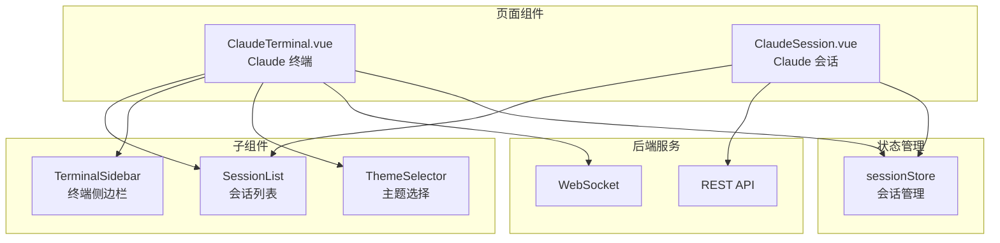
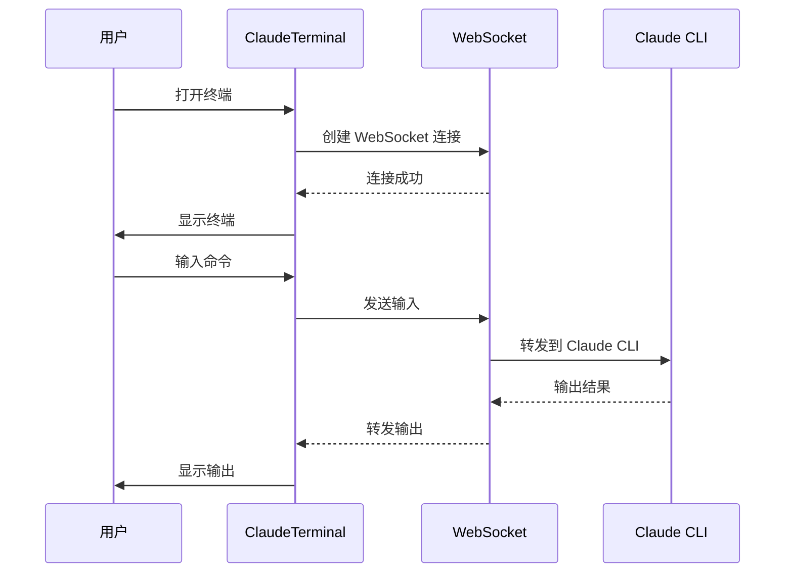
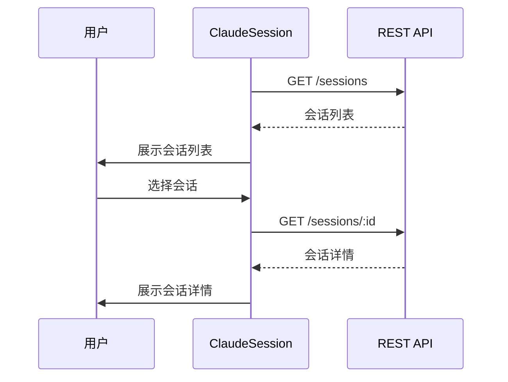

# 终端与对话 UI

## 概述

终端与对话 UI 是 HiSi DevTool 的 Claude 终端和会话管理模块。该模块提供 Web 终端模拟、Claude CLI 交互、会话管理等功能，帮助开发者与 Claude 进行交互式对话。

---

## 功能架构



---

## 页面流程

### 1. Claude 终端

**路径**：`/claude-terminal`

**职责**：Web 终端模拟，与 Claude CLI 交互。

**功能**：
- 终端模拟（xterm.js）
- WebSocket 连接
- 会话管理
- 主题切换

**数据流**：


---

### 2. Claude 会话

**路径**：`/claude-session`

**职责**：Claude 会话管理。

**功能**：
- 会话列表
- 会话创建
- 会话删除
- 会话恢复

**数据流**：


---

## 核心组件

### ClaudeTerminal.vue

**路径**：`src/views/claude-terminal/ClaudeTerminal.vue`

**职责**：Claude 终端主页面。

**功能**：
- 终端模拟（xterm.js）
- WebSocket 连接管理
- 会话列表展示
- 主题切换

**布局**：
```
┌─────────────────────────────────────────────────────┐
│  会话列表  │                                         │
│           │                                         │
│  Session1 │         终端区域                         │
│  Session2 │         ┌─────────────────────────────┐ │
│  Session3 │         │                             │ │
│           │         │  $ claude                   │ │
│           │         │  > Hello!                   │ │
│           │         │  $ _                        │ │
│           │         │                             │ │
│           │         └─────────────────────────────┘ │
│           │                                         │
│           │         主题选择：[暗色] [亮色]           │
└─────────────────────────────────────────────────────┘
```

**技术实现**：
```typescript
// 使用 xterm.js 创建终端
import { Terminal } from '@xterm/xterm'
import { FitAddon } from '@xterm/addon-fit'
import { WebLinksAddon } from '@xterm/addon-web-links'

const terminal = new Terminal({
  theme: {
    background: '#1e1e1e',
    foreground: '#d4d4d4',
    cursor: '#d4d4d4'
  },
  fontFamily: 'Cascadia Code, Fira Code, monospace',
  fontSize: 14
})

const fitAddon = new FitAddon()
terminal.loadAddon(fitAddon)
terminal.loadAddon(new WebLinksAddon())
```

**WebSocket 连接**：
```typescript
// 创建 WebSocket 连接
const ws = new WebSocket(`ws://localhost:8080/terminal?sessionId=${sessionId}`)

ws.onopen = () => {
  terminal.write('Connected to Claude CLI\r\n')
}

ws.onmessage = (event) => {
  terminal.write(event.data)
}

ws.onclose = () => {
  terminal.write('\r\nDisconnected\r\n')
}

// 发送输入
terminal.onData((data) => {
  ws.send(data)
})
```

---

### ClaudeSession.vue

**路径**：`src/views/claude-session/ClaudeSession.vue`

**职责**：Claude 会话管理页面。

**功能**：
- 会话列表展示
- 会话创建
- 会话删除
- 会话恢复

**布局**：
```
┌─────────────────────────────────────────────────────┐
│                                                     │
│  会话列表：                                          │
│  ├── Session 1 (2024-01-01 10:00)                  │
│  ├── Session 2 (2024-01-01 11:00)                  │
│  └── Session 3 (2024-01-01 12:00)                  │
│                                                     │
│  [新建会话]                                          │
│                                                     │
├─────────────────────────────────────────────────────┤
│                                                     │
│  会话详情：                                          │
│  - 会话 ID：xxx                                     │
│  - 创建时间：2024-01-01 10:00                       │
│  - 消息数量：10                                      │
│                                                     │
│  [恢复会话] [删除会话]                                │
│                                                     │
└─────────────────────────────────────────────────────┘
```

---

### SessionList.vue

**路径**：`src/views/claude-terminal/components/SessionList.vue`

**职责**：会话列表组件。

**功能**：
- 会话列表展示
- 会话选择
- 会话删除

**Props**：
```typescript
interface SessionListProps {
  sessions: ClaudeSession[]
  currentSessionId?: string
}
```

**Events**：
- `session-select(sessionId: string)`：会话选中事件
- `session-delete(sessionId: string)`：会话删除事件

---

### TerminalSidebar.vue

**路径**：`src/views/claude-terminal/components/TerminalSidebar.vue`

**职责**：终端侧边栏组件。

**功能**：
- 会话切换
- 快捷操作
- 设置入口

**Props**：
```typescript
interface TerminalSidebarProps {
  currentSessionId?: string
}
```

---

### ThemeSelector.vue

**路径**：`src/views/claude-terminal/components/ThemeSelector.vue`

**职责**：主题选择组件。

**功能**：
- 主题列表展示
- 主题切换
- 主题预览

**Props**：
```typescript
interface ThemeSelectorProps {
  currentTheme: string
}
```

**Events**：
- `theme-change(theme: string)`：主题切换事件

**主题配置**：
```typescript
const themes = [
  {
    name: 'dark',
    label: '暗色',
    background: '#1e1e1e',
    foreground: '#d4d4d4'
  },
  {
    name: 'light',
    label: '亮色',
    background: '#ffffff',
    foreground: '#333333'
  },
  {
    name: 'monokai',
    label: 'Monokai',
    background: '#272822',
    foreground: '#f8f8f2'
  }
]
```

---

## 状态管理

### sessionStore

**路径**：`src/stores/sessionStore.ts`

**职责**：Claude 会话管理。

**状态**：
```typescript
interface SessionState {
  sessions: ClaudeSession[]
  currentSessionId: string | null
  loading: boolean
}
```

**Actions**：
| Action | 参数 | 说明 |
|--------|------|------|
| `loadSessions()` | 无 | 加载会话列表 |
| `createSession()` | 无 | 创建新会话 |
| `deleteSession(sessionId)` | `string` | 删除会话 |
| `setCurrentSession(sessionId)` | `string` | 设置当前会话 |

**数据模型**：
```typescript
interface ClaudeSession {
  id: string
  name: string
  createdAt: string
  updatedAt: string
  messageCount: number
  status: 'active' | 'archived'
}
```

---

## API 接口

### REST API

| 端点 | 方法 | 说明 |
|------|------|------|
| `/api/sessions` | GET | 获取会话列表 |
| `/api/sessions/:id` | GET | 获取会话详情 |
| `/api/sessions` | POST | 创建会话 |
| `/api/sessions/:id` | DELETE | 删除会话 |
| `/api/sessions/:id/resume` | POST | 恢复会话 |

### WebSocket API

| 端点 | 协议 | 说明 |
|------|------|------|
| `/terminal` | WebSocket | 终端连接 |

**WebSocket 消息格式**：
```typescript
// 输入消息
interface TerminalInput {
  type: 'input'
  data: string
}

// 输出消息
interface TerminalOutput {
  type: 'output'
  data: string
}

// 控制消息
interface TerminalControl {
  type: 'resize'
  cols: number
  rows: number
}
```

---

## 数据模型

### ClaudeSession

```typescript
interface ClaudeSession {
  id: string
  name: string
  createdAt: string
  updatedAt: string
  messageCount: number
  status: 'active' | 'archived'
  metadata?: Record<string, unknown>
}
```

### TerminalTheme

```typescript
interface TerminalTheme {
  name: string
  label: string
  background: string
  foreground: string
  cursor?: string
  selection?: string
}
```

---

## 测试

### 单元测试

```typescript
// components/__tests__/SessionList.spec.ts
import { describe, it, expect } from 'vitest'
import { mount } from '@vue/test-utils'
import SessionList from '../SessionList.vue'

describe('SessionList', () => {
  it('should render sessions correctly', () => {
    const sessions = [
      { id: '1', name: 'Session 1', createdAt: '2024-01-01', messageCount: 10 },
      { id: '2', name: 'Session 2', createdAt: '2024-01-02', messageCount: 5 }
    ]
    
    const wrapper = mount(SessionList, {
      props: { sessions }
    })
    
    expect(wrapper.findAll('.session-item')).toHaveLength(2)
  })

  it('should emit session-select event', async () => {
    const sessions = [
      { id: '1', name: 'Session 1', createdAt: '2024-01-01', messageCount: 10 }
    ]
    
    const wrapper = mount(SessionList, {
      props: { sessions }
    })
    
    await wrapper.find('.session-item').trigger('click')
    expect(wrapper.emitted('session-select')).toBeTruthy()
  })
})
```

### E2E 测试

```typescript
// e2e/claude-terminal.spec.ts
import { test, expect } from '@playwright/test'

test('Claude terminal workflow', async ({ page }) => {
  await page.goto('/claude-terminal')
  
  // 验证终端加载
  await expect(page.locator('.xterm')).toBeVisible()
  
  // 输入命令
  await page.keyboard.type('Hello Claude')
  await page.keyboard.press('Enter')
  
  // 验证输出
  await expect(page.locator('.xterm')).toContainText('Hello Claude')
})
```

---

## 设计模式

### 1. WebSocket 连接管理

使用封装的 WebSocket 连接：

```typescript
// utils/websocket.ts
export class WebSocketManager {
  private ws: WebSocket | null = null
  private reconnectAttempts = 0
  private maxReconnectAttempts = 5

  connect(url: string) {
    this.ws = new WebSocket(url)
    
    this.ws.onopen = () => {
      this.reconnectAttempts = 0
      this.onOpen()
    }
    
    this.ws.onmessage = (event) => {
      this.onMessage(event.data)
    }
    
    this.ws.onclose = () => {
      this.reconnect()
    }
  }

  private reconnect() {
    if (this.reconnectAttempts < this.maxReconnectAttempts) {
      this.reconnectAttempts++
      setTimeout(() => this.connect(this.url), 1000 * this.reconnectAttempts)
    }
  }

  send(data: string) {
    if (this.ws?.readyState === WebSocket.OPEN) {
      this.ws.send(data)
    }
  }

  disconnect() {
    this.ws?.close()
  }
}
```

### 2. 终端主题切换

使用 CSS 变量实现主题切换：

```vue
<template>
  <div :style="themeVars" class="terminal-container">
    <div ref="terminalRef" class="terminal"></div>
  </div>
</template>

<script setup lang="ts">
const themeVars = computed(() => ({
  '--terminal-bg': currentTheme.background,
  '--terminal-fg': currentTheme.foreground
}))
</script>

<style scoped>
.terminal-container {
  background-color: var(--terminal-bg);
  color: var(--terminal-fg);
}

.terminal {
  background-color: var(--terminal-bg);
}
</style>
```

### 3. 会话恢复

使用 localStorage 缓存会话状态：

```typescript
// composables/useSession.ts
export function useSession() {
  const currentSessionId = ref<string | null>(
    localStorage.getItem('currentSessionId')
  )

  watch(currentSessionId, (id) => {
    if (id) {
      localStorage.setItem('currentSessionId', id)
    } else {
      localStorage.removeItem('currentSessionId')
    }
  })

  return {
    currentSessionId
  }
}
```

---

## 下一步

- [组件层](./组件层.md) - 了解其他组件设计
- [API服务层](./API服务层.md) - 了解终端和会话 API
- [部署运维](../07-部署运维/index.md) - 了解 WebSocket 配置
