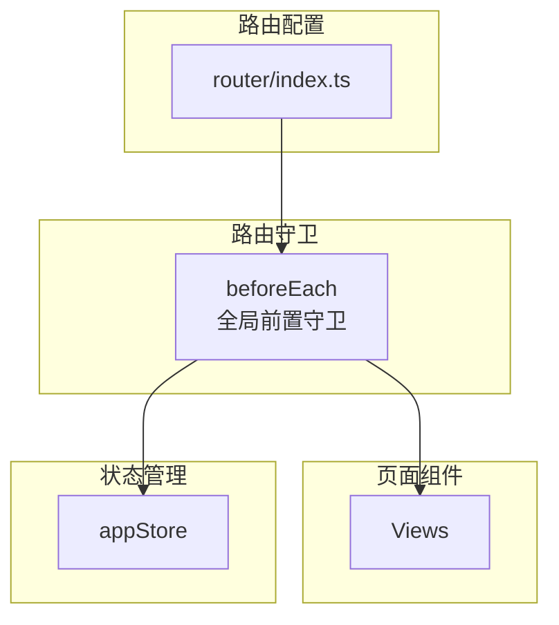

# 路由与导航

## 概述

HiSi DevTool Frontend 使用 Vue Router 进行单页应用路由管理。路由配置定义了页面与 URL 的映射关系，导航守卫负责权限控制和页面访问控制。

---

## 路由架构



---

## 路由配置

### 路由表

```typescript
// router/index.ts
const routes: RouteRecordRaw[] = [
  {
    path: '/',
    redirect: '/project'
  },
  {
    path: '/project',
    name: 'Project',
    component: () => import('@/views/project/ProjectList.vue'),
    meta: { title: '项目管理' }
  },
  {
    path: '/knowledge-graph',
    name: 'KnowledgeGraph',
    component: () => import('@/views/knowledge-graph/KnowledgeGraphView.vue'),
    meta: { title: '知识图谱分析' }
  },
  {
    path: '/ram',
    name: 'RamInput',
    component: () => import('@/views/ram/InputPage.vue'),
    meta: { title: '需求分析大师' }
  },
  {
    path: '/ram/draft/:sid',
    name: 'RamDraft',
    component: () => import('@/views/ram/DraftPage.vue'),
    meta: { title: 'RAM 草稿' }
  },
  {
    path: '/ram/graph/:sid',
    name: 'RamGraph',
    component: () => import('@/views/ram/GraphPreviewPage.vue'),
    meta: { title: 'RAM 影响图谱' }
  },
  // ... 其他路由
]
```

### 路由分组

| 分组 | 路由 | 说明 |
|------|------|------|
| **项目管理** | `/project` | 项目列表、添加、删除 |
| **知识图谱** | `/knowledge-graph` | 图谱浏览、方法搜索、调用链 |
| **需求分析** | `/ram`, `/ram/draft/:sid`, `/ram/graph/:sid` | RAM 三页向导 |
| **APM 调试** | `/apm-debug` | API 调试、调用链预览 |
| **合并分析** | `/merge-analysis`, `/merge-analysis/diff`, `/merge-analysis/result` | 合并影响分析 |
| **搜索** | `/search` | 语义搜索、方法搜索 |
| **日志分析** | `/log-analysis`, `/log-analysis/report/:id` | 日志查询、报告详情 |
| **终端** | `/claude-terminal` | Claude 终端 |
| **会话** | `/claude-session` | Claude 会话 |
| **技能市场** | `/skill-market` | 技能浏览、安装 |
| **设置** | `/settings` | 系统设置 |

---

## 路由守卫

### 全局前置守卫

```typescript
// router/index.ts
router.beforeEach(async (to, _from, next) => {
  // 1. 设置页面标题
  const title = to.meta.title as string
  if (title) {
    document.title = `${title} - HiSi Dev Tool`
  }

  // 2. 加载项目配置（首次导航时）
  const appStore = useAppStore()
  if (!appStore.projectDir && !appStore.configLoading) {
    await appStore.loadProjectDir()
    if (appStore.configError) {
      console.error('Failed to load project configuration:', appStore.configError)
    }
  }

  // 3. 检查菜单可用性
  const menuAvailability = appStore.availableMenus

  if (to.path.startsWith('/knowledge-graph') && !menuAvailability['knowledge-graph']) {
    ElMessage.warning('请先在项目管理页面选择项目')
    return next('/project')
  }

  if (to.path.startsWith('/search') && !menuAvailability['search']) {
    ElMessage.warning('请先在项目管理页面选择项目')
    return next('/project')
  }

  if (to.path.startsWith('/log-analysis') && !menuAvailability['log-analysis']) {
    ElMessage.warning('请先在项目管理页面选择项目')
    return next('/project')
  }

  // 4. 重定向处理
  if (to.path === '/mcp-guide') {
    return next('/skill-market')
  }

  next()
})
```

### 守卫逻辑说明

| 步骤 | 说明 |
|------|------|
| 1. 设置标题 | 根据路由 `meta.title` 设置页面标题 |
| 2. 加载配置 | 首次导航时加载项目目录配置 |
| 3. 权限检查 | 检查菜单可用性，未满足条件时重定向 |
| 4. 重定向 | 处理旧路由重定向（如 `/mcp-guide` → `/skill-market`） |

---

## 菜单可用性

### 可用性规则

```typescript
// stores/app.ts
const availableMenus = computed(() => ({
  'project-management': true,      // 始终可用
  'skill-market': true,            // 始终可用
  'claude-terminal': true,         // 始终可用
  'search': projectDirConfigured.value && projectSelected.value,  // 需要项目
  'knowledge-graph': projectDirConfigured.value && projectSelected.value,  // 需要项目
  'log-analysis': projectDirConfigured.value && projectSelected.value,     // 需要项目
  'prompt-config': true,           // 始终可用
  'settings': true,                // 始终可用
  'apm-debug': true,               // 始终可用
}))
```

### 可用性矩阵

| 菜单 | 需要项目配置 | 需要项目选择 |
|------|-------------|-------------|
| 项目管理 | ❌ | ❌ |
| 知识图谱分析 | ✅ | ✅ |
| 需求分析大师 | ❌ | ❌ |
| APM 调试 | ❌ | ❌ |
| 合入分析 | ❌ | ❌ |
| 增强检索 | ✅ | ✅ |
| 日志分析 | ✅ | ✅ |
| Claude 终端 | ❌ | ❌ |
| 技能市场 | ❌ | ❌ |
| 系统设置 | ❌ | ❌ |

---

## 路由元信息

### Meta 类型定义

```typescript
interface RouteMeta {
  title?: string           // 页面标题
  requiresAuth?: boolean   // 是否需要认证
  requiresProject?: boolean // 是否需要项目选择
  icon?: string           // 菜单图标
  hidden?: boolean        // 是否在菜单中隐藏
}
```

### 使用示例

```typescript
{
  path: '/knowledge-graph',
  name: 'KnowledgeGraph',
  component: () => import('@/views/knowledge-graph/KnowledgeGraphView.vue'),
  meta: {
    title: '知识图谱分析',
    requiresProject: true,
    icon: 'Graph'
  }
}
```

---

## 导航方式

### 1. 声明式导航

```html
<!-- 使用 router-link -->
<router-link to="/project">项目管理</router-link>
<router-link :to="{ name: 'RamDraft', params: { sid: sessionId } }">
  查看草稿
</router-link>
```

### 2. 编程式导航

```typescript
import { useRouter } from 'vue-router'

const router = useRouter()

// 字符串路径
router.push('/project')

// 对象路径
router.push({ name: 'RamDraft', params: { sid: sessionId } })

// 替换当前历史记录
router.replace({ name: 'Project' })

// 前进/后退
router.go(-1)
```

### 3. 导航守卫中的重定向

```typescript
router.beforeEach((to, _from, next) => {
  if (to.path.startsWith('/knowledge-graph') && !hasProject) {
    return next('/project')
  }
  next()
})
```

---

## 侧边栏导航

### AppSidebar.vue

**路径**：`src/components/layout/AppSidebar.vue`

**职责**：侧边导航栏，渲染菜单项。

**菜单配置**：
```typescript
interface MenuItem {
  key: string
  label: string
  icon: string
  path: string
  requiresProject?: boolean
  children?: MenuItem[]
}
```

**菜单项列表**：
```typescript
const menuItems: MenuItem[] = [
  {
    key: 'project',
    label: '项目管理',
    icon: 'Folder',
    path: '/project'
  },
  {
    key: 'knowledge-graph',
    label: '知识图谱分析',
    icon: 'Graph',
    path: '/knowledge-graph',
    requiresProject: true
  },
  {
    key: 'ram',
    label: '需求分析大师',
    icon: 'Document',
    path: '/ram'
  },
  // ... 其他菜单项
]
```

**可用性过滤**：
```typescript
const filteredMenuItems = computed(() => {
  return menuItems.filter(item => {
    if (item.requiresProject) {
      return appStore.availableMenus[item.key]
    }
    return true
  })
})
```

---

## 面包屑导航

### 实现方式

```typescript
// composables/useBreadcrumb.ts
export function useBreadcrumb() {
  const route = useRoute()
  
  const breadcrumbs = computed(() => {
    const matched = route.matched
    return matched.map(record => ({
      title: record.meta.title as string,
      path: record.path
    }))
  })
  
  return { breadcrumbs }
}
```

### 使用示例

```html
<template>
  <el-breadcrumb separator="/">
    <el-breadcrumb-item 
      v-for="item in breadcrumbs" 
      :key="item.path"
      :to="{ path: item.path }"
    >
      {{ item.title }}
    </el-breadcrumb-item>
  </el-breadcrumb>
</template>
```

---

## 路由懒加载

### 配置方式

```typescript
// 使用动态 import 实现懒加载
const routes: RouteRecordRaw[] = [
  {
    path: '/project',
    name: 'Project',
    component: () => import('@/views/project/ProjectList.vue')
  },
  {
    path: '/knowledge-graph',
    name: 'KnowledgeGraph',
    component: () => import('@/views/knowledge-graph/KnowledgeGraphView.vue')
  }
]
```

### 构建产物

懒加载会生成独立的 chunk 文件：

```
dist/assets/
├── index-[hash].js           # 主包
├── ProjectList-[hash].js     # 项目管理页面
├── KnowledgeGraph-[hash].js  # 知识图谱页面
└── ...
```

---

## 路由参数

### 动态路由参数

```typescript
// 路由定义
{
  path: '/ram/draft/:sid',
  name: 'RamDraft',
  component: () => import('@/views/ram/DraftPage.vue'),
  meta: { title: 'RAM 草稿' }
}

// 组件中获取参数
import { useRoute } from 'vue-router'

const route = useRoute()
const sid = computed(() => String(route.params.sid ?? ''))
```

### 查询参数

```typescript
// 路由定义
{
  path: '/knowledge-graph',
  name: 'KnowledgeGraph',
  component: () => import('@/views/knowledge-graph/KnowledgeGraphView.vue')
}

// 组件中获取查询参数
const route = useRoute()
const tab = computed(() => route.query.tab as string)
```

---

## 路由与状态管理

### 路由变化触发状态更新

```typescript
// router/index.ts
router.beforeEach(async (to, _from, next) => {
  const appStore = useAppStore()
  
  // 加载项目配置（首次导航时）
  if (!appStore.projectDir && !appStore.configLoading) {
    await appStore.loadProjectDir()
  }
  
  next()
})
```

### 状态变化触发路由跳转

```typescript
// views/ram/InputPage.vue
async function onSubmit() {
  const resp = await startRamSession({ 
    rawInput: rawInput.value, 
    projectPath: projectPath.value 
  })
  
  // 状态更新后跳转
  await router.push({ 
    name: 'RamDraft', 
    params: { sid: resp.sessionId } 
  })
}
```

---

## 路由测试

### 单元测试

```typescript
// router/__tests__/index.spec.ts
import { describe, it, expect } from 'vitest'
import { createRouter, createWebHistory } from 'vue-router'
import { routes } from '../index'

describe('Router', () => {
  it('should have correct route definitions', () => {
    expect(routes).toContainEqual(
      expect.objectContaining({
        path: '/project',
        name: 'Project'
      })
    )
  })

  it('should redirect root to project', () => {
    const rootRoute = routes.find(r => r.path === '/')
    expect(rootRoute?.redirect).toBe('/project')
  })
})
```

### E2E 测试

```typescript
// e2e/navigation.spec.ts
import { test, expect } from '@playwright/test'

test('should navigate between pages', async ({ page }) => {
  await page.goto('/')
  await expect(page).toHaveURL('/project')
  
  await page.click('text=知识图谱分析')
  await expect(page).toHaveURL('/knowledge-graph')
})
```

---

## 最佳实践

### 1. 路由命名

- 使用 PascalCase：`RamDraft`、`KnowledgeGraph`
- 保持名称与组件名称一致

### 2. 路由组织

- 按功能模块分组
- 使用嵌套路由表示层级关系
- 避免路由嵌套过深（最多 3 层）

### 3. 路由守卫

- 全局守卫用于通用逻辑（标题、权限）
- 路由守卫用于特定页面逻辑
- 避免在守卫中执行耗时操作

### 4. 路由懒加载

- 所有页面组件使用懒加载
- 合理划分 chunk 大小
- 避免循环依赖

---

## 下一步

- [组件层](./组件层.md) - 了解路由如何与组件交互
- [状态管理](./状态管理.md) - 了解路由与状态管理的配合
- [部署运维](../07-部署运维/index.md) - 了解路由在生产环境的配置
