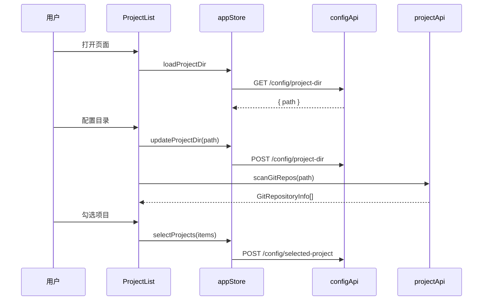
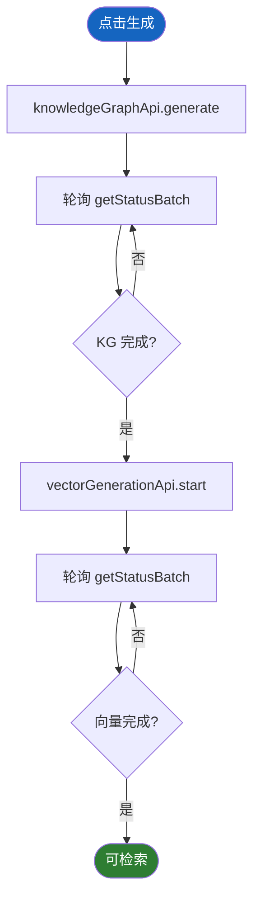
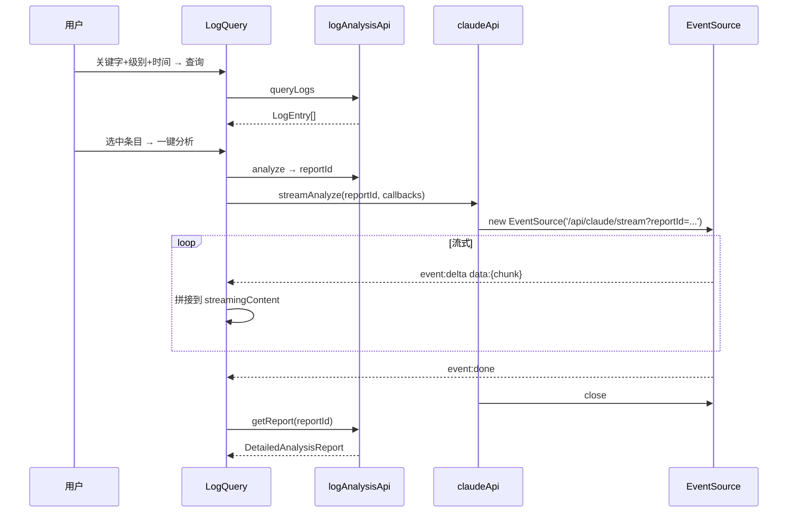
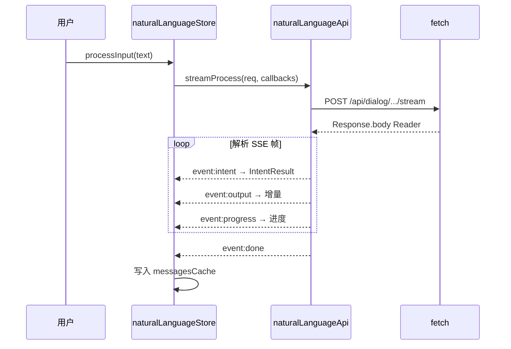
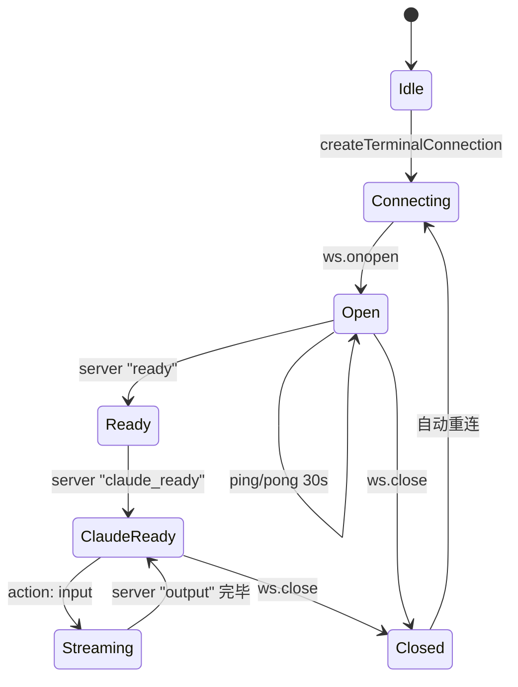
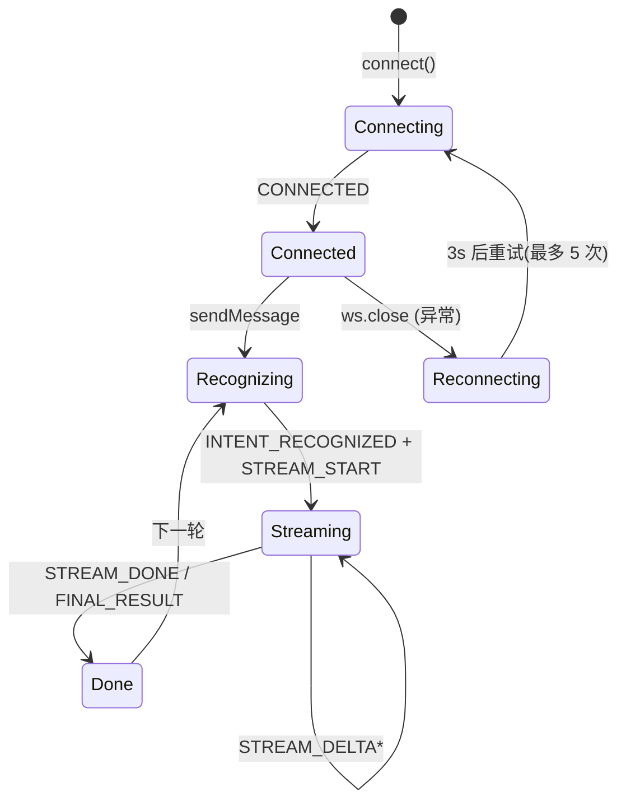

# 数据流程

本章描述前端的端到端数据流、流式协议时序与状态机。

---

## 1. 数据流总览

| # | 流程 | 触发 | 协议 | 关键模块 |
|---|------|------|------|---------|
| 1 | 项目目录配置 → 选择项目 | 用户表单 | REST | `appStore` + `configApi` + `projectApi` |
| 2 | 知识图谱生成 + 向量生成 | 用户点击 | REST(轮询状态) | `knowledgeGraphApi` + `vectorGenerationApi` |
| 3 | 语义检索 | 用户输入 | REST | `vectorSearchApi` |
| 4 | 调用链查询 | 用户点击节点 | REST | `knowledgeGraphApi` 调用链族 |
| 5 | 日志查询 → Claude 流式分析 | 用户操作 | REST + SSE(EventSource) | `logAnalysisApi` + `claudeApi.streamAnalyze` |
| 6 | 自然语言对话(意图+流式) | 用户提问 | fetch + ReadableStream | `naturalLanguageApi.streamProcess` |
| 7 | 多 Agent 诊断 | 用户提问 | WebSocket `/ws/diagnosis` | `useDiagnosis` |
| 8 | Claude 终端 | 用户输入 | WebSocket `/ws/terminal` | `terminal.ts` + xterm.js |
| 9 | MCP 安装 | 用户点击 | SSE | `mcpApi.install` |
| 10 | Skill 安装 / Git 同步 | 用户操作 | REST | `skillMarketApi` / `gitApi` |

---

## 2. 流程 1:项目目录配置

---

## 3. 流程 2:知识图谱 + 向量生成

---

## 4. 流程 5:日志 → Claude 流式分析(SSE)

---

## 5. 流程 6:自然语言对话(fetch ReadableStream)

---

## 6. 流程 7-8:WebSocket 状态机

### 6.1 `/ws/terminal`

### 6.2 `/ws/dialog`

---

## 7. 数据校验与一致性

| 数据 | 校验位置 | 失败行为 |
|------|---------|---------|
| 表单输入 | Element Form rules | UI 红字 |
| API 入参 | 后端 400 | 拦截器解析 → ElMessage.warning |
| 项目路径 | `pathUtils.normalizePath` | 强制正斜杠 |
| 流式序号 | 拼接顺序由后端保证 | — |

---

## 8. 异常处理矩阵

| 异常 | 来源 | 处理 |
|------|------|------|
| 后端未启动 | `/api/health` 失败 | 路由守卫放行,业务页弹"网络连接失败" |
| 业务码非 200 | 拦截器 | reject `BusinessError`,组件 try/catch 自定义 |
| EventSource 失败 | onerror | 关闭 + 上抛 onError 回调 + ElMessage |
| WebSocket 异常断开 | onclose code≠1000 | 自动重连(终端/对话/诊断各自策略) |
| fetch 流读取错误 | reader.read() throw | catch 后关闭 reader + 上抛 |

---

> **延伸阅读**:[接口文档](../05-接口文档/index.md) · [Composables 与工具](../03-模块说明/Composables与工具.md)
