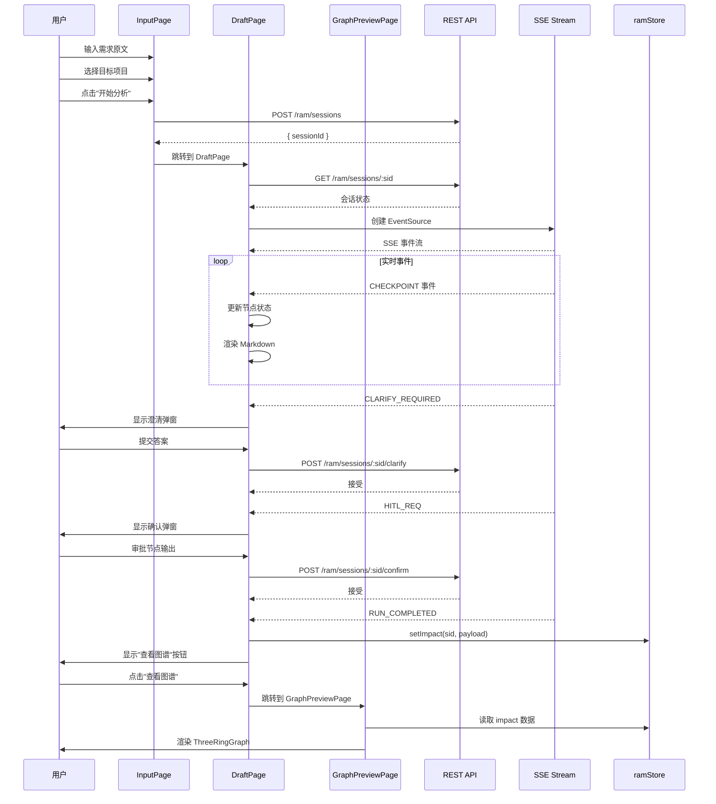
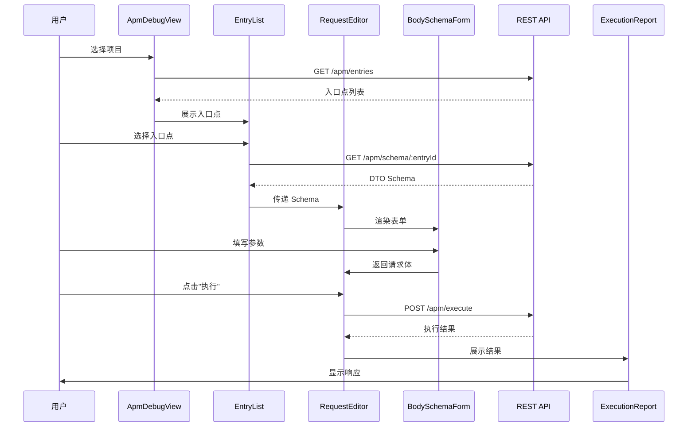
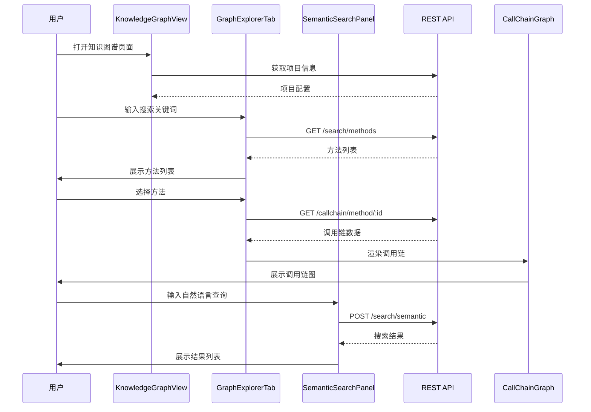
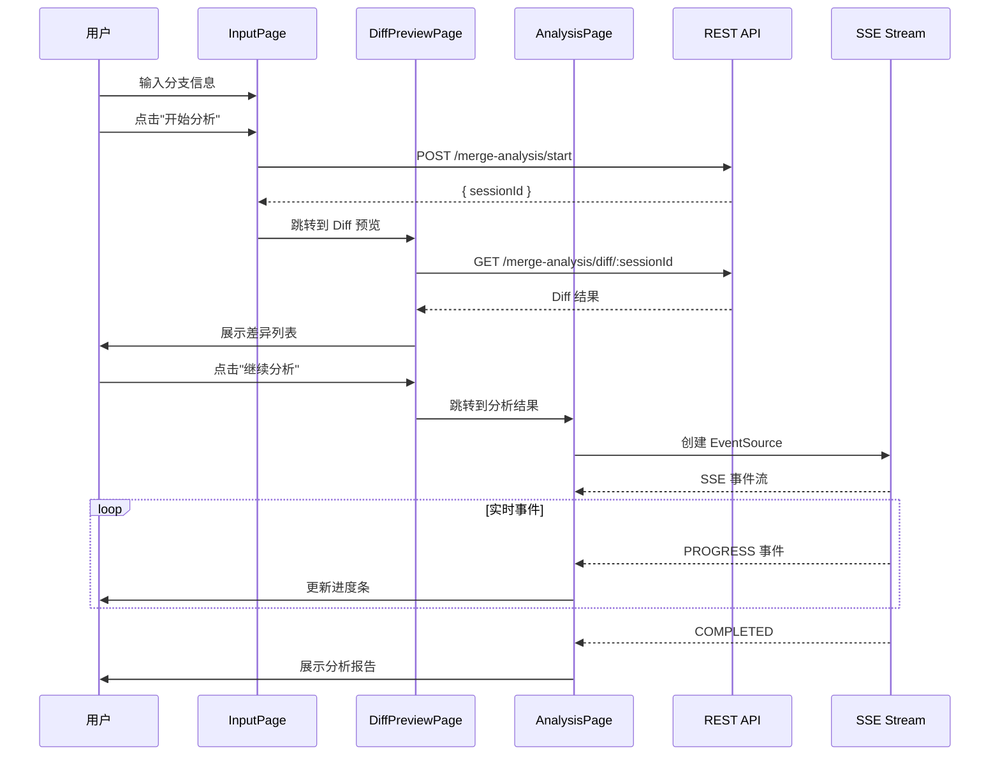
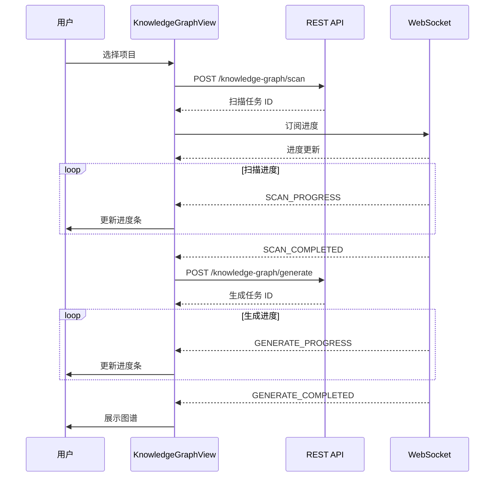
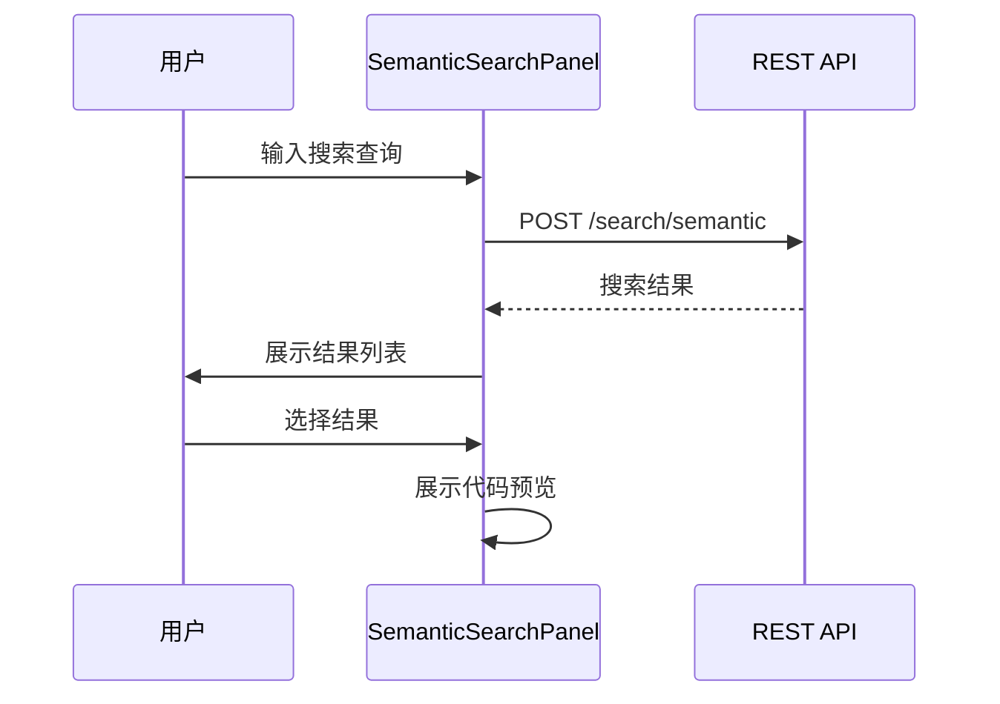
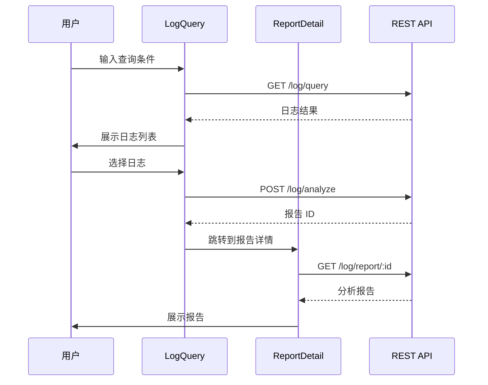
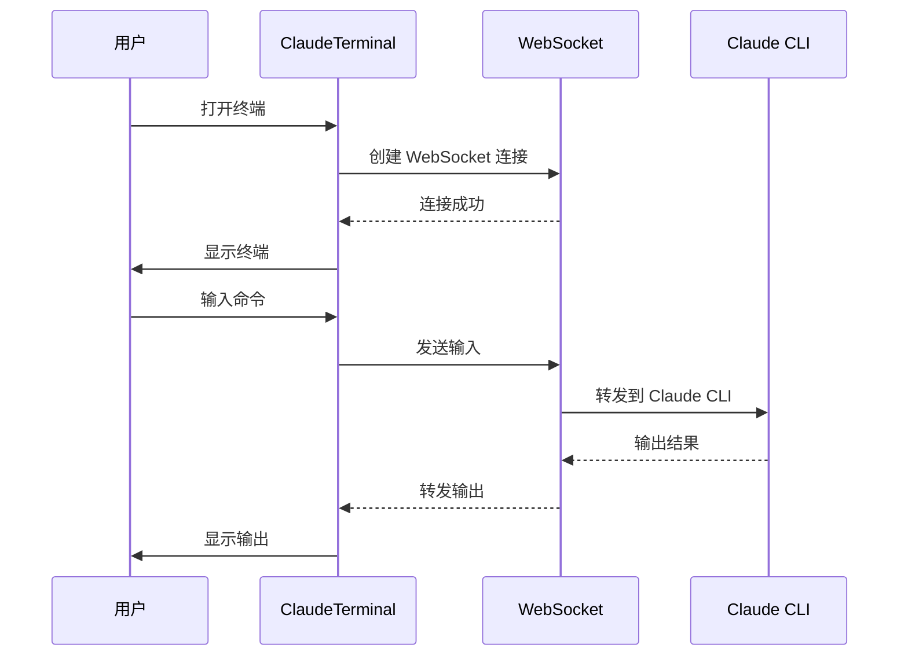
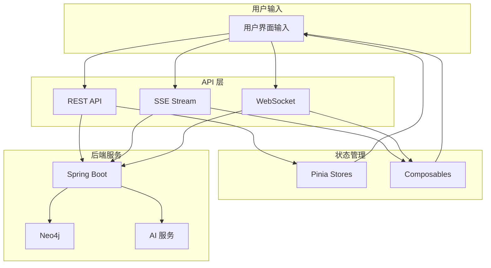

# 04-数据流程

## 概述

本文档描述 HiSi DevTool Frontend 中核心功能的端到端数据流程，包括 RAM 需求分析、APM 调试、图谱浏览、合并分析等主要业务流程。

---

## RAM 需求分析流程

### 流程概览

### 数据流转

| 阶段 | 输入 | 处理 | 输出 |
|------|------|------|------|
| 输入阶段 | 需求原文、项目路径 | 创建 RAM 会话 | sessionId |
| 分析阶段 | SSE 事件流 | 解析事件、更新状态 | 节点状态、Markdown 内容 |
| 澄清阶段 | 用户答案 | 提交澄清 | 确认响应 |
| 确认阶段 | 用户审批 | 提交确认 | 确认响应 |
| 可视化阶段 | ImpactPayload | 渲染图表 | 三环影响图 |

---

## APM 调试流程

### 流程概览

### 数据流转

| 阶段 | 输入 | 处理 | 输出 |
|------|------|------|------|
| 项目选择 | 项目路径 | 获取入口点列表 | EntryPoint[] |
| 入口选择 | 入口点 ID | 获取 DTO Schema | SchemaNode |
| 参数编辑 | Schema、用户输入 | 渲染表单、收集数据 | RequestBody |
| 请求执行 | 请求参数 | 发送 HTTP 请求 | ExecutionResult |
| 结果展示 | 执行结果 | 渲染报告 | 执行报告 |

---

## 图谱浏览流程

### 流程概览

### 数据流转

| 阶段 | 输入 | 处理 | 输出 |
|------|------|------|------|
| 方法搜索 | 搜索关键词 | 调用搜索 API | MethodInfo[] |
| 调用链获取 | 方法 ID | 调用调用链 API | CallChain |
| 语义搜索 | 自然语言查询 | 调用语义搜索 API | SearchResult[] |
| 图谱渲染 | 调用链数据 | dagre 布局 + Vue Flow | 调用链图 |

---

## 合并分析流程

### 流程概览

### 数据流转

| 阶段 | 输入 | 处理 | 输出 |
|------|------|------|------|
| 分支输入 | 源分支、目标分支 | 创建分析会话 | sessionId |
| Diff 预览 | 会话 ID | 获取 Diff 结果 | DiffResult |
| 影响分析 | SSE 事件流 | 解析事件、更新状态 | AnalysisResult |
| 报告展示 | 分析结果 | 渲染报告 | 分析报告 |

---

## 知识图谱构建流程

### 流程概览

### 数据流转

| 阶段 | 输入 | 处理 | 输出 |
|------|------|------|------|
| 项目扫描 | 项目路径 | 扫描代码文件 | 文件列表 |
| 图谱生成 | 文件列表 | 解析代码、构建图谱 | 知识图谱 |
| 向量生成 | 知识图谱 | 生成 embedding | 向量索引 |

---

## 语义搜索流程

### 流程概览

### 数据流转

| 阶段 | 输入 | 处理 | 输出 |
|------|------|------|------|
| 查询输入 | 自然语言查询 | 构建搜索请求 | SearchRequest |
| 向量搜索 | 搜索请求 | 调用搜索 API | SearchResult[] |
| 结果展示 | 搜索结果 | 渲染结果列表 | 结果列表 |

---

## 日志分析流程

### 流程概览

### 数据流转

| 阶段 | 输入 | 处理 | 输出 |
|------|------|------|------|
| 日志查询 | 查询条件 | 调用查询 API | LogEntry[] |
| 日志分析 | 日志 ID | 调用分析 API | reportId |
| 报告展示 | 报告 ID | 获取报告详情 | LogReport |

---

## Claude 终端流程

### 流程概览

### 数据流转

| 阶段 | 输入 | 处理 | 输出 |
|------|------|------|------|
| 连接建立 | 会话 ID | 创建 WebSocket | 连接状态 |
| 命令输入 | 用户输入 | 发送到 WebSocket | 输入数据 |
| 输出显示 | WebSocket 消息 | 写入终端 | 终端输出 |

---

## 数据流向图

### 整体数据流

---

## 下一步

- [RAM需求评估UI](../03-模块说明/RAM需求评估UI.md) - 深入了解 RAM 流程
- [APM诊断UI](../03-模块说明/APM诊断UI.md) - 深入了解 APM 流程
- [接口文档](../05-接口文档/index.md) - 了解 API 接口详情
