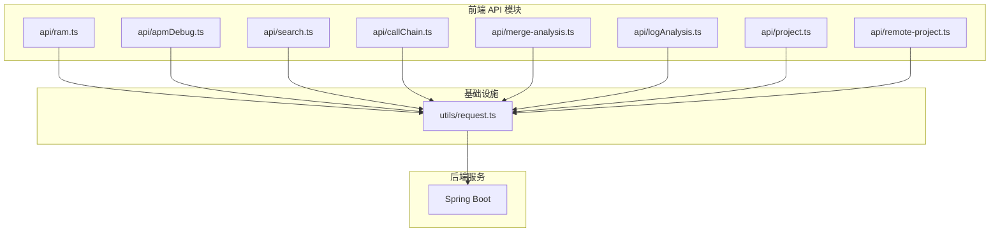

# 05-接口文档

## 概述

本文档描述 HiSi DevTool Frontend 与后端服务交互的 API 接口。所有 API 通过 Axios 实例统一管理，响应格式为 `ApiResponse<T>`，在拦截器中自动解包。

---

## API 架构



---

## 通用约定

### 响应格式

所有 API 返回统一的 `ApiResponse<T>` 格式：

```typescript
interface ApiResponse<T> {
  success: boolean
  data?: T
  error?: string
  meta?: {
    total: number
    page: number
    limit: number
  }
}
```

前端在拦截器中解包，API 模块直接返回 `data`。

### 错误处理

```typescript
// 拦截器中的错误处理
request.interceptors.response.use(
  (response) => {
    const apiResponse = response.data as ApiResponse<unknown>
    if (apiResponse.success) {
      return apiResponse.data
    } else {
      const message = apiResponse.error || '请求失败'
      ElMessage.error(message)
      return Promise.reject(new Error(message))
    }
  },
  (error) => {
    // HTTP 错误处理
    if (error.response) {
      const status = error.response.status
      switch (status) {
        case 401:
          ElMessage.error('未授权，请重新登录')
          break
        case 403:
          ElMessage.error('权限不足')
          break
        case 404:
          ElMessage.error('资源不存在')
          break
        case 500:
          ElMessage.error('服务器内部错误')
          break
        default:
          ElMessage.error(`请求失败：${status}`)
      }
    }
    return Promise.reject(error)
  }
)
```

---

## RAM API

### 创建 RAM 会话

**端点**：`POST /api/ram/sessions`

**请求参数**：
```typescript
interface StartSessionPayload {
  rawInput: string      // 需求原文
  projectPath: string   // 项目路径
  userId?: string       // 用户 ID（可选）
}
```

**响应**：
```typescript
interface StartSessionResponse {
  readonly sessionId: string
}
```

**示例**：
```typescript
const resp = await startRamSession({
  rawInput: '用户需要一个登录功能',
  projectPath: '/path/to/project'
})
// resp.sessionId = 'abc123'
```

---

### 获取 RAM 会话信息

**端点**：`GET /api/ram/sessions/:sid`

**响应**：
```typescript
interface SessionInfoResponse {
  status: string
  currentSeq: number
  clarifyPending: boolean
  hitlPending: boolean
  hitlNodeName?: string
}
```

---

### 提交澄清答案

**端点**：`POST /api/ram/sessions/:sid/clarify`

**请求参数**：
```typescript
interface ClarifyPayload {
  answers: Record<string, unknown>
}
```

**响应**：
```typescript
interface ClarifyResponse {
  readonly accepted: boolean
  readonly nextSeq: number
  readonly status?: string
  readonly hitlPayload?: {
    readonly nodeName: string
    readonly output: Readonly<Record<string, unknown>>
  }
}
```

---

### 确认节点输出

**端点**：`POST /api/ram/sessions/:sid/confirm`

**请求参数**：
```typescript
interface ConfirmPayload {
  nodeName: string
  action: 'approve' | 'reject' | 'edit'
  feedback?: string
  editedOutput?: Record<string, unknown>
}
```

**响应**：
```typescript
interface ConfirmResponse {
  readonly accepted: boolean
  readonly nextSeq: number
}
```

---

### 恢复 RAM 会话

**端点**：`POST /api/ram/sessions/:sid/resume`

**响应**：
```typescript
interface ResumeResponse {
  readonly resumed: boolean
}
```

---

### 中止 RAM 会话

**端点**：`POST /api/ram/sessions/:sid/abort`

**响应**：
```typescript
interface AbortResponse {
  readonly aborted: boolean
}
```

---

### 触发技术方案生成

**端点**：`POST /api/ram/sessions/:sid/nodes/tech-plan`

**响应**：
```typescript
type TechPlanResponse = Record<string, unknown>
```

---

### SSE 事件流

**端点**：`GET /api/ram/sessions/:sid/stream`

**查询参数**：
- `afterSeq`：从指定序号之后开始接收事件

**SSE 事件类型**：
| 事件类型 | 说明 |
|---------|------|
| `USER_MSG` | 用户消息 |
| `ASSISTANT_DELTA` | 助手增量消息 |
| `TOOL_USE` | 工具使用 |
| `TOOL_RESULT` | 工具结果 |
| `CHECKPOINT` | 检查点（节点完成） |
| `CLARIFY_REQ` | 澄清请求 |
| `CLARIFY_RES` | 澄清响应 |
| `HITL_REQ` | 人工确认请求 |
| `HITL_RES` | 人工确认响应 |
| `ERROR` | 错误 |
| `RUN_COMPLETED` | 运行完成 |
| `RUN_FAILED` | 运行失败 |
| `RUN_ABORTED` | 运行中止 |
| `CLARIFY_REQUIRED` | 需要澄清 |

---

## APM API

### 获取入口点列表

**端点**：`GET /api/apm/entries`

**查询参数**：
```typescript
interface GetEntriesParams {
  projectPath: string
  keyword?: string
  type?: 'controller' | 'scheduled' | 'mq' | 'feign'
}
```

**响应**：
```typescript
interface EntryPoint {
  id: string
  name: string
  type: 'controller' | 'scheduled' | 'mq' | 'feign'
  path: string
  method?: string
  className: string
  methodName: string
  description?: string
}
```

---

### 获取入口点详情

**端点**：`GET /api/apm/entries/:id`

**响应**：
```typescript
interface EntryPointDetail {
  id: string
  name: string
  type: string
  path: string
  method: string
  className: string
  methodName: string
  parameters: ParameterInfo[]
  returnType: string
  description: string
}
```

---

### 获取 DTO Schema

**端点**：`GET /api/apm/schema/:entryId`

**响应**：
```typescript
interface SchemaNode {
  type: 'object' | 'array' | 'string' | 'number' | 'boolean'
  properties?: Record<string, SchemaNode>
  items?: SchemaNode
  description?: string
  default?: unknown
  required?: string[]
  format?: string
  enum?: unknown[]
}
```

---

### 执行 API 请求

**端点**：`POST /api/apm/execute`

**请求参数**：
```typescript
interface ExecuteRequestParams {
  entryId: string
  url: string
  method: 'GET' | 'POST' | 'PUT' | 'DELETE'
  headers?: Record<string, string>
  body?: unknown
}
```

**响应**：
```typescript
interface ExecutionResult {
  statusCode: number
  statusText: string
  headers: Record<string, string>
  body: unknown
  duration: number
  error?: string
  traceId?: string
}
```

---

### 搜索 API

**端点**：`GET /api/apm/search`

**查询参数**：
```typescript
interface SearchApisParams {
  projectPath: string
  keyword: string
}
```

**响应**：
```typescript
interface ApiSearchResult {
  id: string
  name: string
  path: string
  method: string
  description: string
}
```

---

## 搜索 API

### 语义搜索

**端点**：`POST /api/search/semantic`

**请求参数**：
```typescript
interface SemanticSearchRequest {
  query: string
  projectPath: string
  limit?: number
  scope?: string
  language?: 'java' | 'python'
}
```

**响应**：
```typescript
interface SearchResult {
  id: string
  className: string
  methodName: string
  description: string
  score: number
  codeSnippet: string
}
```

---

### 方法搜索

**端点**：`GET /api/search/methods`

**查询参数**：
```typescript
interface SearchMethodsParams {
  keyword: string
  projectPath: string
}
```

**响应**：
```typescript
interface MethodInfo {
  id: string
  className: string
  methodName: string
  description: string
  projectPath: string
  language: 'java' | 'python'
}
```

---

### 获取方法详情

**端点**：`GET /api/search/methods/:id`

**响应**：
```typescript
interface MethodDetail {
  id: string
  className: string
  methodName: string
  description: string
  parameters: ParameterInfo[]
  returnType: string
  code: string
}
```

---

### 获取调用链

**端点**：`GET /api/search/methods/:id/callchain`

**查询参数**：
```typescript
interface GetCallChainParams {
  direction: 'upstream' | 'downstream'
  depth?: number
}
```

**响应**：
```typescript
interface CallChain {
  root: CallNode
  nodes: CallNode[]
  edges: CallEdge[]
}

interface CallNode {
  id: string
  className: string
  methodName: string
  type: 'method' | 'entry' | 'bridge'
}

interface CallEdge {
  source: string
  target: string
  type: 'call' | 'reference' | 'feign' | 'mq'
}
```

---

## 调用链 API

### 获取项目列表

**端点**：`GET /api/callchain/projects`

**响应**：
```typescript
interface Project {
  name: string
  path: string
  branch: string
  clean: boolean
}
```

---

### 获取 URI 列表

**端点**：`GET /api/callchain/uris`

**查询参数**：
```typescript
interface GetUrisParams {
  projectPath: string
}
```

**响应**：
```typescript
interface UriInfo {
  uri: string
  method: string
  className: string
  methodName: string
}
```

---

### 获取 URI 调用链

**端点**：`GET /api/callchain/uri-chain`

**查询参数**：
```typescript
interface GetUriChainParams {
  projectPath: string
  uri: string
}
```

**响应**：同 CallChain

---

### 获取桥接点

**端点**：`GET /api/callchain/bridges`

**查询参数**：
```typescript
interface GetBridgesParams {
  projectPath: string
}
```

**响应**：
```typescript
interface BridgePoint {
  id: string
  type: 'feign' | 'mq'
  serviceName: string
  methodName: string
  targetService: string
}
```

---

### 获取 Feign 调用链

**端点**：`GET /api/callchain/feign/:serviceName`

**响应**：同 CallChain

---

### 获取 MQ 调用链

**端点**：`GET /api/callchain/mq/:topic`

**响应**：同 CallChain

---

## 合并分析 API

### 启动合并分析

**端点**：`POST /api/merge-analysis/start`

**请求参数**：
```typescript
interface StartAnalysisPayload {
  projectPath: string
  sourceBranch: string
  targetBranch: string
}
```

**响应**：
```typescript
interface AnalysisSession {
  sessionId: string
  status: string
}
```

---

### 获取 Diff 结果

**端点**：`GET /api/merge-analysis/diff/:sessionId`

**响应**：
```typescript
interface DiffResult {
  files: FileDiff[]
  summary: {
    totalFiles: number
    addedLines: number
    removedLines: number
  }
}

interface FileDiff {
  path: string
  status: 'added' | 'modified' | 'deleted'
  additions: number
  deletions: number
  hunks: DiffHunk[]
}
```

---

### 获取分析结果

**端点**：`GET /api/merge-analysis/result/:sessionId`

**响应**：
```typescript
interface AnalysisResult {
  sessionId: string
  status: 'completed' | 'failed'
  impact: {
    modifiedFiles: string[]
    affectedMethods: string[]
    riskLevel: 'low' | 'medium' | 'high'
  }
  report: string
  suggestions: string[]
}
```

---

### SSE 事件流

**端点**：`GET /api/merge-analysis/stream/:sessionId`

**SSE 事件类型**：
| 事件类型 | 说明 |
|---------|------|
| `PROGRESS` | 进度更新 |
| `FILE_DIFF` | 文件差异 |
| `IMPACT` | 影响分析 |
| `RISK` | 风险评估 |
| `COMPLETED` | 分析完成 |
| `ERROR` | 错误 |

---

## 日志分析 API

### 查询日志

**端点**：`GET /api/log/query`

**查询参数**：
```typescript
interface LogQueryParams {
  keyword?: string
  logLevel?: 'ERROR' | 'WARN' | 'INFO' | 'DEBUG'
  startTime?: string
  endTime?: string
  traceId?: string
  size?: number
}
```

**响应**：
```typescript
interface LogQueryResult {
  logs: LogEntry[]
  total: number
}

interface LogEntry {
  id: string
  timestamp: string
  level: string
  message: string
  traceId?: string
  serviceName?: string
}
```

---

### 获取分析报告

**端点**：`GET /api/log/report/:id`

**响应**：
```typescript
interface LogReport {
  id: string
  status: 'pending' | 'processing' | 'completed' | 'failed'
  rootCause: string
  suggestions: string[]
  relatedLogs: LogEntry[]
}
```

---

### 生成分析报告

**端点**：`POST /api/log/analyze`

**请求参数**：
```typescript
interface AnalyzeLogParams {
  logIds: string[]
  message?: string
  stackTrace?: string
}
```

**响应**：
```typescript
interface ReportTask {
  reportId: number
  status: string
}
```

---

## 项目管理 API

### 获取项目列表

**端点**：`GET /api/projects`

**响应**：
```typescript
interface Project {
  id: string
  name: string
  path: string
  branch: string
  clean: boolean
  source: string
}
```

---

### 扫描 Git 仓库

**端点**：`GET /api/projects/scan-git-repos`

**响应**：
```typescript
interface GitRepositoryInfo {
  name: string
  path: string
  branch: string
  clean: boolean
  source: string
}
```

---

### 添加项目

**端点**：`POST /api/projects`

**请求参数**：
```typescript
interface ProjectInfo {
  name: string
  path: string
}
```

**响应**：同 Project

---

### 删除项目

**端点**：`DELETE /api/projects/:id`

**响应**：无

---

## 远程项目 API

### 获取远程项目列表

**端点**：`GET /api/remote-projects`

**响应**：
```typescript
interface RemoteProject {
  id: string
  name: string
  url: string
  branch: string
  lastSync: string
  status: 'active' | 'inactive'
}
```

---

### 添加远程项目

**端点**：`POST /api/remote-projects`

**请求参数**：
```typescript
interface RemoteProjectInfo {
  name: string
  url: string
  branch: string
}
```

**响应**：同 RemoteProject

---

### 同步远程项目

**端点**：`POST /api/remote-projects/:id/sync`

**响应**：
```typescript
interface SyncResult {
  success: boolean
  message: string
  lastSync: string
}
```

---

## WebSocket API

### 终端连接

**端点**：`ws://localhost:8080/terminal`

**查询参数**：
- `sessionId`：会话 ID

**消息格式**：
```typescript
// 输入消息
interface TerminalInput {
  type: 'input'
  data: string
}

// 输出消息
interface TerminalOutput {
  type: 'output'
  data: string
}

// 控制消息
interface TerminalControl {
  type: 'resize'
  cols: number
  rows: number
}
```

---

## 下一步

- [数据模型](../06-数据模型/index.md) - 了解 TypeScript 类型定义
- [API服务层](../03-模块说明/API服务层.md) - 了解 API 模块实现
- [部署运维](../07-部署运维/index.md) - 了解 API 代理配置
