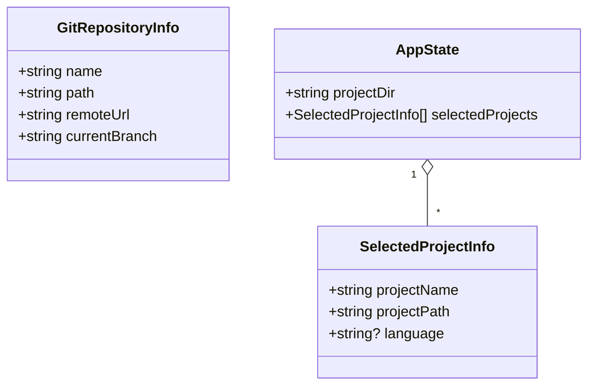
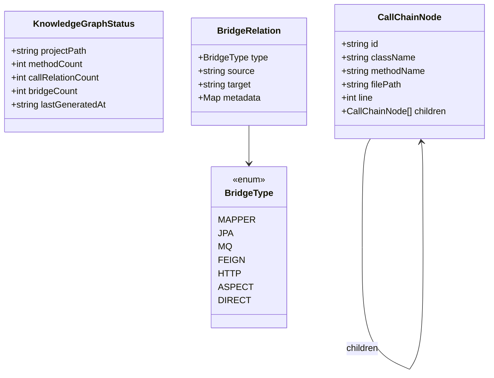
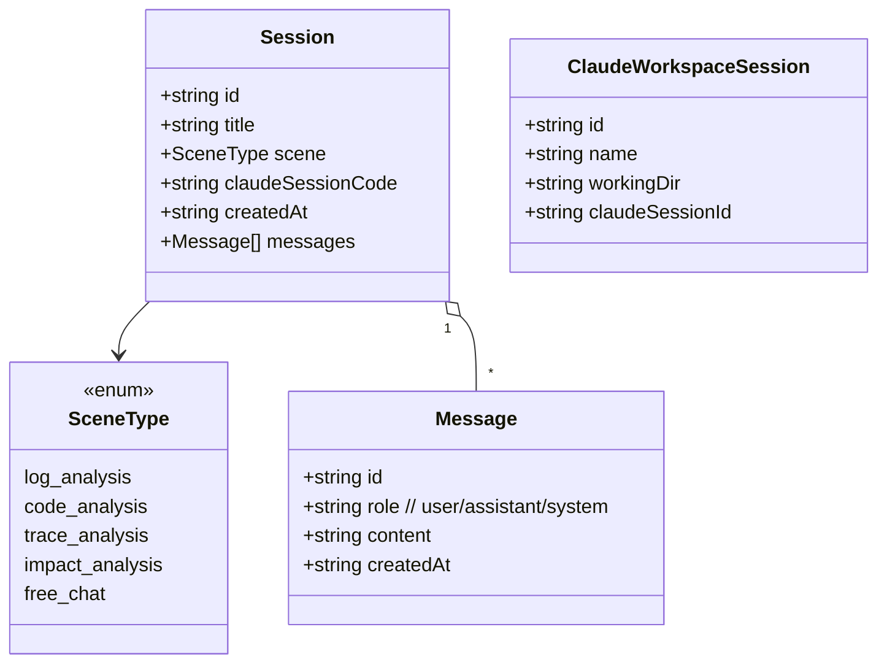
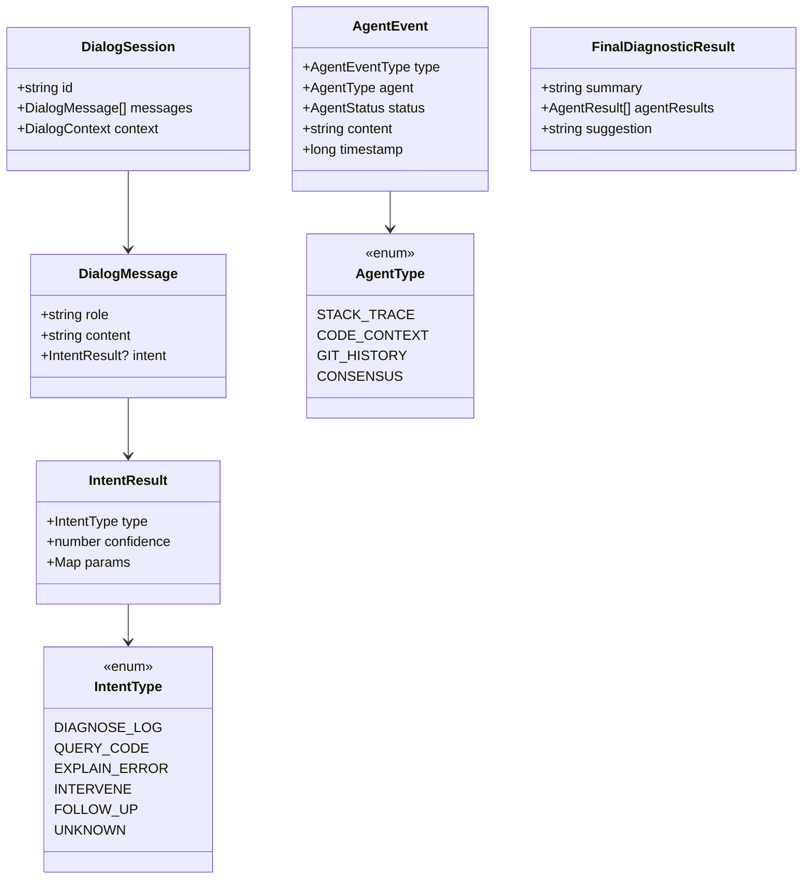
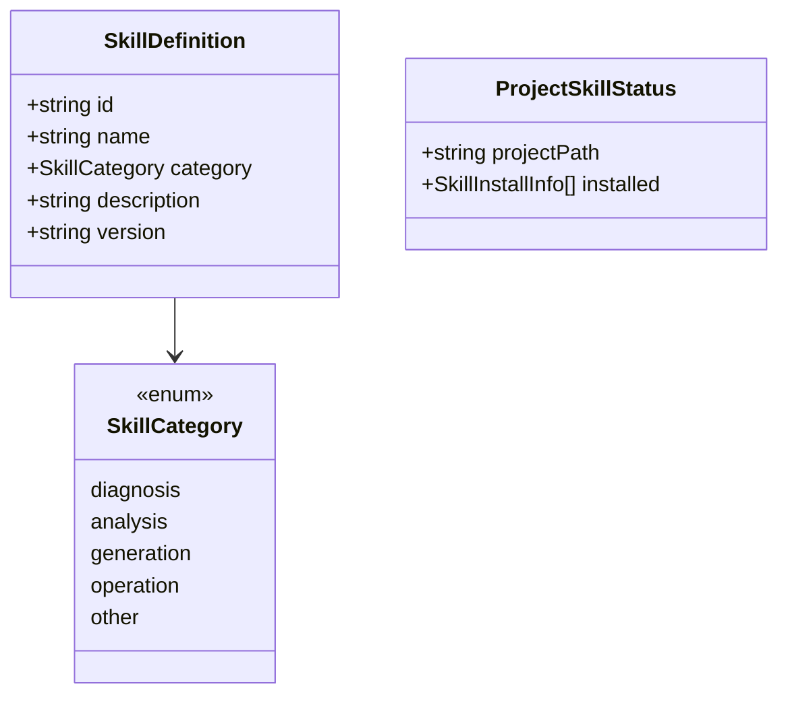

# 数据模型

> 前端所有 TS 类型定义集中于 `src/types/`,与后端 DTO 严格对齐。本章罗列核心类型与枚举关系。

---

## 1. 全局响应包装

```ts
interface ApiResponse<T> {
  code: number      // 200 = 成功
  message: string
  data: T
}

interface ValidationError {
  field: string
  message: string
}
```

---

## 2. 项目与配置



---

## 3. 知识图谱与调用链



---

## 4. 会话与消息



---

## 5. 自然语言对话与 Agent 诊断



---

## 6. 日志与诊断报告

```ts
interface LogEntry {
  timestamp: string
  level: 'ERROR' | 'WARN' | 'INFO' | 'DEBUG'
  message: string
  traceId?: string
  appId?: string
  // ... 元数据
}

interface LogQueryDto {
  keyword?: string
  contentContains?: string
  logLevel?: string
  traceId?: string
  appId?: string
  startTime?: string
  endTime?: string
  errorOnly?: boolean
  size?: number
  sortOrder?: 'asc' | 'desc'
  dslQuery?: string  // 优先级最高
}

interface AnalyzeTaskResponse { reportId: number }
interface Report { id: number; status: 'pending'|'processing'|'completed'|'failed'; ... }
interface DetailedAnalysisReport extends Report { rootCause: string; suggestion: string; codeSnippets: ... }
```

---

## 7. Skill 系统



---

## 8. 主题

```ts
type ThemeId = 'dark-tech' | 'dark-monokai' | 'dark-dracula'
             | 'light-minimal' | 'light-sepia' | 'eye-care'

interface ThemeDefinition {
  id: ThemeId
  name: string
  type: 'dark' | 'light'
  background: string; foreground: string; cursor: string; selection: string
  black: string; red: string; ... ; white: string
  brightBlack: string; ... ; brightWhite: string
  accent: string
}
```

---

## 9. Pinia State 速览

| Store | State 形状 |
|-------|-----------|
| `app` | `{ projectDir, selectedProjects }` |
| `sessionStore` | `{ messagesCache: Map, streamingContentCache: Map, streamingStatusCache: Map }` |
| `workspaceStore` | `{ sessions: ClaudeWorkspaceSession[], currentSessionId }` |
| `themeStore` | `{ themeId, customAccent }` |
| `skillStore` | `{ skills, projectStatus, categoryStats }` |
| `promptStore` | `{ templates }` |
| `naturalLanguageStore` | `{ sessions, streamingContent, intentResults }` |

---

> **延伸阅读**:[类型与数据契约](../03-模块说明/类型与数据契约.md) · [接口文档](../05-接口文档/index.md)
