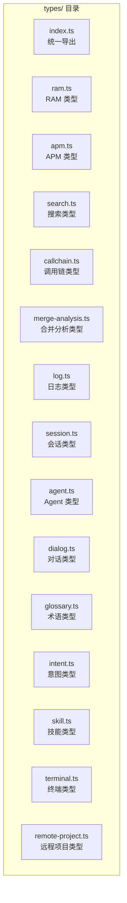

# 06-数据模型

## 概述

本文档描述 HiSi DevTool Frontend 中使用的 TypeScript 类型定义和数据模型。所有类型定义位于 `src/types/` 目录下，按功能模块组织。

---

## 类型组织结构



---

## RAM 类型

### ram.ts

**路径**：`src/types/ram.ts`

**核心类型**：

```typescript
// RAM 状态
type RamStatus = 'idle' | 'running' | 'clarify' | 'confirm' | 'completed' | 'error' | 'aborted'

// SSE 事件
interface RamEvent {
  readonly seq: number
  readonly type: string
  readonly payload: Readonly<Record<string, unknown>>
}

// 澄清 Schema
interface ClarifySchema {
  readonly nodeName?: string
  readonly questions: readonly string[]
}

// 成本快照
interface RamCostSnapshot {
  readonly tokens: number
  readonly usd: number
}

// 启动会话响应
interface StartSessionResponse {
  readonly sessionId: string
}

// 澄清响应
interface ClarifyResponse {
  readonly accepted: boolean
  readonly nextSeq: number
  readonly status?: string
  readonly hitlPayload?: {
    readonly nodeName: string
    readonly output: Readonly<Record<string, unknown>>
  }
}

// 恢复响应
interface ResumeResponse {
  readonly resumed: boolean
}

// 中止响应
interface AbortResponse {
  readonly aborted: boolean
}

// HITL Schema（人工确认）
interface HitlSchema {
  readonly nodeName: string
  readonly output: Readonly<Record<string, unknown>>
}

// 确认响应
interface ConfirmResponse {
  readonly accepted: boolean
  readonly nextSeq: number
}
```

**使用示例**：
```typescript
import type { RamEvent, ClarifySchema, HitlSchema } from '@/types/ram'

const event: RamEvent = {
  seq: 1,
  type: 'CHECKPOINT',
  payload: { nodeName: 'clarify', output: {} }
}
```

---

## APM 类型

### apm.ts

**路径**：`src/types/apm.ts`

**核心类型**：

```typescript
// Schema 节点
interface SchemaNode {
  type: 'object' | 'array' | 'string' | 'number' | 'boolean'
  properties?: Record<string, SchemaNode>
  items?: SchemaNode
  description?: string
  default?: unknown
  required?: string[]
  format?: string
  enum?: unknown[]
}

// 入口点
interface EntryPoint {
  id: string
  name: string
  type: 'controller' | 'scheduled' | 'mq' | 'feign'
  path: string
  method?: string
  className: string
  methodName: string
  description?: string
}

// 入口点详情
interface EntryPointDetail {
  id: string
  name: string
  type: string
  path: string
  method: string
  className: string
  methodName: string
  parameters: ParameterInfo[]
  returnType: string
  description: string
}

// 参数信息
interface ParameterInfo {
  name: string
  type: string
  required: boolean
  description?: string
  defaultValue?: unknown
}

// 执行结果
interface ExecutionResult {
  statusCode: number
  statusText: string
  headers: Record<string, string>
  body: unknown
  duration: number
  error?: string
  traceId?: string
}

// API 搜索结果
interface ApiSearchResult {
  id: string
  name: string
  path: string
  method: string
  description: string
}
```

---

## 搜索类型

### search.ts

**路径**：`src/types/search.ts`

**核心类型**：

```typescript
// 搜索结果
interface SearchResult {
  id: string
  className: string
  methodName: string
  description: string
  score: number
  codeSnippet: string
}

// 方法信息
interface MethodInfo {
  id: string
  className: string
  methodName: string
  description: string
  projectPath: string
  language: 'java' | 'python'
}

// 方法详情
interface MethodDetail {
  id: string
  className: string
  methodName: string
  description: string
  parameters: ParameterInfo[]
  returnType: string
  code: string
}
```

---

## 调用链类型

### callchain.ts

**路径**：`src/types/callchain.ts`

**核心类型**：

```typescript
// 调用链
interface CallChain {
  root: CallNode
  nodes: CallNode[]
  edges: CallEdge[]
}

// 调用节点
interface CallNode {
  id: string
  className: string
  methodName: string
  type: 'method' | 'entry' | 'bridge'
}

// 调用边
interface CallEdge {
  source: string
  target: string
  type: 'call' | 'reference' | 'feign' | 'mq'
}

// Git 仓库信息
interface GitRepositoryInfo {
  name: string
  path: string
  branch: string
  clean: boolean
  source: string
}

// URI 信息
interface UriInfo {
  uri: string
  method: string
  className: string
  methodName: string
}

// 桥接点
interface BridgePoint {
  id: string
  type: 'feign' | 'mq'
  serviceName: string
  methodName: string
  targetService: string
}
```

---

## 合并分析类型

### merge-analysis.ts

**路径**：`src/types/merge-analysis.ts`

**核心类型**：

```typescript
// 合并分析状态
type MergeAnalysisStatus = 'idle' | 'running' | 'completed' | 'error'

// 合并分析事件
interface MergeAnalysisEvent {
  seq: number
  type: string
  payload: Record<string, unknown>
}

// Diff 结果
interface DiffResult {
  files: FileDiff[]
  summary: {
    totalFiles: number
    addedLines: number
    removedLines: number
  }
}

// 文件差异
interface FileDiff {
  path: string
  status: 'added' | 'modified' | 'deleted'
  additions: number
  deletions: number
  hunks: DiffHunk[]
}

// Diff Hunk
interface DiffHunk {
  oldStart: number
  oldLines: number
  newStart: number
  newLines: number
  content: string
}

// 分析结果
interface AnalysisResult {
  sessionId: string
  status: 'completed' | 'failed'
  impact: {
    modifiedFiles: string[]
    affectedMethods: string[]
    riskLevel: 'low' | 'medium' | 'high'
  }
  report: string
  suggestions: string[]
}
```

---

## 日志类型

### log.ts

**路径**：`src/types/log.ts`

**核心类型**：

```typescript
// 日志条目
interface LogEntry {
  id: string
  timestamp: string
  level: 'ERROR' | 'WARN' | 'INFO' | 'DEBUG'
  message: string
  traceId?: string
  serviceName?: string
  stackTrace?: string
}

// 日志查询结果
interface LogQueryResult {
  logs: LogEntry[]
  total: number
}

// 日志报告
interface LogReport {
  id: string
  status: 'pending' | 'processing' | 'completed' | 'failed'
  rootCause: string
  suggestions: string[]
  relatedLogs: LogEntry[]
}
```

---

## 会话类型

### session.ts

**路径**：`src/types/session.ts`

**核心类型**：

```typescript
// Claude 会话
interface ClaudeSession {
  id: string
  name: string
  createdAt: string
  updatedAt: string
  messageCount: number
  status: 'active' | 'archived'
  metadata?: Record<string, unknown>
}
```

---

## Agent 类型

### agent.ts

**路径**：`src/types/agent.ts`

**核心类型**：

```typescript
// Agent 配置
interface AgentConfig {
  id: string
  name: string
  type: string
  model: string
  temperature: number
  maxTokens: number
  systemPrompt: string
}

// Agent 执行结果
interface AgentResult {
  success: boolean
  output: string
  error?: string
  duration: number
}
```

---

## 对话类型

### dialog.ts

**路径**：`src/types/dialog.ts`

**核心类型**：

```typescript
// 对话消息
interface DialogMessage {
  id: string
  role: 'user' | 'assistant' | 'system'
  content: string
  timestamp: string
}

// 对话上下文
interface DialogContext {
  sessionId: string
  messages: DialogMessage[]
  metadata: Record<string, unknown>
}
```

---

## 术语类型

### glossary.ts

**路径**：`src/types/glossary.ts`

**核心类型**：

```typescript
// 术语
interface GlossaryTerm {
  id: string
  term: string
  definition: string
  category: string
  examples?: string[]
}
```

---

## 意图类型

### intent.ts

**路径**：`src/types/intent.ts`

**核心类型**：

```typescript
// 意图
interface Intent {
  id: string
  name: string
  description: string
  keywords: string[]
  handler: string
}
```

---

## 技能类型

### skill.ts

**路径**：`src/types/skill.ts`

**核心类型**：

```typescript
// 技能
interface Skill {
  id: string
  name: string
  description: string
  version: string
  author: string
  installed: boolean
  config?: Record<string, unknown>
}
```

---

## 终端类型

### terminal.ts

**路径**：`src/types/terminal.ts`

**核心类型**：

```typescript
// 终端主题
interface TerminalTheme {
  name: string
  label: string
  background: string
  foreground: string
  cursor?: string
  selection?: string
}

// 终端配置
interface TerminalConfig {
  fontSize: number
  fontFamily: string
  theme: TerminalTheme
  cursorBlink: boolean
}
```

---

## 远程项目类型

### remote-project.ts

**路径**：`src/types/remote-project.ts`

**核心类型**：

```typescript
// 远程项目
interface RemoteProject {
  id: string
  name: string
  url: string
  branch: string
  lastSync: string
  status: 'active' | 'inactive'
}

// 调度配置
interface ScheduleConfig {
  enabled: boolean
  cron: string
  lastRun?: string
  nextRun?: string
}
```

---

## 类型使用模式

### 1. 类型导出

所有类型在 `types/index.ts` 中统一导出：

```typescript
// types/index.ts
export * from './ram'
export * from './apm'
export * from './search'
export * from './callchain'
export * from './merge-analysis'
export * from './log'
export * from './session'
export * from './agent'
export * from './dialog'
export * from './glossary'
export * from './intent'
export * from './skill'
export * from './terminal'
export * from './remote-project'
```

### 2. 组件中使用类型

```typescript
// views/ram/DraftPage.vue
import type { RamEvent, ClarifySchema, HitlSchema } from '@/types/ram'
import type { ImpactPayload } from '@/stores/ram'

const events = ref<RamEvent[]>([])
const clarifySchema = ref<ClarifySchema | null>(null)
const hitlSchema = ref<HitlSchema | null>(null)
const impact = ref<ImpactPayload | null>(null)
```

### 3. API 中使用类型

```typescript
// api/ram.ts
import type { 
  StartSessionResponse, 
  ClarifyResponse, 
  ConfirmResponse 
} from '@/types/ram'

export function startRamSession(
  payload: StartSessionPayload
): Promise<StartSessionResponse> {
  return request.post('/ram/sessions', payload)
}
```

### 4. Store 中使用类型

```typescript
// stores/ram.ts
import type { ImpactPayload } from '@/types/ram'

export const useRamStore = defineStore('ram', () => {
  const impact = ref<ImpactPayload | null>(null)
  
  function setImpact(sessionId: string, payload: ImpactPayload): void {
    impact.value = payload
  }
  
  return { impact, setImpact }
})
```

---

## 类型安全最佳实践

### 1. 使用 readonly

对于不可变数据，使用 `readonly` 修饰符：

```typescript
interface RamEvent {
  readonly seq: number
  readonly type: string
  readonly payload: Readonly<Record<string, unknown>>
}
```

### 2. 使用类型守卫

```typescript
function isClarifySchema(value: unknown): value is ClarifySchema {
  return (
    typeof value === 'object' &&
    value !== null &&
    'questions' in value &&
    Array.isArray((value as ClarifySchema).questions)
  )
}
```

### 3. 使用泛型

```typescript
interface ApiResponse<T> {
  success: boolean
  data?: T
  error?: string
}
```

### 4. 使用联合类型

```typescript
type RamStatus = 'idle' | 'running' | 'clarify' | 'confirm' | 'completed' | 'error' | 'aborted'
```

---

## 下一步

- [API服务层](../03-模块说明/API服务层.md) - 了解类型在 API 中的使用
- [状态管理](../03-模块说明/状态管理.md) - 了解类型在 Store 中的使用
- [接口文档](../05-接口文档/index.md) - 了解 API 接口详情
