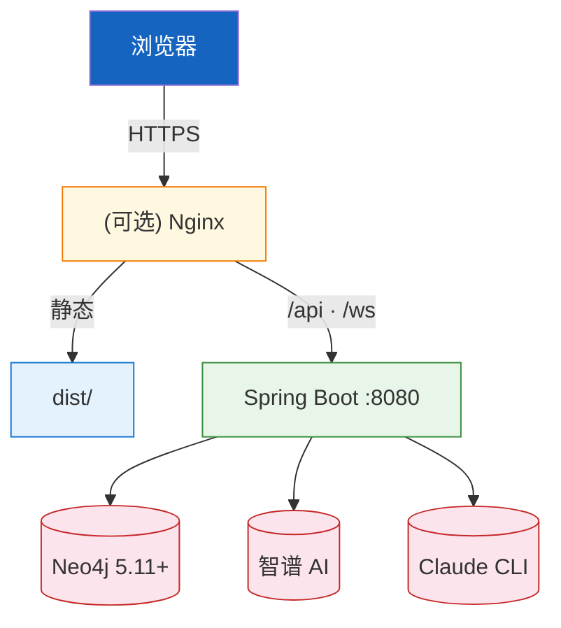

# 部署运维

---

## 1. 环境矩阵

| 环境 | 前端 | 后端 | 用途 |
|------|------|------|------|
| 开发 | `vite` :5173(HMR) | `mvn spring-boot:run` :8080 | 本机开发 |
| 预览 | `vite preview` :4173 | :8080 | 验证 build 产物 |
| 生产 | 静态资源 + (可选)Nginx | Spring Boot :8080 | 局域网/单机部署 |

---

## 2. 构建与脚本

`package.json`:

| 脚本 | 命令 | 说明 |
|------|------|------|
| `dev` | `vite` | 开发服务器,代理 `/api`/`/ws` → :8080 |
| `build` | `run-p type-check "build-only {@}"` | 并行类型检查 + 构建 |
| `build-only` | `vite build` | 仅 Vite 构建 |
| `preview` | `vite preview` | 预览 build 产物(:4173) |
| `type-check` | `vue-tsc --build` | TS + Vue SFC 严格类型检查 |
| `test:unit` | `vitest run` | 单元测试 |
| `test:e2e` | `playwright test` | E2E(5 浏览器) |

> 构建产物默认输出到 `dist/`。

---

## 3. Vite 配置要点(`vite.config.ts`)

| 配置 | 值 |
|------|-----|
| alias | `'@'` → `./src` |
| server.port | 5173 |
| server.proxy `/api` | `target: http://localhost:8080`,`changeOrigin: true` |
| server.proxy `/ws` | `target: ws://localhost:8080`,`ws: true`,`changeOrigin: true` |

---

## 4. 部署拓扑



---

## 5. 启动顺序(必须)

```bash
# 1) 启动后端(必须先)
cd ../hisi-dev-tool && ./mvnw spring-boot:run

# 2) 启动前端
cd hisi-dev-tool-frontend
npm install
npm run dev
```

打开 `http://localhost:5173`,自动跳转到 `/project`。

---

## 6. E2E 测试

`playwright.config.ts` 定义 5 个浏览器矩阵:

| project | 设备 |
|---------|------|
| chromium | Desktop Chrome |
| firefox | Desktop Firefox |
| webkit | Desktop Safari |
| Mobile Chrome | Pixel 5 |
| Mobile Safari | iPhone 12 |

baseURL `http://localhost:5173`,执行前需保证前端 dev 服务器运行。

```bash
npx playwright install   # 首次安装浏览器二进制
npm run test:e2e
```

`e2e/` 目录下 10 个 spec 覆盖:项目管理、KG 生成、语义检索、调用链、日志查询、Skill 安装、终端、对话等。

---

## 7. 单元测试

| 工具 | 配置 | 包含 |
|------|------|------|
| Vitest 4 | `vitest.config.ts` | `src/**/*.{test,spec}.{ts,tsx}` |
| 环境 | happy-dom | 轻量浏览器 DOM 模拟 |
| 覆盖率 | @vitest/coverage-v8 | `npm run test:unit -- --coverage` |

已覆盖:`stores/app.test.ts`、`stores/themeStore.test.ts`、`utils/pathUtils.test.ts`、`utils/logParser.test.ts`、`themes/presets.test.ts`、`themes/types.test.ts`。

---

## 8. 生产部署建议

| 关注点 | 建议 |
|--------|------|
| 静态资源 | `dist/` 由 Nginx 直接托管(开 `gzip` + 长缓存 + `index.html` no-cache) |
| 路由 fallback | history 模式需 `try_files $uri $uri/ /index.html` |
| API 代理 | Nginx `location /api { proxy_pass http://localhost:8080; }`、`location /ws { proxy_pass http://localhost:8080; proxy_set_header Upgrade $http_upgrade; proxy_set_header Connection "upgrade"; }` |
| HTTPS | 前端协议 https 时 WS 自动 wss(`api/terminal.ts` 自动推导) |
| 后端依赖 | Java 17、Neo4j 5.11+、可访问智谱 API、本机有 Claude CLI |

---

## 9. 故障排查

| 现象 | 排查 |
|------|------|
| 进入业务页被拦回 `/project` | 未配置 PROJECT_DIR / 未勾选项目 |
| `网络连接失败` | 后端 `:8080` 未启 / vite 代理失效 |
| 终端打不开 | `/ws/terminal` 失败,检查 vite `/ws` 代理或 Nginx Upgrade |
| 调用链表格空 | KG 未生成或当前项目未在 selectedProjects |
| Element Plus 图标缺失 | `main.ts` 全量注册被误删 |
| 类型检查失败 | `npm run type-check`,优先修类型不要 `as any` |
