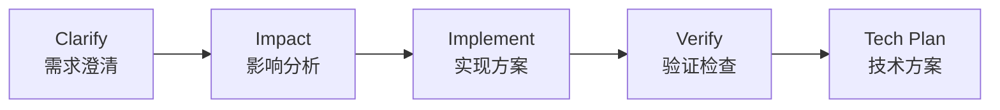
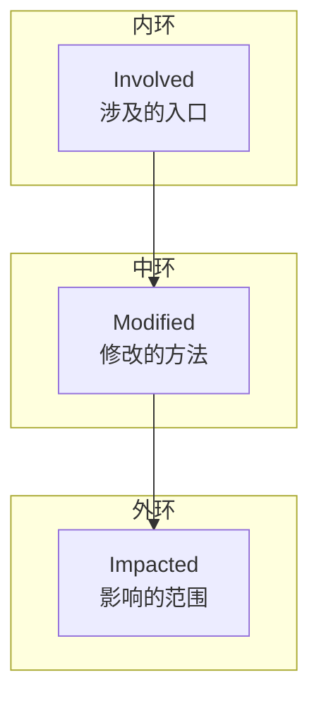

# 09-术语表

## 概述

本文档定义 HiSi DevTool Frontend 中使用的专业术语和领域概念，帮助开发者快速理解项目中的专有名词。

---

## 术语列表

### A

**APM（Application Performance Monitoring）**
应用性能监控。HiSi DevTool 中的 API 调试和诊断模块，提供 DTO schema body skeleton、entryNodeId launch、API search autocomplete 等功能。

**ApiResponse**
后端 API 统一响应格式，包含 `success`、`data`、`error`、`meta` 字段。前端在拦截器中自动解包。

**Axios**
项目使用的 HTTP 客户端库，用于与后端 API 通信。

---

### B

**BodySchemaForm**
APM 模块中的 DTO schema body skeleton 表单组件，根据后端 Schema 自动生成请求体。

**Bridge**
跨服务桥接点，连接不同模块或服务的关键节点，如 Feign 调用、MQ 消息等。

---

### C

**CallChain**
调用链，描述方法之间的调用关系，包括上游调用方和下游被调用方。

**CallNode**
调用链中的节点，代表一个方法或入口点。

**CallEdge**
调用链中的边，代表方法之间的调用关系。

**CHECKPOINT**
RAM 分析过程中的检查点事件，表示某个分析节点完成。

**ClarifyModal**
RAM 模块中的澄清问题弹窗，用于收集用户对需求的补充信息。

**ClarifySchema**
澄清问题的 Schema，定义需要用户回答的问题列表。

**Claude CLI**
Claude 命令行工具，HiSi DevTool 通过终端模拟与其交互。

**Composable**
Vue 3 组合式函数，用于封装可复用的逻辑，如 `useRamSession`、`useDiagnosis`。

**ConfirmModal**
RAM 模块中的节点确认弹窗，用于等待用户审批节点输出。

**CostMeter**
RAM 模块中的成本计量器，显示 token 消耗和费用。

**CrossServiceBridgeTab**
图谱浏览器中的跨服务桥接标签页，展示 Feign、MQ 等跨服务调用。

**Cytoscape**
图数据库可视化库，用于渲染 ThreeRingGraph。

---

### D

**DAG（Directed Acyclic Graph）**
有向无环图，用于表示 RAM 分析的 5 个节点（Clarify → Impact → Implement → Verify → Tech Plan）。

**DagGraph**
RAM 模块中的 DAG 流程图组件，展示分析节点状态。

**DagNode**
DAG 图中的节点，包含 `key`、`label`、`status` 属性。

**dagre**
DAG 自动布局算法库，用于计算节点位置。

**DraftPage**
RAM 模块中的草稿页面，实时展示分析进度。

---

### E

**ECharts**
数据可视化库，用于渲染图表（桑基图、统计图表等）。

**Element Plus**
Vue 3 UI 组件库，提供 50+ 高质量组件。

**EntryPoint**
API 入口点，包括 Controller、Scheduled、MQ Listener、Feign Client 等类型。

**EventSource**
浏览器原生 SSE 客户端，用于接收服务器推送的事件。

**ExecutionResult**
APM 模块中 API 请求的执行结果，包含状态码、响应体、耗时等信息。

---

### F

**FileBrowserPanel**
RAM 模块中的文件浏览器面板，展示受影响的文件列表。

**FlowDag**
调用链模块中的流程 DAG 组件，展示调用流程。

**Feign**
声明式 HTTP 客户端，用于微服务间的调用。

---

### G

**GraphExplorerTab**
图谱浏览器中的图谱浏览器标签页，提供方法搜索和调用链导航。

**GraphPreviewPage**
RAM 模块中的图谱预览页面，可视化展示影响图谱。

---

### H

**HITL（Human-In-The-Loop）**
人工介入，RAM 分析过程中需要用户确认的环节。

**HitlSchema**
人工确认的 Schema，定义需要用户审批的节点输出。

**HybridSearch**
混合检索，结合向量搜索、全文搜索和图遍历的搜索方式。

---

### I

**ImpactPayload**
RAM 模块中影响分析的数据载荷，包含 `involved`、`modified`、`impacted`、`riskScores`。

**ImpactOutputView**
RAM 模块中的影响分析输出视图，结构化展示 impact 数据。

**ImpactSankeyGraph**
RAM 模块中的桑基图组件，展示影响流向。

**InputPage**
RAM 模块中的输入页面，收集需求原文和目标项目信息。

---

### K

**KnowledgeGraph**
知识图谱，将代码结构转换为图数据，支持可视化探索和分析。

**KnowledgeGraphView**
图谱浏览器主页面，整合多个标签页。

---

### M

**MergeAnalysis**
合并分析，分析代码合并的影响范围和风险。

**MergeAnalysisEvent**
合并分析 SSE 事件，包含 `seq`、`type`、`payload`。

**Mermaid**
流程图/时序图渲染库，使用文本描述图表。

**MethodInfo**
方法信息，包含类名、方法名、描述等。

**Minimap**
小地图组件，提供图表的缩略视图。

**MQ（Message Queue）**
消息队列，用于异步通信。

---

### P

**Pinia**
Vue 3 状态管理库，项目用于管理全局状态。

**Playwright**
E2E 测试框架，支持多浏览器测试。

---

### R

**RAM（Requirement Analysis Master）**
需求分析大师，HiSi DevTool 的核心功能模块，提供三页向导流程：输入需求 → 实时分析 → 图谱可视化。

**RamEvent**
RAM SSE 事件，包含 `seq`、`type`、`payload`。

**RamStatus**
RAM 会话状态，包括 `idle`、`running`、`clarify`、`confirm`、`completed`、`error`、`aborted`。

**ramStore**
RAM 模块的 Pinia Store，存储 Impact 数据。

**RemoteProject**
远程项目，通过 Git URL 管理的项目。

---

### S

**SchemaNode**
DTO Schema 节点，描述数据结构，支持 `object`、`array`、`string`、`number`、`boolean` 类型。

**SemanticSearch**
语义搜索，使用自然语言查询代码。

**SessionList**
Claude 终端中的会话列表组件。

**SSE（Server-Sent Events）**
服务器推送事件，用于单向实时通信。

---

### T

**TechPlanOutputView**
RAM 模块中的技术方案输出视图，支持 Mermaid 图表渲染。

**TerminalTheme**
终端主题，定义终端的颜色配置。

**ThreeRingGraph**
RAM 模块中的三环影响图组件，展示 `involved`、`modified`、`impacted` 三层关系。

**TraceView**
APM 模块中的追踪视图，展示分布式追踪信息。

**TypeScript**
项目使用的类型系统，提供静态类型检查。

---

### U

**useMergeAnalysisSession**
合并分析模块的 Composable，封装 SSE 会话管理。

**useRamSession**
RAM 模块的 Composable，封装 SSE 会话管理。

---

### V

**Vite**
前端构建工具，用于开发服务器和生产构建。

**Vitest**
单元测试框架，与 Vite 深度集成。

**Vue Flow**
交互式流程图库，用于渲染 DAG。

**Vue Router**
Vue 3 路由库，用于 SPA 路由管理。

---

### W

**WebSocket**
全双工通信协议，用于 Claude 终端的双向交互。

**workspaceStore**
工作区状态管理 Store。

---

### X

**xterm.js**
Web 终端模拟库，用于在浏览器中模拟终端。

---

## 领域概念

### RAM 分析流程

### 三环影响图

### 调用链类型

| 类型 | 说明 |
|------|------|
| `call` | 方法调用 |
| `reference` | 方法引用 |
| `feign` | Feign 远程调用 |
| `mq` | MQ 消息 |

### 入口点类型

| 类型 | 说明 |
|------|------|
| `controller` | REST API 入口 |
| `scheduled` | 定时任务入口 |
| `mq` | MQ 监听器入口 |
| `feign` | Feign 客户端入口 |

---

## 下一步

- [项目概览](../01-项目概览/index.md) - 了解项目整体情况
- [架构设计](../02-架构设计/index.md) - 了解系统架构
- [技术决策](../08-技术决策/index.md) - 了解技术选型决策
