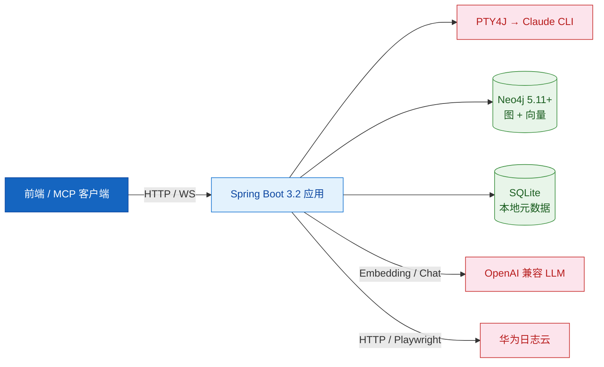
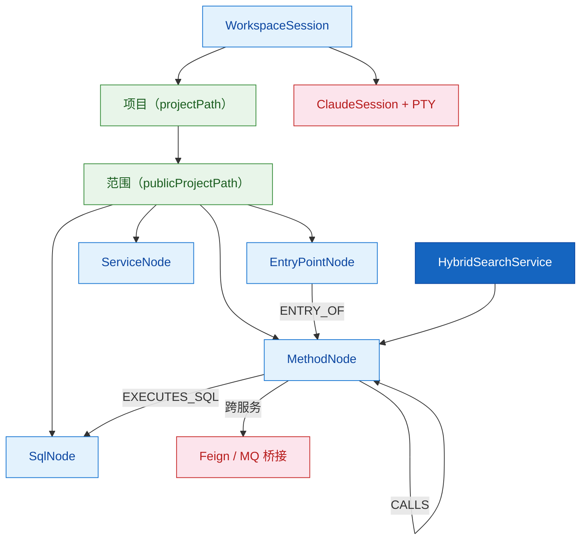

# 项目概览

---

## 1. 使命与定位

### 1.1 项目使命

**HiSi DevTool Backend** 是面向研发同学的代码理解与运维一体化工具后端，核心使命是：

> 让开发者在不离开本地工具链的情况下，**理解任意大型代码库的结构与调用关系**、**追踪线上日志的根因**、**评估变更的影响半径**，并通过 AI 与本地 Claude CLI 形成闭环。

### 1.2 目标用户

| 用户角色 | 使用场景 | 核心诉求 |
|---------|---------|---------|
| 后端研发 | 接手新仓库 / 排查跨服务调用 | 调用链可视化、语义搜索、影响分析 |
| 测试 / 质量 | 评估改动影响 | 影响范围预测、风险打分、用例推荐 |
| SRE / 运维 | 排查线上异常 | 日志云查询、根因分析、调用链溯源 |
| AI 工具集成方 | 通过 MCP / HTTP 接入 | 稳定的 REST 接口与 OpenAI 兼容模型抽象 |

### 1.3 项目边界

| 范围 | 说明 |
|------|------|
| **做** | Java/Python 知识图谱、混合检索、调用链/影响/风险分析、Claude CLI 终端、日志云分析、技能市场 |
| **不做** | 不做代码托管（不替代 Git/CodeHub）、不做 IDE（仅提供 REST/WS）、不做生产级日志聚合（接入华为日志云） |
| **未来可能** | 多语言支持扩展（Go/TS）、公共图谱跨项目检索（`publicProjectPath` 已铺垫） |

---

## 2. 技术栈

| 层 | 技术 | 版本 | 说明 | 选型理由 |
|----|------|------|------|---------|
| 语言 | Java | 17 | LTS，支持 Records / Sealed | 与公司主线一致 |
| 应用框架 | Spring Boot | 3.2.0 | Web / WebSocket / Actuator / Validation | 生态成熟 |
| 图数据库 | Neo4j | 5.11+ | 图 + 原生 VECTOR INDEX (cosine) | 同时承载关系 + 向量，避免双存储 |
| 图谱 ORM | Spring Data Neo4j | 7.x | `@Node` / `@Property` / Repository | 与 Spring Boot 无缝集成 |
| 本地存储 | SQLite | 3.45.1 | 会话 / 任务 / 缓存元数据 | 零运维、单文件 |
| Java 解析 | JavaParser + Symbol Solver | 3.27.0 | AST 解析与符号解析 | 主流 Java 静态分析工具 |
| Python 解析 | ANTLR4 + Python3 grammar | 4.13.1 | AST 解析 | 唯一稳定的 Python 离线解析方案 |
| 终端集成 | PTY4J | 0.13.10 | 创建伪终端进程对接 Claude CLI | 跨平台 PTY |
| 浏览器自动化 | Playwright | 1.46.0 | 日志云 Playwright 模式 | 兜底登录方式 |
| HTML 解析 | Jsoup | 1.18.1 | 抓取与解析 | 轻量 |
| HTTP 客户端 | OkHttp | 4.12.0 | 调外部 LLM | 连接池 + 拦截器 |
| 缓存 | Caffeine | (Spring 默认) | 本地内存缓存（嵌入向量、查询） | 性能 |
| 响应式 | Reactor Core | 3.6.10 | SSE 流式输出（如 MCP 安装） | Spring 生态自带 |
| AI 模型抽象 | OpenAI 兼容协议 | — | `/embeddings` + `/chat/completions` | 一套配置切换智谱/硅基/讯飞 |
| 嵌入模型（默认） | Qwen3-VL-Embedding-8B | 4096 维 | SiliconFlow 提供 | 离线/在线兼容 |
| 文本模型（默认） | glm-4-flash | — | 智谱 AI | 描述生成低延迟 |
| 向量计算 | ONNX Runtime + DJL Tokenizers | 1.18.0 / 0.29.0 | 离线本地嵌入兜底 | 内网无外部依赖时使用 |
| 单元测试 | JUnit 5 + Mockito + AssertJ | (Spring 默认) | — | Spring 默认 |
| 集成测试 | Testcontainers (Neo4j) | 1.21.4 | 启动真实 Neo4j 容器 | 端到端可信 |
| 覆盖率 | JaCoCo | 0.8.11 | 行覆盖 80% / 分支 70% | pom 中已强约束 |

### 技术栈关系图



---

## 3. 项目结构

| 目录 | 职责 | 核心文件 / 子包 | 大致规模 |
|------|------|----------------|---------|
| `src/main/java/com/huawei/hisi/` | 全部 Java 源码（顶层包） | `DevToolApplication.java` | 1 |
| `.../config/` | 全局配置类 | `Neo4jConfig`、`CorsConfig`、`WebSocketConfig`、`GlobalExceptionHandler`、`EmbeddingModelConfig`、`TextModelConfig`、`ProxyConfig`、`SQLiteSchemaInitializer` | 16 |
| `.../controller/` | 通用 REST Controller | 14 个 Controller | 14 |
| `.../service/` | 通用业务服务 | `SessionService` / `WorkspaceSessionService` / `LogCloudService` / `OpsService` / `RootCauseAnalysisService` / `KnowledgeGraphTaskService` / `UnifiedEmbeddingService` / `UnifiedTextService` 等 | 28 |
| `.../service/intent/` | 自然语言对话 / 意图识别 | `DialogController`、`DialogContext`、`IntentResult`、`NaturalLanguageDiagnosisCoordinator` | 9 |
| `.../service/impact/` | 影响分析 | `impl/`、`model/` | 4 + 子包 |
| `.../service/risk/` | 风险评估 | `impl/`、`model/` | 1 + 子包 |
| `.../service/semantic/` | 异常路径语义分析 | `impl/`、`model/` | 3 + 子包 |
| `.../service/suggestion/` | 推荐引擎 | `impl/`、`model/` | 1 + 子包 |
| `.../scanner/` | 代码扫描器（HTTP / Feign / MQ / Endpoint / Proxy） | `EndpointScanner` / `FeignClientScanner` / `HttpCallScanner` / `MQEndpointScanner` / `ProxyClassScanner` | 5 |
| `.../knowledgegraph/` | 知识图谱构建主入口 | `service/KnowledgeGraphBuilder`、`scanner/`、`python/`、`link/`、`util/`、`vector/`、`migration/` | 总计约 55 |
| `.../knowledgegraph/python/` | Python 子图谱（ANTLR4） | `parser/`、`scanner/`、`call/`、`model/` | 13 |
| `.../neo4j/` | Neo4j 图模型与检索服务 | `model/`、`repository/`、`service/`（HybridSearch、QueryTypeDetector、Embedding、VectorIndex）、`controller/`、`config/` | 28 |
| `.../agent/` | AI 智能体编排 | `DiagnosticAgent`、`controller/`、`event/`、`model/`、`orchestrator/` | 12 |
| `.../skill/` | 技能市场 | `SkillController`、`SkillService`、`model/` | 8 |
| `.../handler/` | WebSocket 处理器 | `TerminalWebSocketHandler` | 1 |
| `.../cache/` | 全局缓存 | `GlobalAnalysisCache` | 2 |
| `.../model/` | 通用 DTO / 实体 | `ApiResponse` / `ClaudeSession` / `ClaudeMessage` / `ScanResult` / `FeignClientInfo` 等 | 38 |
| `.../repository/` | SQLite Repository | `ClaudeSessionRepository` 等 | 5 |
| `.../utils/` | 工具类 | `PathUtils` / `SnowflakeIdGenerator` / `StackTraceFilter` / `CodeAnalysisUtils` | 4 |
| `src/main/resources/` | 配置与内置资源 | `application.yml` / `application-prod.yml` / `logback-spring.xml` / `prompts/` / `codeai-skills/` | — |
| `src/main/antlr4/` | Python3 文法定义 | `.g4` 文件 | — |
| `docs/` | 项目文档 | `api-document.md`、`neo4j/`、`plans/` | — |
| `scripts/` | 启动 / 校验脚本 | — | — |

---

## 4. 快速启动

### 4.1 环境准备

| 依赖 | 版本要求 | 验证 |
|------|---------|------|
| JDK | 17+ | `java -version` |
| Maven | 3.8+ | `mvn -v` |
| Neo4j | 5.11+（含 APOC + GDS 插件） | 浏览器访问 `http://localhost:7474` |
| Docker（可选） | 任意版本 | 用于 `docker-compose.neo4j.yml` 启动 Neo4j |

```bash
git clone <repo-url>
cd hisi-dev-tool
```

### 4.2 安装与启动

```bash
# 一键启动 Neo4j（可选）
docker compose -f docker-compose.neo4j.yml up -d

# 设置必要环境变量（PowerShell 示例）
$env:NEO4J_PASSWORD = "12345678"
$env:EMBEDDING_API_KEY = "sk-..."
$env:TEXT_MODEL_API_KEY = "..."

# 编译运行
mvn clean package -DskipTests
java -jar target/devTools-1.0.0.jar
# 或
mvn spring-boot:run
```

### 4.3 验证运行

| 服务 | 地址 | 预期 |
|------|------|------|
| 应用根 | `http://localhost:8080/api/ops/health` | `200 OK` + `{"success": true, ...}` |
| Actuator | `http://localhost:8080/actuator/health` | `{"status":"UP"}` |
| Neo4j Browser | `http://localhost:7474` | 登录成功 |

启动后 `Neo4jInitializer` 会在 `ApplicationReadyEvent` 时自动建索引和约束（含 `publicProjectPath` 索引 + backfill），日志会打印 `Neo4j 初始化完成: 成功=N, 失败=0`。

### 4.4 常见启动问题

| 问题 | 原因 | 解决方案 |
|------|------|---------|
| `Connection refused 7687` | Neo4j 未启动 | 启动 Neo4j Desktop / Docker |
| 启动时 `EMBEDDING_API_KEY` 为空 | 环境变量未注入 | 设置环境变量或在 `application.yml` 直接赋值 |
| Playwright 首次启动慢 | 首次自动下载浏览器 | 等待或预下载 |
| 端口 8080 被占用 | 其他进程占用 | `server.port` 改其他端口 |

---

## 5. 核心概念

| 概念 | 英文 | 定义 | 代码对应 |
|------|------|------|---------|
| **方法节点** | MethodNode | 知识图谱中的最小代码单元，记录类名/方法名/签名/向量等 | `neo4j/model/MethodNode.java` |
| **入口点** | EntryPoint | Controller / Scheduled / MQ Listener / Feign Client 等可被外部触达的方法 | `neo4j/model/EntryPointNode.java` |
| **混合检索** | Hybrid Search | 关键词过滤 + 向量语义匹配 + 调用链图遍历，三路结果通过 RRF 融合 | `neo4j/service/HybridSearchService.java` |
| **查询类型** | QueryType | 自然语言 / 方法名 / FQN / SQL / HTTP URI / 注解 / 异常类型 等 9 种 | `neo4j/model/QueryType.java`、`QueryTypeDetector` |
| **公共图谱** | publicProjectPath | 跨项目共享检索的范围键，单项目时等于 `projectPath` | `MethodNode.publicProjectPath` |
| **桥接点** | Bridge | 跨服务的 Feign / MQ / HTTP 调用关系 | `knowledgegraph/link/`、bridge-stats 接口 |
| **Claude 会话** | ClaudeSession | 与本地 Claude CLI 的一次对话上下文，由 PTY 进程承载 | `model/ClaudeSession`、`SessionService` |
| **工作区** | WorkspaceSession | 用户在前端创建的工作区，绑定项目目录 + 多个 Claude 会话 | `WorkspaceSessionService` |
| **技能** | Skill | 可下载/安装的 codeai 子能力（模板、提示词、规则集） | `skill/SkillService`、`resources/codeai-skills/` |
| **影响分析** | Impact Analysis | 给定改动方法，预测影响的下游节点 + 测试用例 + 风险评分 | `service/impact/` |

### 概念关系图



---

## 6. 项目演进

| 版本 | 关键变更 | 对应 ADR |
|------|---------|---------|
| v3.x | 初版基于 OpenGauss / MySQL 关系型存储 | — |
| v4.0 | 主存储迁移至 Neo4j 5.11+，引入向量索引 | ADR-001 |
| v4.1 | Python 支持 + 公共图谱（`publicProjectPath`） | ADR-002 |
| v4.x（当前主线） | OpenAI 兼容协议统一 LLM 抽象（embedding / text-model） | ADR-003 |

> 详见 [08-技术决策/index.md](../08-技术决策/index.md)
