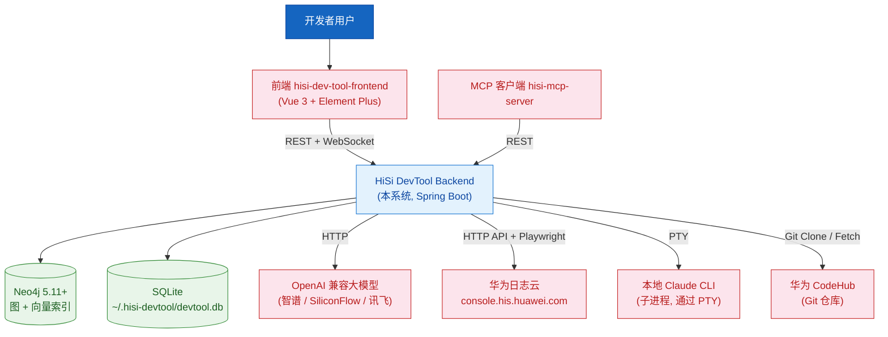
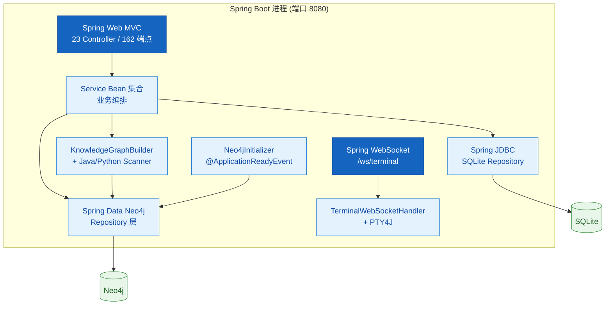
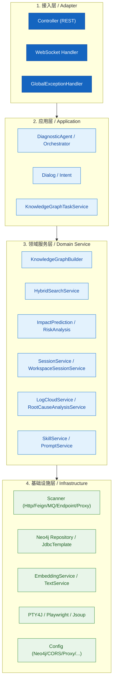
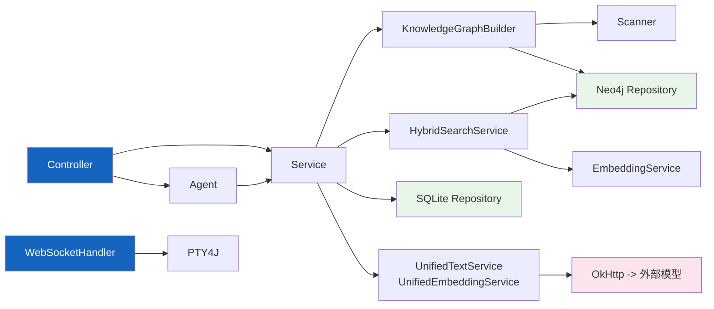
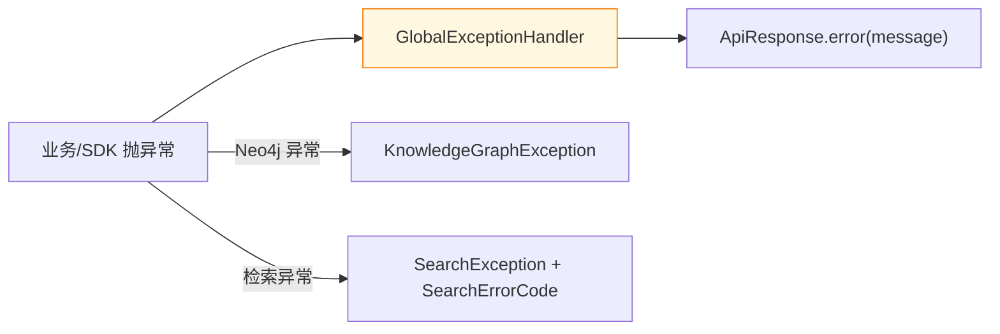
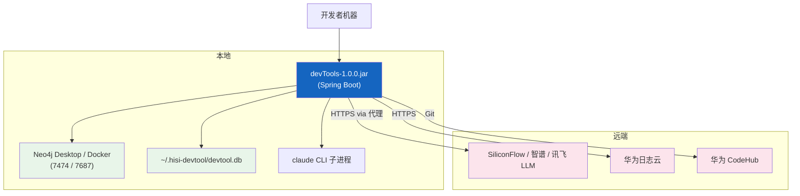

# 架构设计

---

## 1. 架构总览

### 1.1 系统上下文图（C4 Level 1: Context）

| 角色 / 系统 | 类型 | 交互 | 数据流向 |
|------------|------|------|---------|
| 开发者 | 人员 | 浏览器 / IDE | 操作前端 |
| hisi-dev-tool-frontend | 系统 | REST + WebSocket | 双向 |
| hisi-mcp-server | 系统 | REST | 调用本系统暴露的图谱/检索接口 |
| Neo4j | 系统 | Bolt（7687） | 双向，主存储 |
| SQLite | 文件 | JDBC | 双向，本地元数据 |
| LLM | 系统 | HTTPS（OpenAI 协议） | 请求向量 / 描述 |
| 华为日志云 | 系统 | HTTPS API + Playwright 兜底 | 拉取日志 |
| Claude CLI | 进程 | PTY stdio | 双向，会话流 |

### 1.2 容器图（C4 Level 2）

---

## 2. 分层设计

### 2.1 分层架构图

### 2.2 各层职责

#### 接入层（Adapter）

- **职责**：协议转换（HTTP/JSON、WebSocket 文本帧），参数校验，异常转 `ApiResponse`
- **核心组件**：`controller/*Controller`、`handler/TerminalWebSocketHandler`、`config/GlobalExceptionHandler`
- **约束**：不写业务逻辑，所有错误响应统一通过 `ApiResponse.error(...)` 包装

#### 应用层（Application / Orchestration）

- **职责**：跨多个领域服务的编排（任务、意图识别、Agent）
- **核心组件**：`agent/DiagnosticAgent`、`agent/orchestrator/`、`service/intent/NaturalLanguageDiagnosisCoordinator`、`service/KnowledgeGraphTaskService`
- **约束**：通过 Service Bean 注入，不直接访问 Repository

#### 领域服务层（Domain Service）

- **职责**：单一业务能力的实现
- **典型 Bean**：`HybridSearchService`、`KnowledgeGraphBuilder`、`ImpactPredictionServiceImpl`、`RootCauseAnalysisServiceImpl`、`LogCloudServiceImpl`、`SessionServiceImpl`、`SkillServiceImpl`、`PromptServiceImpl`
- **约束**：每个 Service 接口 + impl 模式（同 [java/patterns.md](../../../.claude/rules/java/patterns.md)）

#### 基础设施层（Infrastructure）

- **职责**：与外部系统对接、数据持久化、协议适配
- **核心组件**：`neo4j/repository/`、`repository/`、`scanner/`、`UnifiedEmbeddingService`、`UnifiedTextService`、`config/*Config`
- **约束**：不感知业务流程，只暴露稳定 API

---

## 3. 模块依赖关系

| 规则 | 说明 |
|------|------|
| 单向依赖 | Controller → Service → Repository / 外部 SDK |
| 跨模块通过接口 | Service 全部以接口暴露（`*Service` + `*ServiceImpl`） |
| 循环依赖 | `application.yml` 设置 `spring.main.allow-circular-references: true` —— 临时妥协，新代码禁止引入 |

---

## 4. 架构质量属性

| 优先级 | 质量属性 | 具体要求 | 架构保障措施 |
|--------|---------|---------|-------------|
| P0 | 可扩展性（Schema） | 支持新增语言（Java/Python，将来 Go/TS） | `language` 字段 + 各语言独立 scanner（`knowledgegraph/python/`） |
| P0 | 可观测性 | 关键流程可追踪 | logback + `org.springframework.web=info`、模块级 debug、Spring Actuator |
| P1 | 性能 | 大型仓库 5k+ 方法可在分钟级完成扫描，向量检索 < 1s | Caffeine 缓存（`QueryEmbeddingCache`）、`GlobalAnalysisCache`、Neo4j 原生 VECTOR INDEX |
| P1 | 容错 | 外部 LLM 故障不影响主链路 | OkHttp 重试 (`max-retries=3`)、`@ConditionalOnProperty(neo4j.uri)` 缺配置降级 |
| P2 | 安全 | API Key 不入库不入日志 | 全部走环境变量 (`${EMBEDDING_API_KEY}`)，logback 不打印请求体 |
| P2 | 部署便利 | 单 jar + 本地 SQLite | Spring Boot fat jar，无外部 DB（除 Neo4j） |

### 架构权衡

| 权衡点 | 选择 | 放弃 | 理由 |
|--------|------|------|------|
| Neo4j 同时存图与向量 | Neo4j 原生 VECTOR INDEX | 单独部署 ChromaDB / Milvus | 减少运维组件、避免双写一致性 |
| SQLite 存本地元数据 | SQLite 单文件 | PostgreSQL / OpenGauss | 工具属性，零运维 |
| 同步阻塞 + 任务表 | KnowledgeGraphTaskService 长任务异步 + 状态表 | 引入 MQ | 单实例工具不必上 MQ |
| OpenAI 兼容协议 | 一套 `/embeddings` + `/chat/completions` 抽象 | 各厂商 SDK | 切换成本低，可对接任意兼容服务 |
| 允许循环依赖（临时） | `allow-circular-references=true` | 严格分层 | 历史包袱，待重构 |

---

## 5. 跨切面关注点

### 5.1 错误处理

- 全局：`config/GlobalExceptionHandler`
- 领域：`knowledgegraph/exception/`、`neo4j/model/SearchException`

### 5.2 日志

| 模块 | 默认级别 | 配置位置 |
|------|---------|---------|
| `com.huawei.hisi` | info | `application.yml: logging.level` |
| `com.huawei.hisi.neo4j` | debug | 同上 |
| `com.huawei.hisi.knowledgegraph` | debug | 同上 |
| Spring framework | warn | 同上 |

### 5.3 安全

| 关注点 | 策略 | 实现位置 |
|--------|------|---------|
| 跨域 | 白名单 + 环境变量 | `CorsConfig` + `cors.allowed-origins` |
| 敏感参数 | 环境变量注入 | `${NEO4J_PASSWORD}` / `${*_API_KEY}` |
| 异常脱敏 | 不直接抛 stacktrace 给前端 | `GlobalExceptionHandler` |
| 路径校验 | 防 path traversal | `utils/PathUtils` |

---

## 6. 部署架构

| 环境 | 用途 | 配置 |
|------|------|------|
| 开发 | 本地工具 | `application.yml`（profile=dev） |
| 生产 | 内网服务（如有） | `application-prod.yml` + 环境变量 |

---

## 7. 技术选型总结

| 领域 | 选择 | 备选 | 选择原因 | 对应 ADR |
|------|------|------|---------|---------|
| 主存储 | Neo4j 5.11+ | OpenGauss + Pgvector | 同时承载图 + 向量，社区生态强 | ADR-001 |
| Java AST | JavaParser + SymbolSolver | Eclipse JDT | API 简洁、依赖少 | — |
| Python AST | ANTLR4 + Python3.g4 | tree-sitter / Jython | 离线、Maven 插件可生成 | ADR-002 |
| LLM 抽象 | OpenAI 兼容协议（`/embeddings` / `/chat/completions`） | 多 SDK | 一套配置切换厂商 | ADR-003 |
| 终端集成 | PTY4J | ProcessBuilder | 真伪终端，支持 ANSI / 交互输入 | — |
| 本地存储 | SQLite | H2 / 文件 | 单文件零运维，跨平台 | — |

---

## 8. 架构约束与限制

| 约束类型 | 约束 | 影响 | 应对 |
|---------|------|------|------|
| 部署 | 仅支持单实例（无分布式） | 不能水平扩展 | 当前定位是开发者本机工具 |
| 网络 | 内网必须走代理 | 直连外部 LLM 失败 | `ProxyConfig` 默认走 `proxy.huawei.com:8080` |
| Neo4j 版本 | 必须 ≥ 5.11 | 旧版无 VECTOR INDEX | README 已说明 |
| 嵌入维度 | 与所选模型绑定 | 切换模型后需要重建向量索引 | `Neo4jInitializer` 自动迁移 |
| Java 版本 | 17 | 历史代码不可降级 | 强制约束 |
