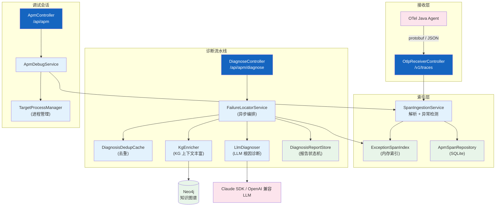
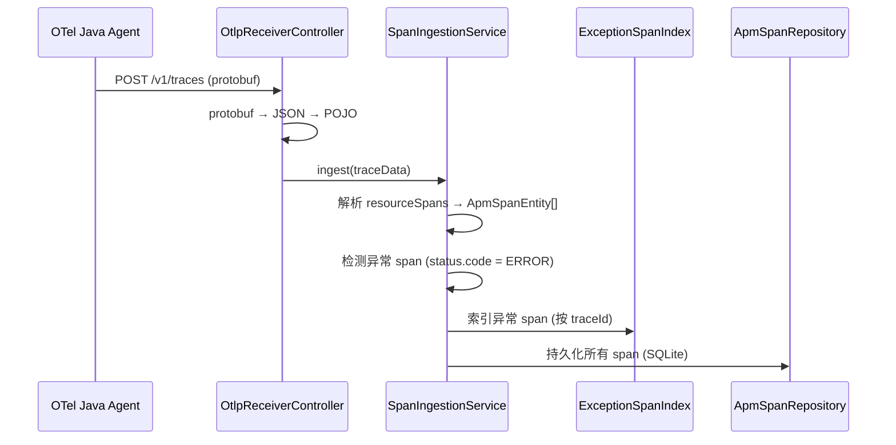
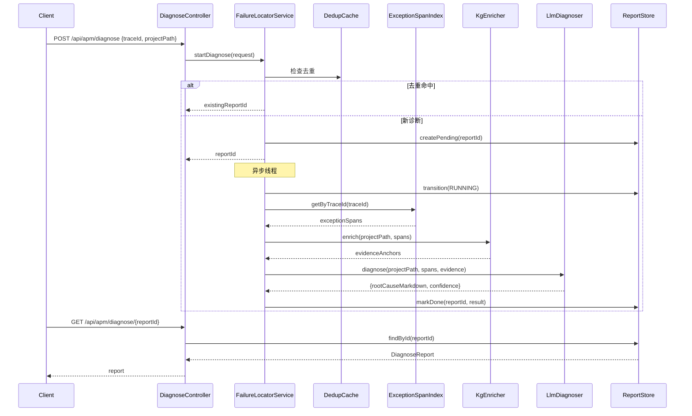
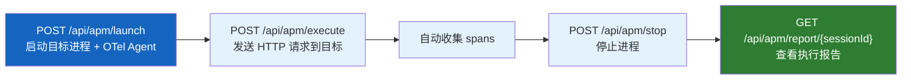
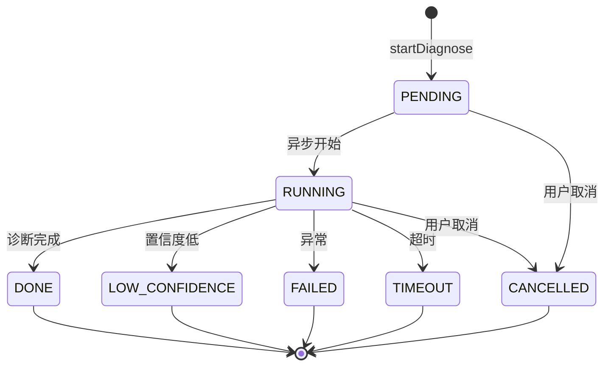

# APM 故障诊断

| 属性 | 值 |
|------|-----|
| **所属层** | 应用层（Orchestration）+ 基础设施层（OTel 接收） |
| **目录** | `apm/`（controller / service / model / cache / config / handler / repository） |
| **文件数** | 44 |
| **核心入口** | `ApmController`、`DiagnoseController`、`OtlpReceiverController` |
| **REST 基础路径** | `/api/apm`、`/api/apm/diagnose`、`/v1/traces` |

---

## 1. 模块概述

### 1.1 职责定义

APM 故障诊断引擎是一个完整的故障定位流水线：接收 OpenTelemetry Agent 上报的 trace 数据，索引异常 span，结合知识图谱（KG）上下文丰富信息，调用 LLM 进行根因诊断，最终输出结构化的诊断报告。

| 本模块负责 ✅ | 不负责 ❌ |
|-------------|---------|
| OTel trace 接收（protobuf + JSON） | 知识图谱构建（在 `knowledgegraph/`） |
| 异常 span 索引与缓存 | 通用检索（在 `HybridSearchService`） |
| KG 上下文丰富（方法体、调用链） | LLM 协议细节（在 `UnifiedTextService`） |
| LLM 根因诊断（Claude / OpenAI 兼容） | APM Agent 管理（外部 OTel Agent） |
| 诊断报告存储与查询 | — |
| APM 调试会话管理（launch/execute/stop） | — |

### 1.2 子包结构

| 子包 / 文件 | 职责 |
|-----------|------|
| `controller/ApmController` | APM 调试会话 CRUD（launch/execute/stop/sessions/spans/trace/report） |
| `controller/DiagnoseController` | 异步诊断流水线入口（POST / GET / DELETE /status） |
| `controller/OtlpReceiverController` | OTLP/HTTP protobuf + JSON trace 接收端点 |
| `controller/ApmTestCaseController` | APM 测试用例管理 |
| `service/ApmDebugService` | 调试会话核心逻辑（进程管理、span 收集） |
| `service/SpanIngestionService` | trace 数据入库（span 解析、异常检测、索引） |
| `service/locator/FailureLocatorService` | 异步诊断流水线编排（去重→KG丰富→LLM诊断→报告） |
| `service/locator/KgEnricher` | KG 上下文丰富接口（方法体、调用链、异常路径） |
| `service/locator/LlmDiagnoser` | LLM 诊断接口（Claude / OpenAI 兼容） |
| `service/locator/FailureLocatorPromptBuilder` | 诊断提示词构建 |
| `service/locator/ApmClaudeLlmClient` | Claude SDK LLM 客户端实现 |
| `service/SpanToKgMapper` | span → KG 节点映射 |
| `service/KgMethodIncludeBuilder` | KG 方法包含关系构建 |
| `service/DebugReportService` | 调试报告服务 |
| `service/OtelAgentManager` | OTel Agent 生命周期管理 |
| `service/TargetProcessManager` | 目标进程管理 |
| `cache/ExceptionSpanIndex` | 异常 span 内存索引（按 traceId） |
| `cache/DiagnosisReportStore` | 诊断报告存储（状态机） |
| `cache/DiagnosisDedupCache` | 诊断去重缓存（防重复提交） |
| `model/` | `ApmSession`、`ApmSpanEntity`、`DiagnoseReport`、`DiagnoseRequest`、`DebugReport`、`OtlpTraceData` 等 |
| `repository/` | `ApmSessionRepository`、`ApmSpanRepository`、`ApmTestCaseRepository`（SQLite） |
| `config/` | `ApmConfig`、`ApmDiagnoseConfig`、`ApmDiagnoseProperties`、`ApmLlmProperties` |
| `handler/ApmWebSocketHandler` | APM WebSocket 实时推送 |

---

## 2. 模块架构

---

## 3. 核心流程

### 3.1 OTel Trace 接收流程

### 3.2 LLM 诊断流水线

### 3.3 APM 调试会话流程

---

## 4. REST 端点

### 4.1 APM 调试会话（`/api/apm`）

| 方法 | 路径 | 说明 |
|------|------|------|
| POST | `/api/apm/launch` | 启动目标进程 + OTel Agent |
| POST | `/api/apm/execute` | 发送 HTTP 请求到目标进程 |
| POST | `/api/apm/stop` | 停止目标进程 |
| GET | `/api/apm/sessions` | 列出活跃/最近会话 |
| GET | `/api/apm/session/{id}` | 会话详情 |
| GET | `/api/apm/spans/{sessionId}` | 会话收集的 spans |
| GET | `/api/apm/trace/{traceId}` | 按 traceId 查看 span 树 |
| GET | `/api/apm/report/{sessionId}` | 执行报告 |
| GET | `/api/apm/process-output/{sessionId}` | 进程 stdout 输出 |
| POST | `/api/apm/dev/register-session` | 开发用：手动注册会话 |

### 4.2 诊断流水线（`/api/apm/diagnose`）

| 方法 | 路径 | 说明 |
|------|------|------|
| POST | `/api/apm/diagnose` | 提交诊断请求（异步，返回 reportId） |
| GET | `/api/apm/diagnose/{reportId}` | 获取完整诊断报告 |
| GET | `/api/apm/diagnose/{reportId}/status` | 轻量状态轮询 |
| DELETE | `/api/apm/diagnose/{reportId}` | 取消进行中的诊断 |

### 4.3 OTel 接收（`/v1/traces`）

| 方法 | 路径 | 说明 |
|------|------|------|
| POST | `/v1/traces` | OTLP/HTTP protobuf trace 接收 |
| POST | `/v1/traces` | OTLP/JSON trace 接收（向后兼容） |

---

## 5. 数据模型

### 5.1 诊断报告状态机

### 5.2 核心实体

| 实体 | 说明 |
|------|------|
| `ApmSession` | APM 调试会话（进程、状态、时间） |
| `ApmSpanEntity` | OTel span 实体（traceId、spanId、parentSpanId、name、status、attributes） |
| `DiagnoseReport` | 诊断报告（status、rootCauseMarkdown、confidence、evidenceAnchors、errorCode） |
| `DiagnoseRequest` | 诊断请求（traceId、projectPath、userNote、forceRefresh） |
| `DebugReport` | 调试执行报告（请求/响应、spans、耗时） |
| `OtlpTraceData` | OTLP trace 数据结构（resourceSpans、scopeSpans、span） |

---

## 6. 配置项

| 配置 | 默认 | 说明 |
|------|------|------|
| `hisi.apm.diagnose.enabled` | `true` | 诊断功能开关 |
| `hisi.apm.diagnose.timeout-seconds` | `120` | 诊断超时 |
| `hisi.apm.diagnose.kg-enabled` | `true` | KG 丰富开关 |
| `hisi.apm.diagnose.llm-enabled` | `true` | LLM 诊断开关 |
| `hisi.apm.diagnose.confidence-low-threshold` | `0.4` | 低置信度阈值 |
| `hisi.apm.llm.provider` | `claude` | LLM 提供商（claude / openai-compatible） |
| `hisi.apm.llm.model` | `claude-sonnet-4-20250514` | 模型名 |

---

## 7. 错误处理

| 场景 | 处理 |
|------|------|
| protobuf 解析失败 | 返回 500，日志记录 payload 大小 |
| 无异常 span | 标记报告 FAILED，errorCode = `DIAGNOSE_NO_EXCEPTION_SPANS` |
| LLM 超时 | 标记报告 TIMEOUT，errorCode = `LLM_TIMEOUT` |
| LLM 响应无效 | errorCode = `LLM_INVALID_RESPONSE` |
| 去重竞争 | 使用先到的 reportId，后到者复用 |
| 诊断超时 | 异步检查 deadline，超时标记 TIMEOUT |

---

## 8. 已知问题与扩展点

| 问题 | 说明 |
|------|------|
| ExceptionSpanIndex 为内存索引 | 重启丢失，需重新接收 trace |
| KgEnricher 默认为 no-op | 需配置 Neo4j 连接才启用 KG 丰富 |

| 扩展点 | 方式 |
|--------|------|
| 新增 LLM 提供商 | 实现 `LlmDiagnoser` 接口 |
| 自定义 KG 丰富逻辑 | 实现 `KgEnricher` 接口 |
| 自定义诊断提示词 | 修改 `FailureLocatorPromptBuilder` |

---

> **延伸阅读**：
> - 知识图谱丰富来源 → [知识图谱构建](./知识图谱构建.md)
> - LLM 抽象层 → [应用启动与全局配置](./应用启动与全局配置.md)
> - 端到端 APM 诊断流程 → [04-数据流程](../04-数据流程/index.md)
