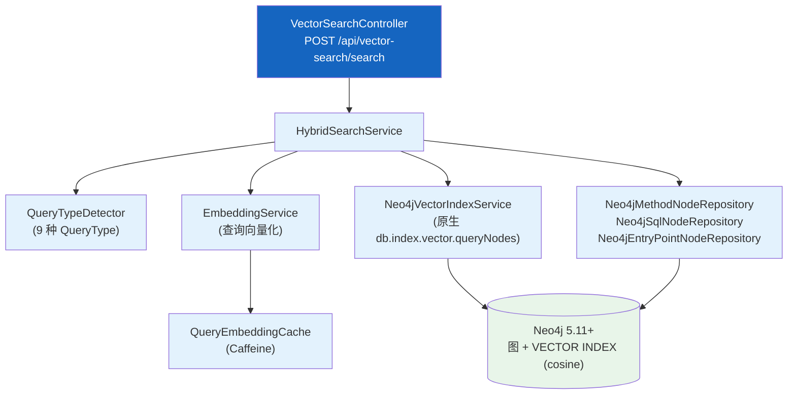
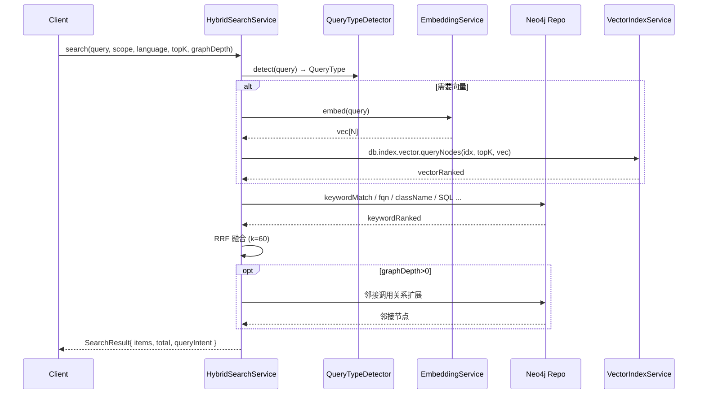

# Neo4j 图存储与检索

| 属性 | 值 |
|------|-----|
| **所属层** | 服务层（检索） + 基础设施层（图存储） |
| **目录** | `neo4j/`（model / repository / service / controller / config） |
| **文件数** | 28 |
| **核心入口** | `HybridSearchService` / `Neo4jVectorIndexService` |

---

## 1. 模块概述

### 1.1 职责定义

承载 Neo4j 图存储的访问层 + 三层混合检索（关键词过滤 + 向量语义 + 调用链图遍历，RRF 融合）。

| 本模块负责 ✅ | 不负责 ❌ |
|-------------|---------|
| 图节点 / 边模型（`@Node`） | 图谱构建（在 `knowledgegraph/`） |
| Spring Data Neo4j Repository（含 `*ByVectorIndex` / `*ByScope`） | LLM 描述生成 |
| 混合检索路由（`QueryTypeDetector` 判别 → 9 种策略） | 用户层 RAG 编排 |
| 嵌入服务封装（`EmbeddingService`）+ 查询缓存（`QueryEmbeddingCache`） | LLM 协议（在 `UnifiedEmbeddingService`） |
| 向量索引创建 / 查询（`Neo4jVectorIndexService`） | 索引初始化策略（在 `Neo4jInitializer`） |
| 图嵌入服务（`GraphEmbeddingService`） | — |

### 1.2 子包

| 子包 | 文件示例 |
|------|---------|
| `model/` | `MethodNode` / `EntryPointNode` / `SqlNode` / `ServiceNode` / `MigrationResult` / `MigrationStatus` / `QueryIntent` / `QueryType`（9 值枚举） / `SearchErrorCode` / `SearchException` / `SearchResult` / `SearchResultItem` / `VectorSearchResult` / `GenerationCheckpointNode` |
| `repository/` | `Neo4jMethodNodeRepository`（含 `*ByVectorIndex`、`*ByScope`、`MethodWithScore` / `CallerWithRelationByTarget` / `CalleeWithRelationBySource` 等投影） / `Neo4jEntryPointNodeRepository` / `Neo4jSqlNodeRepository` / `Neo4jServiceNodeRepository` / `Neo4jGenerationCheckpointRepository` |
| `service/` | `HybridSearchService` / `QueryTypeDetector` / `EmbeddingService` / `QueryEmbeddingCache` / `Neo4jVectorIndexService` / `GraphEmbeddingService` / `ProxyVectorService` |
| `controller/` | `VectorSearchController`、`SemanticSearchController` |
| `config/` | `Neo4jInitializer`（启动时建索引/迁移） |

---

## 2. 模块架构

---

## 3. 混合检索路由

`HybridSearchService` 根据 `QueryTypeDetector` 判别的 `QueryType` 选择策略：

| QueryType | 主策略 |
|-----------|------|
| `NATURAL_LANGUAGE` | `descriptionEmbedding` 向量检索 + 图扩展 |
| `METHOD_NAME` | `methodName` 模糊匹配 + 向量补充 + 图扩展 |
| `FULL_QUALIFIED_NAME` | `className` + `methodName` 精确匹配 + 图扩展 |
| `CLASS_NAME` | `className` 精确/模糊匹配 + 图扩展 |
| `SQL_SNIPPET` | `sqlEmbedding` 向量检索 → EXECUTES_SQL 反查 |
| `HTTP_URI` | `entryKey` 模糊匹配 → methodNodeId 关联 |
| `CODE_SNIPPET` | `codeEmbedding` 向量检索 + 图扩展 |
| `ANNOTATION` | `methodBody / comment` CONTAINS 匹配 |
| `EXCEPTION_TYPE` | `thrownExceptions / caughtExceptions` CONTAINS 匹配 |

### 关键常量

| 常量 | 值 | 用途 |
|------|---|-----|
| `RRF_K` | 60 | RRF 融合公式 `score = 1 / (k + rank)` |
| `DEFAULT_TOP_K` | 10 | 向量检索默认 TopK |
| `DEFAULT_GRAPH_DEPTH` | 2 | 图遍历默认深度 |
| `SIMILARITY_THRESHOLD` | 0.5 | 标准向量阈值 |
| `RELAXED_SIMILARITY_THRESHOLD` | 0.3 | 放宽阈值 |
| `CONTEXT_LIMIT` | 3 | 关联上下文（调用者 / 被调用者 / 入口点 / SQL）数量 |

### 检索时序

---

## 4. 范围与多语言

`MethodNode` / `EntryPointNode` 含两个范围字段：

| 字段 | 含义 |
|------|------|
| `projectPath` | 节点所属的具体项目目录 |
| `publicProjectPath` | 共享检索范围键。**单项目 = `projectPath`；公共图谱 = 用户选定的 rootPath** |
| `language` | `"java"` / `"python"`，旧节点 null 视为 java |
| `framework` | `spring / fastapi / django / flask` 等 |

范围查询统一写法：`coalesce(n.publicProjectPath, n.projectPath) = $scope`。

`Neo4jMethodNodeRepository` 的 `*ByScope` 重载即基于此实现。

---

## 5. 向量索引

由 `Neo4jInitializer` 在 `ApplicationReadyEvent` 创建：

| 索引 | 维度 | 距离 | 字段 |
|------|------|------|------|
| `idx_method_description_embedding` | 与模型一致（默认 4096） | cosine | `MethodNode.descriptionEmbedding` |
| `idx_method_code_embedding` | 同上 | cosine | `MethodNode.codeEmbedding` |
| `idx_sql_embedding` | 同上 | cosine | `SqlNode.sqlEmbedding` |

> 切换嵌入模型（如从 4096 → 2048）需要重建索引（`Neo4jInitializer` 会迁移）。

---

## 6. 错误处理

| 场景 | 处理 |
|------|------|
| Neo4j 未配置 | Bean 不装配（`@ConditionalOnProperty(neo4j.uri)`），相关接口降级 |
| 嵌入服务 401/超时 | 抛 `SearchException(SearchErrorCode.EMBED_FAILED)` |
| 向量索引未建 | 检索抛 `SearchException(SearchErrorCode.INDEX_NOT_FOUND)`，提示重启 |
| Cypher 异常 | 包装并日志（debug 级别） |

---

## 7. 已知问题与扩展点

| 问题 | 说明 |
|------|------|
| `embedding` 字段（旧） | 不再写入，仅作为兼容查询保留 |
| 向量缓存仅查询侧 | 节点写入侧不缓存（写入路径低频） |

| 扩展点 | 方式 |
|--------|------|
| 新增 QueryType | `QueryType` 枚举 + `QueryTypeDetector` 增加正则 + `HybridSearchService` 增加分支 |
| 新增桥接关系 | Neo4j Cypher + Repository 投影 |

---

> **延伸阅读**：
> - 图谱写入流程 → [知识图谱构建](./知识图谱构建.md)
> - 端到端检索数据流 → [04-数据流程/index.md](../04-数据流程/index.md)
> - 数据模型 → [06-数据模型/index.md](../06-数据模型/index.md)
