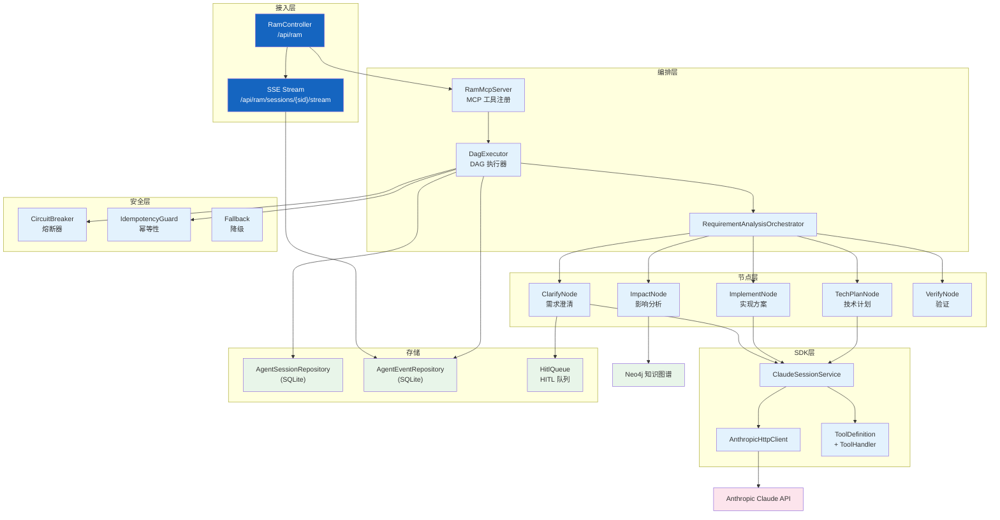
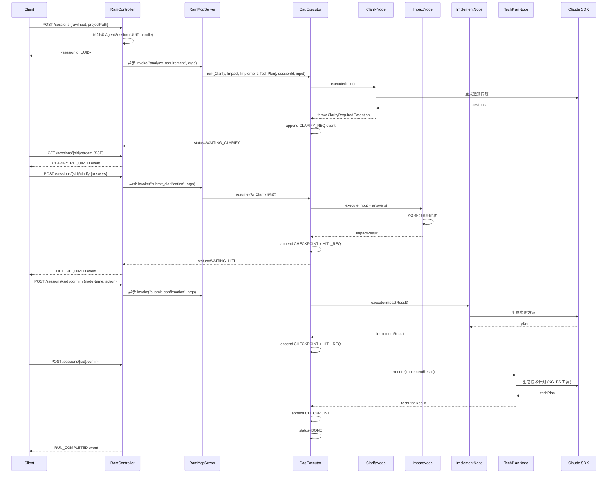
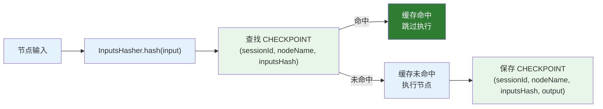
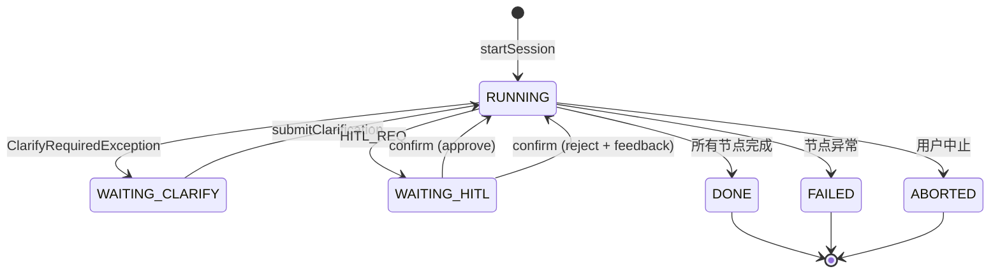

# RAM 需求评估

| 属性 | 值 |
|------|-----|
| **所属层** | 应用层（Orchestration）+ 基础设施层（Claude SDK） |
| **目录** | `ram/`（controller / orchestrator / nodes / sdk / mcp / model / repository / safety / hitl / kg / registry / contract / config） |
| **文件数** | 75 |
| **核心入口** | `RamController`、`RamMcpServer`、`DagExecutor` |
| **REST 基础路径** | `/api/ram` |

---

## 1. 模块概述

### 1.1 职责定义

RAM（Requirement Analysis Master）是一个基于 DAG 编排的需求评估引擎。用户提交需求描述后，系统通过 Clarify → Impact → Implement → TechPlan 四个节点的有序执行，结合知识图谱上下文和 Claude LLM，输出影响分析、实现方案和技术计划。支持 HITL（Human-in-the-Loop）人机交互，在关键节点暂停等待用户确认。

| 本模块负责 ✅ | 不负责 ❌ |
|-------------|---------|
| DAG 编排执行（节点有序执行、检查点、缓存） | 知识图谱构建（在 `knowledgegraph/`） |
| ClarifyNode（需求澄清） | 通用检索（在 `HybridSearchService`） |
| ImpactNode（影响分析） | 通用影响分析（在 `service/impact/`） |
| ImplementNode（实现方案） | — |
| TechPlanNode（技术计划） | — |
| HITL 人机交互（确认/拒绝/编辑） | — |
| Claude SDK 集成（Tool Use、多轮对话） | — |
| MCP Server（工具注册与调用） | — |
| 安全策略（熔断器、幂等性、降级） | — |

### 1.2 子包结构

| 子包 / 文件 | 职责 |
|-----------|------|
| `controller/RamController` | REST + SSE 入口（sessions/clarify/resume/confirm/abort/tech-plan） |
| `orchestrator/DagExecutor` | DAG 执行器（检查点缓存、HITL 暂停、错误处理） |
| `orchestrator/DagNode` | DAG 节点接口（name/execute） |
| `orchestrator/RequirementAnalysisOrchestrator` | 需求分析编排器（节点注册、执行调度） |
| `orchestrator/InputsHasher` | 输入哈希（检查点缓存 key） |
| `orchestrator/ClarifyRequiredException` | Clarify 暂停异常 |
| `orchestrator/HitlConfirmException` | HITL 确认暂停异常 |
| `nodes/ClarifyNode` | 需求澄清节点（LLM 生成澄清问题） |
| `nodes/impact/ImpactNode` | 影响分析节点（KG 查询 + LLM 分析） |
| `nodes/impact/` | 影响分析子组件（ImpactRing/ModifiedRing/InvolvedRing/RiskScorer/QueryDecomposer 等） |
| `nodes/ImplementNode` | 实现方案节点（LLM 生成实现建议） |
| `nodes/TechPlanNode` | 技术计划节点（LLM 生成技术方案，支持 KG+FS 工具） |
| `nodes/VerifyNode` | 验证节点 |
| `nodes/impl/` | LLM 客户端实现（ClaudeClarifyLlmClient、ClaudeImplementLlmClient、ClaudeTechPlanLlmClient、StubXxxLlmClient） |
| `sdk/ClaudeSessionService` | Claude SDK 会话管理 |
| `sdk/impl/AnthropicHttpClient` | Anthropic HTTP 客户端 |
| `sdk/impl/ClaudeSessionServiceImpl` | Claude 会话服务实现 |
| `sdk/SendOptions`、`SSEEvent`、`ToolDefinition`、`ToolHandler` | SDK 模型 |
| `mcp/RamMcpServer` | MCP Server（工具注册与调用） |
| `mcp/RamDagNodes` | DAG 节点 MCP 适配 |
| `mcp/tools/` | MCP 工具（AnalyzeRequirementTool、SubmitClarificationTool、SubmitConfirmationTool、ResumeSessionTool） |
| `hitl/HitlQueue` | HITL 队列管理 |
| `kg/KgMcpClient` | KG MCP 客户端接口 |
| `kg/impl/DirectKgClient` | 直接 KG 查询实现 |
| `kg/dto/` | KG DTO（Bridge、CallTreeNode、Entry、Impl、Seed、SqlMapping、MethodBodyInfo） |
| `model/` | `AgentSession`、`AgentEvent`、`EventType`、`SessionStatus` |
| `repository/` | `AgentSessionRepository`、`AgentEventRepository`（JDBC 实现） |
| `safety/` | 安全策略（CircuitBreaker、CircuitPolicy、Decision、Fallback、IdempotencyGuard、SessionStats） |
| `registry/` | Agent 注册（AgentManifest、AgentRegistry） |
| `contract/` | Schema 校验（SchemaValidator、ValidationResult） |
| `config/RamSchemaInitializer` | RAM Schema 初始化 |

---

## 2. 模块架构



---

## 3. 核心流程

### 3.1 需求评估 DAG 流程



### 3.2 检查点缓存机制



---

## 4. REST 端点

| 方法 | 路径 | 说明 |
|------|------|------|
| POST | `/api/ram/sessions` | 创建需求评估会话（异步启动 DAG） |
| GET | `/api/ram/sessions/{sid}` | 会话信息（status/currentSeq/clarifyPending/hitlPending） |
| GET | `/api/ram/sessions/{sid}/stream` | SSE 事件流（支持 afterSeq 参数） |
| POST | `/api/ram/sessions/{sid}/clarify` | 提交澄清答案 |
| POST | `/api/ram/sessions/{sid}/resume` | 恢复暂停的会话 |
| POST | `/api/ram/sessions/{sid}/confirm` | HITL 确认（approve/reject/edit） |
| POST | `/api/ram/sessions/{sid}/abort` | 中止会话 |
| POST | `/api/ram/sessions/{sid}/nodes/tech-plan` | 手动触发 TechPlanNode 执行 |

---

## 5. 数据模型

### 5.1 会话状态机



### 5.2 核心实体

| 实体 | 说明 |
|------|------|
| `AgentSession` | 评估会话（id、userId、status、currentNode、createdAt） |
| `AgentEvent` | 会话事件（seq、type、payload、idempotencyKey、inputsHash、circuitState、validatorStatus） |
| `EventType` | 事件类型枚举（USER_MSG、CHECKPOINT、CLARIFY_REQ、CLARIFY_RES、HITL_REQ、HITL_RES、ERROR、TOOL_CALL、TOOL_RESULT） |
| `SessionStatus` | 会话状态枚举（RUNNING、WAITING_CLARIFY、WAITING_HITL、DONE、FAILED、ABORTED） |

### 5.3 DAG 节点接口

```java
public interface DagNode {
    String name();
    Map<String, Object> execute(Map<String, Object> input);
}
```

---

## 6. 安全策略

| 策略 | 实现 | 说明 |
|------|------|------|
| 熔断器 | `CircuitBreaker` + `CircuitPolicy` | 连续失败达阈值后熔断，防止级联故障 |
| 幂等性 | `IdempotencyGuard` | 基于 idempotencyKey 防止重复执行 |
| 降级 | `Fallback` | LLM 调用失败时降级到模板输出 |
| HITL | `HitlQueue` | 关键节点暂停等待用户确认 |
| 反馈注入 | `DagExecutor.findRejectionFeedback` | 用户拒绝时注入反馈，强制重新执行 |

---

## 7. 配置项

| 配置 | 默认 | 说明 |
|------|------|------|
| `hisi.ram.enabled` | `true` | RAM 模块开关 |
| `hisi.ram.claude.api-key` | — | Anthropic API Key |
| `hisi.ram.claude.model` | `claude-sonnet-4-20250514` | Claude 模型 |
| `hisi.ram.claude.max-tokens` | `4096` | 最大输出 token |
| `hisi.ram.safety.circuit-breaker-threshold` | `5` | 熔断阈值 |
| `hisi.ram.safety.circuit-breaker-reset-ms` | `60000` | 熔断重置时间 |

---

## 8. 错误处理

| 场景 | 处理 |
|------|------|
| ClarifyNode 需要澄清 | 抛出 `ClarifyRequiredException`，会话状态 → `WAITING_CLARIFY` |
| 节点执行异常 | 记录 ERROR 事件，会话状态 → `FAILED` |
| HITL 确认超时 | 前端轮询 `/sessions/{sid}` 检测状态 |
| Claude API 超时 | 熔断器计数，达到阈值后熔断 |
| 检查点缓存命中 | 跳过节点执行，直接使用缓存输出 |
| 用户拒绝节点输出 | 注入 rejection feedback，强制重新执行 |

---

## 9. 已知问题与扩展点

| 问题 | 说明 |
|------|------|
| SSE 轮询间隔固定 500ms | 高并发时可能有性能压力 |
| 会话映射为内存 LRU | 重启丢失，需重新创建会话 |

| 扩展点 | 方式 |
|--------|------|
| 新增 DAG 节点 | 实现 `DagNode` 接口 + 注册到 `RequirementAnalysisOrchestrator` |
| 新增 LLM 提供商 | 实现 `ClarifyLlmClient` / `ImplementLlmClient` / `TechPlanLlmClient` |
| 自定义安全策略 | 实现 `CircuitPolicy` / `Fallback` |
| 新增 MCP 工具 | 在 `RamMcpServer` 注册新 `McpTool` |

---

> **延伸阅读**：
> - 知识图谱影响分析底层 → [影响分析与风险评估](./影响分析与风险评估.md)
> - Claude SDK 集成 → [08-技术决策](../08-技术决策/index.md)
> - 端到端 RAM 评估流程 → [04-数据流程](../04-数据流程/index.md)
