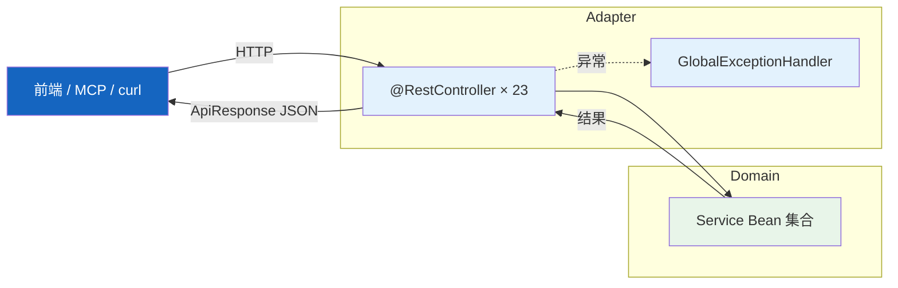
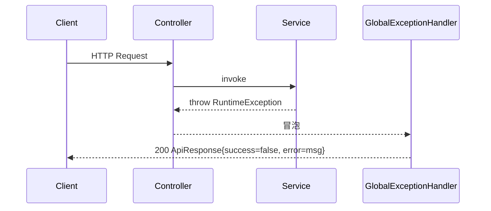

# REST 接口层

| 属性 | 值 |
|------|-----|
| **所属层** | 接入层（Adapter / Presentation） |
| **目录** | `controller/` + `knowledgegraph/controller/` + `neo4j/controller/` + `agent/controller/` + `skill/SkillController.java` + `service/intent/DialogController.java` |
| **文件数** | 23 个 Controller 类 |
| **对外接口** | 约 162 个 REST 端点 |

---

## 1. 模块概述

### 1.1 职责定义

提供 HTTP / REST 入口，将外部请求路由至下游 Service。统一以 `ApiResponse<T>` 包装结果，统一异常由 `GlobalExceptionHandler` 处理。

### 1.2 Controller 清单

| Controller | 基础路径 | 核心能力 |
|-----------|---------|---------|
| `GitController` | `/api/git` | Git status / checkout / pull / logs / commits / commit-diff / update-all |
| `CodeHubFetchController` | `/api/git`（POST `/fetch`） | 从 CodeHub 拉取代码 |
| `ConfigController` | `/api/config` | 应用配置读写 + 当前选中项目 |
| `ExceptionPathController` | `/api/semantic/exception` | 异常路径分析（单项 + 批量 + Top sources） |
| `ImpactPredictionController` | `/api/impact` | 影响分析、用例推荐、风险、批量、Summary 报告 |
| `LogAnalysisController` | `/api/log` | 日志查询 / LLM 分析 / 报告（query/analyze/reports/report） |
| `McpController` | `/api/mcp` | MCP 工具下载、SSE 安装、状态、配置模板 |
| `OpsController` | `/api/ops` | 健康检查、影响分析对外接口、文档接口、日志下载 |
| `ProjectController` | `/api/projects` | 项目列表、克隆、状态、Git 仓库扫描 |
| `PromptController` | `/api/prompts` | 提示词 CRUD、渲染、变量提取 |
| `SessionController` | `/api/sessions` | Claude 会话列表/详情/更新/删除/归档/导出/清空消息 |
| `SettingsController` | `/api/settings` | 系统设置 + 代理配置 |
| `SkillMarketController` | `/api/skill-market` | 技能市场列表 / 安装 / 卸载 / 检查更新 / 升级 |
| `WorkspaceSessionController` | `/api/workspace-sessions` | 工作区会话 CRUD + 绑定 Claude 会话 |
| `KnowledgeGraphController` | `/api/knowledge-graph` | 图谱生成、状态、调用链、入口点、MyBatis、bridges、interfaces 等（约 40 端点） |
| `CrossServiceBuildController` | `/api/knowledge-graph/cross-service` | 跨服务图谱构建 |
| `RefreshController` | `/api/knowledge-graph` | 增量刷新（git-status / incremental） |
| `VectorGenerationController` | `/api/vector-generation` | 离线/重试生成方法描述与向量 |
| `SemanticSearchController` | `/api/search` | 语义搜索入口（已部分迁移至 vector-search） |
| `VectorSearchController` | `/api/vector-search` | 混合检索（关键词+向量+图） |
| `DiagnosisController` | `/api/diagnosis` | 智能诊断 Agent |
| `SkillController` | `/api/skills` | Skill CRUD（与 skill-market 区分：本地能力管理） |
| `DialogController` | `/api/dialog` | 自然语言对话 / 意图识别 |

### 1.3 通用响应格式

```java
// com.huawei.hisi.model.ApiResponse
public record ApiResponse<T>(boolean success, T data, String error) { ... }
```

成功：`{ "success": true, "data": {...}, "error": null }`
失败：`{ "success": false, "data": null, "error": "错误描述" }`

---

## 2. 模块架构



---

## 3. 典型 Controller 模式

```java
@Slf4j
@RestController
@RequestMapping("/api/sessions")
@RequiredArgsConstructor
public class SessionController {
    private final SessionService sessionService;

    @GetMapping
    public ApiResponse<Map<String, Object>> getSessions(
            @RequestParam(required = false) String status,
            @RequestParam(defaultValue = "1") int page,
            @RequestParam(defaultValue = "20") int pageSize) { ... }
}
```

约定：

- `@RequiredArgsConstructor` + `final` 字段做构造注入
- `@RequestMapping` 在类上，方法上用 `@GetMapping/@PostMapping/...`
- 直接返回 `ApiResponse<T>` 或 `ResponseEntity<...>`（仅 SSE / 二进制下载）
- `@RequestParam(defaultValue=...)` 给默认值，`@PathVariable` 映射路径参数

---

## 4. 特殊接口形式

| 形式 | 例子 | 说明 |
|------|------|------|
| SSE 流式 | `McpController.install` `produces=TEXT_EVENT_STREAM_VALUE` | 安装进度实时推送 |
| 文件下载 | `SessionController.export`、`OpsController.logs/download` | 直接 `ResponseEntity<byte[]>` + `Content-Disposition` |
| WebSocket | `/ws/terminal` | 不在 Controller 中，见 [终端与WebSocket](./终端与WebSocket.md) |
| 长任务 + 状态轮询 | `KnowledgeGraphController.tasks/generate` + `tasks/status` | 任务表（SQLite） + 异步线程池 |

---

## 5. 依赖关系

| Controller | 主要依赖 Service |
|-----------|----------------|
| `KnowledgeGraphController` | `KnowledgeGraphTaskService` / `CycleDetectionService` / `IncrementalRefreshService` / Neo4j Repository / `MapperCallResolver` |
| `VectorSearchController` | `HybridSearchService` / `EmbeddingService` |
| `SessionController` | `SessionService` |
| `WorkspaceSessionController` | `WorkspaceSessionService` |
| `LogAnalysisController` | `LogCloudService` / `LogAnalysisExecutor` / `RootCauseAnalysisService` |
| `ImpactPredictionController` | `service/impact/impl/*` / `service/risk/impl/*` / `service/suggestion/impl/*` |
| `DiagnosisController` | `agent/DiagnosticAgent` |
| `DialogController` | `service/intent/NaturalLanguageDiagnosisCoordinator` |
| `SkillMarketController` / `SkillController` | `skill/SkillServiceImpl` |
| `PromptController` | `service/PromptServiceImpl` |
| `SettingsController` | `AppConfigService` + `ProxyConfig` |

---

## 6. 错误处理



> 注意：HTTP 状态码默认 200，错误通过 `success=false` 标识（与前端契约一致）。

---

## 7. 已知问题与扩展点

| 问题 | 说明 |
|------|------|
| 路径前缀分散 | 知识图谱相关分散在 `/api/knowledge-graph` `/api/vector-search` `/api/search` `/api/vector-generation` 多个前缀，待统一 |
| `OpsController` / `KnowledgeGraphController` 体积大 | 端点数 > 30，可按子域拆分 |

| 扩展点 | 方式 |
|--------|------|
| 新增 API | 新建 Controller / 新增方法 + 注入 Service，无须改 Adapter 配置 |
| 新增统一字段 | 修改 `ApiResponse` 记录 |

---

> **延伸阅读**：
> - 全部端点详细 → [05-接口文档](../05-接口文档/index.md)
> - 数据流程 → [04-数据流程](../04-数据流程/index.md)
