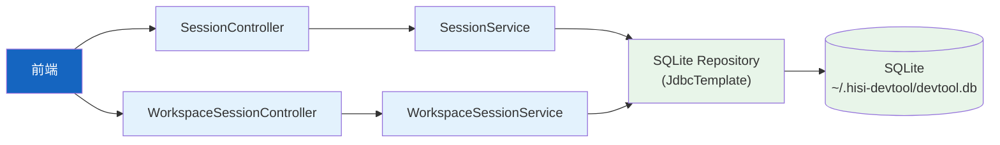
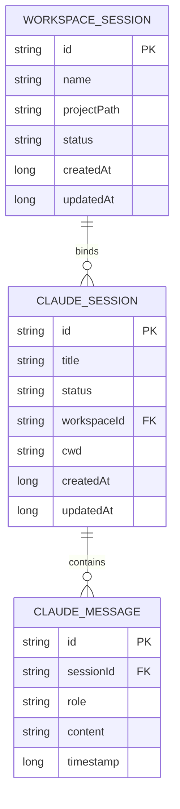
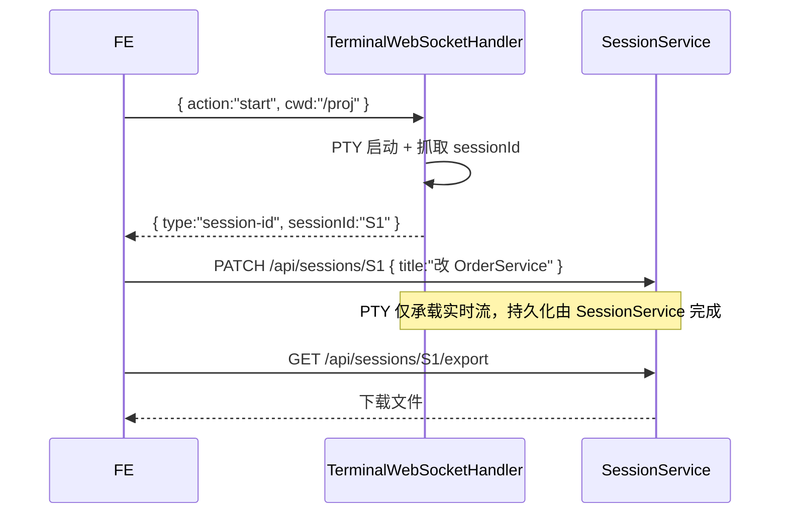

# 会话与工作区

| 属性 | 值 |
|------|-----|
| **所属层** | 服务层 + 基础设施层（SQLite） |
| **目录** | `service/SessionService*.java` + `service/WorkspaceSessionService*.java` + `repository/`（SQLite） |
| **REST 入口** | `SessionController` (`/api/sessions`) + `WorkspaceSessionController` (`/api/workspace-sessions`) |

---

## 1. 模块概述

两个相关但独立的概念：

| 概念 | 含义 | 持久化 |
|------|------|--------|
| `ClaudeSession` | 一次与 Claude CLI 的对话上下文（PTY 进程对应一条记录） | SQLite 表 |
| `ClaudeMessage` | 会话内的单条消息（用户/助手/工具） | SQLite 表 |
| `WorkspaceSession` | 用户在前端创建的工作区，绑定项目目录 + 多个 Claude 会话 | SQLite 表 |

### 1.1 核心文件

| 文件 | 职责 |
|------|------|
| `model/ClaudeSession.java` | 会话实体 |
| `model/ClaudeMessage.java` | 消息实体 |
| `service/SessionService.java` + `SessionServiceImpl.java` | 会话 CRUD / 归档 / 导出 / 清空消息 |
| `service/WorkspaceSessionService.java` + `WorkspaceSessionServiceImpl.java` | 工作区 CRUD / 绑定 Claude 会话 |
| `repository/ClaudeSessionRepository.java` 等 | SQLite JdbcTemplate Repository |
| `config/SQLiteSchemaInitializer.java` | 启动建表 |

---

## 2. 模块架构

---

## 3. REST 端点

### 3.1 ClaudeSession（`/api/sessions`）

| 方法 | 路径 | 说明 |
|------|------|------|
| GET | `/api/sessions` | 列表（支持 `status / page / pageSize`） |
| GET | `/api/sessions/{id}` | 详情 + 消息列表 |
| PATCH | `/api/sessions/{id}` | 更新（如 title） |
| DELETE | `/api/sessions/{id}` | 删除 |
| POST | `/api/sessions/{id}/archive` | 归档 |
| GET | `/api/sessions/{id}/export` | 导出（文件下载） |
| DELETE | `/api/sessions/{id}/messages` | 清空消息 |

### 3.2 WorkspaceSession（`/api/workspace-sessions`）

| 方法 | 路径 | 说明 |
|------|------|------|
| GET | `/api/workspace-sessions` | 列表 |
| GET | `/api/workspace-sessions/{id}` | 详情 |
| POST | `/api/workspace-sessions` | 创建 |
| PUT | `/api/workspace-sessions/{id}` | 更新 |
| DELETE | `/api/workspace-sessions/{id}` | 删除 |
| POST | `/api/workspace-sessions/{id}/archive` | 归档 |
| POST | `/api/workspace-sessions/{id}/bind-claude-session` | 绑定 Claude 会话 |

---

## 4. 数据模型（简化）

---

## 5. 与终端的关系

---

## 6. 错误处理

| 场景 | 处理 |
|------|------|
| 会话不存在 | `ApiResponse.error("会话不存在")` |
| 删除时存在子消息 | 级联删除（按 `sessionId`） |
| SQLite 文件锁 | JdbcTemplate 自动重试 |

---

## 7. 已知问题

| 问题 | 说明 |
|------|------|
| 不支持多用户 | 工具属性，单实例单用户 |
| 大量消息时分页缺失 | 当前一次返回全部 messages，可优化 |
