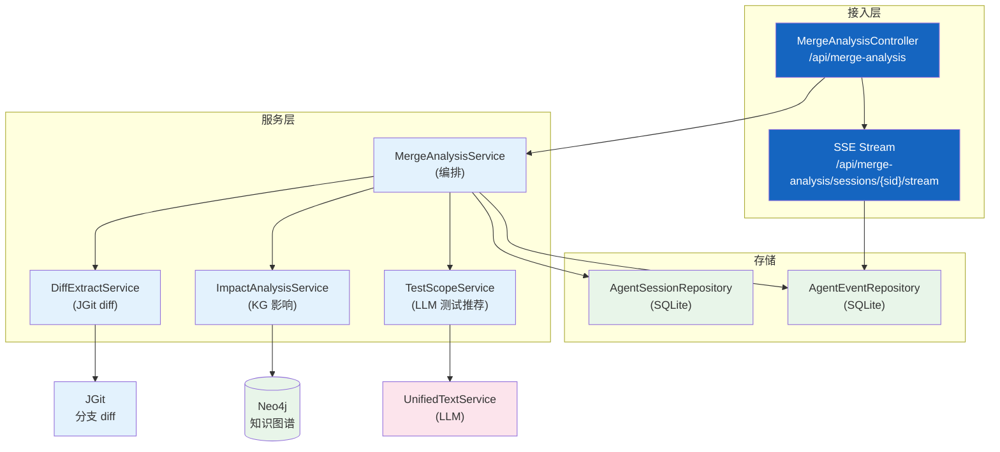
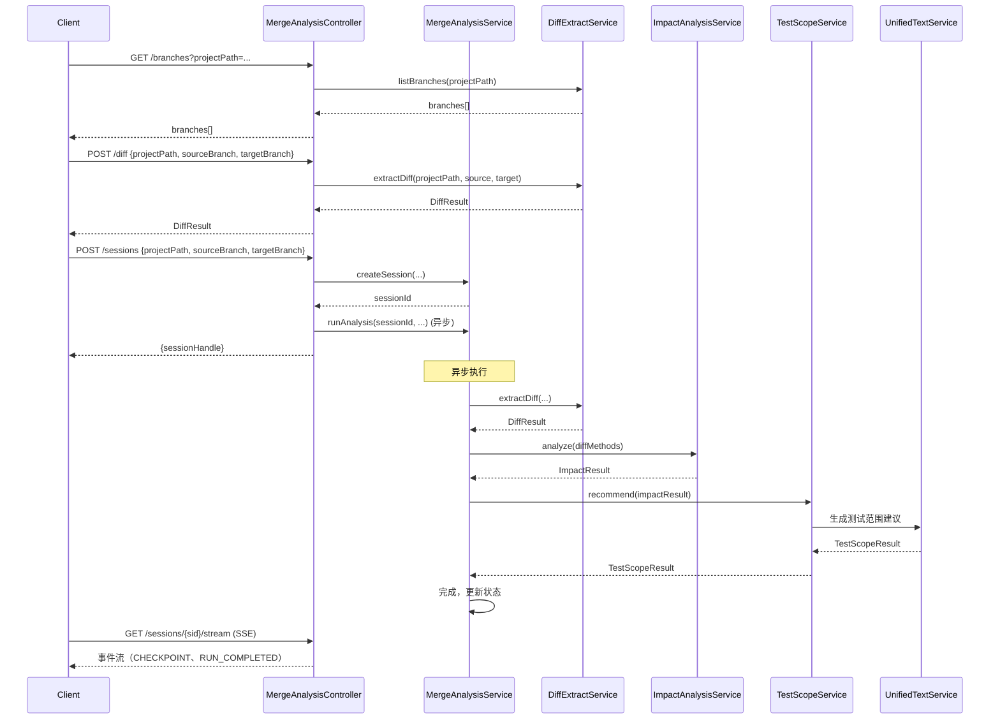
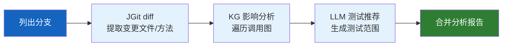

# 合并影响分析

| 属性 | 值 |
|------|-----|
| **所属层** | 应用层（Orchestration） |
| **目录** | `mergeanalysis/`（controller / service / model） |
| **文件数** | 8 |
| **核心入口** | `MergeAnalysisController`、`MergeAnalysisService` |
| **REST 基础路径** | `/api/merge-analysis` |

---

## 1. 模块概述

### 1.1 职责定义

合并影响分析模块在代码合并前评估变更影响：通过 JGit 提取分支 diff，结合知识图谱分析影响范围，调用 LLM 推荐测试范围，最终通过 SSE 流式输出分析进度和结果。

| 本模块负责 ✅ | 不负责 ❌ |
|-------------|---------|
| JGit diff 提取（分支对比） | 通用 Git 操作（在 `GitController`） |
| KG 影响分析（基于 diff 方法） | 通用影响分析（在 `service/impact/`） |
| LLM 测试范围推荐 | LLM 协议细节（在 `UnifiedTextService`） |
| SSE 流式输出分析进度 | 通用 SSE（在 `RamController`） |
| 合并分析会话管理 | — |

### 1.2 核心文件

| 文件 | 职责 |
|------|------|
| `controller/MergeAnalysisController` | REST + SSE 入口（branches/diff/sessions/stream） |
| `service/MergeAnalysisService` | 合并分析编排（创建会话、运行分析） |
| `service/DiffExtractService` | JGit diff 提取（分支列表、文件差异） |
| `service/ImpactAnalysisService` | KG 影响分析（基于 diff 方法查询影响范围） |
| `service/TestScopeService` | LLM 测试范围推荐 |
| `model/DiffResult` | diff 结果模型 |
| `model/ImpactResult` | 影响分析结果模型 |
| `model/TestScopeResult` | 测试范围推荐结果模型 |

---

## 2. 模块架构

---

## 3. 核心流程

### 3.1 合并影响分析流程

### 3.2 分析流水线

---

## 4. REST 端点

| 方法 | 路径 | 说明 |
|------|------|------|
| GET | `/api/merge-analysis/branches` | 列出项目分支（参数：projectPath） |
| POST | `/api/merge-analysis/diff` | 提取分支 diff |
| POST | `/api/merge-analysis/sessions` | 创建合并分析会话（异步启动） |
| GET | `/api/merge-analysis/sessions/{sid}` | 会话信息（status/currentNode/lastSeq） |
| GET | `/api/merge-analysis/sessions/{sid}/stream` | SSE 事件流（支持 afterSeq 参数） |

---

## 5. 数据模型

### 5.1 请求/响应模型

| 模型 | 说明 |
|------|------|
| `DiffRequest` | diff 请求（projectPath、sourceBranch、targetBranch） |
| `StartRequest` | 分析启动请求（projectPath、sourceBranch、targetBranch） |
| `StartResponse` | 分析启动响应（sessionHandle） |
| `SessionInfo` | 会话信息（status、currentNode、lastSeq） |
| `DiffResult` | diff 结果（变更文件列表、变更方法列表、统计） |
| `ImpactResult` | 影响分析结果（受影响节点、入口点、SQL） |
| `TestScopeResult` | 测试范围推荐（测试用例列表、优先级、覆盖率） |

---

## 6. 错误处理

| 场景 | 处理 |
|------|------|
| 分支不存在 | 返回 400，错误信息 |
| diff 过大 | 限制变更文件数量，超出截断 |
| KG 查询超时 | 降级为仅 diff 结果，跳过影响分析 |
| LLM 推荐失败 | 降级为基于规则的测试推荐 |
| SSE 客户端断开 | 捕获 `ClientGoneException`，静默关闭 |

---

## 7. 已知问题与扩展点

| 问题 | 说明 |
|------|------|
| diff 仅支持文本对比 | 不支持二进制文件差异 |
| 测试推荐基于 LLM | 结果质量取决于 LLM 能力 |

| 扩展点 | 方式 |
|--------|------|
| 支持更多 diff 策略 | `DiffExtractService` 增加新策略 |
| 自定义影响分析 | `ImpactAnalysisService` 增加新分析维度 |
| 接入真实测试覆盖率 | `TestScopeService` 对接 JaCoCo 报告 |

---

> **延伸阅读**：
> - 影响分析底层 → [影响分析与风险评估](./影响分析与风险评估.md)
> - 知识图谱查询 → [Neo4j图存储与检索](./Neo4j图存储与检索.md)
> - 端到端合并分析流程 → [04-数据流程](../04-数据流程/index.md)
