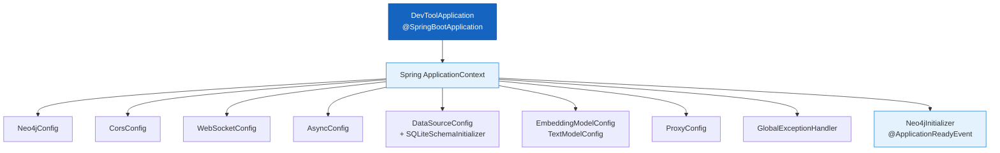
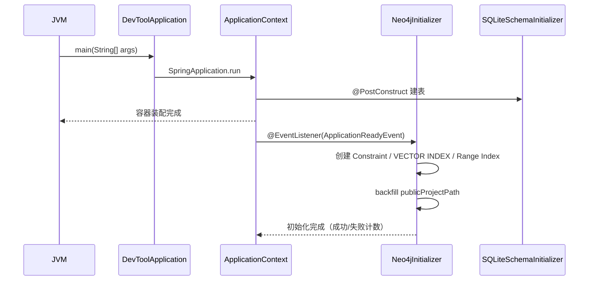

# 应用启动与全局配置

| 属性 | 值 |
|------|-----|
| **所属层** | 基础设施层 |
| **目录** | `src/main/java/com/huawei/hisi/`（根 + `config/`） |
| **文件数** | 1（启动类） + 16（`config/`） |
| **对外接口** | Spring Bean 装配（`@Bean`） |

---

## 1. 模块概述

### 1.1 职责定义

负责 Spring Boot 应用的启动、全局配置 Bean 装配、跨域、异常拦截、Schema 初始化、HTTP 代理、数据源、外部模型的连接配置。

| 本模块负责 ✅ | 不负责 ❌ |
|-------------|---------|
| Spring 容器启动、配置类、全局异常 | 业务逻辑 |
| 数据源（SQLite）+ Neo4j Driver Bean | Repository / Service |
| WebSocket 端点注册 | 帧处理（在 `handler/`） |
| OpenAI 兼容模型 base-url / key 注入 | 真正的请求执行（在 `UnifiedEmbeddingService` / `UnifiedTextService`） |

### 1.2 核心文件清单

| 文件 | 类型 | 职责 |
|------|------|------|
| `DevToolApplication.java` | `@SpringBootApplication`、`@EnableCaching` 启动类 | 进程入口 |
| `config/Neo4jConfig.java` | `@Configuration` | 装配 Neo4j Driver、`Neo4jTransactionManager`、`Neo4jConversions` |
| `config/CorsConfig.java` | `@Configuration` | 全局 CORS（读取 `cors.allowed-origins`） |
| `config/WebSocketConfig.java` | `@Configuration` | 注册 `TerminalWebSocketHandler` |
| `config/GlobalExceptionHandler.java` | `@RestControllerAdvice` | 统一返回 `ApiResponse.error(...)` |
| `config/EmbeddingModelConfig.java` | `@ConfigurationProperties("embedding")` | 注入 `api-key/base-url/model/dimension/timeout` |
| `config/TextModelConfig.java` | 同上 | 注入 `text-model.*` |
| `config/ProxyConfig.java` | 同上 | HTTP / SOCKS 代理（用于内网访问外部模型） |
| `config/AsyncConfig.java` | `@EnableAsync` | 全局线程池 |
| `config/DataSourceConfig.java` | `@Configuration` | SQLite `DataSource` |
| `config/SQLiteSchemaInitializer.java` | `@PostConstruct` | 应用启动时建表 |
| `config/AnalysisFeatureConfig.java` | 配置开关 | 增强解析特性的启停 |
| `config/ExceptionInheritanceConfig.java` | 配置 | 异常继承关系（用于 `RootCauseAnalysisService`） |
| `config/LogCloudConfig.java` | `@ConfigurationProperties("logcloud")` | 日志云 API + Playwright 配置 |
| `config/ZhipuConfig.java` / `IFlytekConfig.java` / `SiliconFlowConfig.java` | 已废弃保留兼容 | 旧版按厂商配置（`enabled=false`） |

---

## 2. 模块架构

---

## 3. 对外接口

| Bean | 类型 | 说明 |
|------|------|------|
| `Driver` | `org.neo4j.driver.Driver` | Neo4j 原生 Driver，用于 Cypher 直查（`Neo4jVectorIndexService` 使用） |
| `Neo4jTransactionManager` | `PlatformTransactionManager` | 配合 `@Transactional` |
| `Neo4jConversions` | 自定义类型转换器 | 处理 `float[]` 向量字段 |
| `DatabaseSelectionProvider` | 数据库选择器 | 默认数据库 |
| `DataSource` | `javax.sql.DataSource` | SQLite |
| `JdbcTemplate` | Spring JDBC | 通过 SQLite Repository 使用 |
| `WebSocketHandlerRegistry` | 配置 | 注册 `/ws/terminal` 端点 |

---

## 4. 关键配置项（`application.yml`）

| 段 | 关键字段 | 说明 |
|----|---------|------|
| `spring.datasource.url` | `jdbc:sqlite:${user.home}/.hisi-devtool/devtool.db` | SQLite 文件路径 |
| `server.port` | `8080` | HTTP 端口 |
| `embedding.*` | `api-key/base-url/model/dimension` | 默认 SiliconFlow Qwen3-VL-Embedding-8B 4096 维 |
| `text-model.*` | 同上 | 默认 智谱 glm-4-flash |
| `neo4j.uri` / `username` / `password` | `bolt://127.0.0.1:7687` | Neo4j 连接 |
| `cors.allowed-origins` | 多个 localhost 端口 | CORS 白名单 |
| `proxy.*` | `enabled / host / port / type / disable-ssl-verification` | 代理（默认 `proxy.huawei.com:8080`） |
| `logcloud.*` | API + Playwright 双模式 | 日志云接入 |
| `analysis.features.*` | 增强解析开关 | 接口实现 / 字段调用 / Spring 注解感知 |
| `impact.default-coverage-score` | `50` | 影响分析覆盖率兜底 |

---

## 5. 启动流程

---

## 6. 错误处理

| 场景 | 处理 |
|------|------|
| Neo4j 未配置 | `@ConditionalOnProperty(neo4j.uri)` 跳过相关 Bean，KG/检索接口降级返回 |
| 外部模型 401/超时 | OkHttp 重试 3 次，重试基础延迟 60s（`max-retries=3`） |
| SQLite 文件目录不存在 | 启动时创建 `~/.hisi-devtool/` |
| 业务异常 | `GlobalExceptionHandler` 转 `ApiResponse.error("…")` |

---

## 7. 已知问题

| 问题 | 说明 |
|------|------|
| `spring.main.allow-circular-references=true` | 历史循环依赖临时方案，新代码禁止引入 |
| 已废弃 Bean（`ZhipuConfig` / `IFlytekConfig` / `SiliconFlowConfig`） | `enabled=false`，仅为向后兼容，不参与主链路 |

---

> **延伸阅读**：
> - 配置项详细 → [07-部署运维/index.md](../07-部署运维/index.md)
> - 异常处理流程 → [04-数据流程/index.md](../04-数据流程/index.md)
