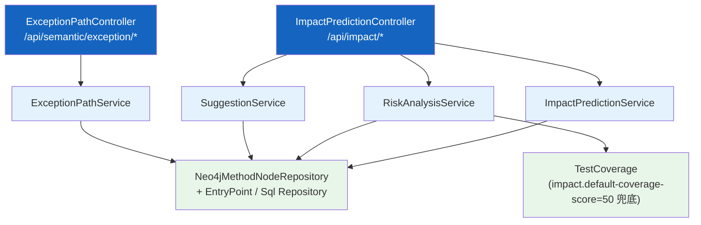
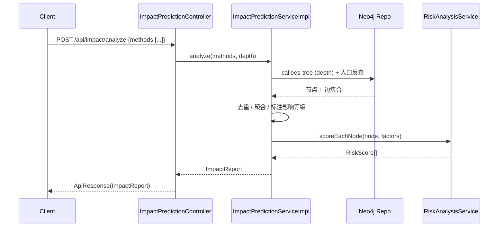

# 影响分析与风险评估

| 属性 | 值 |
|------|-----|
| **所属层** | 服务层 |
| **目录** | `service/impact/` + `service/risk/` + `service/suggestion/` + `service/semantic/` |
| **REST 入口** | `ImpactPredictionController` (`/api/impact`) + `ExceptionPathController` (`/api/semantic/exception`) |

---

## 1. 模块概述

围绕"代码变更预测"形成四个子能力：

| 子模块 | 职责 |
|--------|------|
| `service/impact/` | 给定方法集合，遍历 Neo4j 调用图，输出受影响的下游/上游节点、入口点、SQL |
| `service/risk/` | 综合复杂度、覆盖率、调用入度等给改动打风险分（0-100） |
| `service/suggestion/` | 推荐回归测试用例（基于影响节点 → 关联测试） |
| `service/semantic/` | 异常路径分析：基于 `thrownExceptions / caughtExceptions` 字段反推异常源头 |

### 1.1 子文件清单（impl + model）

```
service/impact/
├── impl/        ImpactPredictionServiceImpl 等 (3)
├── model/       ImpactReport / ImpactNode / TestcaseRecommendation 等 (6)
└── ImpactPredictionService 接口 (4)

service/risk/
├── impl/        RiskAnalysisServiceImpl
├── model/       RiskScore / RiskFactor
└── RiskAnalysisService

service/suggestion/
├── impl/        TestcaseSuggestionServiceImpl
├── model/       SuggestionItem
└── SuggestionService

service/semantic/
├── impl/        ExceptionPathServiceImpl
├── model/       ExceptionPath / ExceptionSource (9)
└── ExceptionPathService
```

---

## 2. 模块架构



---

## 3. 核心 REST 端点

| 端点 | 用途 |
|------|------|
| `POST /api/impact/analyze` | 给定方法集合，返回影响范围 |
| `POST /api/impact/testcases` | 推荐回归测试用例 |
| `POST /api/impact/risk` | 综合风险评分 |
| `GET /api/impact/preview` | 影响预览（轻量） |
| `POST /api/impact/batch` | 批量影响分析 |
| `GET /api/impact/summary/{reportId}` | 取历史报告摘要 |
| `GET /api/semantic/exception/analyze` | 异常路径分析（单项） |
| `POST /api/semantic/exception/analyze/batch` | 批量异常路径 |
| `GET /api/semantic/exception/top-sources` | Top 异常源 |
| `GET /api/semantic/exception/status` | 任务状态 |

---

## 4. 影响分析流程



风险因子（典型）：

| 因子 | 来源 |
|------|------|
| 圈复杂度 | `MethodNode.complexity` |
| 测试覆盖率 | 外部覆盖率（缺失时使用 `impact.default-coverage-score=50`） |
| 入口数 | EntryPoint 反查 |
| 跨服务桥接 | Feign / MQ 桥接计数 |

---

## 5. 异常路径


---

## 6. 错误处理

| 场景 | 处理 |
|------|------|
| 方法不存在 | 跳过该方法，记入 `notFound` 列表 |
| 图遍历超时 | 限制 `depth` 参数，最大值由 Service 内常量约束 |
| 覆盖率数据缺失 | 使用 `impact.default-coverage-score` 兜底 |

---

## 7. 已知问题与扩展点

| 问题 | 说明 |
|------|------|
| 覆盖率仅用兜底值 | 未对接真实 JaCoCo 报告 |
| 风险因子权重写死 | 未配置化 |

| 扩展点 | 方式 |
|--------|------|
| 新增风险因子 | `RiskFactor` 增枚举 + `RiskAnalysisServiceImpl` 加权 |
| 自定义影响策略 | 新增 `ImpactStrategy` 实现 |
