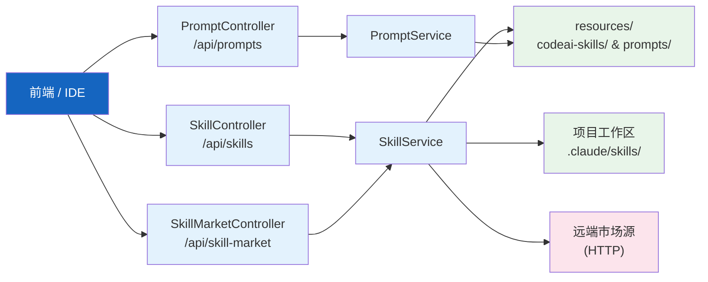
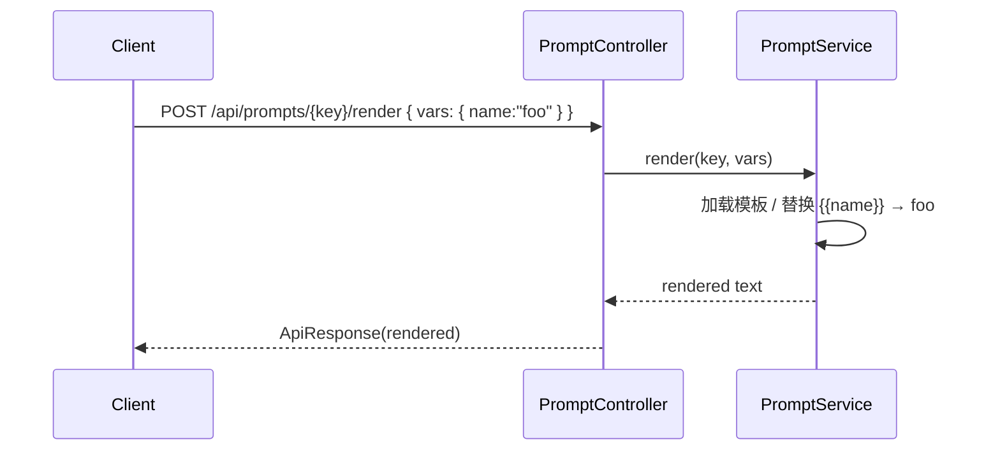

# 技能市场与提示词

| 属性 | 值 |
|------|-----|
| **所属层** | 应用层 |
| **目录** | `skill/` + `service/PromptService*.java` |
| **REST 入口** | `SkillController` (`/api/skills`) + `SkillMarketController` (`/api/skill-market`) + `PromptController` (`/api/prompts`) |
| **资源** | `src/main/resources/codeai-skills/` + `src/main/resources/prompts/` |

---

## 1. 模块概述

### 1.1 子能力

| 子模块 | 职责 |
|--------|------|
| `skill/SkillService` + `SkillServiceImpl` | 技能 CRUD（本地能力管理） |
| `skill/SkillController` | `/api/skills` |
| `SkillMarketController`（在 `controller/`） | `/api/skill-market` 远端市场（列表 / 安装 / 卸载 / 升级） |
| `service/PromptService` + `PromptServiceImpl` | 提示词管理：列表、读取、更新、模板渲染、变量提取 |
| `controller/PromptController` | `/api/prompts` |
| `resources/codeai-skills/` | 内置技能资源（默认安装包） |
| `resources/prompts/` | 内置提示词模板 |

---

## 2. 模块架构

---

## 3. REST 端点

### 3.1 `/api/skill-market`

| 方法 | 路径 | 说明 |
|------|------|------|
| GET | `/list` | 远端市场列表 |
| GET | `/project-status` | 项目当前已安装/版本状态 |
| GET | `/detail/{id}` | 技能详情 |
| POST | `/install` | 安装技能到当前项目 |
| POST | `/uninstall` | 卸载 |
| GET | `/check-updates` | 检查升级 |
| POST | `/update` | 升级 |

### 3.2 `/api/skills`（本地）

`SkillController` 提供本地技能 CRUD（增、删、改、查），用于工程内自定义技能。

### 3.3 `/api/prompts`

| 方法 | 路径 | 说明 |
|------|------|------|
| GET | `/api/prompts` | 列表 |
| GET | `/api/prompts/{key}` | 详情 |
| PUT | `/api/prompts/{key}` | 保存 |
| POST | `/api/prompts/{key}/render` | 渲染（参数代入模板） |
| POST | `/api/prompts/extract-variables` | 从模板抽取所有 `{{var}}` |

---

## 4. 提示词渲染

---

## 5. 已知问题与扩展点

| 问题 | 说明 |
|------|------|
| 安装源只支持 HTTP | 暂未支持 Git 源 |
| 提示词无版本快照 | 改写后无法回滚 |

| 扩展点 | 方式 |
|--------|------|
| 增加技能渠道 | `SkillService` 注入新 `SkillSource` 实现 |
| 自定义模板引擎 | 替换 `PromptServiceImpl` 内的字符串替换逻辑 |
