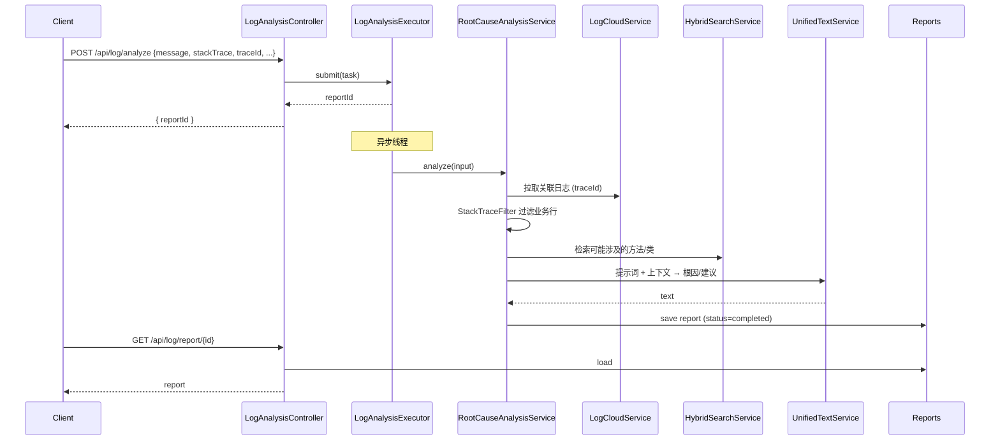

# 日志云与运维

| 属性 | 值 |
|------|-----|
| **所属层** | 服务层 |
| **目录** | `service/LogCloud*.java` + `service/RootCauseAnalysisService*.java` + `service/LogAnalysisExecutor.java` + `service/OpsService*.java` |
| **REST 入口** | `LogAnalysisController` (`/api/log`) + `OpsController` (`/api/ops`) |
| **配置** | `LogCloudConfig` ← `application.yml: logcloud.*` |

---

## 1. 模块概述

### 1.1 职责定义

对接华为内部日志云（`console.his.huawei.com`），支持两种取数模式：

1. **HTTP API 模式（首选）**：通过 `apig-beta.his.huawei.com` 直接发送 DSL Query
2. **Playwright 模式（兜底）**：以浏览器自动化方式登录后抓取（覆盖未开放 API 的场景）

并把日志交给 LLM 分析，输出根因报告。

### 1.2 核心文件

| 文件 | 职责 |
|------|------|
| `service/LogCloudService.java` + `LogCloudServiceImpl.java` | 日志云查询：HTTP / Playwright 两种实现路径 |
| `service/LogAnalysisExecutor.java` | 异步分析任务执行器（线程池） |
| `service/RootCauseAnalysisService.java` + `RootCauseAnalysisServiceImpl.java` | 根因分析：日志 → LLM 总结 → 关联代码 → 报告 |
| `service/OpsService.java` + `OpsServiceImpl.java` | 健康、运维相关聚合 |
| `config/LogCloudConfig.java` | 配置类 |
| `config/ExceptionInheritanceConfig.java` | 异常继承关系配置（让"NPE 继承 RuntimeException"等关系参与匹配） |

### 1.3 配置

```yaml
logcloud:
  base-url: https://console.his.huawei.com
  app-id: com.huawei.hiapm
  username: ${LOGCLOUD_USERNAME:}
  password: ${LOGCLOUD_PASSWORD:}
  api:
    base-url: https://apig-beta.his.huawei.com/api/gaia/rm-openapi
    query-path: /platforms/logQueryService/dslQuery/hiapm_error_fetcher
    header-xhw-id: com.huawei.hiapm
    header-appkey: ${LOGCLOUD_APPKEY:placeholder}
    timeout: 60000
    connect-timeout: 30000
  browser:
    headless: true
    timeout: 60000
    cache-expire: 1800
```

---

## 2. 模块架构

```mermaid
flowchart TD
    Cli["LogAnalysisController\n/api/log/*"]:::entry
    LCS["LogCloudService"]:::process
    Exec["LogAnalysisExecutor\n(线程池)"]:::process
    RCA["RootCauseAnalysisService"]:::process
    Reports["报告表 (SQLite)"]:::data
    KGS["HybridSearchService\nNeo4jMethodNodeRepository"]:::data
    LLM["UnifiedTextService"]:::ext

    subgraph LCS_Impl
        Http["OkHttp HTTP API\n→ apig-beta.his.huawei.com"]
        PW["Playwright\n→ console.his.huawei.com"]
    end

    Cli -->|/query| LCS
    LCS --> Http
    LCS -.fallback.-> PW
    Cli -->|/analyze| Exec
    Exec --> RCA
    RCA --> LCS
    RCA --> KGS
    RCA --> LLM
    RCA --> Reports
    Cli -->|/reports /report/{id}| Reports

    classDef entry fill:#1565c0,color:#fff
    classDef process fill:#e3f2fd
    classDef data fill:#e8f5e9
    classDef ext fill:#fce4ec
```

---

## 3. REST 端点

| 方法 | 路径 | 说明 |
|------|------|------|
| POST | `/api/log/query` | 根据 DSL / 关键字查询日志 |
| POST | `/api/log/analyze` | 触发异步 LLM 分析，返回 `reportId` |
| GET | `/api/log/reports` | 报告列表 |
| GET | `/api/log/report/{id}` | 报告详情（含根因 / 修复建议） |
| GET | `/api/log/report/{id}/status` | 查询分析进度（pending/processing/completed/failed） |
| GET | `/api/ops/health` | 健康检查 |
| POST | `/api/ops/analysis/impact` | 运维通用影响分析入口 |
| GET | `/api/ops/docs/interface` | 文档接口 |
| POST | `/api/ops/logs/download` | 日志批量下载 |

---

## 4. 根因分析流程



---

## 5. 错误处理

| 场景 | 处理 |
|------|------|
| HTTP API 401 / 限流 | OkHttp 自动重试，超过阈值降级到 Playwright |
| Playwright 启动失败 | `LogCloudServiceImpl` 抛错并打印浏览器路径 |
| LLM 输出超时 | `RootCauseAnalysisService` 标记报告 `failed` |
| 缺少 `LOGCLOUD_APPKEY` | 启动告警，但不阻塞应用 |

---

## 6. 已知问题

| 问题 | 说明 |
|------|------|
| Playwright 首次启动慢 | 自动下载 Chromium，可预下载到 `~/.cache/ms-playwright` |
| 日志去重 | 当前不在服务端做去重，依赖 LLM 上下文裁剪 |

---

> **延伸阅读**：
> - 异常路径分析（基于代码图） → [影响分析与风险评估](./影响分析与风险评估.md)
> - 自然语言入口 → [智能诊断与对话](./智能诊断与对话.md)
