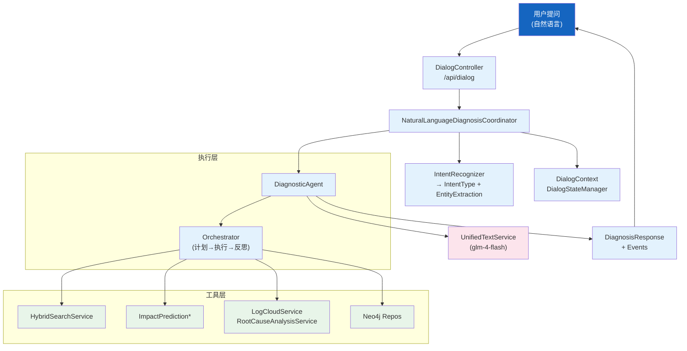
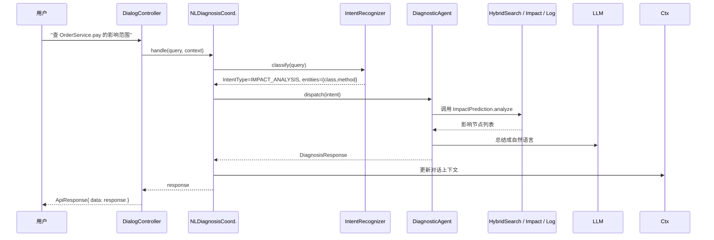

# 智能诊断与对话

| 属性 | 值 |
|------|-----|
| **所属层** | 应用层（Orchestration） |
| **目录** | `agent/` + `service/intent/` |
| **文件数** | 12 + 9 |
| **核心入口** | `DiagnosticAgent`、`DialogController`、`NaturalLanguageDiagnosisCoordinator` |

---

## 1. 模块概述

### 1.1 职责定义

把"自然语言提问"转换成对底层 Service 的编排调用：意图识别 → 实体抽取 → 多步执行 → 结果聚合 → 自然语言回复。

| 子模块 | 职责 |
|--------|------|
| `agent/DiagnosticAgent` | 单步 Agent：异常诊断主入口 |
| `agent/orchestrator/` | 多步任务编排（计划 → 执行 → 反思） |
| `agent/event/` | Agent 事件流（用于 SSE 推进度） |
| `agent/model/` | Agent 输入输出模型（请求/响应/计划） |
| `agent/controller/DiagnosisController` | REST 入口 `/api/diagnosis` |
| `service/intent/DialogController` | REST 入口 `/api/dialog` |
| `service/intent/IntentResult` / `IntentType` | 意图分类结果与枚举 |
| `service/intent/EntityExtraction` | 实体抽取（如类名、方法名、异常类型） |
| `service/intent/DialogContext` / `DialogStateManager` | 多轮对话上下文与状态机 |
| `service/intent/NaturalLanguageDiagnosisCoordinator` | 协调器：把意图路由到 Agent / Service |
| `service/intent/InterventionHandler` | 人工干预（HIL：人类在回路） |
| `service/intent/DiagnosisResponse` | 统一响应包装 |

---

## 2. 模块架构

---

## 3. 典型流程

---

## 4. IntentType 枚举（`service/intent/IntentType`）

涵盖（基于代码命名约定，典型值）：
- `CALL_CHAIN_QUERY` —— 调用链查询
- `IMPACT_ANALYSIS` —— 影响分析
- `EXCEPTION_TRACE` —— 异常根因
- `LOG_DIAGNOSIS` —— 日志诊断
- `CODE_SEARCH` —— 代码搜索
- `UNKNOWN` —— 兜底

---

## 5. HIL 干预

`InterventionHandler` 在 Agent 决策置信度低或操作有副作用前，挂起任务等待用户确认；前端通过下一次 `/api/dialog` 请求带 `confirm=true` 继续。

---

## 6. 错误处理

| 场景 | 处理 |
|------|------|
| LLM 失败 | 退化为基于规则的简短回复 |
| 工具异常 | 把工具异常文本注入回复，不阻断对话 |
| 上下文过大 | `DialogContext` 滚动裁剪 |

---

## 7. 已知问题与扩展点

| 扩展点 | 方式 |
|--------|------|
| 新增意图 | `IntentType` 增枚举 + `NLDiagnosisCoord` 增分支 |
| 接入新工具 | Orchestrator 注册 Service Bean，更新 plan 模板 |

---

> **延伸阅读**：
> - 影响分析底层 → [影响分析与风险评估](./影响分析与风险评估.md)
> - 日志诊断 → [日志云与运维](./日志云与运维.md)
