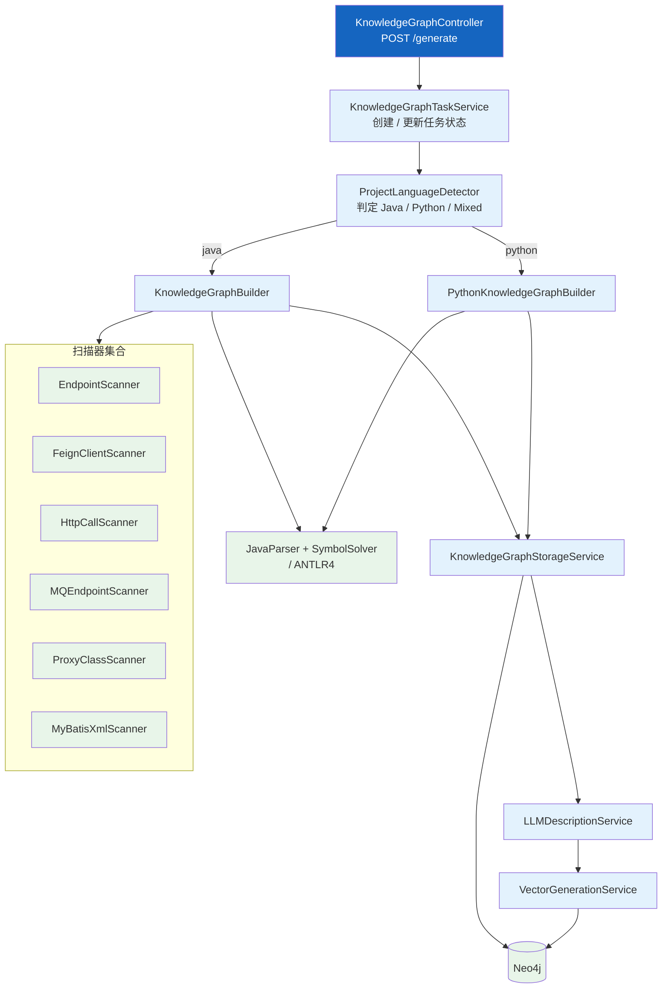
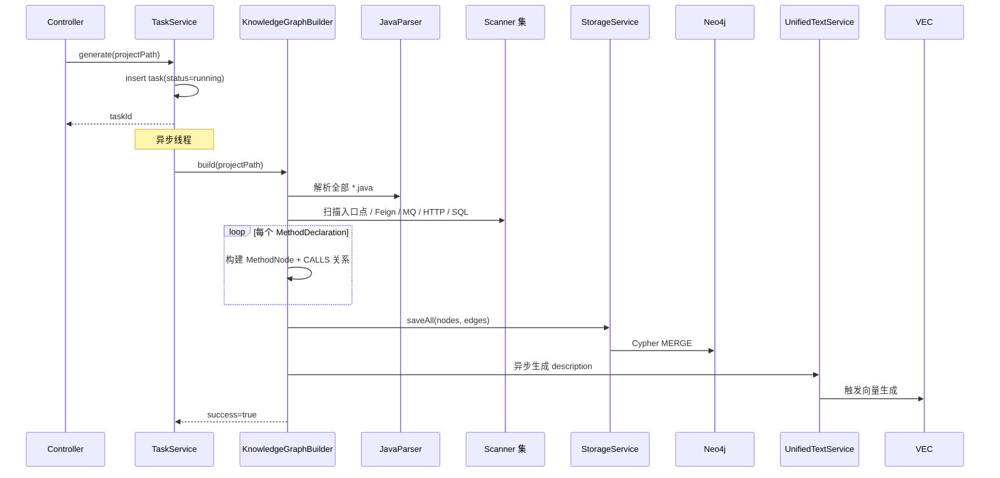
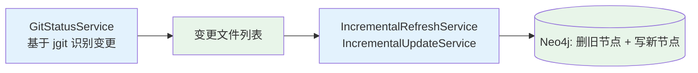

# 知识图谱构建

| 属性 | 值 |
|------|-----|
| **所属层** | 应用层 + 基础设施层（扫描 + 落库） |
| **目录** | `knowledgegraph/` + `scanner/`（顶层） |
| **文件数** | 约 55（`knowledgegraph/*` 全量）+ 5（`scanner/*`） |
| **核心入口** | `KnowledgeGraphBuilder` |

---

## 1. 模块概述

### 1.1 职责定义

将一个项目目录扫描为 Neo4j 图谱：方法节点、调用关系、入口点、SQL 节点、跨服务桥接（Feign / MQ / HTTP），并触发后续的 LLM 描述与向量化。

| 本模块负责 ✅ | 不负责 ❌ |
|-------------|---------|
| Java（JavaParser）+ Python（ANTLR4）AST 解析 | 图存储优化（在 `neo4j/`） |
| 调用关系提取、桥接发现、MyBatis SQL 关联 | 检索（在 `HybridSearchService`） |
| LLM 描述生成（`LLMDescriptionService`） | LLM 协议细节（在 `UnifiedTextService`） |
| 向量生成调度（`VectorGenerationService`） | 向量索引创建（在 `Neo4jInitializer`） |
| 增量更新（基于 git status） | 任务持久化（`KnowledgeGraphTaskService`） |

### 1.2 子包结构

| 子包 / 文件 | 职责 |
|-----------|------|
| `service/KnowledgeGraphBuilder.java` | 主流程：扫描 → 构建节点 → 落库 |
| `service/IncrementalUpdateService.java` / `IncrementalRefreshService.java` | git diff 驱动的增量刷新 |
| `service/CrossServiceBuildService.java` | 跨服务图谱（多仓库统一构建） |
| `service/CycleDetectionService.java` | 调用环检测 |
| `service/GitStatusService.java` | 封装 jgit，识别变更文件 |
| `service/LLMDescriptionService.java` | 为方法生成自然语言描述 |
| `service/MapperCallResolver.java` | MyBatis Mapper 调用关系解析 |
| `service/VectorGenerationService.java` | 批量向量生成调度 |
| `service/storage/KnowledgeGraphStorageService.java` | Neo4j 节点/关系持久化抽象 |
| `scanner/MyBatisXmlScanner.java` | 解析 MyBatis Mapper XML，提取 SQL |
| `python/PythonKnowledgeGraphBuilder.java`（隐含） | Python 子图谱构建 |
| `python/parser/` | ANTLR4 生成代码包装 |
| `python/scanner/` | Python 框架特征扫描（FastAPI / Django / Flask 等） |
| `python/call/` | Python 调用关系解析 |
| `python/model/` | Python 专属模型 |
| `link/` | 跨服务连接（Feign / MQ / HTTP 桥接构建） |
| `migration/` | Neo4j 迁移脚本承载 |
| `vector/` | 向量计算包装（接 ONNX / 远端 LLM） |
| `repository/` | 任务表 Repository（SQLite） |
| `util/ProjectLanguageDetector.java` | 自动检测项目语言（Java / Python / Mixed） |
| `controller/*` | REST 入口（见 [REST接口层](./REST接口层.md)） |
| `exception/*` | `KnowledgeGraphException` 等领域异常 |

### 1.3 顶层 `scanner/`（Java 专用）

| 文件 | 职责 |
|------|------|
| `EndpointScanner.java` | 扫描 Spring `@RequestMapping` 等入口点 |
| `FeignClientScanner.java` | 扫描 `@FeignClient` 接口，识别远程调用 |
| `HttpCallScanner.java` | 扫描 `RestTemplate / OkHttp` 等代码级 HTTP 调用 |
| `MQEndpointScanner.java` | 扫描 `@KafkaListener / @RocketMQMessageListener` 等 |
| `ProxyClassScanner.java` | 识别 Spring 代理类（`@Async / @Transactional` 等） |

---

## 2. 模块架构

---

## 3. 关键流程

### 3.1 全量构建

### 3.2 增量刷新

---

## 4. 数据产物

| 节点 | 来源 | 字段亮点 |
|------|------|---------|
| `MethodNode` | JavaParser / ANTLR4 | `nodeId / className / methodName / signature / filePath / language / framework / projectPath / publicProjectPath / description / descriptionEmbedding / codeEmbedding / thrownExceptions / caughtExceptions` |
| `EntryPointNode` | `EndpointScanner` 等 | Controller / Scheduled / MQ Listener 等 |
| `SqlNode` | `MyBatisXmlScanner` | SQL 文本 + statementType + sqlEmbedding |
| `ServiceNode` | `link/` | 服务注册（跨服务桥接） |
| `GenerationCheckpointNode` | `VectorGenerationService` | 增量重试断点 |

关系：`CALLS` / `ENTRY_OF` / `EXECUTES_SQL` / `IMPLEMENTS` / `EXTENDS` / `BRIDGE_TO` 等。

---

## 5. 配置项

| 配置 | 默认 | 说明 |
|------|------|------|
| `analysis.features.enhanced-interface-resolution` | true | 接口实现解析（同时存简单名 + FQN） |
| `analysis.features.enhanced-field-call-resolution` | true | `@Autowired/@Lazy` 字段调用 |
| `analysis.features.spring-annotation-aware` | true | `@Async/@Transactional` 代理调用感知 |
| `analysis.features.debug-logging` | true | 详细类型解析日志 |

---

## 6. 错误处理

| 场景 | 处理 |
|------|------|
| AST 解析失败 | 记录日志跳过该文件，不阻塞整体扫描 |
| 单方法描述失败 | 重试 3 次后跳过，留待重试任务 |
| 任务异常退出 | TaskService 标记 `failed` + 错误信息 |
| `KnowledgeGraphException` | 抛给 `GlobalExceptionHandler` 包装为 `ApiResponse.error` |

---

## 7. 已知问题与扩展点

| 问题 | 说明 |
|------|------|
| Python 调用解析仅覆盖典型场景 | 动态 import / monkey patch 不覆盖 |
| 大型仓库内存占用 | JavaParser 全量符号求解内存占用高，可分批 |

| 扩展点 | 方式 |
|--------|------|
| 新增语言 | 新建 `knowledgegraph/{lang}/` 包 + 实现 builder + 在 `ProjectLanguageDetector` 增加判定 |
| 新增桥接类型 | `knowledgegraph/link/` 增加扫描器 + 关系类型 |

---

> **延伸阅读**：
> - 数据进入 Neo4j 后的检索 → [Neo4j图存储与检索](./Neo4j图存储与检索.md)
> - 端到端调用链 → [04-数据流程/index.md](../04-数据流程/index.md)
