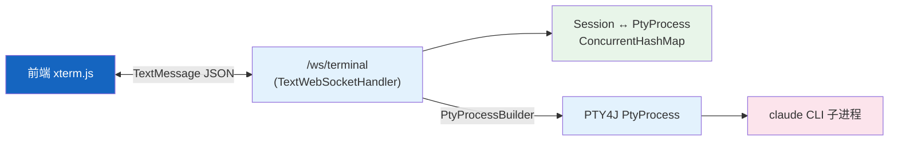
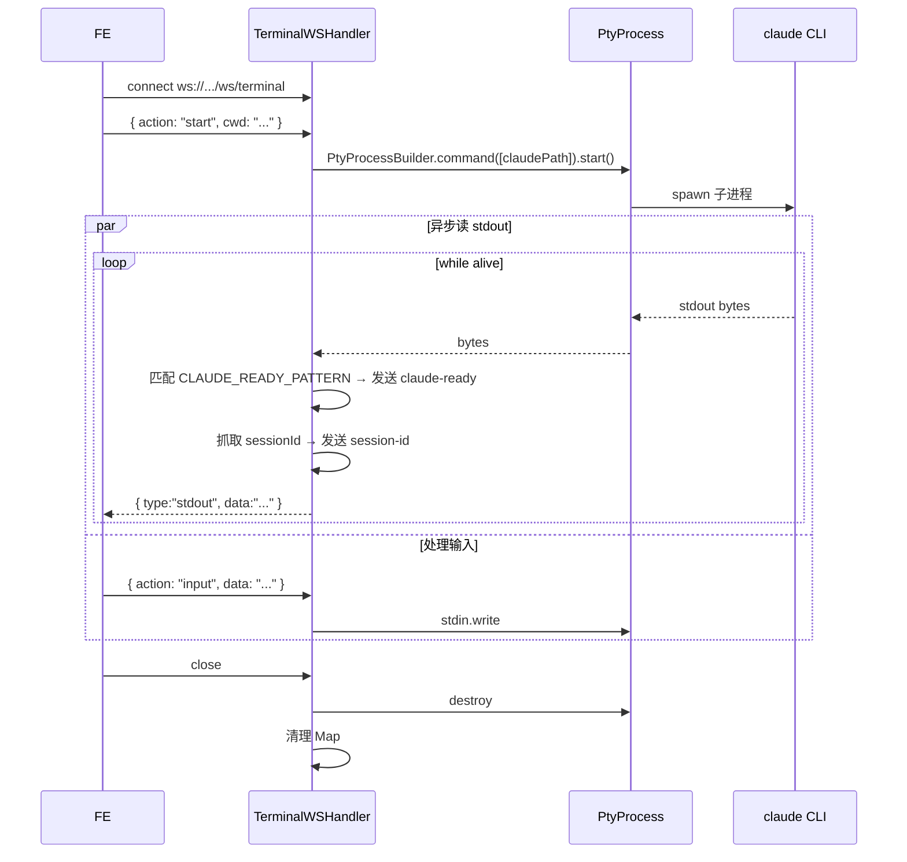

# 终端与 WebSocket

| 属性 | 值 |
|------|-----|
| **所属层** | 接入层 + 基础设施层（PTY） |
| **目录** | `handler/` + `config/WebSocketConfig.java` |
| **核心文件** | `TerminalWebSocketHandler.java` |
| **WebSocket 端点** | `/ws/terminal` |

---

## 1. 模块概述

### 1.1 职责定义

为前端提供与本地 Claude CLI 进程的**双向终端通道**：通过 PTY4J 在服务端创建伪终端进程，把前端 WebSocket 文本帧 → PTY stdin，PTY stdout → 前端 WebSocket 文本帧。

| 本模块负责 ✅ | 不负责 ❌ |
|-------------|---------|
| WebSocket 帧解析（结构化协议：start/resume/input/resize） | 业务级会话持久化（在 `SessionService`） |
| PTY 进程生命周期 | Claude CLI 协议 |
| Claude 就绪检测（正则匹配欢迎符） | 提示词管理（在 `PromptService`） |
| 会话 ID 提取（从 stdout 抓取） | 会话历史导出（在 `SessionController.export`） |

### 1.2 核心字段

```java
@Component
public class TerminalWebSocketHandler extends TextWebSocketHandler {
    @Value("${claude.working-directory:${user.dir}}") String defaultWorkingDirectory;
    @Value("${claude.claude-path:claude}") String claudePath;

    Map<WebSocketSession, PtyProcess> ptyProcessMap;
    Map<WebSocketSession, String> extractedSessionIds;
    Map<WebSocketSession, Boolean> claudeReadySent;

    static final Pattern CLAUDE_READY_PATTERN = Pattern.compile(
        "(Welcome to Claude|Claude Code|^[>]\\s*$|╭─+╮|╰─+╯|What would you like)",
        Pattern.CASE_INSENSITIVE | Pattern.MULTILINE);
}
```

---

## 2. 模块架构



---

## 3. 协议（结构化文本帧）

客户端 → 服务端：

```json
{ "action": "start", "cwd": "C:/projects/foo" }
{ "action": "resume", "sessionId": "..." }
{ "action": "input", "data": "hello\n" }
{ "action": "resize", "cols": 120, "rows": 40 }
```

服务端 → 客户端：

```json
{ "type": "stdout", "data": "..." }
{ "type": "claude-ready" }
{ "type": "session-id", "sessionId": "..." }
{ "type": "exit", "code": 0 }
```

---

## 4. 关键流程



---

## 5. 配置项

| 配置 | 默认 | 说明 |
|------|------|------|
| `claude.working-directory` | `${user.dir}` | 默认 PTY 工作目录 |
| `claude.claude-path` | `claude` | Claude CLI 可执行文件，默认从 PATH 解析 |
| `spring.websocket.max-text-message-buffer-size` | 65536 | WS 最大文本缓冲 |

---

## 6. 错误处理

| 场景 | 处理 |
|------|------|
| 找不到 `claude` 命令 | 抛 `IOException` → close session 并发 `{ type:"exit", code:127 }` |
| 客户端异常断开 | `afterConnectionClosed` 销毁 PTY 进程，避免僵尸 |
| 写入 stdin 失败 | 日志 + 关闭会话 |

---

## 7. 已知问题与扩展点

| 问题 | 说明 |
|------|------|
| 单点 Map 状态 | 不支持多实例水平扩展 |
| 终端编码 | Windows 中文环境需 chcp 65001（UTF-8），否则乱码 |

| 扩展点 | 方式 |
|--------|------|
| 支持其他 CLI（gemini / codex） | 增加 action 字段 + 新建 handler 或参数化 |
| 增加录屏 | hook stdout 写入文件 |

---

> **延伸阅读**：
> - 会话持久化 → [会话与工作区](./会话与工作区.md)
> - 接入层全景 → [REST接口层](./REST接口层.md)
