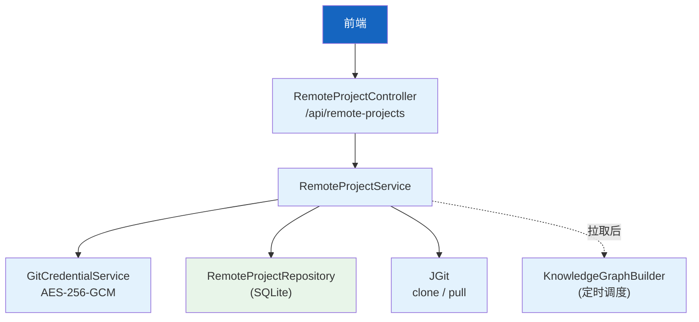
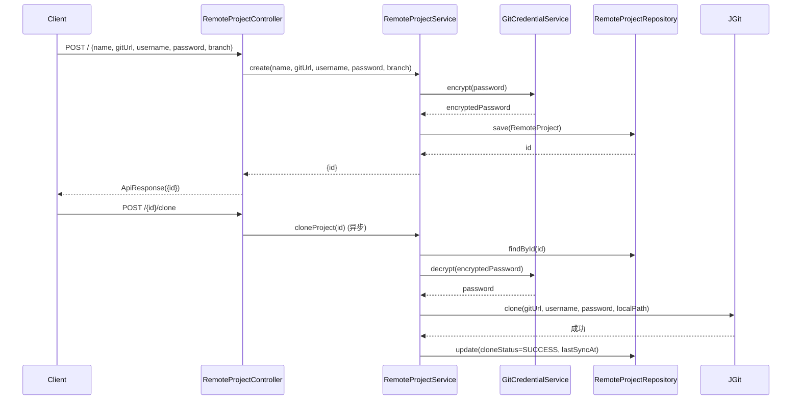
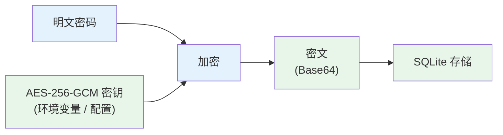

# 远程项目管理

| 属性 | 值 |
|------|-----|
| **所属层** | 服务层 + 基础设施层（Git 操作、凭证加密） |
| **目录** | `project/remote/`（controller / service / model / repository） |
| **文件数** | 5 |
| **核心入口** | `RemoteProjectController`、`RemoteProjectService` |
| **REST 基础路径** | `/api/remote-projects` |

---

## 1. 模块概述

### 1.1 职责定义

远程项目管理模块提供对远程 Git 仓库的全生命周期管理：创建、克隆、拉取、更新、删除。Git 凭证使用 AES-256-GCM 加密存储，支持定时调度自动拉取最新代码并触发知识图谱重建。

| 本模块负责 ✅ | 不负责 ❌ |
|-------------|---------|
| RemoteProject CRUD | 知识图谱构建（在 `knowledgegraph/`） |
| Git clone / pull 操作 | Git status / checkout（在 `GitController`） |
| AES-256-GCM 凭证加密 | 通用加密工具（在 `utils/`） |
| KG 定时调度（拉取后自动重建图谱） | 图谱存储（在 `neo4j/`） |

### 1.2 核心文件

| 文件 | 职责 |
|------|------|
| `controller/RemoteProjectController` | REST 入口（CRUD + clone + pull） |
| `service/RemoteProjectService` | 业务逻辑（创建、克隆、拉取、删除） |
| `service/GitCredentialService` | Git 凭证加密/解密（AES-256-GCM） |
| `model/RemoteProject` | 远程项目实体 |
| `repository/RemoteProjectRepository` | SQLite Repository |

---

## 2. 模块架构

---

## 3. 核心流程

### 3.1 远程项目克隆流程

### 3.2 凭证加密流程

---

## 4. REST 端点

| 方法 | 路径 | 说明 |
|------|------|------|
| GET | `/api/remote-projects` | 列出所有远程项目 |
| POST | `/api/remote-projects` | 创建远程项目 |
| PUT | `/api/remote-projects/{id}` | 更新远程项目 |
| DELETE | `/api/remote-projects/{id}` | 删除远程项目 |
| POST | `/api/remote-projects/{id}/clone` | 克隆项目（异步） |
| POST | `/api/remote-projects/{id}/pull` | 拉取最新代码（异步） |

---

## 5. 数据模型

### 5.1 RemoteProject 实体

| 字段 | 类型 | 说明 |
|------|------|------|
| `id` | Long | 主键 |
| `name` | String | 项目名称 |
| `gitUrl` | String | Git 仓库 URL |
| `username` | String | Git 用户名 |
| `password` | String | Git 密码（AES-256-GCM 加密） |
| `branch` | String | 默认分支 |
| `localPath` | String | 本地克隆路径 |
| `cloneStatus` | String | 克隆状态（PENDING/CLONING/SUCCESS/FAILED） |
| `lastSyncAt` | Long | 最后同步时间（epoch seconds） |

---

## 6. 配置项

| 配置 | 默认 | 说明 |
|------|------|------|
| `hisi.remote-project.clone-dir` | `remote-repos` | 克隆目标目录 |
| `hisi.remote-project.encryption-key` | — | AES-256-GCM 密钥（环境变量） |
| `hisi.remote-project.auto-pull-enabled` | `false` | 自动拉取开关 |
| `hisi.remote-project.auto-pull-cron` | `0 0 2 * * ?` | 自动拉取 cron 表达式 |

---

## 7. 错误处理

| 场景 | 处理 |
|------|------|
| Git URL 无效 | 返回 400，错误信息 |
| 凭证错误 | 克隆/拉取失败，更新状态为 FAILED |
| 网络超时 | 异步任务标记 FAILED，可重试 |
| 本地目录已存在 | pull 而非 clone |
| 加密密钥缺失 | 启动告警，凭证以明文存储（降级） |

---

## 8. 已知问题与扩展点

| 问题 | 说明 |
|------|------|
| 克隆进度无实时反馈 | 异步执行，前端需轮询状态 |
| 不支持 SSH key 认证 | 仅支持用户名/密码 |

| 扩展点 | 方式 |
|--------|------|
| 支持 SSH key | `GitCredentialService` 增加 SSH key 解密 |
| 克隆进度推送 | 增加 SSE 端点推送 clone 进度 |
| 自动触发 KG 重建 | clone/pull 成功后调用 `KnowledgeGraphTaskService` |

---

> **延伸阅读**：
> - 知识图谱构建 → [知识图谱构建](./知识图谱构建.md)
> - Git 操作 → [REST接口层](./REST接口层.md)
> - 部署配置 → [07-部署运维](../07-部署运维/index.md)
