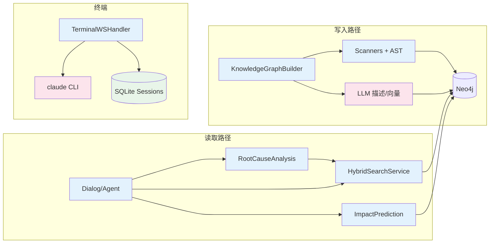
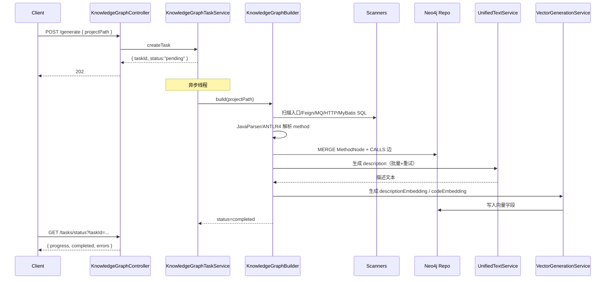
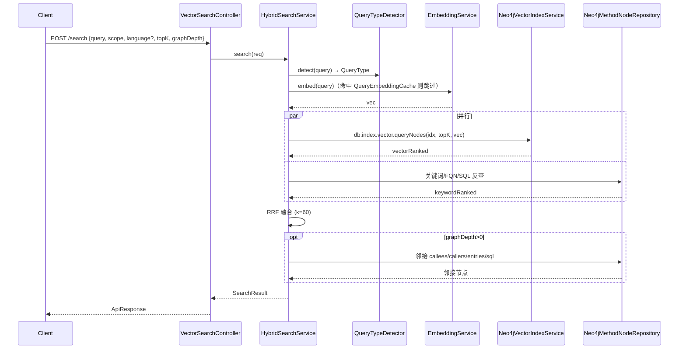
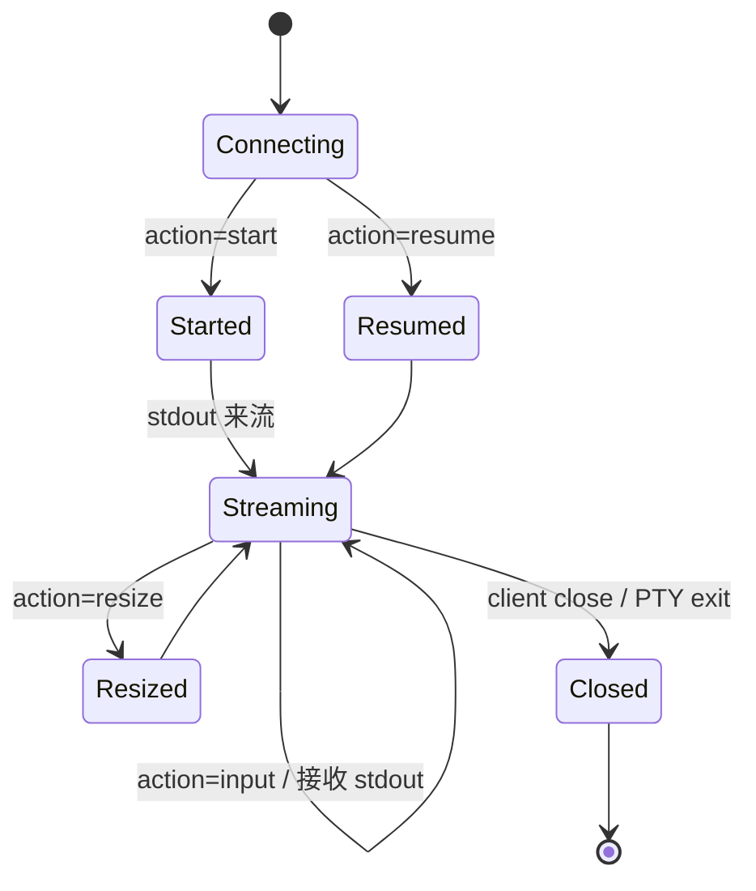
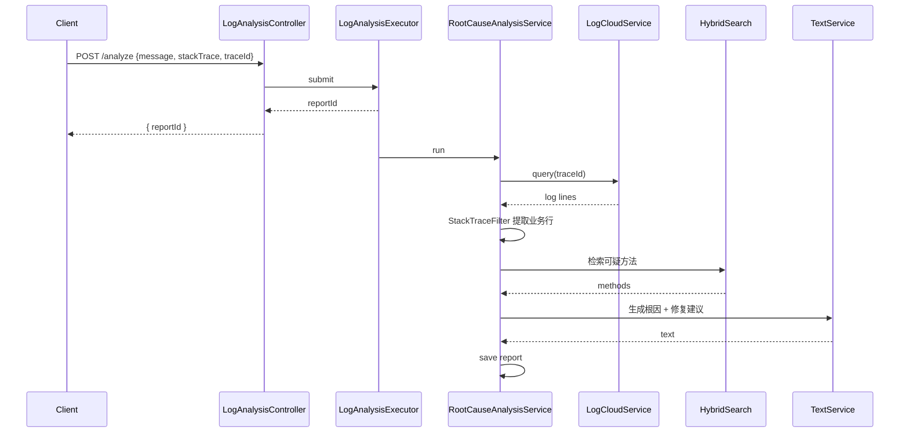

# 核心数据流

---

## 1. 数据流概览

| # | 流程名 | 触发方 | 关键路径 | 频率 | 重要性 |
|---|--------|--------|---------|------|--------|
| 1 | 知识图谱构建 | 用户 POST `/api/knowledge-graph/generate` | Scanner → JavaParser/ANTLR4 → MethodNode → Neo4j → LLM 描述 → 向量 | 低频，每仓库一次 | 核心 |
| 2 | 混合检索 | 用户 / MCP POST `/api/vector-search/search` | QueryTypeDetector → Embedding → VectorIndex + Repo 关键词 + 图扩展 → RRF | 高频 | 核心 |
| 3 | Claude 终端会话 | WS `/ws/terminal` | TerminalWSHandler ↔ PTY ↔ Claude CLI；SessionService 持久化 | 高频 | 核心 |
| 4 | 日志根因分析 | POST `/api/log/analyze` | LogCloudService → StackTraceFilter → HybridSearch → LLM → 报告 | 中频 | 核心 |
| 5 | 影响分析 | POST `/api/impact/analyze` | Neo4j 调用图遍历 → 风险评分 → 用例推荐 | 中频 | 核心 |
| 6 | 自然语言对话 | POST `/api/dialog` | NLDiagnosisCoord → IntentRecognizer → DiagnosticAgent → 工具 | 中频 | 辅助 |

### 全景图

---

## 2. 流程 1：知识图谱构建

### 2.1 时序图

### 2.2 异常流程

| 异常 | 处理 |
|------|------|
| 单文件 AST 解析失败 | 跳过，统计入 errors |
| LLM 描述 401/超时 | 重试 3 次后跳过，留待 `/api/vector-generation/retry` |
| Neo4j 连接断开 | 任务标记 failed，stacktrace 存入任务表 |

---

## 3. 流程 2：混合检索

### 3.1 时序图

### 3.2 数据转换节点

| 节点 | 输入 | 输出 | 实现 |
|------|------|------|------|
| QueryType 判别 | string | `QueryType` 枚举 | `QueryTypeDetector` |
| 查询向量化 | string | float[] | `EmbeddingService.embed` |
| 向量召回 | float[], topK | `MethodWithScore[]` | `Neo4jVectorIndexService` |
| 关键词召回 | string, scope | `MethodWithScore[]` | `Neo4jMethodNodeRepository.*ByScope` |
| RRF 融合 | List<List<Item>> | List<Item> | `HybridSearchService` 内部 |

---

## 4. 流程 3：Claude 终端会话

`SessionService` 在另一条路径上独立持久化（前端按需调用，不阻塞 PTY 流）。

---

## 5. 流程 4：日志根因分析

---

## 6. 流程 5：影响分析

---

## 7. 数据校验

| 数据 | 校验 | 校验位置 |
|------|------|---------|
| `projectPath` | 路径存在、绝对路径、不含 `..` | `PathUtils` + Controller |
| `query` 长度 | < 5000 字符 | `HybridSearchService` |
| `topK` / `graphDepth` | 范围 1-100 / 0-10 | Controller 参数默认值 + Service 内部 clamp |
| 嵌入维度 | 与索引一致 | `Neo4jVectorIndexService` |

---

## 8. 性能关键路径

| 路径 | 瓶颈 | 优化 |
|------|------|------|
| 全量构建 | JavaParser 符号解析内存 | 分批处理、`GlobalAnalysisCache` |
| LLM 描述 | 网络 RTT | 批量 + 重试 + 队列；可禁用 |
| 向量检索 | Neo4j VECTOR INDEX 查询 | 控制 topK、`QueryEmbeddingCache` 缓存查询向量 |
| 影响分析 | 大图遍历 | 限制 `depth`，使用 `MATCH ... LIMIT` |

---

## 9. 数据安全与脱敏

| 数据 | 敏感级别 | 措施 |
|------|---------|-----|
| API Key | 高 | 环境变量，logback 不打印 |
| 仓库源码 | 中 | 仅本机存储，不外发（LLM 调用仅发送方法体片段） |
| 日志原文 | 中 | 不持久化原始日志，仅保留分析报告 |
| Claude 会话 | 低（本机） | SQLite 本地，不上传 |
